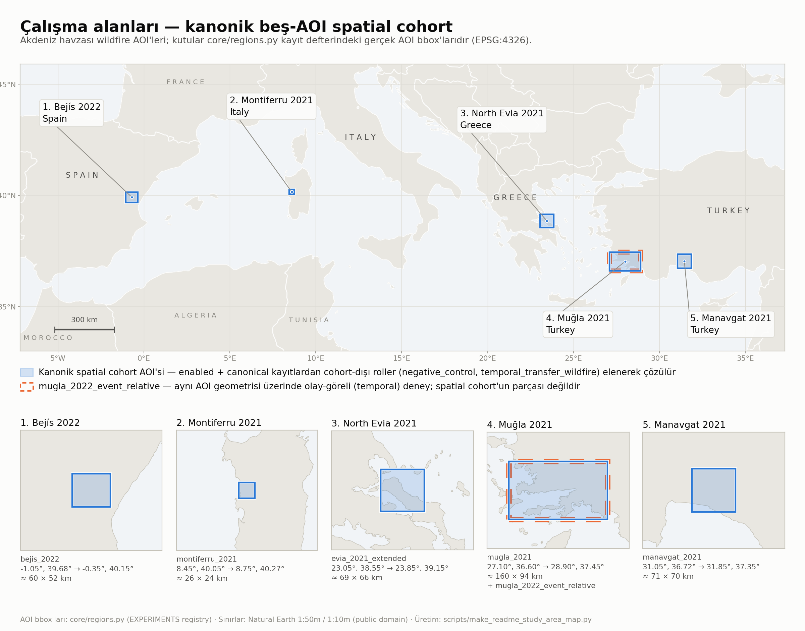

# Satellite Thermal Digital Twin

[](LICENSE)

<p align="center">
  
</p>

<p align="center">
  <sub>
    Kanonik beş-AOI spatial cohort. Kutular çizim amaçlı değildir:
    <code>core/regions.py</code> (<code>EXPERIMENTS</code>) kayıt defterindeki gerçek AOI
    bbox'larıdır ve görsel <code>python scripts/make_readme_study_area_map.py</code>
    ile yeniden üretilir.
  </sub>
</p>

Deney-farkında (experiment-aware) bir uydu-termal işleme ve yanmış-alan modelleme araştırma pipeline'ı.

Landsat/MODIS termal ve bitki örtüsü verileri işlenir; türetilen predictor'lar MCD64A1'in doğal/yeniden-kurulan ~500 m grid'ine toplulaştırılır. Amaç iki katmanlıdır: bir bölge içindeki termal katkının yanmış-alan ayrımına etkisini (within-region) ve bu katkının bölgeler/olaylar arasında taşınıp taşınmadığını (cross-region, event-to-event), mekansal olarak dürüst (spatially honest) değerlendirmeyle test etmek.

Bu bir operasyonel erken-uyarı sistemi değildir ve tam bir 3B dijital ikiz değildir; mevcut haliyle bir termal jeouzamsal araştırma pipeline'ı / prototipidir. Teknik tamamlanma ile bilimsel kanıt bilinçli olarak ayrı tutulur.

## Proje ne yapar

- Google Earth Engine üzerinden Landsat/MODIS veri edinimi (namespaced, direkt/tiled yerel indirme).
- Landsat LST ve NDVI ön-işleme, QA maskeleme ve kompozit üretimi.
- Termal anomali (z-score) ve TVDI (dryness) ürünleri.
- MODIS→Landsat downscaling ve gözlem-öncelikli (observed-priority) füzyon.
- MCD64A1 burned-landcover gate (Step6B) ile AOI uygunluk denetimi.
- Etiket-dürüst (label-honest) ~500 m modelleme (Step8A–E).
- Cross-region / event-to-event transfer, distribution-shift ve concept/relationship-shift teşhisi (Step9, Step10).
- Ayrı teşhis aileleri: büyük mekansal blok robustluğu, marginal Area-of-Applicability, burned-pattern morfolojisi, domain-classifier separability, window-closure duyarlılığı, ERA5-Land bölgesel meteoroloji.

## Araştırma sorusu

Uydu-türevi termal/dryness bilgisi, yanmış-alan ayrımını statik/çevresel baseline feature'ların ötesinde iyileştiriyor mu; ve bu iyileşme bölgeler ile olaylar arasında taşınıyor mu?

## Bilimsel tasarım ve güvenceler

**Analiz birimi.** Predictor rasterlarının çoğu 30 m seviyesindedir, ancak modelleme örnek birimi 30 m piksel *değildir*: MCD64A1'in doğal/yeniden-kurulan ~500 m hücresidir. Yerelde native-CRS'li 500 m raster tutulmadığı için hücre, 30 m referans grid üzerinde `round(500/30) = 17` pikselli bloklardan yeniden kurulur; efektif hücre boyutu bu nedenle yaklaşık **510 m**'dir (`core/config.py: STEP8A_MCD64A1_NATIVE_CELL_SIZE_M / STEP8A_REFERENCE_PIXEL_SIZE_M`, `src/step8a_prepare_500m_modeling_dataset.py: compute_block_size_pixels`). 30 m predictor pikselleri bağımsız MCD64A1 etiket örnekleri gibi kullanılmaz.

**Birincil etiket.** MCD64A1 BurnDate. FIRMS birincil etiket **değildir**; yalnızca teşhis/çapraz-kontrol amacıyla kullanılabilir.

**Birincil popülasyon.** Wildfire modelleme ve cross-region karşılaştırmalarının birincil popülasyonu `burnable_tree_shrub_grass` (TSG)'dir. `all_valid` ve `burnable_tree_shrub` alternatif/ikincil popülasyonlar olarak da değerlendirilir. Bölgeler arası sonuçlar okunurken popülasyon farkı göz ardı edilmemelidir.

**Değerlendirme.** Within-region değerlendirme spatial-block CV (StratifiedGroupKFold) ile yapılır; belirsizlik spatial-block bootstrap ile raporlanır. Random split kullanılmaz. Klasik p-value/anlamlılık iddiası yoktur.

**Target-label firewall.** Transfer/adaptasyon sırasında hedef bölge etiketleri normalization, adaptation, CORAL fit, threshold seçimi, kalibrasyon veya feature engineering için kullanılmaz (Step10). Target labels transfer performansının değerlendirilmesi ve metrik hesaplanması için kullanılabilir. `few-shot-recovery`, target label'ı özellikle recovery/adaptation amacıyla kullanan ayrı ve açıkça etiket-denetimli bir duyarlılık analizidir; operasyonel bir dağıtım iddiası değildir.

**Step9F.** Bu çalışma kontratında Step9F intentionally skipped'dır; tamamlanmış veya kanonik bir analiz olarak sunulmaz.

**Leakage sözleşmeleri.** Kanonik label rasteri label penceresine DOY-maskeli olduğundan, label_start öncesi yanan hücreler ayrı bir pre-label BurnDate rasteri ile analiz evreninden *çıkarılır* (unburned negatif sayılmaz). Bu, `core/regions.py` içindeki jenerik `exclude_pre_label_burns` / `pre_label_burn_window` alanlarıyla deklaratif olarak yönetilir.

## Pipeline genel bakış


Aşamalar `scripts/main.py experiment` orkestratörü üzerinden bir zincir olarak seçilir. Geçerli aşamalar (`--from-stage`/`--to-stage`, sıralı): `gate`, `predictors`, `scene-provenance`, `step7`, `seam-audit`, `seam-localization`, `step8`. Her aşama önce `--dry-run` ile planlanabilir; üretim yalnızca açık `--force` ile çalışır.

İki iş akışı vardır:

- **Deney-farkında akış (güncel varsayılan):** deney kayıt defterini ve namespaced çıktıları kullanır; predictor edinimi doğrudan/tiled yerel Earth Engine indirmesi ile yapılır, Google Drive kullanmaz ve Drive klasör kimlik bilgisi gerektirmez. Export işlemleri için Earth Engine kimlik doğrulaması gerekir.
- **Legacy Kozan akışı (yalnızca tarihsel reprodüksiyon):** açıkça `python scripts/main.py legacy` ile çağrılır; tarihsel Step4 (GEE→Google Drive export) ve Step4B (Drive→yerel indirme) aşamalarını korur ve `.env` Drive yapılandırması gerektirir. Önerilen varsayılan yol değildir; paylaşılan, namespace'siz `outputs/step5`, `outputs/step8a..e` gibi legacy yollara yazar.

## Deney kayıt defteri ve kanonik cohort'lar

`core/regions.py` (`EXPERIMENTS`) tek doğruluk kaynağıdır. Her kayıt `enabled` alanından **bağımsız** olarak bir `variant_status` taşır: `canonical` veya `legacy_superseded`. Eksik/bilinmeyen bir değer fail-closed hata verir; `legacy_superseded` bir kayıt zorunlu olarak `superseded_by` ile halefini gösterir ve yeni kanonik seçimlere giremez — sessizce düşürülmez, açıkça istendiğinde halefini işaret eden bir hata ile reddedilir.

| Experiment | `variant_status` | Rol (`role`) | Ülke | Not |
|---|---|---|---|---|
| `manavgat_2021` | canonical | `anchor_wildfire` | Türkiye | Doğal-bitki-örtüsü wildfire çapası (anchor). |
| `bejis_2022` | canonical | `mediterranean_transfer_wildfire` | İspanya | Bejís / Castellón. |
| `mugla_2021` | canonical | `same_country_same_year_transfer_wildfire` | Türkiye | Marmaris/Bodrum/Milas/Köyceğiz; pre-label exclusion açık. |
| `evia_2021_extended` | canonical | `mediterranean_transfer_wildfire` | Yunanistan | **Kanonik Kuzey Evia varyantı**; `evia_2021`'i supersede eder. |
| `montiferru_2021` | canonical | `mediterranean_transfer_wildfire` | İtalya | Sardinya; AOI resmi ISTAT belediye sınırlarından türetilmiştir. |
| `mugla_2022_event_relative` | canonical | `temporal_transfer_wildfire` | Türkiye | Olay-göreli Muğla 2022; **spatial cohort'un parçası değildir** (aşağıya bakınız). |
| `kozan_2023` | canonical | `negative_control` | Türkiye | Cropland/anız baskın negatif kontrol; doğal-vejetasyon cohort'undan *rolü* nedeniyle ayrılır, legacy olduğu için değil. |
| `evia_2021` | legacy_superseded → `evia_2021_extended` | `mediterranean_transfer_wildfire` | Yunanistan | Dar AOI varyantı; kayıtlı kalır, çıktıları korunur. |
| `mugla_2022` | legacy_superseded → `mugla_2022_event_relative` | `temporal_transfer_wildfire` | Türkiye | Geçici takvim-kaydırmalı (calendar-shift) deneme; çıktıları dondurulmuş olarak korunur. |

`valencia_2022`, `build_regions()` içinde bulunan bir placeholder geometridir; `EXPERIMENTS` registry kaydı değildir ve deney/cohort tablosunun parçası değildir.

### Kanonik beş-AOI spatial cohort

Mevcut cross-region spatial analizlerinin temeli şu beş AOI'dir:

`manavgat_2021`, `bejis_2022`, `mugla_2021`, `evia_2021_extended`, `montiferru_2021`

`--all-enabled` discovery modu bu cohort'u registry/status/role filtrelerinden türetir: enabled + canonical kayıtlardan `negative_control` ve `temporal_transfer_wildfire` rollerini eleyip kanonik Step8A veri setine sahip olanları çözer ve tam olarak bu beşini döndürür (`src/burned_pattern_audit.py: NON_COHORT_ROLES`; `core/regions.py: list_canonical_enabled_experiments`). Frozen veya explicit synthesis çağrıları ise yeniden üretilebilirlik amacıyla AOI listesini açıkça sabitleyebilir.

README başındaki çalışma alanı haritası (`assets/readme_study_areas.png`) bu cohort'un görsel karşılığıdır ve **aynı** registry/role mantığından üretilir; AOI dikdörtgenleri elle çizilmez, `build_regions()` içindeki `ee.Geometry.BBox` tanımlarından okunur (GEE oturumu gerekmez). Yeniden üretim:

```bash
python scripts/make_readme_study_area_map.py            # PNG üretir
python scripts/make_readme_study_area_map.py --dry-run  # yalnızca çözülen cohort'u yazdırır
```

Script bir pipeline aşaması değildir: `outputs/` altını okumaz/yazmaz, hiçbir bilimsel metriği etkilemez. Cohort üyesi bir AOI'nin bbox'ı çözülemezse fail-closed hata verir. `mugla_2022_event_relative` haritada, `mugla_2021` ile **aynı** geometri üzerine çizilen kesikli çerçeve olarak görünür (kaydırılmış/sahte bir kutu çizilmez); `kozan_2023` kendi bağımsız (buffer tabanlı) geometrisi nedeniyle haritalanmaz ve script çıktısında gerekçesiyle raporlanır.

### Evia

`evia_2021` artık kanonik değildir; kanonik Kuzey Evia varyantı `evia_2021_extended`'dır. İki kaydın **tek sözleşme farkı AOI geometrisidir** (predictor/label pencereleri, baseline yılları, rol ve leakage sözleşmesi birebir aynıdır). Eski `evia_2021` çıktıları `outputs/experiments/evia_2021/` altında tarihsel provenance amacıyla korunur — silinmiş veya hiç var olmamış değildir.

### Muğla 2022 — event-relative sözleşme

Eski `mugla_2022` kaydı, `mugla_2021` pencerelerinin bir takvim yılı ileri kaydırılmasıydı ve 2022'nin ana yangınını predictor penceresinin *içine* aldığı için bilimsel olarak superseded edilmiştir. Kanonik halefi `mugla_2022_event_relative`, pencereleri 2022 baskın MCD64A1 olayının tutuşma tarihine sabitler:

| Alan | Değer |
|---|---|
| Event anchor | `2022-06-21` |
| Predictor penceresi | `2022-04-24` → `2022-06-20` (58 gün) |
| Label penceresi | `2022-06-21` → `2022-08-08` (49 gün) |
| Baseline yılları | 2018–2021 |
| `transfer_framing` | `same_geography_event_to_event` |

Bu deney **kanonik beş-AOI spatial cohort'un altıncı üyesi değildir**: aynı coğrafyada farklı bir olay/yıl çalışmasıdır ve rolü (`temporal_transfer_wildfire`) onu spatial cohort keşfinden çıkarır. Ayrıca **"pure temporal transfer" olarak adlandırılmamalıdır** — 2022 olayı mevsim içinde 2021'den belirgin biçimde erken tutuştuğu için yıl ve mevsimsel faz confounded'dır; iddia yalnızca olay-olaya (event-to-event) transferdir.

İki **bağımsız** exclusion ekseni vardır ve gate tarafından union'lanır:

1. **Pre-label burn exclusion** — bu deneyin kendi predictor penceresi içinde yanan hücreler.
2. **Historical burn exclusion** — `mugla_2021` kanonik Step8A veri setindeki **tüm `burned == 1` fiziksel hücreler**. Maske TSG, `analysis_eligible` veya `valid_for_modeling` ile *ek olarak kısıtlanmaz*: iddia fiziksel ("bu hücre yandı"), modellenebilirlik değil. Dondurulmuş beklenen sayı **3073**'tür; kaynak farklı bir sayı verirse manifest üretimi fail-closed durur. Bu hücreler 2022 analiz evreninden çıkarılır; mevcut ham label sütunları audit amacıyla değiştirilmez. Kaynak artefakt salt-okunur açılır ve asla yeniden yazılmaz (`src/historical_burn_exclusion.py`).

Muğla 2022 için ayrıca **deneye özgü, post-gate bir örneklem-büyüklüğü kuralı** vardır: birincil popülasyon `burnable_tree_shrub_grass` içinde en az **300** burned hücre. Bu kural, generic burned-landcover gate'in global `min_positives = 30` toplam-burned uygulanabilirlik eşiğinin *yerine geçmez*; ikisi ayrı kurallardır ve gate çıktısında ayrı raporlanır.

## Mevcut yüksek seviye bulgular

README bir makale Results bölümü değildir; aşağıdakiler dondurulmuş çıktılardan okunan kısa, temkinli özetlerdir.

**Within-region.** Termal predictor'lar birçok wildfire AOI'sinde within-region ayrıma katkı sağlar (kanonik ~1 km bloklarda thermal − baseline ROC-AUC farkı beş AOI'de pozitif). Ancak bu katkı **mekansal blok ölçeğine duyarlıdır** ve "her ölçekte robust" değildir: büyük-blok robustluk raporları AOI'ye göre `strongly_robust`'tan `scale_sensitive`'e kadar değişen durumlar üretir. Muğla 2022 event-relative örneğinde ~5 km blokta ROC katkısı belirsizleşir (`uncertain`), ~10 km blokta desteklenmez. Doğru dil: *within-region termal katkı desteklenir, mekansal blok ölçeğine duyarlılık ile birlikte.*

**Cross-region / event-to-event.** Genelleme **yön-bağımlı (direction-dependent) ve kararsızdır**. Beş-AOI sentezinde bazı yönler şans üstü ham transfer gösterirken bazıları şans altındadır; label-blind adaptasyon varyantları (region-wise z-score ve CORAL) bir yönde toparlanma sağlarken diğerinde transferi bozabilir ve neredeyse tüm yönlerde bir **residual within-vs-transfer gap** kalır. Domain-classifier separability tüm çiftlerde ~0.96–1.00'dır; bu, kovaryat kaymasının büyük olduğunu gösterir ancak **tek başına transfer örüntüsünü açıklamaz** — sonuçlar *marjinal kovaryat normalizasyonunun tek başına yetersiz olduğu* ve *basit marjinal kovaryat kaymasının ötesinde ilişki kararsızlığı (relationship instability)* ile tutarlıdır. Nedensellik, "concept shift kanıtlandı" veya "CORAL transfer problemini çözdü" gibi iddialar üretilmez.

**Muğla 2021 ↔ 2022 (aynı coğrafya, olay-olaya).**

- Within-event 2022 termal modeli güçlüdür (ROC-AUC 0.942 vs baseline 0.864).
- Ham 2021→2022 transferinde termal sıralama baseline'ın **altına** düşer (0.559 vs 0.642).
- Ters yön 2022→2021'de termal sıralama baseline'ın **üstündedir** (0.669 vs 0.581).
- Region-wise z-score / CORAL ilk yönde toparlanma sağlar, ters yönde ham transferi bozar.
- Prevalence yönler arasında çok farklıdır (2022 hedefinde 331/38 790'a karşı 2021 hedefinde 2 911/38 819) ve yıl ile mevsimsel faz confounded'dır.

Bu, olay-olaya transportability'nin **yönlü** olduğunu gösterir; yıl etkisinin kanıtı olarak okunamaz.

**PR-AUC hakkında.** Cross-region PR-AUC prevalence-bağımlıdır ve AOI'ler arasında headline karşılaştırma olarak sunulmaz. Bölgeler arası okuma ROC-AUC ve ΔROC-AUC öncelikli yapılır; PR-AUC yalnızca hedef prevalence / no-skill taban çizgisiyle birlikte yorumlanır. (Örneğin `evia_2021_extended` prevalence'ı ~%28,7 iken `manavgat_2021` ~%3,8'dir.)

**Burned morphology.** `burned-pattern-audit` çıktıları **betimleyicidir**. Bağlantılı bileşenler (connected components) mekansal parçalanma göstergesidir, **bağımsız yangın olaylarının sayısı değildir**.

**Kozan.** `kozan_2023` doğal wildfire kanıtı değildir: burned-landcover gate kararı `cropland_dominated_control`'dur. Cropland/anız-yakma confound'u nedeniyle negatif kontrol / teşhis vakası olarak okunur ve doğal wildfire sonucu gibi sunulmaz.

## Hızlı başlangıç

```bash
git clone https://github.com/emrehann17/satellite-thermal-digital-twin
cd satellite-thermal-digital-twin

python -m venv .venv
source .venv/bin/activate

pip install -r requirements.txt
earthengine authenticate
```

Windows'ta WSL veya bir POSIX kabuk (Git Bash) önerilir; komutlar Linux/macOS ile aynıdır.

- `requirements.txt` ana kurulum kaynağıdır; `requirements-lock.txt` birebir sürümleri sabitleyen bir reproducibility anlık görüntüsüdür (`geographiclib` dahil tüm doğrudan bağımlılıklar burada çözümlenmiş/pinlenmiş durumdadır). Sürüm numaralarını bu dosyalardan okuyun; README'de kopyalanmazlar.
- Export/GEE aşamaları için Earth Engine kimlik doğrulaması gerekir. **Normal deney-farkında akış Google Drive kullanmaz** ve Drive kimlik bilgisi gerektirmez.
- Yalnızca legacy Kozan akışı `.env` içinde Drive klasör yapılandırması gerektirir.
- Ayrıntılı ortam, kimlik doğrulama, `.env` ve isteğe bağlı legacy yapılandırma: [SETUP_ENV.md](SETUP_ENV.md).

## Sık kullanılan komutlar

Tüm alt-komutlar `scripts/main.py --help` ile listelenir. Aşağıdaki örnekler kaynak koddan doğrulanmıştır ve önce güvenli/dry-run kullanımı gösterir. `--force` gerçek üretim/overwrite anlamına gelir ve dondurulmuş çıktıları etkileyebilir; kasıtlı olmadan kullanmayın.

```bash
# CLI yardımı (hiçbir şey çalıştırmaz)
python scripts/main.py --help

# yeni bir AOI için ilk kapı: yalnızca Step6B burned-landcover gate
# (gate'i geçmek downstream çalıştırmayı YETKİLENDİRMEZ; manifest
#  downstream_authorized=false taşır)
python scripts/run_label_gate_only.py --experiment montiferru_2021 --dry-run

# deney dry-run (planı ve planlanan yolları basar; GEE'ye dokunmaz, dosya yazmaz)
python scripts/main.py experiment \
  --experiment manavgat_2021 --from-stage predictors --to-stage step8 \
  --predictor-mode local-only --dry-run

# yalnızca yerel yeniden çalıştırma (GEE'ye dokunmaz; mevcut çıktıları ÜZERİNE YAZAR)
python scripts/main.py experiment \
  --experiment manavgat_2021 --from-stage predictors --to-stage step8 \
  --predictor-mode local-only --force

# GEE predictor export (namespaced, direkt/tiled yerel indirme)
python scripts/main.py experiment \
  --experiment bejis_2022 --from-stage predictors --to-stage step8 \
  --predictor-mode export --force

# cross-region transfer (Step9A-D; Step9B zaten iki yönü de hesaplar)
python scripts/main.py transfer --source manavgat_2021 --target mugla_2021 --dry-run

# post-hoc distribution-shift audit (Step9E)
python scripts/main.py shift-audit --source manavgat_2021 --target mugla_2021 --dry-run

# Step10: ön-kayıtlı, target-label-blind self-calibrated transfer
python scripts/main.py step10 \
  --source mugla_2021 --target mugla_2022_event_relative --dry-run

# Step9G univariate feature-AUC direction-reversal (concept/relationship shift)
python scripts/main.py concept-shift --source manavgat_2021 --target bejis_2022 --dry-run

# beş-AOI karşılaştırma / sentez (REPORT-ONLY: dondurulmuş sayıları okur)
python scripts/main.py concept-shift-compare \
  --experiments manavgat_2021 bejis_2022 mugla_2021 evia_2021_extended montiferru_2021 --dry-run
python scripts/main.py transfer-synthesis \
  --aoi manavgat_2021 --aoi bejis_2022 --aoi mugla_2021 \
  --aoi evia_2021_extended --aoi montiferru_2021 --dry-run

# registry-güdümlü keşif: tam olarak kanonik beş-AOI cohort'unu çözer
python scripts/main.py burned-pattern-audit --all-enabled --dry-run
python scripts/main.py domain-classifier-audit --all-enabled --dry-run

# tek deney için büyük mekansal blok (10/20 hücre) robustluk
python scripts/main.py step8-big-block-robustness \
  --experiment mugla_2022_event_relative --dry-run

# legacy Kozan (Google Drive tabanlı) tam pipeline
python scripts/main.py legacy --experiment kozan_2023 --dry-run
```

### Window closure

Predictor penceresini uzunluğunu koruyarak (her iki ucu birlikte) ön-kayıtlı gün sayısı kadar **erken kapatıp** within-AOI baseline/thermal sonuçların ve aralarındaki termal katkının nasıl tepki verdiğini ölçen ayrı bir yetenek. Label penceresi, event/gate tarihleri, DEM/landcover/grid, hiper-parametreler, seed ve blok tanımı sabittir; her varyant aynı ortak cohort ve aynı paylaşılan spatial fold ataması üzerinde karşılaştırılır. Sonuçlar **betimleyici predictor-timing duyarlılığıdır** — operasyonel bir öngörü doğrulaması değildir ve sıfırı içeren bir aralık denklik kanıtı değildir.

Güncel giriş noktası **tektir**: `window-closure-region`. Tarihsel
`window-closure-sensitivity` komutu ve `scripts/run_window_closure_sensitivity.py`
manuel çalıştırması **2026-08-10'da emekliye ayrılmıştır**; çağrıldıklarında
sıfırdan farklı çıkış koduyla reddederler, hiçbir şey çalıştırmaz ve hiçbir şey
yazmazlar. Komut yalnızca provenance amacıyla `--help` içinde `[RETIRED]` olarak
görünmeye devam eder.

Tamamlanmış beş window-closure AOI'sinin tamamı tek bir kök altındadır:
`outputs/diagnostics/window_closure_region/` — `manavgat_2021`, `bejis_2022`,
`mugla_2021`, `evia_2021_extended`, `montiferru_2021`. Manavgat **salt-okunur
referans AOI'dir**; diğer dördü bölgesel actual AOI'lerdir. Fiziksel çıktı ailesi
ortaktır, bilimsel rol ayrımı değişmemiştir.

Manavgat'ın tarihsel `outputs/diagnostics/window_closure_sensitivity/manavgat_2021/`
fiziksel yerleşimi emekliye ayrılmıştır. Mevcut donmuş Manavgat bilimi bağımsız
olarak makine hassasiyetinde yeniden üretilmiş, ardından doğrulanmış bölgesel
replay'i **migration sırasında hiçbir bilimsel yeniden hesaplama yapılmadan**
promote edilmiştir. Kanıt:
`docs/multi_region_window_closure_design/MANAVGAT_MIGRATION_RECORD.json` ve
`docs/multi_region_window_closure_design/manavgat_migration_evidence/`.
`src/window_closure_sensitivity.py` **silinmemiştir** — hâlâ bölgesel üretimin
bilimsel arka ucudur; emekliye ayrılan yalnızca çıktı namespace'idir.

```bash
# bağımsız izole edilmiş bölgesel çalıştırma (salt-okunur dry-run)
python scripts/main.py window-closure-region --experiment bejis_2022 --dry-run
python scripts/run_window_closure_region.py --experiment mugla_2021 --dry-run --json

# üretilmiş bir bölgesel namespace'in artefakt-seviyesi doğrulaması
python scripts/validate_window_closure_region.py --experiment bejis_2022 --inventory
python scripts/validate_window_closure_region.py --experiment bejis_2022 --analysis-id <analysis_id>
```

Cohort koruması koda gömülüdür (`src/multi_region_window_closure/contract.py`): fiilen çalıştırılan AOI'ler `bejis_2022`, `evia_2021_extended`, `montiferru_2021`, `mugla_2021`'dir; `manavgat_2021` **salt-okunur referanstır** ve yeniden hesaplanmaz; superseded `evia_2021` sert biçimde dışlanır ve analize giremez. Gerçek (dry-run olmayan) çalıştırma yalnızca açık `--execute-actual` ile başlar — asla ima edilmez — ve `--force` yalnızca `--execute-actual` ile birlikte kabul edilir, üstelik sadece kendi bölgesel namespace'ini hedefler.

### ERA5-Land bölgesel meteoroloji teşhisi

AOI seviyesinde, kanonik pencerelere ve 2017–2020 klimatolojisine bağlı bir **teşhis/ek (addendum)** üründür — model predictor pipeline'ının zorunlu bir parçası **değildir** ve Step8A predictor setine girmez.

```bash
# plan: Earth Engine oturumu yok, sorgu yok, dizin yok, dosya yok
python scripts/run_era5_land_regional_diagnostic.py --dry-run

# sözleşme doğrulaması
python scripts/validate_era5_land_regional_diagnostic.py --help
```

Varsayılan cohort dondurulmuş beş kanonik AOI'dir; Muğla 2022 varsayılana **dahil değildir** ve yalnızca açıkça isimlendirilerek eklenebilir — bu da `analysis_id`'yi değiştirir, yani mevcut dondurulmuş beş-bölge artefaktının üzerine yazmaz, yeni bir namespace açar.

## Çıktı düzeni

```text
outputs/
├── experiments/<experiment_id>/        # predictor'lar, gate, Step5-Step8 within-region çıktıları
│   └── robustness/step8_big_blocks*/   # büyük-blok robustluk (sürümlenmiş namespace'ler)
├── cross_region/<source>__<target>/    # Step9A-G ve Step10 transfer/shift sonuçları
└── diagnostics/<analysis_family>/      # teşhis aileleri; genelde <analysis_id> veya <canonical_set_id> alt-dizini
```

Büyük üretilmiş veri ve çıktılar git'e commit edilmez (`.gitignore`: `outputs/`, `data/`, `logs/`).

## Depo düzeni

```text
core/      yapılandırma, deney kayıt defteri, orkestrasyon, deney context'i
src/       bilimsel ve raster-işleme implementasyonları (step*, teşhis modülleri, alt-paketler)
scripts/   komut satırı çalıştırıcıları ve validator'lar
tests/     regresyon ve metodolojik güvenlik (guard) testleri
docs/      ayrıntılı dokümantasyon ve tasarım paketleri
config/    yardımcı yapılandırma varlıkları
archives/  arşivlenmiş materyal
```

## Tekrarüretilebilirlik, provenance ve dondurulmuş artefaktlar

- **Kanonik/dondurulmuş çıktılar sessizce üzerine yazılmaz.** Normal generated outputs bazı entry-point'lerde yalnızca açık `--force` ile yeniden üretilebilir; ancak `--force`, frozen/canonical bilimsel artefaktlar için blanket overwrite izni değildir. İlgili analiz ailesinin daha güçlü korumaları geçerlidir: birçok akışta preregistration/orijinal Step8 çıktıları ayrıca korunur; `few-shot-recovery` ve `mugla-subsampling` gibi ailelerde mevcut namespace silinmek yerine `_quarantine/` altına alınır.
- **Analiz kimliği içeriğe bağlıdır.** Teşhis namespace'leri `analysis_id` (girdi hash'leri + bilimsel yapılandırma) veya sıralı experiment ID'lerinden türetilen `canonical_set_id` altına yazar. Bu nedenle mevcut 5-AOI analizleri, registry'ye yeni bir bölge eklendiğinde sessizce 6-AOI analizine dönüşmez: farklı bir AOI kümesi farklı bir kimliğe ve farklı bir çıktı dizinine karşılık gelir. Yeni bir 6-bölge analizi istendiğinde bu ayrı namespace/sürüm kullanılmalıdır (`--output-root` ile sürümlenmiş namespace'ler de desteklenir, örn. `step8_big_blocks_v2`).
- **Superseded/legacy çıktılar korunur.** `outputs/experiments/evia_2021/` ve `outputs/experiments/mugla_2022/` tarihsel kayıt olarak yerinde kalır; taşınmaz, migrate edilmez ve halef deneyler için girdi olarak yeniden kullanılmaz.
- **Hash tabanlı provenance.** `outputs/` git tarafından izlenmediği için kanonik Step8A veri setlerinin provenance'ı içerik SHA-256 digest'lerine dayanır. Bilimsel artefaktlar bu komutlarla denetlenir; ikisi de hiçbir bilimsel çıktıyı değiştirmez (`frozen-hash-inventory` yalnızca `outputs/diagnostics/advisor_followup_provenance/` altına kendi envanter dosyasını yazar, `manavgat-step8a-hash-audit` hiçbir şey yazmaz):

```bash
# önce/sonra envanteri alıp farkı raporla (beklenmeyen değişimde exit != 0)
python scripts/main.py frozen-hash-inventory --phase before
python scripts/main.py frozen-hash-inventory --phase diff

# tek bir Step8A içerik hash'i denetimi (yalnızca okur ve rapor basar)
python scripts/main.py manavgat-step8a-hash-audit --experiment manavgat_2021
```

  Kanonik Step8A hash'lerinin, satır/pozitif sayılarının ve export sözleşmesinin otoritatif listesi: [`docs/advisor_final_numerical_package/GIT_AND_EXPORT_PROVENANCE.md`](docs/advisor_final_numerical_package/GIT_AND_EXPORT_PROVENANCE.md).

## Bilimsel sınırlar

- Operasyonel yangın-uyarı/öngörü sistemi değildir.
- Nedensel (causal) yangın-risk modeli değildir; hiçbir teşhis nedensellik iddia etmez.
- 30 m MCD64A1 etiket modeli değildir; analiz birimi ~510 m yeniden-kurulan hücredir.
- FIRMS yalnızca teşhis/çapraz-kontrol amaçlıdır.
- Hedef-bölge etiketleri yasaklı transfer adaptasyonu için kullanılmaz.
- p-value/anlamlılık testi raporlanmaz; yalnızca bootstrap aralıkları ve destek durumları raporlanır. Sıfırı içeren bir aralık denklik kanıtı değildir.
- Bağlantılı bileşen sayıları bağımsız yangın olayları değildir.
- Cross-region PR-AUC prevalence-bağımlıdır; bölgeler arası ham PR-AUC karşılaştırması yapılmaz.
- Cross-region başarısızlık/negatif sonuçlar dürüstçe raporlanır ve gizlenmez.

## Dokümantasyon

- [SETUP_ENV.md](SETUP_ENV.md) — ortam, Earth Engine kimlik doğrulaması, `.env` ve legacy Drive yapılandırması
- [docs/PROJECT_REONBOARDING.md](docs/PROJECT_REONBOARDING.md) — proje yeniden-tanışma rehberi
- [docs/project_mastery/PROJECT_MASTERY_GUIDE.md](docs/project_mastery/PROJECT_MASTERY_GUIDE.md) — kavramsal ve yöntemsel derinlemesine kılavuz
- [docs/experiments.md](docs/experiments.md) — deney kayıt defteri ve namespace kapsamı
- [docs/label_gate.md](docs/label_gate.md) — MCD64A1 etiket kapısı (label gate)
- [docs/seam_audit.md](docs/seam_audit.md) — seam/discontinuity denetimi
- [docs/source_scene_provenance_and_seam_localization.md](docs/source_scene_provenance_and_seam_localization.md) — kaynak-sahne provenance ve seam lokalizasyonu
- [docs/aoi_refinement.md](docs/aoi_refinement.md) — AOI netleştirme notları
- [docs/multi_region_window_closure_design/README.md](docs/multi_region_window_closure_design/README.md) — multi-region window-closure tasarım paketi
- [docs/advisor_final_numerical_package/README.md](docs/advisor_final_numerical_package/README.md) — dondurulmuş sayısal paket ve provenance

## Lisans

Bu proje MIT Lisansı ile lisanslanmıştır. Ayrıntılar için [LICENSE](LICENSE) dosyasına bakın.
