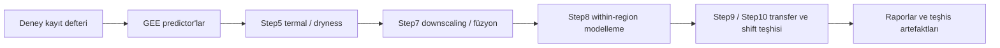

# Satellite Thermal Digital Twin

[](LICENSE)

Deney-farkında (experiment-aware) bir uydu-termal işleme ve yanmış-alan modelleme araştırma pipeline'ı.

Landsat/MODIS termal ve bitki örtüsü verileri işlenir; türetilen predictor'lar MCD64A1'in doğal/yeniden-kurulan ~500 m grid'ine toplulaştırılır. Analiz birimi kasıtlı olarak bu ~500 m hücredir: 30 m predictor pikselleri etiketin çözünürlüğünde bağımsız örnek gibi davranmaz. Amaç iki katmanlıdır: bir bölge içindeki termal katkının yanmış-alan ayrımına etkisini (within-region) ve bu katkının bölgeler arasında genellenip genellenmediğini (cross-region), mekansal olarak dürüst (spatially honest) değerlendirmeyle test etmek. Bu bir operasyonel erken-uyarı sistemi değildir; teknik tamamlanma ile bilimsel kanıt bilinçli olarak ayrı tutulur.

## Proje ne yapar

- Google Earth Engine üzerinden Landsat/MODIS veri edinimi (namespaced, direkt/tiled yerel indirme).
- Landsat LST ve NDVI ön-işleme, QA maskeleme ve kompozit üretimi.
- Termal anomali (z-score) ve TVDI (dryness) ürünleri.
- MODIS→Landsat downscaling ve gözlem-öncelikli (observed-priority) füzyon.
- Etiket-dürüst (label-honest) ~500 m modelleme (Step8).
- Cross-region transfer ile distribution/concept-shift teşhisi (Step9/Step10).

## Araştırma sorusu

Uydu-türevi termal/dryness bilgisi, yanmış-alan ayrımını statik/çevresel baseline feature'ların ötesinde iyileştiriyor mu; ve bu iyileşme bölgeler arasında genelleniyor mu?

- Birincil etiket MCD64A1 BurnDate'tir; FIRMS birincil hedef olarak kullanılmaz (yalnızca teşhis/çapraz-kontrol).
- 30 m predictor pikselleri bağımsız etiket örnekleri olarak ele alınmaz.
- Değerlendirme spatial-block CV ve spatial-block bootstrap ile yapılır; ön-işleme, eşik ve model fit yalnızca kaynak bölgeden türetilir (target-label firewall).

## Mevcut bulgular

Aşağıdaki özet, commit edilmiş rapor ve dokümantasyona göre yüksek seviyede ve temkinlidir.

- Ana doğal-bitki örtüsü wildfire AOI'lerinde within-region termal katkı desteklenir; sonuç spatial-block bootstrap ile ve daha büyük mekansal bloklarda korunur.
- Ham (raw) cross-region ayrım zayıf/kararsızdır ve başarılı bir genelleme olarak sunulmaz: domain separability ≈1.0 iken transfer performansı şans düzeyine yakındır.
- Hedef-etiketi kullanmayan denetimsiz bölge-düzeyi adaptasyon, covariate-shift kaynaklı kaybın bir kısmını toparlayabilir; buna karşın belirgin bir within-vs-transfer farkı, ilişki/concept shift ile tutarlı biçimde kalıcıdır.
- Kozan, cropland/anız-yakma baskın bir negatif-kontrol AOI'sidir; doğal wildfire kanıtı olarak sunulmaz.

## Pipeline genel bakış



Aşamalar `scripts/main.py` orkestratörü üzerinden bir zincir olarak seçilebilir; her aşama önce `--dry-run` ile planlanabilir, yalnızca açık `--force` ile üretim çalıştırılır. İki iş akışı vardır:

- **Deney-farkında akış (güncel varsayılan):** deney kayıt defterini ve namespaced çıktıları kullanır; predictor edinimi doğrudan/tiled yerel Earth Engine indirmesi ile yapılır, Google Drive kullanmaz ve Drive klasör kimlik bilgisi gerektirmez. Export işlemleri için Earth Engine kimlik doğrulaması gerekir.
- **Legacy Kozan akışı (yalnızca tarihsel reprodüksiyon):** açıkça `python scripts/main.py legacy` komutuyla çağrılır; tarihsel Step4 (GEE→Google Drive export) ve Step4B (Drive→yerel indirme) aşamalarını korur ve `.env` Drive yapılandırması gerektirebilir. Bu akış önerilen varsayılan değildir. Drive kodu depodan kaldırılmadı; yalnızca varsayılan deney-farkında akışın parçası değildir.

## Deneyler

Aşağıdaki tablo `core/regions.py` içindeki güncel kayıt defterinden alınmıştır. Beş deneyin tümü kayıtlı ve etkindir (enabled).

| Deney | Rol | Amaç / durum |
|-------|-----|--------------|
| `kozan_2023` | negative_control | Cropland/anız baskın negatif-kontrol AOI; metodolojinin doğrulandığı ve legacy Drive akışının sahibi olan bölge. |
| `manavgat_2021` | anchor_wildfire | Ana doğal-bitki örtüsü wildfire çapası (anchor). |
| `mugla_2021` | same_country_same_year_transfer_wildfire | Aynı ülke/aynı yıl Akdeniz çam wildfire'ı; within-region ve transfer üretildi. |
| `bejis_2022` | mediterranean_transfer_wildfire | İspanya (Castellón) Akdeniz transfer vakası; Manavgat ile kıyaslanabilir. |
| `evia_2021` | mediterranean_transfer_wildfire | Yunanistan (Kuzey Evia) aynı yıl ülkeler-arası replikasyon. |

## Hızlı başlangıç

```bash
git clone https://github.com/emrehann17/satellite-thermal-digital-twin
cd satellite-thermal-digital-twin

python -m venv .venv
source .venv/bin/activate

pip install -r requirements.txt
earthengine authenticate
```

Windows'ta WSL veya bir POSIX kabuk (Git Bash) önerilir; komutlar Linux/macOS ile aynıdır.

Bu adımlar normal deney-farkında akış için yeterlidir. Normal deney-farkında çalıştırmalarda Google Drive kimlik bilgileri gerekmez. Ayrıntılı ortam, kimlik doğrulama ve isteğe bağlı legacy yapılandırma [SETUP_ENV.md](SETUP_ENV.md) dosyasında belgelenmiştir. `requirements-lock.txt`, isteğe bağlı bir tekrarüretilebilirlik (reproducibility) anlık görüntüsüdür.

### Sık kullanılan komutlar

Öncelikle güvenli `--dry-run` örnekleri:

```bash
# CLI yardımı (hiçbir şey çalıştırmaz)
python scripts/main.py --help

# deney dry-run (yalnızca planı ve planlanan yolları basar)
python scripts/main.py experiment \
  --experiment manavgat_2021 --from-stage predictors --to-stage step8 \
  --predictor-mode local-only --dry-run

# yalnızca yerel yeniden çalıştırma (GEE'ye dokunmaz)
python scripts/main.py experiment \
  --experiment manavgat_2021 --from-stage predictors --to-stage step8 \
  --predictor-mode local-only --force

# GEE predictor export (namespaced, direkt/tiled yerel indirme)
python scripts/main.py experiment \
  --experiment bejis_2022 --from-stage predictors --to-stage step8 \
  --predictor-mode export --force

# cross-region transfer (Step9A-D, çift yönlü)
python scripts/main.py transfer \
  --source manavgat_2021 --target mugla_2021 --reverse --force

# post-hoc distribution-shift audit (Step9E)
python scripts/main.py shift-audit \
  --source manavgat_2021 --target mugla_2021 --force

# legacy Kozan (Google Drive tabanlı) tam pipeline
python scripts/main.py legacy --experiment kozan_2023 --force
```

Geçerli aşamalar (`--from-stage`/`--to-stage`): `gate`, `predictors`, `scene-provenance`, `step7`, `seam-audit`, `seam-localization`, `step8`.

## Çıktı düzeni

```text
outputs/
├── experiments/<experiment_id>/       # predictor'lar, Step5-Step8 within-region çıktıları
├── cross_region/<source>__<target>/   # Step9/Step10 transfer ve shift sonuçları
└── diagnostics/                       # seam / kaynak-sahne / counterfactual teşhis artefaktları
```

Büyük üretilmiş veri ve çıktılar genellikle commit edilmez.

## Depo düzeni

```text
core/      yapılandırma, deney kayıt defteri, orkestrasyon
src/       bilimsel ve raster-işleme implementasyonları
scripts/   komut satırı çalıştırıcıları
tests/     regresyon ve metodolojik güvenlik (guard) testleri
docs/      ayrıntılı dokümantasyon
```

## Bilimsel sınırlar

- Operasyonel yangın-uyarı sistemi değildir.
- Nedensel (causal) yangın-risk modeli değildir.
- 30 m MCD64A1 etiket modeli değildir; analiz birimi ~500 m hücredir.
- FIRMS yalnızca teşhis/çapraz-kontrol amaçlıdır.
- Hedef-bölge etiketleri, yasaklı transfer adaptasyonu için kullanılmaz.
- Cross-region başarısızlık/negatif sonuçlar dürüstçe raporlanır.

Bu, tam bir 3B dijital ikiz değil; mevcut haliyle bir termal jeouzamsal araştırma pipeline'ı / prototipidir.

## Dokümantasyon

- [SETUP_ENV.md](SETUP_ENV.md) — `.env` ve legacy Drive yapılandırması
- [docs/PROJECT_REONBOARDING.md](docs/PROJECT_REONBOARDING.md) — proje yeniden-tanışma rehberi
- [docs/project_mastery/PROJECT_MASTERY_GUIDE.md](docs/project_mastery/PROJECT_MASTERY_GUIDE.md) — kavramsal ve yöntemsel derinlemesine kılavuz
- [docs/label_gate.md](docs/label_gate.md) — MCD64A1 etiket kapısı (label gate)
- [docs/seam_audit.md](docs/seam_audit.md) — seam/discontinuity denetimi

## Lisans

Bu proje MIT Lisansı ile lisanslanmıştır. Ayrıntılar için [LICENSE](LICENSE) dosyasına bakın.
