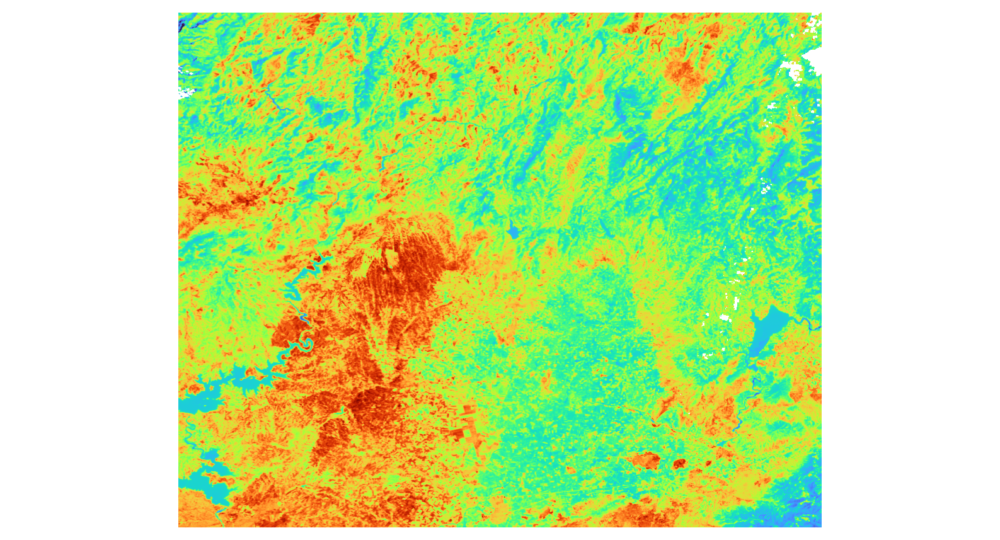
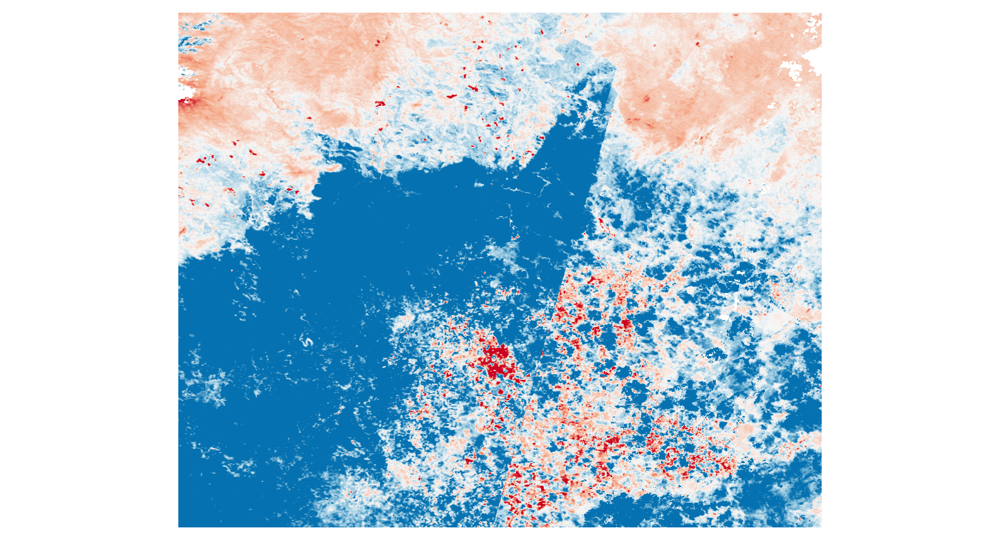

# Uydu Tabanlı Termal Veri İşleme Prototipi

Bu proje, Google Earth Engine (GEE) üzerinden alınan **MODIS** ve **Landsat** yüzey sıcaklığı verilerini kullanarak Doğu Akdeniz bölgesi için **termal çevre temsili** oluşturan modüler bir prototip sistemdir. Proje; veri sorgulama, sıcaklık işleme, GeoTIFF export, Google Drive üzerinden otomatik dosya alma ve Python ile yerel raster ön işleme adımlarını içeren bir altyapı kurmayı hedeflemektedir.

Bu repo şu anda tamamlanmış bir **3B termal dijital ikiz** veya **yangın riski tahmin sistemi** değildir. Mevcut haliyle, bu hedeflere ilerleyen bir **termal veri işleme ve ön analiz prototipi** olarak değerlendirilmelidir.

---

# Amaç

Projede amaç, uydu tabanlı yüzey sıcaklığı verilerini kullanarak Doğu Akdeniz bölgesine ait:

* geniş alanlı termal referans katmanlar üretmek,
* yüksek çözünürlüklü Landsat sıcaklık verilerini işlemek,
* zaman serisi tabanlı ön işleme akışı kurmak,
* anomali üretimine temel oluşturacak raster çıktılar elde etmek

ve daha sonraki aşamalarda bunları 3B görselleştirme, risk analizi ve karar destek katmanlarına bağlayabilecek bir temel hazırlamaktır.

---

# Proje Kapsamı

Projede şu adımlar yer almaktadır:

* çalışma bölgesinin tanımlanması
* MODIS LST verisinin sorgulanması
* MODIS için 5 yıllık yaz dönemi baseline üretimi
* baseline için ortalama ve standart sapma hesaplanması
* Landsat yüksek çözünürlüklü LST verisinin hazırlanması
* Landsat günlük composite zaman serisi oluşturulması
* GeoTIFF export
* Drive export task polling
* Google Drive klasöründen otomatik indirme
* raster dosyalarının yerel veri klasörlerine otomatik yerleştirilmesi
* QA tabanlı bulut maskeleme
* Python ile zaman serisi ön işleme
* baseline ve anomaly raster üretimi
* geçerli gözlem sayısı ve düşük güven maskeleri ile anomaly teşhisi
* ileride 2B/3B görselleştirme ve risk analizi

---

# Mevcut Durum

Şu anda tamamlanan veya büyük ölçüde kurulan kısımlar şunlardır:

* GEE bağlantısı ve doğrulama
* çalışma bölgelerinin tanımlanması
* proje yapısının modüler hale getirilmesi (`core/` yapısı)
* ortak ayarların `config.py` altında toplanması
* MODIS veri sorgulama
* MODIS için 5 yıllık yaz dönemi **ortalama** üretimi
* MODIS için 5 yıllık yaz dönemi **standart sapma** üretimi
* Landsat veri sorgulama
* Landsat zaman serisi koleksiyonunun hazırlanması
* current period ile aynı takvim penceresine sahip geçmiş yıl Landsat median composite'lerinin hazırlanması
* current period için QA-maskeli temporal window tabanlı median composite üretimi
* current period için geçerli gözlem sayısı bandı üretimi
* Step4'te MODIS ve Landsat exportlarının aç/kapa mantığıyla kontrol edilmesi
* Step4'te Drive export task polling
* Step4b'de Google Drive klasörü indirme ve dosyaların yerel veri klasörlerine yerleştirilmesi
* `main.py` üzerinden Step1 -> Step5 akışının uçtan uca çalıştırılabilmesi
* Step5'in otomatik akış içinde çalıştırılması
* baseline mean raster, baseline std raster, baseline valid count raster, current period median raster, current period valid count raster ve z-score anomaly raster çıktılarının üretilmesi
* düşük baseline gözlem sayısı, düşük baseline standard deviation ve düşük current gözlem sayısı için tanı maskelerinin üretilmesi
* Step5 raster çıktılarının windowed/chunked okuma ile düşük bellek kullanarak oluşturulması
* NetCDF yerine daha hafif raster + metadata odaklı Step5 çıktı yapısına geçilmesi

---

# Şu Anda Gözlenen Sınırlılıklar

Proje çalışıyor olsa da şu anda bazı önemli teknik sınırlılıklar bulunmaktadır:

* Step4 otomatikleşmiş olsa da bunun sağlıklı çalışması için `DRIVE_AUTO_DOWNLOAD_AFTER_EXPORT`, `GOOGLE_DRIVE_EXPORT_FOLDER_URL` veya `GOOGLE_DRIVE_EXPORT_FOLDER_ID` ayarlarının doğru verilmesi gerekir.
* Google Drive klasör URL/ID değerleri repoda hardcode edilmez; `GOOGLE_DRIVE_EXPORT_FOLDER_URL` veya `GOOGLE_DRIVE_EXPORT_FOLDER_ID` environment variable olarak verilmelidir.
* Drive indirme akışı `geemap/gdown` davranışına bağlıdır; klasör URL/ID, paylaşım yetkisi ve Drive erişimi yanlış ise indirme adımı durabilir.
* Doğrudan `ee.Image.getDownloadURL()` indirme yolu kaldırılmıştır; büyük rasterlar için ana akış Drive export, task polling ve geemap/gdown klasör indirmedir.
* Step5 şu ana kadar sınırlı sayıda pencere composite'i ve daha küçük bir bölge ile test edilmiştir. Güncel simetrik baseline ayarında 2019-2022 yılları için aynı current penceresi export edilir.
* Bu nedenle anomaly ve diğer raster çıktılarında veri bulunmayan beyaz alanlar oluşabilmektedir.
* Anomaly üretimi artık tek sahne yaklaşımı yerine belirli bir zaman penceresi içerisindeki QA-maskeli Landsat sahnelerinin median composite çıktısı üzerinden yapılmaktadır.
* Ancak küçük test pencerelerinde veya sınırlı sahne sayısında hala veri boşlukları oluşabilmektedir.
* Bu boşlukların temel nedeni yetersiz zamansal kapsama, bulut/QA maskelemesi ve Landsat sahnelerinin doğal mekansal kapsama farklılıklarıdır.
* MODIS (~1 km) ve Landsat (~30 m) çözünürlük farkı nedeniyle anomaly üretimi hala geliştirme aşamasındadır.
* Baseline-current simetrisi Landsat tarafında pencere bazlı hale getirilmiştir; yine de bu yaklaşımın büyük bölge ve daha fazla tarih penceresi ile doğrulanması gerekir.
* Step5 çıktıları henüz büyük ölçekli veri ile tam doğrulanmış değildir.

---

# Geliştirme Aşamasında Olan Kısımlar

Şu anda aktif olarak geliştirilen / iyileştirilen alanlar:

* anomaly üretiminde temporal window yaklaşımının iyileştirilmesi
* daha geniş zaman pencereleri ile veri boşluklarının azaltılması
* current period composite üretiminin daha kararlı hale getirilmesi
* Step5 çıktılarının daha büyük veri kümeleri ile doğrulanması
* çıktıların README'ye eklenebilecek düzeyde iyileştirilmesi
* Step4 sonrası veri geçiş sürecinin daha kontrollü hale getirilmesi
* config bağımlılığının zamanla azaltılması
* step fonksiyonlarına parametre geçişinin artırılması
* raster işleme sırasında bellek kullanımının optimize edilmesi
* chunked/windowed raster processing yaklaşımının geliştirilmesi

---

# Planlanan Çalışmalar

Henüz tamamlanmamış veya ileride geliştirilecek başlıklar:

* 2B çıktıların daha güçlü görselleştirilmesi
* 3B görselleştirme katmanı
* gelişmiş anomali / risk analizi
* karar destek yapısı
* yangın kayıtları ile veri birleştirme
* Jetson / YOLO entegrasyonu
* daha kararlı online/offline pipeline ayrımı
* Step5 sonrası aşamaların yapılandırılması

---

# Veri Kaynakları

## MODIS

* Veri kümesi: `MODIS/061/MOD11A1`
* İçerik: günlük kara yüzey sıcaklığı verisi
* Çözünürlük: yaklaşık 1 km
* Kullanım amacı: geniş alanlı termal baseline üretimi

## Landsat 8

* Veri kümesi: `LANDSAT/LC08/C02/T1_L2`
* İçerik: Surface Temperature (`ST_B10`) ve kalite bandı (`QA_PIXEL`)
* Çözünürlük: yaklaşık 30 m
* Kullanım amacı: yüksek çözünürlüklü termal katman ve zaman serisi işleme

---

# MODIS Baseline Seçiminin Gerekçesi

Projede MODIS verisi, Doğu Akdeniz için düşük çözünürlüklü ama zamansal olarak daha düzenli bir referans termal davranış üretmek amacıyla kullanılmaktadır.

Bu aşamada MODIS tarafında tam zaman serisi yerine 5 yıllık yaz dönemi ortalaması ve standart sapması alınmıştır. Bunun başlıca gerekçeleri şunlardır:

* MODIS, Landsat'a göre daha düzenli gözlem sıklığı sağlar.
* 5 yıllık pencere, tek bir yıla göre daha kararlı bir baseline üretir.
* Yaz aylarına odaklanılması, yüksek sıcaklık davranışını inceleme amacıyla uyumludur.
* Ortalama tek başına yeterli olmadığı için, değişkenliği tanımlamak üzere standart sapma da eklenmiştir.
* Bu yapı, ileride z-score veya normalize anomali hesapları için temel sağlayacaktır.

Bu nedenle MODIS çıktısı, Landsat'ın yerine geçen bir zaman serisi değil; daha çok Landsat analizini destekleyen referans termal katman olarak kullanılmaktadır.

---

# Metodoloji

Projede genel akış şu şekildedir:

1. Çalışma bölgesi GEE üzerinde tanımlanır.
2. MODIS verisi kullanılarak 5 yıllık yaz dönemi baseline katmanları hazırlanır.
3. Bu baseline için ortalama ve standart sapma hesaplanır.
4. Landsat verisi aynı bölge için filtrelenir.
5. Current period için belirli bir temporal window tanımlanır.
6. Bu pencerenin aynı ay-gün aralığı geçmiş baseline yıllarına taşınır.
7. Her baseline yılı için QA-maskeli pencere median composite üretilir.
8. Current period için QA-maskeli median composite ve geçerli gözlem sayısı bandı üretilir.
9. MODIS ve Landsat rasterları GeoTIFF olarak Google Drive'a export edilir.
10. Export task'ları polling ile tamamlanana kadar izlenir.
11. Drive klasörü otomatik indirilir ve dosyalar yerel veri klasörlerine dağıtılır.
12. QA verisi kullanılarak bulut, gölge, cirrus, kar ve düşük güvenli pikseller maskelenir.
13. Python tarafında zaman serisi kurulup baseline mean/std, valid count, current median, current valid count ve z-score anomaly rasterları üretilir.
14. Düşük baseline gözlem sayısı, düşük baseline std ve düşük current gözlem sayısı maskeleriyle anomaly çıktısı teşhis edilir.

---

# Proje Yapısı

```text
core/
├── config.py
├── gee_utils.py
├── io_utils.py
├── regions.py
└── drive_downloader.py

step1_fetch_modis.py
step2_modis_5year_mean.py
step3_landsat_lst.py
step4_export_geotiff.py
step4b_download_drive_exports.py
step5_preprocess_timeseries.py
main.py

```

---

# Step Açıklamaları

## Step 1

GEE bağlantısını başlatır, çalışma bölgelerini tanımlar ve temel MODIS sorgusunu gerçekleştirir.

## Step 2

MODIS verisini kullanarak 5 yıllık yaz dönemi baseline katmanlarını üretir. Bu aşamada ortalama ve standart sapma hesaplanır.

## Step 3

Landsat baseline ve current period koleksiyonlarını hazırlar. Güncel yöntemde baseline, tüm yaz günlük composite yığını değildir; current period ile aynı ay-gün aralığındaki geçmiş yıl pencerelerinin QA-maskeli median composite'lerinden oluşur.

Örnek:

```text
current  = 2023-07-17 -> 2023-08-31 median
baseline = 2019-07-17 -> 2019-08-31 median
baseline = 2020-07-17 -> 2020-08-31 median
baseline = 2021-07-17 -> 2021-08-31 median
baseline = 2022-07-17 -> 2022-08-31 median
```

Step5 bu geçmiş yıl pencere medianları üzerinden baseline mean/std üretir.

Current period çıktısı iki bantlıdır:

* `Current_Period_LST_Celsius`
* `Current_Period_Valid_Count`

İkinci bant, current period median değerinin kaç QA-temiz Landsat gözleminden üretildiğini gösterir. Step5 bu bandı düşük güvenli current piksellerini elemek için kullanır.

## Step 4

Online export katmanıdır. MODIS ve Landsat rasterlarını GeoTIFF olarak Google Drive'a export eder ve export task'larını polling ile izler. Bu adım artık Drive klasörünü indirmez; indirme ve yerel klasörlere dağıtma sorumluluğu Step4b'ye ayrılmıştır.

## Step 4B

Drive download ve yerel dosya yerleştirme katmanıdır. Step4 tarafından tamamlanan Drive export dosyalarını indirir ve GeoTIFF dosyalarını Step5'in beklediği yerel klasörlere dağıtır.

Yerel klasör yerleştirmesi şu şekildedir:

* QA dosyaları -> `data/landsat_qa`
* Baseline Landsat LST dosyaları -> `data/landsat_timeseries`
* Current period median dosyası -> `data/current_period`
* MODIS export dosyaları -> `data/modis`

## Step 5

Offline raster işleme katmanıdır. Step4b tarafından yerleştirilen GeoTIFF dosyaları okunur, QA tabanlı maskeleme uygulanır ve aşağıdaki çıktılar üretilir:

* baseline mean raster
* baseline standard deviation raster
* baseline valid count raster
* current period median raster
* current period valid count raster
* z-score anomaly raster
* düşük güven tanı maskeleri
* metadata JSON çıktısı

Step5 artık tüm zamanı bellekte tutan `xarray + full stack` yolu yerine windowed/chunked raster işleme ile çalışmaktadır. Baseline istatistiklerinde lineer zaman interpolasyonu kullanılmaz; yeterli geçerli gözlem olmayan pikseller `NaN` bırakılır.

## main.py

`main.py`, Step1'den Step5'e kadar olan akışı organize biçimde çalıştırır. Güncel akışta Step4 export/polling sürecini tamamlar, Step4b ile Drive çıktılarını indirip yerel klasörlere dağıtır, ardından Step5 otomatik olarak devreye girer.

---

# Step5 Çıktıları

Step5 sonunda aşağıdaki raster ve metadata çıktıları üretilmektedir:

* `baseline_lst_mean_celsius.tif`
* `baseline_lst_std_celsius.tif`
* `baseline_valid_count.tif`
* `low_baseline_count_mask.tif`
* `low_baseline_std_mask.tif`
* `current_period_median_celsius.tif`
* `current_period_valid_count.tif`
* `low_current_count_mask.tif`
* `anomaly_zscore.tif`
* `step5_metadata.json`

Tanı maskelerinde `1` değeri ilgili pikselin o nedenle güven dışı kaldığını gösterir. Bu katmanlar özellikle anomaly rasterındaki doygun mavi alanların kaynağını ayırmak için kullanılır:

* `low_baseline_count_mask.tif`: baseline döneminde yeterli geçerli Landsat gözlemi yoktur.
* `low_baseline_std_mask.tif`: baseline standart sapması z-score için çok düşüktür.
* `low_current_count_mask.tif`: current period median yeterli QA-temiz gözlemden oluşmamıştır.

Güncel z-score formülü:

```text
z_score = (current_median - baseline_mean) / baseline_std
```

Bu hesap yalnızca şu koşullar sağlandığında yapılır:

* baseline geçerli gözlem sayısı `STEP5_MIN_BASELINE_VALID_COUNT` eşiğini geçmelidir.
* baseline standard deviation `STEP5_MIN_BASELINE_STD_CELSIUS` eşiğini geçmelidir.
* current period geçerli gözlem sayısı `STEP5_MIN_CURRENT_VALID_COUNT` eşiğini geçmelidir.

---

# Kurulum

```bash
git clone https://github.com/emrehann17/satellite-thermal-digital-twin.git
cd satellite-thermal-digital-twin

```

```bash
python -m venv .venv

```

Windows:

```bash
.venv\Scripts\activate

```

Linux / macOS:

```bash
source .venv/bin/activate

```

```bash
pip install -r requirements.txt

```

```bash
earthengine authenticate

```

Google Drive otomatik indirme kullanılacaksa Drive klasör referansı environment variable olarak verilmelidir. Bu değerler güvenlik ve repo hijyeni nedeniyle `core/config.py` içine hardcode edilmez.

Windows PowerShell:

```powershell
$env:GOOGLE_DRIVE_EXPORT_FOLDER_ID="DRIVE_KLASOR_ID"
```

Linux / macOS:

```bash
export GOOGLE_DRIVE_EXPORT_FOLDER_ID="DRIVE_KLASOR_ID"
```

Alternatif olarak klasör URL'si kullanılabilir:

```bash
export GOOGLE_DRIVE_EXPORT_FOLDER_URL="https://drive.google.com/drive/folders/DRIVE_KLASOR_ID"
```

---

# Güncel Test Ayarları

`core/config.py` içinde güncel test çalıştırması için öne çıkan ayarlar:

```python
REGION_NAME = "kozan_aoi"
ENABLE_MODIS_EXPORT = True
ENABLE_LANDSAT_EXPORT = True

MAX_LANDSAT_DAILY_EXPORTS = 12

BASELINE_START_DATE = "2019-06-01"
BASELINE_END_DATE = "2023-09-30"

CURRENT_PERIOD_DAYS = 45
CURRENT_PERIOD_END_DATE = "2023-08-31"

STEP5_MIN_BASELINE_STD_CELSIUS = 1.0
STEP5_MIN_BASELINE_VALID_COUNT = 3
STEP5_MIN_CURRENT_VALID_COUNT = 2
```

Bu ayarla beklenen GEE export task sayısı yaklaşık olarak:

* 4 Landsat baseline window LST
* 4 Landsat baseline window QA
* 1 current period raster
* 1 MODIS raster
* toplam yaklaşık 10 task

Production veya daha kapsamlı denemelerde baseline yıl aralığı ve pencere sayısı artırılabilir. Büyük bölgeye geçmeden önce küçük bölge ve kontrollü test önerilir.

---

# Çalıştırma Sırası

## Uçtan Uca Akış

```bash
python main.py

```

Bu komut güncel akışta sırasıyla şunları yürütür:

* Step1: GEE bağlantısı ve temel veri sorguları
* Step2: MODIS baseline üretimi
* Step3: Landsat günlük composite ve current period hazırlığı
* Step4: Drive export ve task polling
* Step4b: Drive klasörü indirme ve dosya yerleştirme
* Step5: windowed/chunked raster ön işleme ve anomaly üretimi

## Adım Adım Çalıştırma

```bash
python step1_fetch_modis.py
python step2_modis_5year_mean.py
python step3_landsat_lst.py
python step4_export_geotiff.py
python step4b_download_drive_exports.py
python step5_preprocess_timeseries.py

```

## Step4 -> Step4b -> Step5 Geçişi

Step4, Drive export task'larını polling ile tamamlanana kadar bekler ve `outputs/step4/step4_metadata.json` dosyasına export listesini yazar. Step4 artık Drive klasörü indirme veya yerel klasörlere dosya dağıtma yapmaz.

Step4b, `DRIVE_AUTO_DOWNLOAD_AFTER_EXPORT=True` yapılır ve `GOOGLE_DRIVE_EXPORT_FOLDER_URL` veya `GOOGLE_DRIVE_EXPORT_FOLDER_ID` verilirse Drive klasörünü geemap/gdown ile indirir. Bu aşamada config ayarları ve Google Drive dosya erişim izinlerini kullanıcının manuel olarak yapması beklenir.

İndirilen GeoTIFF dosyaları otomatik olarak şu klasörlere yerleştirilir:

* QA dosyaları -> `data/landsat_qa`
* Baseline Landsat LST dosyaları -> `data/landsat_timeseries`
* Current period median dosyası -> `data/current_period`
* MODIS export dosyaları -> `data/modis`

Bu yerleştirme tamamlandıktan sonra Step5 aynı veri akışı üzerinden çalışır.

Step5 mümkünse `outputs/step4/step4_metadata.json` içindeki son export listesini kullanarak baseline dosyalarını seçer. Böylece `data/landsat_timeseries` içinde önceki denemelerden kalan GeoTIFF dosyalarının yeni baseline yığınına karışması engellenir. Metadata okunamazsa Step5 klasördeki uygun Landsat LST dosyalarını kullanır ve log'a uyarı yazar.

Current period tarafında Step5, `CURRENT_PERIOD_DAYS` ile eşleşen dosya adını öncelikli seçer. Örneğin `CURRENT_PERIOD_DAYS=45` ise `landsat_current_period_45days*.tif` dosyası beklenir.

## Step5'i Tek Başına Çalıştırma

```bash
python step5_preprocess_timeseries.py

```

Bu komut, Step5'i tek başına yeniden çalıştırmak istediğinde kullanılabilir. Normal kullanımda `main.py` akışı içinde otomatik tetiklenir.

---

# Örnek Çıktılar

## Baseline Mean Raster

Bu raster, baseline dönemi boyunca hesaplanan ortalama yüzey sıcaklığını temsil etmektedir.



## Z-Score Anomaly Raster

Bu raster, current period median sıcaklık değerlerinin baseline mean ve standard deviation kullanılarak hesaplanan z-score anomaly çıktısını göstermektedir.



---

# Çıktılar Hakkında Önemli Notlar

Bu görseller, projenin mevcut geliştirme aşamasını temsil eden erken prototip çıktılarıdır ve aşağıdaki sınırlamaları içermektedir:

* Çıktılar, işlem süresini kısaltmak amacıyla sınırlı sayıda Landsat sahnesi kullanılarak üretilmiştir.
* Bu nedenle anomaly raster üzerinde veri bulunmayan alanlar oluşabilmektedir.
* Bu boşluklar çoğunlukla yetersiz zamansal kapsama, QA maskelemesi, düşük baseline gözlem sayısı veya düşük current gözlem sayısından kaynaklanmaktadır.
* Current thermal state, belirli bir zaman penceresine düşen QA-maskeli Landsat sahnelerinin median composite çıktısı olarak tanımlanmaktadır.
* Bu yaklaşım, tek sahne kullanımına göre daha kararlı ve daha geniş kapsamlı anomaly üretimi sağlamayı hedeflemektedir.
* Daha geniş temporal window ve daha fazla sahne kullanımı ile anomaly kapsamasının iyileştirilmesi hedeflenmektedir.
* Anomaly rasterındaki doygun mavi alanların su, bulut/QA kaçağı, düşük baseline std veya düşük valid count kaynaklı olup olmadığını ayırmak için Step5 tanı maskeleri birlikte değerlendirilmelidir.

---

# Planlanan İyileştirmeler

* Daha fazla Landsat sahnesi kullanılarak veri boşluklarının azaltılması
* Pencere-simetrik baseline yaklaşımının farklı pencereler ve büyük bölge üzerinde doğrulanması
* Temporal window ve composite stratejisinin daha güçlü anomaly kapsaması sağlayacak şekilde geliştirilmesi
* MODIS baseline ile Landsat anomaly ilişkisinin daha sağlam kurulması
* Büyük bölgelerde parçalı GeoTIFF exportları için mosaic/VRT tabanlı daha sağlam okuma akışının kurulması
* Büyük rasterlar için daha verimli bellek yönetimi
* Nihai, doğrulanmış ve daha temiz görsel çıktılarla bu bölümün güncellenmesi

---

# Not

Bu repo şu anda tamamlanmış bir 3B termal dijital ikiz sistemi değildir. Mevcut haliyle, MODIS ve Landsat tabanlı termal veri işleme ve ön analiz akışını kurmaya odaklanan bir prototip çalışmadır.

Şu anki en önemli açık konular:

* anomaly'nin tüm bölgeyi temsil edecek şekilde güçlendirilmesi
* daha fazla Landsat sahnesi ile Step5'in yeniden test edilmesi
* veri boşluklarının azaltılması
* pencere-simetrik baseline yaklaşımının daha fazla test edilmesi
* büyük bölge tiling/parçalı GeoTIFF akışının tam çözülmesi
* Step5 çıktılarının büyük veri ile daha güçlü doğrulanması

Bu eksikler giderildikçe proje daha güçlü 2B/3B termal temsil ve risk analizi katmanlarına doğru genişletilecektir.
