# Önsöz — Bu Rehber Nasıl Kullanılır

Bu belge, **Uydu Tabanlı Termal Dijital İkiz** projesinin sahibi için hazırlanmış, kapsamlı ve pedagojik bir **proje ustalık rehberidir**. Amaç: projeyi AI yardımı olmadan uçtan uca anlatabilmek, her sonucu girdi verisine ve kod yoluna kadar izleyebilmek, ve projeyi güvenle çalıştırıp değiştirebilmek.

**Bu bir README değildir.** README bilimsel çerçeve için hâlâ değerlidir; ancak bu rehber, kanonik kaynağı **kod + registry + gerçek çıktı dosyaları** olarak alır ve doküman ile çıktı çeliştiğinde bir *discrepancy* (tutarsızlık) olarak açıkça işaretler (bkz. Bölüm 4.5).

**Nasıl okunur:**

- Aceleyse: Bölüm 0 (zihinsel model) + Bölüm 14 (claim tablosu) + Bölüm 25 (kopya kâğıtları).
- Sistemli öğrenme için: Bölüm 23'teki 14 günlük plan.
- Referans için: Bölüm 6 (CLI), Bölüm 7 (sabitler), Bölüm 19 (tüm modüller).
- Sınav/danışman için: Bölüm 24.

**Kullanılan callout kutuları:** *Neden önemli?*, *Sık yapılan hata*, *Leakage riski*, *Claim sınırı*, *Kodda nerede?*, *Çıktıda nerede?*, *Bunu kendin kontrol et*, *Discrepancy*, *Not*.

Her ana bölümün sonunda beş öz-kontrol sorusu, bir depo-gezinme egzersizi ve bir "AI kullanmadan anlat" egzersizi vardır.

# Bölüm 0 — Bir Sayfalık Zihinsel Model

Bu bölüm, tüm projeyi tek bir kavramsal harita üzerinden özetler. Buradaki her kutu ve ok, ilerideki bölümlerde ayrıntılı olarak açılacaktır. Amaç: bu sayfayı okuyan birinin, projenin **neyi sorduğunu, neyi kanıtladığını ve neyi kanıtlamadığını** 60 saniyede kavrayabilmesidir.

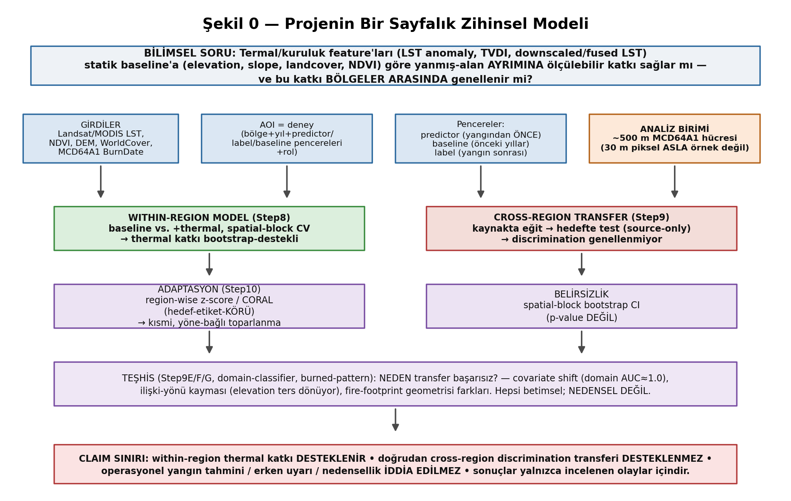

**Tek cümleyle proje:** Bu proje, uydu-tabanlı termal ve kuruluk göstergelerinin (LST anomaly, TVDI, downscaled/fused LST) statik arazi göstergelerine (elevation, slope, landcover, NDVI) göre **yanmış-alan ayrımına** ölçülebilir bir katkı sağlayıp sağlamadığını — ve bu katkının **bir bölgeden diğerine genellenip genellenmediğini** — dürüst (label-honest) bir istatistiksel çerçevede test eder.

**Yedi anahtar fikir:**

1. **Bilimsel soru** iki katmanlıdır: (a) *within-region* — tek bir bölgede termal feature'lar baseline'a katkı sağlıyor mu? (b) *cross-region* — bu katkı başka bir bölgeye taşınıyor mu?
2. **Analiz birimi** 30 m piksel değil, MCD64A1'in yaklaşık **~500 m hücresidir**. 30 m predictor'lar bu hücreye toplanır (aggregation). Bu, "label-resolution honesty"nin çekirdeğidir.
3. **AOI = deney (experiment)**: yalnızca bir coğrafi dikdörtgen değil; bölge + yıl + predictor penceresi + label penceresi + baseline yılları + rol + çıktı namespace'i.
4. **Pencereler** zamansaldır: predictor penceresi yangından **önce**, baseline penceresi **önceki yıllar**, label penceresi yangın **sonrasıdır**. Bu ayrım "pre-fire" senaryosunu ve leakage'a karşı ilk savunmayı kurar.
5. **Within-region sonuç olumlu**: termal katkı, spatial-block bootstrap ile desteklenir ve daha büyük mekansal bloklarda korunur.
6. **Cross-region sonuç olumsuz**: doğrudan ayrım (discrimination) transferi genellenmez; domain separability neredeyse mükemmel (≈1.0) iken transfer performansı şans düzeyinde kalır. Adaptasyon (Step10) yalnızca kısmi ve yöne-bağlı toparlanma sağlar.
7. **Claim sınırı**: proje operasyonel bir yangın erken-uyarı sistemi **değildir**, nedensellik **iddia etmez**, ve sonuçlar yalnızca incelenen olaylar için geçerlidir.

> **Bunu kendin kontrol et:** `python scripts/main.py --help` çıktısındaki 15 alt-komutu bu şemayla eşleştir: `experiment` (within-region üretim), `transfer`/`step10` (cross-region), `shift-audit`/`concept-shift`/`domain-classifier-audit`/`burned-pattern-audit` (teşhis). Her okun altında hangi komutun çalıştığını Bölüm 6 gösterir.

---

# Bölüm 1 — Proje Amacı ve Bilimsel Sözleşme

## 1.1 Bu bölümün amacı

Bir projeye hâkim olmanın ilk adımı, onun **ne olduğunu ve ne olmadığını** kesin olarak bilmektir. Bu bölüm, projenin bilimsel "sözleşmesini" (contract) tanımlar: hangi soruyu test ediyor, hangi iddiaları destekliyor, ve hangi iddiaları kesinlikle **yasaklıyor**. Bu sözleşme, `README.md`'nin 1., 2., 17. ve 19. bölümlerinde ve kodun içindeki onlarca fail-fast kontrolünde somutlaşır.

## 1.2 Orijinal çerçeve: "dijital ikiz"den bilimsel deneye

Proje adı **"satellite-thermal-digital-twin"**dir ve tarihsel olarak bir "termal dijital ikiz" ürün fikriyle başlamıştır (bkz. Bölüm 20, git geçmişi: erken commit'ler "MODIS pipeline", "TVDI workflow"). Ancak proje **evrilmiştir**: bugün deposu, 3B bir görselleştirme/simülasyon katmanı üretmez. Bunun yerine, iki ayrı teslimat kümesi vardır:

- **Ürün/altyapı katmanı**: MODIS/Landsat termal işleme, MODIS→Landsat downscaling ve fusion (Step1–Step7). Bu, "dijital ikiz"in veri-üretim çekirdeğidir.
- **Bilimsel deney katmanı**: label-honest burned-area modelleme (Step8), cross-region transfer değerlendirmesi (Step9), self-calibrated adaptation (Step10) ve teşhis analizleri. Bu, projenin bugünkü bilimsel omurgasıdır.

> **Neden önemli?** Danışmanına veya bir jüriye projeyi anlatırken bu iki katmanı karıştırmak en sık yapılan hatadır. "Dijital ikiz" ifadesi bir *ürün vizyonudur*; bugünkü *bilimsel katkı* ise termal feature'ların yanmış-alan ayrımına katkısının dürüst ölçümüdür. İkisini ayrı cümlelerle anlat.

## 1.3 "Satellite thermal digital twin" bu depoda ne anlama gelir?

Bu depoda terim, üç şeyin birleşimidir:

1. **Termal veri üretimi**: gerçek uydu gözlemlerinden (Landsat/MODIS LST) türetilmiş anomaly ve kuruluk (TVDI) ürünleri, artı boşlukları dolduran downscaled/fused LST.
2. **Label-honest modelleme altyapısı**: bu ürünlerin MCD64A1 yanmış-alan etiketleriyle, sahte hassasiyet (pseudo-replication) olmadan ilişkilendirilmesi.
3. **Genelleme sınırlarının dürüst belgelenmesi**: bu ilişkinin bölgeler arası taşınabilirliğinin test edilmesi ve neden sınırlı kaldığının teşhisi.

Yani "dijital ikiz", burada bir 3B model değil, **gerçek uydu verisinin işlenmiş, model-hazır bir dijital temsilidir** ve bu temsilin bilimsel olarak nereye kadar güvenilir olduğunun kaydıdır.

## 1.4 Proje şu anda neyi test ediyor?

Kesin bilimsel hipotez:

> "Termal/kuruluk feature'ları (`lst_anomaly_mean`, `current_lst_mean`, `current_tvdi_mean`, `tvdi_difference_mean`, `downscaled_lst_mean`, `fused_lst_mean`), statik baseline feature'larına (`ndvi_mean`, `elevation_mean`, `slope_mean`, `landcover_dominant`) göre, ~500 m MCD64A1 hücrelerinde yanmış/yanmamış ayrımına ölçülebilir bir katkı sağlar mı; ve bu katkı bir Akdeniz yangın bölgesinden diğerine genellenir mi?"

Bu hipotez üç ölçekte test edilir: (i) tek bölge içinde (Step8), (ii) daha büyük mekansal doğrulama bloklarında (robustness), (iii) bölgeler arası (Step9/Step10).

## 1.5 Proje neyi test ETMİYOR?

- **Yangın oluşumunu tahmin etmiyor.** Bu bir *burned-area discrimination* çalışmasıdır: yangın *olmuş* alanları, aynı sezonda yanmamış alanlardan ayırt etmeye çalışır. Bir yangının *nerede/ne zaman çıkacağını* tahmin etmez.
- **Operasyonel erken-uyarı yapmıyor.** Near-real-time veri akışı, çok-yıllı üretim döngüsü yoktur.
- **Nedensellik iddia etmiyor.** Hiçbir feature'ın yangına *neden olduğu* söylenmez; yalnızca istatistiksel ilişki ölçülür.

> **Claim sınırı:** "Burned-area discrimination" ile "fire prediction" tamamen farklı iki iştir. Discrimination, etiketin (yangın olmuş) *sonrasına* bakan bir sınıflandırma problemidir. Prediction, geleceğe bakan nedensel bir problemdir. Bu proje yalnızca birincisini yapar. "Bu proje yangını tahmin ediyor" cümlesi **yasaktır**.

## 1.6 Neden burned-area ayrımı ≠ yangın tahmini?

Predictor penceresi yangından *önce* biter (pre-fire kurgu), bu da "yangından önceki kuruluk sinyali" fikrini çağrıştırır. Ancak:

- Model, hangi hücrenin *yanmış olduğunu* (label) öğrenerek eğitilir; bu etiket geçmişe aittir.
- Cross-validation bir *tahmin* değil, aynı sezon içindeki bir *ayrım* ölçer.
- "Pre-fire" ifadesi yalnızca predictor'ların leakage'sız (yangın sonrası ısı/kül sinyali içermeyen) olmasını sağlar; bir öngörü mekanizması kurmaz.

## 1.7 Analiz birimi ve mekansal çözünürlük

Analiz birimi **~500 m MCD64A1 hücresidir** (bkz. `STEP8A_MCD64A1_NATIVE_CELL_SIZE_M = 500.0`). MCD64A1 yerelde native 500 m CRS'te saklanmadığı için, Step8A referans 30 m grid üzerinde `round(500/30) ≈ 17×17` piksel-bloklarıyla native hücreyi yeniden oluşturur (`STEP8A_REFERENCE_PIXEL_SIZE_M = 30.0`).

## 1.8 MCD64A1'in rolü

**MCD64A1 BurnDate** tek ve birincil yanmış-alan etiketidir. Gerçek BurnDate DOY (day-of-year, 1..366) değerleri kullanılır; yalnızca binary (0/1) bir maske **yetersizdir** (bkz. Bölüm 15, label honesty). Step6, bu raw BurnDate export'unun tek sahibidir (`export_raw_mcd64a1_labels()`).

## 1.9 Neden 30 m predictor pikselleri bağımsız label örnekleri değildir?

Aynı ~500 m yanmış hücresinin içindeki onlarca 30 m piksel, **aynı** etiketi paylaşır. Eğer her 30 m piksel bir eğitim örneği sayılırsa, model aynı bilgiyi düzinelerce kez görür (pseudo-replication) ve hem performans hem güven aralıkları yapay olarak şişer. Bu yüzden Step8A, 30 m predictor'ları özet istatistiklerle (sürekli: mean/median; kategorik: mode/fraction) 500 m hücreye indirger; **her satır tam olarak bir MCD64A1 hücresidir**.

## 1.10 Neden FIRMS birincil hedef değildir?

FIRMS (aktif yangın; MODIS T21 + VIIRS) yalnızca **bağımsız bir cross-check** katmanıdır (`VALIDATION_INCLUDE_FIRMS = True`). Hiçbir aşamada MCD64A1 ile OR-birleştirilerek birincil etikete dahil edilmez. Aktif yangın, yanmış-alanı değil, *o an yanmakta olan* pikselleri gösterir; farklı bir olgudur.

## 1.11 Label honesty (etiket dürüstlüğü)

Üç ilke: (i) etiketin gerçek çözünürlüğünün (~500 m) altında sahte hassasiyet üretilmez; (ii) etiket yalnızca label penceresine ait BurnDate'ten türetilir; (iii) predictor penceresinde yanmış hücreler (pre-label burns) analiz evreninden **çıkarılır** (Muğla/Evia'da `exclude_pre_label_burns=True`).

## 1.12 Source-only transfer ve target-label kısıtları

Cross-region transferde (Step9/Step10) tüm ön-işleme, eşik seçimi ve model fit'i **yalnızca kaynak (source) bölgeden** yapılır. Hedef (target) bölgenin etiketleri; ön-işlemeyi, eşiği, kalibrasyonu veya feature seçimini **hiçbir şekilde etkilemez**. Bu "target-label firewall", leakage'a karşı en kritik disiplindir (bkz. Bölüm 15).

## 1.13 Orijinal ürün teslimatları vs. sonraki bilimsel deneyler

| Katman | İçerik | Durum |
|---|---|---|
| Ürün/altyapı | Step1–Step7 (termal işleme, downscaling, fusion) | Tamamlandı (5 AOI) |
| Bilimsel çekirdek | Step8 within-region modelleme | Tamamlandı (5 AOI) |
| Cross-region | Step9A–G transfer + teşhis | Tamamlandı (8 çift) |
| Adaptasyon | Step10 self-calibrated | Tamamlandı (5 çift) |
| Sentez/teşhis | domain/burned-pattern/multi-AOI | Tamamlandı |
| 3B dijital ikiz sunumu | — | **Henüz yok** |

## 1.14 Bölüm özdeğerlendirmesi

**Beş öz-kontrol sorusu:**

1. "Burned-area discrimination" ile "fire prediction" arasındaki farkı bir cümleyle açıkla.
2. Analiz birimi neden 30 m piksel değil ~500 m hücredir? Hangi sabit bunu belirler?
3. FIRMS neden birincil etiket değildir? Kodda hangi bayrak bunu kontrol eder?
4. "Target-label firewall" ne demektir ve hangi adımlarda uygulanır?
5. Projenin yasakladığı üç iddiayı say.

**Depo gezinme egzersizi:** `core/config.py` içinde `STEP8A_MCD64A1_NATIVE_CELL_SIZE_M` ve `STEP8A_REFERENCE_PIXEL_SIZE_M` sabitlerini bul; oranlarının kaç piksellik bir bloğa denk geldiğini hesapla.

**"AI kullanmadan anlat" egzersizi:** 3 dakikada, beyaz tahtada, "bu proje neyi test ediyor ve neyi test etmiyor" sorusunu yalnızca Şekil 0'a bakarak anlat.

---

# Bölüm 2 — Kapsamlı Terminoloji ve Sözlük

Bu bölüm, projenin kullandığı her önemli terimi tanımlar. Bir terime dayanmadan önce onu tanımlama ilkesine uyulur. Terimler tematik gruplandırılmıştır; benzer terimler için karşılaştırma tabloları eklenmiştir.

## 2.1 Coğrafi ve deney kavramları

- **AOI (Area of Interest):** Çalışılan coğrafi dikdörtgen (bbox). Kesin yangın perimetri **değildir**; elle çizilmiş bir çalışma alanıdır ve Step6B gate ile doğrulanır.
- **experiment (deney):** AOI + yıl + predictor/label/baseline pencereleri + rol + çıktı namespace'i. `core/regions.py:EXPERIMENTS` içinde tanımlıdır. Bir *region* yalnızca geometridir; bir *experiment* tam bir bilimsel kurulumdur.
- **anchor wildfire:** İlk referans doğal-bitki-örtüsü yangını (`manavgat_2021`, rol = `anchor_wildfire`).
- **transfer wildfire:** Anchor ile karşılaştırılan ikinci/üçüncü Akdeniz yangını (`bejis_2022`, `mugla_2021`, `evia_2021`).
- **negative control:** Yanmış etiketleri doğal bitki örtüsü değil cropland/anız-yakma kaynaklı olan bölge (`kozan_2023`). Wildfire modelinin kanıtı olarak sunulmaz; bir kontrol grubudur.

## 2.2 Zamansal pencereler

- **predictor window:** Predictor rasterlarının (LST, NDVI...) türetildiği, yangından **önce** biten pencere.
- **label window:** MCD64A1 BurnDate'in etiket olarak alındığı, yangın **sonrası** pencere.
- **baseline window:** Anomaly hesabı için önceki yıllardaki aynı takvim penceresi (`baseline_years`).

> **Neden önemli?** Bu üç pencerenin ayrık olması leakage'a karşı ilk bariyerdir. `core/config.py` içinde `VALIDATION_ALLOW_OVERLAPPING_WINDOWS = False` olduğu için predictor ve label pencereleri çakışırsa pipeline fail-fast durur.

## 2.3 Hücre ve popülasyon kavramları

- **burned cell:** Label penceresinde MCD64A1 BurnDate'i pozitif olan ~500 m hücre.
- **analysis eligible:** Yeterli geçerli 30 m piksel içeren ve modele girmeye uygun hücre (`STEP8A_MIN_30M_VALID_FRACTION = 0.3`).
- **primary population:** Ana analiz popülasyonu. Cross-region için `burnable_tree_shrub_grass`; formal within-region Step8B için `all_valid`.
- **burnable_tree_shrub_grass:** Baskın landcover'ı ağaç/çalı/ot olan (doğal bitki örtüsü) hücreler.
- **burnable_tree_shrub:** Yalnızca ağaç+çalı (ot hariç) alt popülasyon.
- **cropland_dominant:** Baskın landcover'ı ekili alan olan hücreler (Kozan'da baskındır; wildfire AOI'lerinde genelde yetersiz pozitif).

## 2.4 Feature/label ilişkisi

- **feature / predictor:** Modelin girdi değişkeni (ör. `ndvi_mean`).
- **label / target:** Tahmin edilen çıktı; burada burned (0/1).
- **baseline feature:** Statik arazi göstergeleri (ndvi, elevation, slope, landcover).
- **thermal feature:** Termal/kuruluk göstergeleri (lst_anomaly, current_lst, current_tvdi, tvdi_difference, downscaled_lst, fused_lst).

## 2.5 Transfer ve adaptasyon kavramları

- **source region / target region:** Modelin eğitildiği (source) ve test edildiği (target) bölge.
- **within-region model:** Bir bölgede eğitilip aynı bölgede spatial-block CV ile değerlendirilen model (Step8).
- **cross-region transfer / raw transfer:** Kaynakta eğitilip hedefte, hiçbir uyarlama olmadan test edilen model (Step9B).
- **self-calibration:** Hedef bölgenin **etiketsiz** covariate istatistikleriyle yapılan uyarlama (Step10).
- **region-wise z-score:** Her bölgenin feature'larını kendi mean/std'siyle standardize etme (unsupervised).
- **CORAL (CORrelation ALignment):** Kaynak ve hedef feature kovaryanslarını hizalayan unsupervised domain adaptation yöntemi (`STEP10_CORAL_LAMBDA = 1e-5`).

## 2.6 Dağılım/ilişki kayması kavramları

- **covariate shift:** P(X) (feature dağılımı) değişir; P(y|X) (ilişki) sabit kalır. z-score/CORAL bunu hedefler.
- **probability-scale shift:** Model çıktı olasılıklarının ölçeğinin bölgeler arası kayması (Brier'i etkiler).
- **concept shift / relationship-direction instability:** P(y|X)'in *yönünün* değişmesi (ör. `elevation_mean` bir bölgede pozitif, diğerinde negatif ilişkili). Adaptasyon bunu düzeltemez.
- **ranking reversal / inversion:** Modelin sıralamasının hedefte tersine dönmesi (ROC-AUC < 0.5). **Otomatik ters çevrilmez** — yalnızca teşhis amaçlı bir gözlemdir.
- **calibration:** Tahmin olasılıklarının gerçek frekanslarla uyumu.

## 2.7 Değerlendirme ve istatistik kavramları

- **OOF prediction (out-of-fold):** CV'de her hücrenin, o hücreyi içermeyen fold'da eğitilmiş modelle üretilen tahmini.
- **spatial block:** Komşu ~500 m hücrelerinin gruplandığı mekansal blok: `spatial_block_id = (row_500m // block, col_500m // block)`.
- **grouped CV / StratifiedGroupKFold:** Aynı spatial block'un hem train hem test'e düşmesini engelleyen, sınıf oranını koruyan CV.
- **bootstrap:** Yeniden örnekleme ile belirsizlik tahmini. Burada birim satır değil, **spatial block**tur.
- **percentile CI:** Bootstrap replikalarının yüzdelik dilimlerinden (2.5–97.5) türetilen güven aralığı. **Klasik p-value DEĞİLDİR.**
- **ROC-AUC:** Sıralama/ayrım kalitesi (0.5 = şans).
- **PR-AUC:** Precision-Recall eğrisi altı alan; nadir pozitif (burned) için ROC'tan daha bilgilendiricidir.
- **Brier score:** Olasılık hatasının kare ortalaması (düşük = iyi). Ayrım (discrimination) değil, kalibrasyon/olasılık kalitesini ölçer.
- **ablation:** Bir feature grubunu çıkararak katkısını ölçme (Step8D).
- **robustness:** Sonucun tasarım seçimlerine (blok boyutu vb.) duyarlılığı.

## 2.8 Teşhis ve altyapı kavramları

- **domain classifier:** İki bölgeyi yalnızca predictor'larla ayırt etmeye çalışan sınıflandırıcı; hedefi bölge kimliğidir (burned değil). AUC≈1.0 = güçlü covariate shift.
- **connected component:** Yanmış hücrelerin 8-komşuluk mekansal bağlı bileşeni. **Bağımsız yangın olayı sayısı DEĞİLDİR** — yalnızca mekansal parçalanma göstergesidir.
- **canonical artifact:** Bir analizin resmi/kanonik çıktısı (manifest ile referanslanan, frozen olabilen).
- **manifest:** Bir çıktının provenance'ını (girdi hash'leri, analysis_id, şema versiyonu) kaydeden JSON.
- **analysis ID:** Bir analizin girdilerinden türetilen deterministik kimlik (genelde SHA-256).
- **SHA-256:** Girdi dosyalarının değişmediğini doğrulayan kriptografik hash.
- **dry-run:** Hiçbir hesaplama/yazma yapmadan yalnızca planı basan mod.
- **force:** Var olan (izin verilen) çıktıların üzerine yazma; preregistration/frozen dosyalar HARİÇ.
- **namespace:** Bir deneyin çıktılarının toplandığı izole dizin (`outputs/experiments/<id>/`).
- **registry:** Deney kayıt defteri (`core/regions.py:EXPERIMENTS`).
- **legacy command:** Yalnızca Kozan için, Google Drive tabanlı eski Step1–Step8E zinciri (`main.py legacy`).

## 2.9 Karşılaştırma tabloları

**ROC-AUC vs. PR-AUC vs. Brier:**

| Metrik | Ne ölçer | Şans değeri | Bu projede rolü |
|---|---|---|---|
| ROC-AUC | Sıralama/ayrım | 0.50 | Birincil discrimination metriği |
| PR-AUC | Nadir-pozitif ayrımı | pozitif oranı | Burned nadir olduğu için önemli |
| Brier | Olasılık hatası | — | Kalibrasyon; discrimination DEĞİL |

**Covariate shift vs. concept shift:**

| Özellik | Covariate shift | Concept (relationship) shift |
|---|---|---|
| Değişen | P(X) | P(y\|X) yönü |
| z-score/CORAL düzeltir mi? | Kısmen evet | Hayır |
| Bu projede kanıt | domain AUC≈1.0 | elevation ters dönüşü (Step9G) |

**within-region vs. raw transfer vs. adapted transfer:**

| Değerlendirme | Eğitim | Test | Tipik ROC-AUC (thermal) |
|---|---|---|---|
| within-region | bölge A | bölge A (CV) | 0.86–0.92 |
| raw transfer | bölge A | bölge B | 0.33–0.62 |
| adapted (Step10) | bölge A (+z-score/CORAL) | bölge B | 0.43–0.56 |

## 2.10 Bölüm özdeğerlendirmesi

**Beş öz-kontrol sorusu:**
1. `spatial_block_id` nasıl hesaplanır ve neden gereklidir?
2. Percentile CI ile p-value arasındaki fark nedir?
3. Covariate shift ile concept shift'i bir örnekle ayır.
4. connected component neden "yangın olayı sayısı" değildir?
5. `analysis_id` ve `manifest` ne işe yarar?

**Depo gezinme egzersizi:** `outputs/cross_region/manavgat_2021__bejis_2022/step9d/final_cross_region_report.json` içinde `overall_conclusion` ve `bootstrap_confidence_intervals[...].interpretation` alanlarını bul.

**"AI kullanmadan anlat" egzersizi:** "Covariate shift vs. concept shift" farkını, Şekil 12'yi çizerek bir arkadaşına anlat.

---

# Bölüm 3 — Veri Kaynakları ve Mekansal/Zamansal Anlambilim

Bu bölüm her veri kaynağını; ürün adı, rol, çözünürlük, birim, eksik-değer davranışı, ön-işleme, hücreye toplama, sınırlamalar ve kod/konfigürasyon yolu ile açıklar. Tüm kaynak tanımları `core/config.py` içindedir.

## 3.1 Bir ~500 m modelleme satırı nasıl oluşur?

Önce üst düzey resmi görelim; ayrıntılar aşağıdaki alt bölümlerdedir.

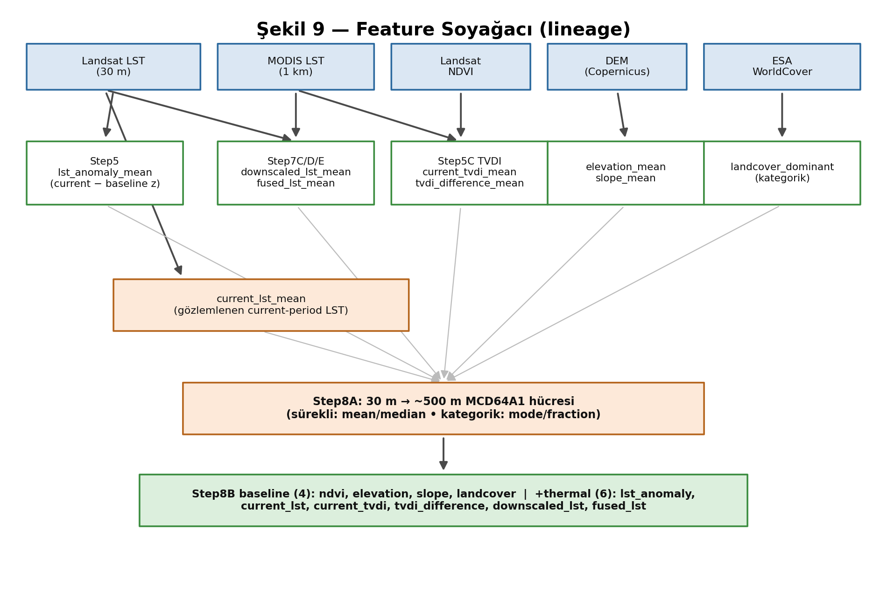

Bir modelleme satırı (bir ~500 m MCD64A1 hücresi) şöyle kurulur:

1. Her 30 m predictor rasteri (LST anomaly, NDVI, TVDI, elevation, slope, downscaled/fused LST, landcover) aynı referans grid üzerinde hizalanır.
2. Step8A, native ~500 m hücreyi 17×17 piksel-bloğuyla yeniden oluşturur.
3. Sürekli feature'lar için blok içi **mean/median**, kategorik landcover için **mode/fraction** hesaplanır.
4. MCD64A1 BurnDate (label penceresi) o hücre için mode ile toplanır → `burned` (0/1) + `burn_day_of_year`.
5. Yeterli geçerli 30 m piksel içermeyen hücreler elenir (`STEP8A_MIN_30M_VALID_FRACTION = 0.3`).

## 3.2 Landsat LST (yüzey sıcaklığı)

- **Ürün:** `LANDSAT/LC08/C02/T1_L2` (Landsat 8 Collection 2 Level 2), `ST_B10` termal bandı.
- **Rol:** Ana yüksek-çözünürlük yüzey sıcaklığı; anomaly ve downscaling target'ı.
- **Çözünürlük:** 30 m (yeniden örneklenmiş termal), günlük değil (16 gün tekrar).
- **Birim:** Kelvin → Celsius (`LANDSAT_SCALE = 0.00341802`, `LANDSAT_OFFSET = 149.0`).
- **Eksik değer:** QA mask ile bulut/gölge maskelenir; interpolasyon yapılmaz.
- **İlgili feature:** `current_lst_mean`, `lst_anomaly_mean`.
- **Kod:** `src/step3_landsat_lst.py`, `src/step5_preprocess_timeseries.py`.

## 3.3 MODIS LST

- **Ürün:** `MODIS/061/MOD11A1` (günlük LST), QC_Day kalite bitleriyle.
- **Rol:** Downscaling için düşük-çözünürlük termal bağlam; anomaly bağlamı.
- **Çözünürlük:** ~1 km, günlük.
- **Birim:** Kelvin → Celsius. Nodata sentineli `-9999.0` (`STEP7_MODIS_NODATA_VALUE`).
- **Kalite:** Yalnızca mandatory-QA=0 ve data-quality=0 pikseller kabul edilir; piksel başına en az `STEP7_MODIS_MIN_VALID_OBSERVATIONS = 3` gözlem gerekir.
- **İlgili feature:** downscaling girdisi (doğrudan bir Step8 feature'ı değil).
- **Kod:** `src/step1_fetch_modis.py`, `src/step2_modis_5year_mean.py`, `scripts/prepare_modis_for_step7.py`.

## 3.4 NDVI

- **Ürün:** Landsat SR bantlarından NDVI = (NIR−RED)/(NIR+RED), `SR_B5`/`SR_B4`.
- **Rol:** Bitki örtüsü yoğunluğu; TVDI'nin ekseni; baseline feature.
- **Çözünürlük:** 30 m.
- **Birim:** Boyutsuz [−1, 1]. Payda ~0 iken maskelenir (`NDVI_DENOMINATOR_EPSILON = 1e-6`); [−1,1] dışı fiziksel-imkânsız değerler maskelenir (`NDVI_VALID_MIN/MAX`).
- **İlgili feature:** `ndvi_mean`.
- **Kod:** `core/config.py` NDVI sabitleri, `src/step5c_tvdi.py`.

## 3.5 TVDI (Temperature-Vegetation Dryness Index)

- **Ürün:** LST-NDVI üçgeninden türetilir: TVDI = (LST − wet_edge)/(dry_edge − wet_edge).
- **Rol:** Yüzey kuruluğunun NDVI-normalize göstergesi.
- **Parametreler:** NDVI 20 bin'e bölünür (`TVDI_NDVI_BIN_COUNT`); wet/dry edge percentile'ları 2/98 (`TVDI_WET_EDGE_PERCENTILE`, `TVDI_DRY_EDGE_PERCENTILE`); bin başına min 30 piksel.
- **İlgili feature:** `current_tvdi_mean`, `tvdi_difference_mean`.
- **Kod:** `src/step5c_tvdi.py`, `core/config.py` TVDI bloğu.

## 3.6 DEM (elevation) ve slope

- **Ürün:** `COPERNICUS/DEM/GLO30` (fallback: `USGS/SRTMGL1_003`).
- **Rol:** Statik topografik baseline; slope DEM'den türetilir.
- **Çözünürlük:** 30 m. Birim: metre (elevation), derece (slope).
- **İlgili feature:** `elevation_mean`, `slope_mean`.
- **Kod:** `src/step2b_dem.py`, `scripts/prepare_dem_for_experiment.py`.

## 3.7 ESA WorldCover (landcover)

- **Ürün:** ESA WorldCover v200 (10 sınıf).
- **Rol:** Arazi örtüsü; gate'in doğal-bitki-örtüsü kararı ve modelin kategorik feature'ı.
- **Çözünürlük:** 10 m → referans gride hizalanır.
- **Birim:** Kategorik sınıf kodu (10=tree_cover, 20=shrubland, 30=grassland, 40=cropland...).
- **İlgili feature:** `landcover_dominant` (mode).
- **Kod:** `src/step6a_prepare_gate_inputs.py`, `src/step6b_burned_landcover_gate.py`.

> **Sık yapılan hata:** `landcover_dominant`'ı sayısal (ordinal) bir feature gibi kullanmak. Sınıf kodları (10, 20, 30, 40) sıralı bir büyüklük ifade etmez; 40 (cropland) 10'dan (tree) "daha fazla" değildir. Model bunu kategorik olarak işler; sayısal skaler sıralama bir leakage/hata kaynağıdır (bkz. Bölüm 15).

## 3.8 MCD64A1 BurnDate (etiket)

- **Ürün:** `MODIS/061/MCD64A1`, `BurnDate` bandı.
- **Rol:** Tek ve birincil yanmış-alan etiketi.
- **Çözünürlük:** ~500 m native, aylık.
- **Birim:** DOY (1..366); 0 = yanmamış. Label penceresine DOY-maskelenir.
- **Kod:** `src/step6_validate_fire_relation.py:export_raw_mcd64a1_labels()`.

## 3.9 FIRMS (bağımsız cross-check)

- **Ürün:** `FIRMS` (MODIS T21) + VIIRS (`NASA/LANCE/*_VIIRS/C2`).
- **Rol:** Bağımsız aktif-yangın çapraz kontrolü — **birincil etiket DEĞİL**.
- **Eşik:** parlaklık > 330 K (`VALIDATION_FIRMS_BRIGHTNESS_THRESHOLD`).
- **Kod:** `core/config.py` FIRMS bloğu, `src/step6_validate_fire_relation.py`.

## 3.10 Kalite maskeleri

- **Landsat QA:** bulut/gölge maskeleme (`data/landsat_qa/`).
- **MODIS QC_Day:** mandatory-QA + data-quality bitleri (Bölüm 3.3).

## 3.11 Bölüm özdeğerlendirmesi

**Beş öz-kontrol sorusu:**
1. Landsat LST hangi scale/offset ile Celsius'a çevrilir?
2. TVDI'nin wet/dry edge'leri hangi percentile'lardan gelir?
3. `landcover_dominant` neden kategorik işlenmelidir?
4. MODIS bir pikselin geçerli sayılması için kaç gözlem gerekir?
5. Bir ~500 m modelleme satırının kurulmasını 5 adımda özetle.

**Depo gezinme egzersizi:** `core/config.py` içinde `NDVI_VALID_MIN`, `TVDI_DRY_EDGE_PERCENTILE`, `STEP7_MODIS_NODATA_VALUE` sabitlerini bul ve değerlerini not al.

**"AI kullanmadan anlat" egzersizi:** Şekil 9'u referans alarak bir ham veri kaynağından (ör. Landsat LST) bir Step8 feature'ına (`lst_anomaly_mean`) giden yolu tahtada çiz.

---

# Bölüm 4 — Deney Kayıt Defteri ve AOI El Kitabı

Bu bölümdeki tüm bilgiler `core/regions.py` (registry) ve `outputs/` altındaki gerçek gate/Step8 çıktılarından **doğrulanarak** yazılmıştır — eski bir README'den kopyalanmamıştır. Bu ayrım kritiktir çünkü README (16 Temmuz) ile registry arasında bir **tutarsızlık** vardır (bkz. 4.5).

## 4.1 region ≠ experiment

`core/regions.py` iki kavramı ayırır:

- **region** = yalnızca geometri (`build_regions()` sözlüğündeki `ee.Geometry`).
- **experiment** = region + yıl + predictor/label/baseline pencereleri + rol + namespace (`EXPERIMENTS` sözlüğü).

Aktif deney `get_active_experiment(experiment_id)` ile çözülür; `enabled=False` bir deney `allow_disabled=True` verilmeden seçilemez.

## 4.2 Kayıtlı deneyler (registry'den doğrulanmış)

`EXPERIMENTS` sözlüğünde **beş** deney vardır ve **hepsi `enabled=True`**:

| experiment_id | Konum | Yıl | Rol | Ülke | Durum |
|---|---|---|---|---|---|
| `kozan_2023` | Kozan/Adana | 2023 | `negative_control` | Türkiye | Enabled (control) |
| `manavgat_2021` | Manavgat/Antalya | 2021 | `anchor_wildfire` | Türkiye | Enabled |
| `bejis_2022` | Bejís/Castellón | 2022 | `mediterranean_transfer_wildfire` | İspanya | Enabled |
| `mugla_2021` | Muğla | 2021 | `same_country_same_year_transfer_wildfire` | Türkiye | Enabled |
| `evia_2021` | Kuzey Evia (Euboea) | 2021 | `mediterranean_transfer_wildfire` | Yunanistan | Enabled |

## 4.3 Deney pencereleri ve baseline yılları

| experiment_id | predictor | label | baseline_years | region_key |
|---|---|---|---|---|
| `kozan_2023` | 2023-06-01 → 2023-07-31 | 2023-08-01 → 2023-10-31 | 2019–2022 | `kozan_aoi` |
| `manavgat_2021` | 2021-06-01 → 2021-07-27 | 2021-07-28 → 2021-08-31 | 2017–2020 | `manavgat_aoi` |
| `bejis_2022` | 2022-06-15 → 2022-08-14 | 2022-08-15 → 2022-09-30 | 2018–2021 | `bejis_aoi` |
| `mugla_2021` | 2021-06-01 → 2021-07-28 | 2021-07-29 → 2021-09-15 | 2017–2020 | `mugla_aoi` |
| `evia_2021` | 2021-06-05 → 2021-08-02 | 2021-08-03 → 2021-09-30 | 2017–2020 | `north_evia` |

**Muğla ve Evia'ya özgü leakage-güvenli özellik:** Her ikisinde de `exclude_pre_label_burns = True`. Muğla'da predictor penceresi içinde ayrı bir yangın (Bördübet/Marmaris, ~2021-06-21..25) vardır; bu hücreler post-fire imza taşıdığından analiz evreninden çıkarılır. Muğla ayrıca yalnız-teşhis amaçlı `pre_label_diagnostic_window = [2021-06-21, 2021-06-25]` alanına sahiptir.

> **Leakage riski:** `exclude_pre_label_burns` olmasaydı, kanonik label rasteri label penceresine DOY-maskelendiği için pre-label yanan hücreler `BurnDate=0` görünür ve **yanmamış negatif** gibi işlenirdi — post-fire sıcak/kuru/çıplak imzalarıyla predictor popülasyonunu kirletirdi (temporal leakage). Bu, `core/regions.py`'de deney-başına deklaratif bir alan olarak çözülmüştür; Evia'ya kod dalı eklenmeden aynı jenerik mekanizmayla uygulanmıştır.

## 4.4 Gate sonuçları (gerçek çıktılardan)

`outputs/experiments/<id>/validation/labels/burned_landcover_gate.json`:

| experiment_id | Gate kararı | burned_count |
|---|---|---|
| `manavgat_2021` | `wildfire_candidate_pass` | 796 |
| `bejis_2022` | `wildfire_candidate_pass` | 1103 |
| `mugla_2021` | `wildfire_candidate_pass` | 3026 |
| `evia_2021` | `wildfire_candidate_pass` | 2774 |
| `kozan_2023` | `cropland_dominated_control` | 542 (533 cropland) |

Dört wildfire AOI'sinin dördü de gate'i **doğal-bitki-örtüsü** kararıyla geçti; Kozan beklendiği gibi cropland-dominant kontrol olarak işaretlendi.

## 4.5 DISCREPANCY: README ↔ registry ↔ outputs

> **Discrepancy:** Depoda üç kaynak farklı bir "aktif AOI" tablosu sunar. Bu handbook, **registry + outputs**'u kanonik kabul eder ve README'nin ilgili bölümlerini **stale (bayat)** olarak işaretler.

| Konu | README (16 Tem, `README.md`) | Registry (`core/regions.py`) | Outputs (gerçek) | Kanonik kabul |
|---|---|---|---|---|
| Aktif wildfire AOI | yalnızca manavgat, bejis | manavgat, bejis, **mugla, evia** | 4'ünün de tam Step8 çıktısı var | Registry + outputs |
| Disabled placeholder | `zamora_2022` | **yok**; yalnızca `valencia_2022_aoi` bir region_key | zamora çıktısı yok | Registry (zamora deney değil) |
| Kozan legacy yolları | `outputs/step5/`, `outputs/validation/labels/` | — | gerçekte `outputs/kozan-legacy/...` | Outputs |
| CLI komut sayısı | 10 komut listeler | — | `main.py`'de **15** komut | main.py |
| Cross-region çiftler | yalnızca manavgat↔bejis | — | **8 çift** (mugla/evia dahil) | Outputs |

**Neden bu tutarsızlık var?** Git geçmişi (Bölüm 20) gösterir ki README en son 16 Temmuz'da güncellendi (`6281557`); Muğla (20–22 Temmuz) ve Evia (23 Temmuz) sonradan eklendi. README bilimsel çerçeve/claim politikası için hâlâ **güvenilir**dir, ancak **AOI kapsamı, CLI listesi ve çıktı yolları** için registry+outputs esas alınmalıdır.

## 4.6 AOI geometrileri ve dışlama kuralları

Tüm AOI'ler **kesin yangın perimetri değildir**; elle çizilmiş çalışma dikdörtgenleridir ve gate ile doğrulanır:

- `manavgat_aoi` = refined bbox `(31.05, 36.72, 31.85, 37.35)` — kıyı tarım kuşağı kasıtlı dışlanmış, Toros orman yamaçlarına doğru kaydırılmış.
- `bejis_aoi` = `(-1.05, 39.68, -0.35, 40.15)`.
- `mugla_aoi` = `MUGLA_AOI_BBOX = (27.10, 36.60, 28.90, 37.45)` — büyük kısmı deniz; Bodrum↔Köyceğiz ~110 km.
- `north_evia` = `NORTH_EVIA_AOI_BBOX = (23.12, 38.68, 23.52, 39.08)`.

## 4.7 Durum matrisi

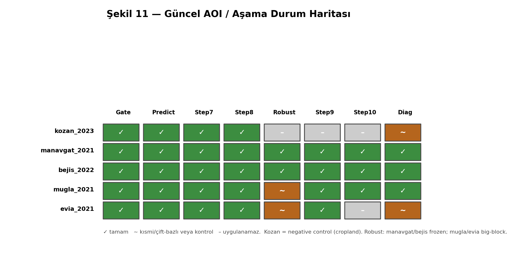

| AOI | gate | predictors | Step7 | Step8 | Step9 | Step10 | diagnostics | frozen/pending |
|---|---|---|---|---|---|---|---|---|
| kozan_2023 | ✓ (control) | ✓ (legacy) | ✓ | ✓ | – | – | kısmi | legacy dondurulmuş |
| manavgat_2021 | ✓ | ✓ | ✓ | ✓ | ✓ (tüm çiftler) | ✓ | ✓ | robustness frozen |
| bejis_2022 | ✓ | ✓ | ✓ | ✓ | ✓ | ✓ | ✓ | robustness frozen |
| mugla_2021 | ✓ | ✓ | ✓ | ✓ | ✓ | ✓ | ✓ | big-block robustness |
| evia_2021 | ✓ | ✓ | ✓ | ✓ | ✓ (5 yön) | kısmi | kısmi | %90 (son commit) |

**Not:** `evia_2021` en son commit'te ("Evia AOI at %90") kısmen tamamlanmıştır; step9d raporları mevcuttur ancak Step10 ve bazı diagnostic'ler evia için henüz tüm yönlerde yoktur.

## 4.8 Hangi AOI'ler mevcut sonuçlara katılır?

- **Within-region thermal katkı iddiası:** manavgat, bejis, mugla, evia (dördü de `thermal_improves`).
- **Formal large-block robustness (frozen):** yalnızca manavgat + bejis (all_valid + burnable duyarlılığı).
- **Cross-region transfer:** 8 çift; kritik olan mugla↔manavgat (aynı ülke, aynı yıl) staj sorusunu yanıtlar.
- **Kozan:** yalnızca negatif kontrol; transfer/iddia hesaplarına girmez.

## 4.9 Bölüm özdeğerlendirmesi

**Beş öz-kontrol sorusu:**
1. Registry'de kaç deney var ve kaçı enabled? README ile farkı nedir?
2. Muğla'da `exclude_pre_label_burns` hangi somut yangın nedeniyle gereklidir?
3. Hangi AOI negatif kontroldür ve neden?
4. Kozan legacy çıktıları gerçekte hangi dizindedir?
5. Evia'nın rolü nedir ve staj sorusuna nasıl bağlanır?

**Depo gezinme egzersizi:** `python scripts/check_experiment_registry.py` (veya `core/regions.py`'yi aç) ile beş deneyin `role` ve `baseline_years` alanlarını doğrula.

**"AI kullanmadan anlat" egzersizi:** "Bu projede kaç AOI var, rolleri ne, ve neden Muğla ile Evia eklendi?" sorusunu 4 dakikada anlat.

---

# Bölüm 5 — Depo Mimarisi

Bu bölüm, dizin ağacını sorumluluk temelinde açıklar ve modüller arası bağımlılıkları haritalar.

## 5.1 Üst düzey dizin sorumlulukları

```
core/     # paylaşılan sabitler, yardımcılar, orkestrasyon, registry
src/      # Step1–Step10 + robustness + diagnostics'in çalışabilir mantığı
scripts/  # uçtan uca CLI, aşama çalıştırıcıları, tek-seferlik yardımcılar
tests/    # orkestrasyon/CLI/gate/robustness/transfer için odaklı testler
data/     # yerel ham/indirilmiş veri (.gitignore)
outputs/  # tüm raster/tablo/rapor çıktıları (.gitignore)
logs/     # runtime log dosyaları (.gitignore)
docs/     # dokümantasyon (bu handbook dahil)
old_codes/# tarihsel; aktif pipeline'a dahil DEĞİL
venv/     # sanal ortam; kaynak değil
```

## 5.2 `core/` — ne sahiptir, ne sahip olmamalıdır

`core/` **paylaşılan altyapıya** sahiptir; **bilimsel adım mantığına sahip olmamalıdır** (o `src/`'dedir). İki istisna kabul edilir: `pipeline_orchestrator.py` (yalnızca dispatch, bilim yok) ve `*_shared.py`/`cross_region_experiment.py` (adımların paylaştığı yardımcılar).

| Modül | Sahiplik |
|---|---|
| `config.py` | 201 merkezi sabit (legacy Kozan + tüm Step eşikleri) |
| `paths.py` | `PROJECT_ROOT` ve yol kökleri |
| `io_utils.py` | `setup_logger()` ortak loglama |
| `regions.py` | Step0 registry (region+experiment) |
| `experiment_context.py` | deney-farkında namespaced yol/tarih context'i |
| `pipeline_orchestrator.py` | aşama sırası + dispatch (bilim yok) |
| `cross_region_experiment.py` | Step9F paylaşılan yardımcıları |
| `step10_shared.py` | Step10 z-score/CORAL/bootstrap/hashing |
| `validation_burned_area.py` | burned-area doğrulama yardımcıları |
| `drive_downloader.py`, `gee_utils.py` | legacy Drive + GEE yardımcıları |
| `utils/tiling.py`, `utils/geotiff_validation.py` | jenerik raster yardımcıları |
| `seam_audit*_config.py`, `source_scene_provenance_config.py`, `seam_localization_config.py` | QA altyapı konfigürasyonları |

## 5.3 `src/` — bilimsel adımlar

`src/` üç aile içerir: (a) legacy Kozan Step1–Step4B, (b) ortak Step5–Step10, (c) diagnostics/robustness/QA. Ayrıntılı per-modül referansı Bölüm 19'dadır.

## 5.4 `scripts/` — çalıştırıcılar

`scripts/main.py` kanonik giriş noktasıdır; `run_*_only.py` her aşamanın izole çalıştırıcısıdır; `run_cross_region_*.py`, `run_step10_*.py`, `run_*_audit.py` cross-region/diagnostic orkestratörleridir; `prepare_*.py`, `preview_*.py`, `check_*.py` yardımcılardır.

## 5.5 Diyagramlar

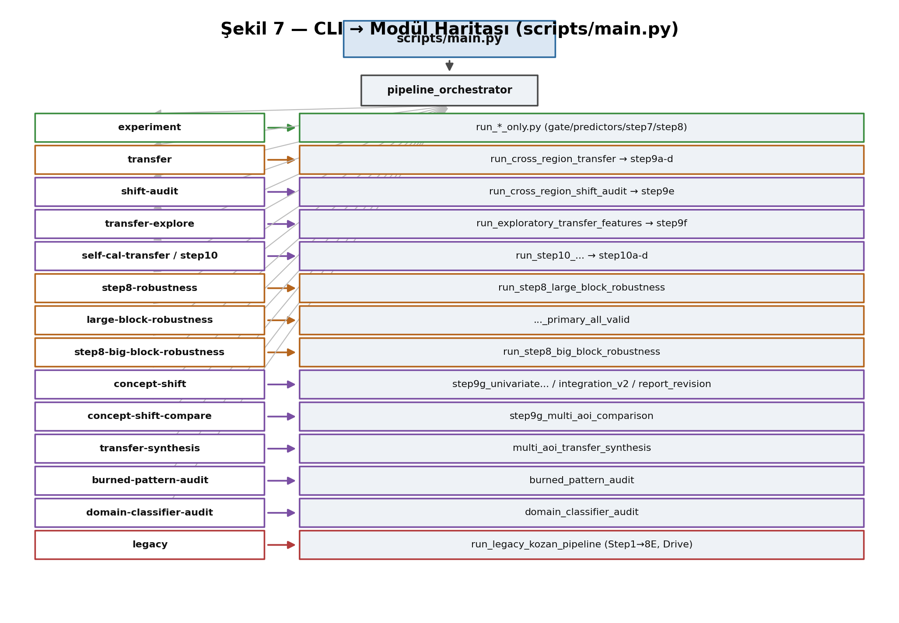

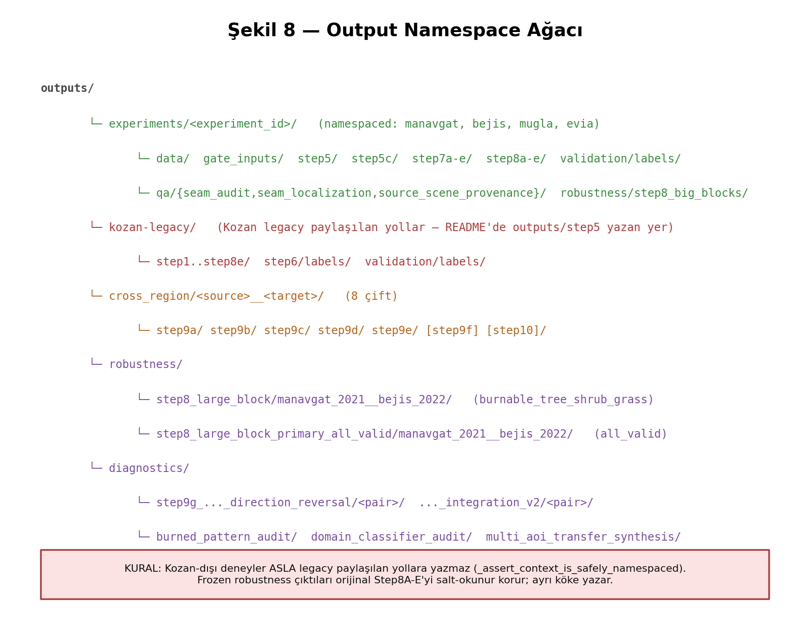

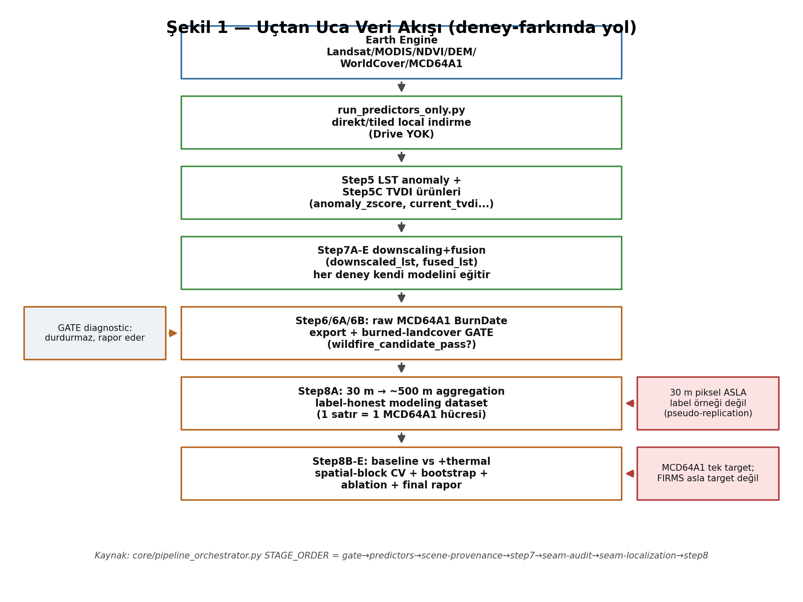

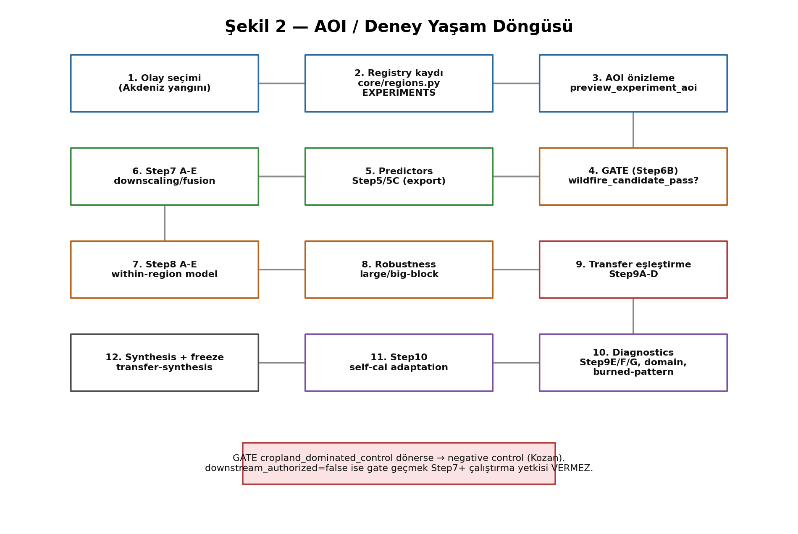

## 5.6 Modül bağımlılık örüntüsü

Bağımlılık yönü tek yönlüdür ve döngüsüzdür:

```
scripts/main.py
  └─> core/pipeline_orchestrator.py
        └─> scripts/run_*_only.py, run_*.py
              └─> src/stepN_*.py
                    └─> core/{config,regions,experiment_context,io_utils,utils}
```

Bilimsel mantık asla yukarı doğru (main.py'ye) sızmaz; orkestratör asla bilim uygulamaz.

## 5.7 Mimari borç, olası ölü/yinelenen dosyalar (kanıt vs. tahmin)

> **Not:** Aşağıdaki gözlemler statik incelemeye dayanır; "kesin ölü kod" iddiası runtime izleme gerektirir. Kanıt ile tahmini ayırıyorum.

- **Kanıt (yinelenen isim):** `outputs/` altında Kozan hem `outputs/kozan-legacy/` hem (README'ye göre) `outputs/step5/` gibi legacy yollar bekler; gerçekte `kozan-legacy/` kullanılır. README yolları stale.
- **Kanıt (robustness üçlemesi):** `src/step8_large_block_robustness.py`, `..._primary_all_valid.py`, `step8_big_block_robustness.py` — üçü de benzer amaç taşır ama farklı kontratlarla (frozen pair vs. all_valid vs. tek-deney). Kod yinelemesi değil, bilinçli varyantlardır (bkz. Bölüm 9/11).
- **Tahmin (kullanılmıyor olabilir):** `scripts/run_prefire_experiment.py`, `scripts/standalone_step5-6.py` yalnızca legacy Kozan yardımcılarıdır; canonical CLI'dan çağrılmazlar. Silinmemiştir, tarihsel amaçla korunur.
- **Kanıt (seam/QA altyapısı):** `seam_audit`, `seam_audit_v2`, `seam_localization`, `source_scene_provenance` — README'de belgeli değil (23 Tem'den önceki commit); `experiment` alt-komutunun stage'lerine entegre.

## 5.8 Bölüm özdeğerlendirmesi

**Beş öz-kontrol sorusu:**
1. Bilimsel mantık neden `core/`'da değil `src/`'de olmalıdır?
2. `main.py` → `src/` bağımlılık zincirini sırala.
3. Üç robustness modülü neden ayrıdır?
4. `experiment_context.py` neyi sağlar?
5. Hangi scriptler yalnızca legacy Kozan yardımcısıdır?

**Depo gezinme egzersizi:** `core/pipeline_orchestrator.py:STAGE_DISPATCH` sözlüğünü aç; yedi aşamanın hangi runner'a gittiğini eşleştir.

**"AI kullanmadan anlat" egzersizi:** Şekil 7 + Şekil 8'i kullanarak "bir komut çalıştığında hangi dosyalar hangi sırayla devreye girer ve çıktı nereye yazılır" akışını anlat.

---

# Bölüm 6 — CLI Komut Referansı

`scripts/main.py` kanonik (tek önerilen) giriş noktasıdır. Alt-komut verilmeden çalıştırma yalnızca yardım basar; hiçbir GEE/legacy iş akışını **sessizce** başlatmaz. Bu bölüm, `build_parser()` içindeki tüm 15 alt-komutu belgeler.


## 6.1 Ortak semantik

- **`--dry-run`**: hiçbir hesaplama/yazma yok; yalnızca çözümlenen plan + yollar basılır. Her aşama KENDİ dry-run implementasyonunu çağırır.
- **`--force`**: izin verilen downstream çıktıların üzerine yazar. **Preregistration/immutable manifest'ler bundan MUAF**tır; runtime bilimsel konfigürasyon mevcut manifest ile uyuşmazsa koşu fail-fast durur.
- Hata yönetimi: her komut, exception'ı **yutmaz**; loglar + net exit code döner (`_fail()`).

## 6.2 `experiment` — deney-farkında aşama zinciri

- **Amaç:** Bir deney için `gate → predictors → scene-provenance → step7 → seam-audit → seam-localization → step8` aralığını çalıştırır.
- **Zorunlu:** `--experiment`, `--from-stage`, `--to-stage`, `--predictor-mode {export|local-only}`.
- **Opsiyonel:** `--export-labels` (yalnız gate), `--seam-products`, `--seam-scales`, `--provenance-mode`, `--manual-boundaries`, `--force`, `--dry-run`.
- **Girdi/çıktı:** `outputs/experiments/<id>/...` (namespaced).
- **Runtime sınıfı:** `export` modu GEE indirmesi + eğitim → yavaş (dakikalar–saatler); `local-only` yalnız yerel işleme.
- **Yaygın hata:** `--from-stage` `--to-stage`'ten sonra → fail-fast. Kozan-dışı deney legacy yola yazamaz (namespace guard).
- **Güvenli örnek:** `python scripts/main.py experiment --experiment mugla_2021 --from-stage predictors --to-stage step8 --predictor-mode local-only --dry-run`
- **Ne zaman çalıştırma:** GeoTIFF'ler yoksa `local-only` başarısız olur; önce `export` gerekir (pahalı, GEE auth ister).

## 6.3 `transfer` — Step9A–D cross-region

- **Amaç:** iki yönlü raw cross-region transfer (Step9A girdi denetimi → 9B transfer → 9C bootstrap → 9D rapor).
- **Zorunlu:** `--source`, `--target`. **Opsiyonel:** `--reverse`, `--force`, `--dry-run`.
- **Çıktı:** `outputs/cross_region/<source>__<target>/step9a..d/`.
- **Güvenli örnek:** `python scripts/main.py transfer --source manavgat_2021 --target bejis_2022 --reverse --dry-run`

## 6.4 `shift-audit` — Step9E post-hoc

- **Amaç:** dağılım/ilişki-kayması teşhisi. Hiçbir model yeniden eğitmez; Step9A–D'yi değiştirmez.
- **Opsiyonel:** `--report-only` (Part A–F'yi yeniden hesaplamadan yalnız safe_wording/provenance günceller).
- **Çıktı:** `.../step9e/`.

## 6.5 `transfer-explore` — Step9F kesifsel

- **Amaç:** sabit feature altkümeleri + region-relative temsille transferin düzelip düzelmediğini araştırır (**kesifsel, post-hoc**; validation DEĞİL).
- **Opsiyonel:** `--bootstrap-replicates` (1000), `--seed`.
- **Çıktı:** `.../step9f/`.

## 6.6 `self-cal-transfer` ve `step10` (aynı analiz)

- **Amaç:** Step10 preregistered, hedef-etiket-körü self-calibrated transfer (`raw_source_only` / `regionwise_zscore` / `coral_after_regionwise_zscore`).
- **Opsiyonel:** `--report-only` (yalnız Step10D raporu), `--bootstrap-replicates` (1000), `--seed` (42).
- **Çıktı:** `.../step10/`. `step10` kullanıcı-dostu addır; `self-cal-transfer` ile birebir aynı runner'a gider.

## 6.7 `step8-robustness` — frozen predefined (manavgat+bejis)

- **Amaç:** frozen Step8 planını 10/20-hücre bloklarda çalıştırır. Deneyler **tam olarak** `manavgat_2021 bejis_2022`, bloklar **tam olarak** `10 20` olmalı; başka değer fail-fast reddedilir.
- **Popülasyon:** `burnable_tree_shrub_grass` (doğal-bitki-örtüsü duyarlılığı).
- **Çıktı:** `outputs/robustness/step8_large_block/manavgat_2021__bejis_2022/`.

## 6.8 `large-block-robustness` — formal all_valid (gated)

- **Amaç:** formal Step8B primary population **`all_valid`** için 10/20-hücre robustness. `STEP8B_SPATIAL_BLOCK_SIZE_CELLS` **2 kalır**; büyük bloklar runtime'da geçilir.
- **Kritik bayrak:** `--run-large-block-fit` verilmeden koşu **2-hücre equivalence gate**'ten sonra durur. Bu gate, paylaşılan kod yolunun 2 hücrede dondurulmuş orijinal çıktıyla birebir eşleştiğini (≤1e-12) doğrular.
- **Çıktı:** `outputs/robustness/step8_large_block_primary_all_valid/manavgat_2021__bejis_2022/`.

## 6.9 `step8-big-block-robustness` — tek deney

- **Amaç:** herhangi bir tek deney için big-block (10/20) robustness; hiçbir AOI hard-code değildir (`--experiment` argümanı).
- **Opsiyonel:** `--block-sizes` (10 20), `--regenerate-reports-only` (yalnız frozen JSON/Parquet'ten rapor yeniden üret; fit/fold/bootstrap YOK).
- **Çıktı:** `outputs/experiments/<id>/robustness/step8_big_blocks/`.

## 6.10 `concept-shift` — Step9G

- **Amaç:** univariate feature-AUC yön-tersleşmesi teşhisi (population `burnable_tree_shrub_grass`; ham feature değeriyle burned ROC-AUC; inversion/normalizasyon/imputation YOK; 10-hücre bootstrap).
- **Zorunlu:** `--source`, `--target`.
- **Modlar:** varsayılan = HESAPLAR; `--integration-only` = REPORT-ONLY kanonik integration-v2; `--report-revision` = v1 raporunu yerinde semantik düzeltme (sayı yeniden hesaplanmaz).
- **Çıktı:** `outputs/diagnostics/step9g_univariate_feature_auc_direction_reversal[...]/<pair>/`.

## 6.11 `concept-shift-compare` — çoklu AOI (report-only)

- **Amaç:** dondurulmuş Step9G v1 çift-raporlarından yan yana karşılaştırma tablosu (report-only; hiçbir AUC yeniden hesaplanmaz). 1e-12 toleransla çapraz-doğrulama.
- **Zorunlu:** `--experiments <id1> <id2> ...` (hiçbir AOI hard-code değil).

## 6.12 `transfer-synthesis` — çoklu AOI sentezi (report-only)

- **Amaç:** 2–5 AOI için dondurulmuş Step8/Step9B–G/Step10 çıktılarından jenerik sentez raporu. Modelleme/adaptasyon/bootstrap ÇALIŞTIRMAZ.
- **Zorunlu:** `--aoi` (tekrarlanabilir, 2–5). **Opsiyonel:** `--output-root`.
- **Çıktı:** `outputs/diagnostics/multi_aoi_transfer_synthesis/<canonical_set_id>/`.

## 6.13 `burned-pattern-audit` — çoklu deney betimsel

- **Amaç:** her deney için 8-komşuluk bağlı bileşenler, patch-boyut dağılımı, burned elevation dağılımı, burned landcover kompozisyonu. Bileşenler **parçalanma göstergesidir, yangın olayı sayısı DEĞİL**. Step8A'ya salt-okunur.
- **Seçim (mutually exclusive):** `--experiments <liste>` veya `--all-enabled`.

## 6.14 `domain-classifier-audit` — çoklu deney çift teşhisi

- **Amaç:** her sırasız çift için, iki bölgenin yalnız predictor'larla ne kadar ayırt edilebildiğini ölçer (hedef = bölge kimliği; burned DEĞİL). `RandomForestClassifier`, `class_weight=balanced`, spatial-block. Nedensellik KURMAZ.
- **Seçim:** `--experiments` veya `--all-enabled`.

## 6.15 `legacy` — yalnız Kozan (Drive)

- **Amaç:** eski Step1–Step8E Google Drive tabanlı tam zinciri, **yalnızca `kozan_2023`** için. Başka deney verilirse net hata.
- **Not:** `.env` Drive kimlikleri yalnız bu komut için gereklidir.

## 6.16 Komut karar ağacı

> **Bunu kendin kontrol et:** Aşağıdaki "ne yapmak istiyorum?" → "hangi komut?" eşlemesini `python scripts/main.py <komut> --help` ile doğrula.

- Yeni/var olan bir AOI'yi üretmek (gate→step8) → `experiment`
- İki bölge arası ham transfer ölçmek → `transfer`
- Transfer neden başarısız, dağılım kayması var mı → `shift-audit` (Step9E)
- Feature altkümeleriyle transfer denemek (kesifsel) → `transfer-explore` (Step9F)
- Etiketsiz adaptasyonla transferi iyileştirmeyi denemek → `step10` / `self-cal-transfer`
- Feature-label ilişki yönü ters mi dönüyor → `concept-shift` (Step9G)
- Birden çok çiftte reversal tutarlı mı → `concept-shift-compare`
- Within-region thermal katkı büyük bloklarda korunuyor mu → `large-block-robustness` (all_valid) / `step8-robustness` (burnable) / `step8-big-block-robustness` (tek deney)
- İki bölge covariate olarak ayrışıyor mu → `domain-classifier-audit`
- Yanmış alan geometrisi bölgeler arası nasıl farklı → `burned-pattern-audit`
- Tüm bulguları tek rapora toplamak → `transfer-synthesis`
- Kozan'ı tarihsel olarak yeniden üretmek → `legacy`

## 6.17 Bölüm özdeğerlendirmesi

**Beş öz-kontrol sorusu:**
1. `--force` neyi yapamaz?
2. `large-block-robustness`'te `--run-large-block-fit` olmadan ne olur?
3. `step10` ile `self-cal-transfer` arasındaki fark nedir?
4. `concept-shift`'in üç modu hangileridir ve hangileri hesaplar/hangileri report-only?
5. `legacy` neden yalnız Kozan'ı kabul eder?

**Depo gezinme egzersizi:** `python scripts/main.py large-block-robustness --dry-run` çıktısını incele (fit yapmaz).

**"AI kullanmadan anlat" egzersizi:** Karar ağacını ezberden, komut isimleriyle anlat.

---

# Bölüm 7 — Konfigürasyon, Sabitler ve Önemli Değişkenler

Tüm merkezi sabitler `core/config.py` (201 sabit) ve deney tanımları `core/regions.py` içindedir. Bu bölüm bilimsel olarak anlamlı olanları listeler; anlamsız geçici yerel değişkenler dahil edilmez, ancak bir bilimsel maske/eşik/kontrat kodlayan yerel değişkenler belgelenir.

## 7.1 En kritik bilimsel sabitler

| Sabit | Değer | Tanım yeri | Bilimsel etki |
|---|---|---|---|
| `STEP8A_MCD64A1_NATIVE_CELL_SIZE_M` | 500.0 | config.py | Analiz birimi boyutu |
| `STEP8A_REFERENCE_PIXEL_SIZE_M` | 30.0 | config.py | 30 m→500 m blok oranı (~17) |
| `STEP8A_MIN_30M_VALID_FRACTION` | 0.3 | config.py | Hücre uygunluğu eşiği |
| `STEP8A_BURNABLE_FRACTION_THRESHOLD` | 0.5 | config.py | burnable popülasyon tanımı |
| `STEP8B_SPATIAL_BLOCK_SIZE_CELLS` | 2 | config.py | ~1 km frozen CV bloğu |
| `STEP8B_N_SPLITS` | 5 | config.py | CV fold sayısı |
| `STEP8B_PRIMARY_POPULATION` | `all_valid` | config.py | Formal within-region popülasyon |
| `STEP8B_MIN_POSITIVES_PER_POPULATION` | 30 | config.py | Popülasyon atlanma eşiği |
| `STEP8C_N_BOOTSTRAP` | 1000 | config.py | Within-region bootstrap replika |
| `STEP8C_CI_LOWER/UPPER` | 2.5 / 97.5 | config.py | %95 percentile CI |
| `STEP10_CORAL_LAMBDA` | 1e-5 | config.py | CORAL regularizasyonu |
| `STEP10_BOOTSTRAP_REPLICATES` | 1000 | config.py | Step10 bootstrap |
| `STEP10_MIN_VALID_BOOTSTRAP_REPLICATES` | 900 | config.py | Bootstrap kararlılık eşiği |
| `STEP10_RANDOM_STATE` | 42 | config.py | Step10 seed |
| `*_RANDOM_SEED` / `*_SEED` | 42 | config.py (çok yerde) | Determinizm |

## 7.2 Gate ve popülasyon eşikleri

| Sabit | Değer | Etki |
|---|---|---|
| `STEP6_BURNED_LANDCOVER_GATE_MIN_POSITIVES` | 30 | insufficient_burned_positives eşiği |
| `STEP6_BURNED_LANDCOVER_GATE_NATURAL_THRESHOLD` | 0.50 | wildfire_candidate_pass eşiği |
| `STEP6_BURNED_LANDCOVER_GATE_CROPLAND_THRESHOLD` | 0.50 | cropland_dominated_control eşiği |
| `STEP6_BURNED_LANDCOVER_GATE_LEVEL` | `500m_reconstructed_mcd64a1_cell` | Gate agregasyon seviyesi |

## 7.3 Termal/kuruluk üretim eşikleri

| Sabit | Değer | Etki |
|---|---|---|
| `STEP5_MIN_BASELINE_STD_CELSIUS` | 1.0 | Düşük-std'de z-score NaN |
| `STEP5_MIN_BASELINE_VALID_COUNT` | 3 | Anomaly için min baseline gözlem |
| `TVDI_NDVI_BIN_COUNT` | 20 | TVDI NDVI ekseni bin sayısı |
| `TVDI_WET/DRY_EDGE_PERCENTILE` | 2 / 98 | TVDI edge percentile'ları |
| `TVDI_MIN_PIXELS_PER_BIN` | 30 | Edge fit min piksel |
| `LANDSAT_SCALE` / `LANDSAT_OFFSET` | 0.00341802 / 149.0 | LST Kelvin ölçekleme |
| `NDVI_VALID_MIN/MAX` | −1.0 / 1.0 | NDVI fiziksel aralık |

## 7.4 Downscaling eşikleri (Step7)

| Sabit | Değer | Etki |
|---|---|---|
| `STEP7C_MODEL_TYPE` | `random_forest` | Downscaling modeli |
| `STEP7C_SPLIT_MODE` | `spatial_block` | Leakage-güvenli split |
| `STEP7C_SPATIAL_BLOCK_SIZE_PIXELS` | 64 | Downscaling CV bloğu |
| `STEP7C_EXCLUDE_LEAKAGE_FEATURES` | True | anomaly/tvdi/zscore eğitimden çıkarılır |
| `STEP7_MODIS_MIN_VALID_OBSERVATIONS` | 3 | MODIS mean/std min gözlem |

## 7.5 Registry-türevi köprü değişkenleri

`core/config.py` sonunda `ACTIVE_EXPERIMENT_ID` (varsayılan `kozan_2023`) registry'yi config'e köprüler. Kozan için EXPERIMENT_* değerlerinin legacy sabitlerle birebir aynı olduğu **fail-fast** doğrulanır (bir sapma erken yakalanır).

## 7.6 Önemli yerel değişken (bilimsel maske) örneği

`core/regions.py` içindeki deney-başına `exclude_pre_label_burns` / `pre_label_burn_window` alanları yerel gibi görünse de bir **veri-kontratı** kodlar: hangi hücrelerin analiz evreninden çıkarılacağını belirler (Muğla/Evia leakage bariyeri).

## 7.7 Değişiklik-etki matrisi

> **Sık yapılan hata:** Bir sabiti değiştirip yalnızca son adımı yeniden çalıştırmak. Aşağıdaki matris, bir değişiklikten sonra **neyin yeniden çalıştırılması** gerektiğini gösterir.

| Ayar | Etkilenen aşamalar | Değişirse yeniden çalıştır |
|---|---|---|
| `STEP8A_*` (cell/valid/burnable) | Step8A→8E, robustness, Step9, Step10, diagnostics | TÜM Step8+ zinciri |
| `STEP8B_SPATIAL_BLOCK_SIZE_CELLS` | Step8B/C/D, robustness referansı | Step8B–E (frozen referans bozulur!) |
| `STEP8B_N_SPLITS` / seed | Step8B OOF, Step8C bootstrap | Step8B–E |
| Gate eşikleri (`STEP6_*`) | gate kararı, popülasyon | gate + Step8A+ |
| `TVDI_*`, `STEP5_*` | Step5/5C ürünleri | Step5/5C → Step7 → Step8+ |
| `STEP7C_*` | downscaled/fused LST | Step7 → Step8+ |
| `STEP10_CORAL_LAMBDA`, `STEP10_*` | Step10 adaptasyonu | yalnız Step10 |
| Registry pencereleri | tüm deney | ilgili deneyin TÜM zinciri |

> **Claim sınırı:** `STEP8B_SPATIAL_BLOCK_SIZE_CELLS`'i 10/20'ye **çevirmeyin**. Robustness komutları büyük blokları *runtime'da* geçer; global config 2 kalır ki frozen ~1 km referans ve orijinal Step8 çıktıları bozulmasın. Bunu değiştirmek dondurulmuş sonuçları geçersiz kılar.

## 7.8 Bölüm özdeğerlendirmesi

**Beş öz-kontrol sorusu:**
1. `STEP8B_SPATIAL_BLOCK_SIZE_CELLS` neden 2'de sabit kalır?
2. Seed neden çoğu adımda 42'dir?
3. Gate'in üç eşiği hangi kararları belirler?
4. `STEP7C_EXCLUDE_LEAKAGE_FEATURES=True` neyi engeller?
5. `STEP8A_MIN_30M_VALID_FRACTION`'ı değiştirirsen ne yeniden çalışmalı?

**Depo gezinme egzersizi:** `core/config.py`'de `STEP10_*` bloğundaki altı sabiti bul.

**"AI kullanmadan anlat" egzersizi:** Değişiklik-etki matrisini kullanarak "gate eşiğini değiştirirsem ne olur" sorusunu yanıtla.

---

# Bölüm 8 — Feature Sözlüğü

Bu bölüm, Step8 modelleme ve teşhis feature'larının tamamını tanımlar. Kanonik feature kontratı `outputs/experiments/<id>/step8b/step8b_model_comparison_metrics.json` → `feature_sets` alanından doğrulanmıştır: **baseline (4)** + **thermal_additional (6)** = **thermal_model_full (10)**.

> **Claim sınırı:** Aşağıda hiçbir feature için "beklenen" bir yangın ilişkisi uydurulmaz. Gözlemlenen ilişkiler AOI-bazlı etiketlenir ve yalnızca kanonik Step9G/Step9E çıktılarına dayanır. Bir feature'ın yüksek/düşük ham değeri tek başına yangın hakkında nedensel bir şey söylemez.

## 8.1 Baseline feature'lar

**`ndvi_mean`** — Bitki örtüsü yoğunluğu (NDVI blok ortalaması). Kaynak: Landsat SR. Birim: boyutsuz [−1,1]. Sürekli. Step8/9/10/diagnostics'te kullanılır. Step9G'de dört wildfire çiftinde genelde **same-direction** (yön kaymayan) feature olarak sınıflanmıştır.

**`elevation_mean`** — Yükseklik (m), Copernicus DEM. Sürekli. **Kritik teşhis feature'ı:** Step9G'de manavgat↔bejis ve manavgat↔mugla çiftlerinde burned ile ilişkisi **bootstrap-destekli olarak ters döner** (Manavgat: AUC≈0.37 < 0.5; Bejís: AUC≈0.64 > 0.5). Bu, concept/relationship shift'in tek bootstrap-destekli univariate kanıtıdır. **Baseline feature'ıdır (thermal değil).**

**`slope_mean`** — Eğim (derece), DEM'den türetilir. Sürekli. Step9G'de genelde same-direction.

**`landcover_dominant`** — Baskın WorldCover sınıfı (mode). **Kategorik** (10=tree, 20=shrub, 30=grass, 40=cropland...). Sayısal AUC'den çıkarılır (Step9G kategorik olduğu için dışlar). Sayısal ordinal olarak KULLANILMAZ.

## 8.2 Thermal feature'lar

**`lst_anomaly_mean`** — Landsat LST anomaly z-score (current − baseline)/std. Kaynak: Step5. Sürekli. Step9E'de "genel olarak tutarlı negatif ilişki ama global ölçeği güçlü kayan" olarak işaretlenmiştir. Step9G'de same-direction eğiliminde.

**`current_lst_mean`** — Gözlemlenen current-period LST (°C). Kaynak: Step5/Step3. Sürekli. Step9E/9G'de ilişki-yönü instabil (point reversal, ama CI şansı içerir → bootstrap-destekli DEĞİL).

**`current_tvdi_mean`** — Current TVDI kuruluk indeksi. Kaynak: Step5C. Sürekli [~0,1]. Step9E'de "karşılaştırmalı olarak daha stabil" thermal feature.

**`tvdi_difference_mean`** — TVDI farkı (current − baseline). Kaynak: Step5C. Sürekli. Step9E'de **en çok kayan** feature'lardan; ilişki-yönü ters döner (point reversal, bootstrap-destekli değil).

**`downscaled_lst_mean`** — Step7D'nin MODIS→Landsat downscaled LST'si (°C). Kaynak: Step7C/D. Sürekli. Step9E/9G'de ilişki-yönü instabil.

**`fused_lst_mean`** — Step7E'nin gözlemlenen+downscaled fused LST'si (°C). Gözlem önceliklidir. Kaynak: Step7E. Sürekli. downscaled ile benzer instabilite gösterir.

## 8.3 Feature özet tablosu

| Feature | Grup | Tür | Kaynak | Hesaplandığı adım | Step9G yön durumu (wildfire çiftleri) |
|---|---|---|---|---|---|
| `ndvi_mean` | baseline | sürekli | Landsat SR | Step5C | çoğunlukla same-direction |
| `elevation_mean` | baseline | sürekli | DEM | Step2B | **bootstrap-destekli reversal** |
| `slope_mean` | baseline | sürekli | DEM | Step2B | same-direction |
| `landcover_dominant` | baseline | kategorik | WorldCover | Step6A/8A | sayısal AUC'den dışlanır |
| `lst_anomaly_mean` | thermal | sürekli | Step5 | Step5 | same-direction, ölçek kayar |
| `current_lst_mean` | thermal | sürekli | Step3/5 | Step5 | point reversal (bootstrap yok) |
| `current_tvdi_mean` | thermal | sürekli | Step5C | Step5C | görece stabil |
| `tvdi_difference_mean` | thermal | sürekli | Step5C | Step5C | point reversal (bootstrap yok) |
| `downscaled_lst_mean` | thermal | sürekli | Step7C/D | Step7D | point reversal (bootstrap yok) |
| `fused_lst_mean` | thermal | sürekli | Step7E | Step7E | point reversal (bootstrap yok) |

## 8.4 Leakage değerlendirmeleri (feature bazında)

- **Türev feature'lar (anomaly, tvdi, zscore) downscaling eğitimine sızmamalı:** Step7C `STEP7C_EXCLUDE_LEAKAGE_FEATURES=True` ile bunları çıkarır.
- **`fused_lst_mean` gözlem önceliklidir:** downscaled değeri yalnız gözlem eksikse kullanılır; bu bir gap-fill'dir, bir tahmin karışımı değil.
- **`landcover_dominant` sayısallaştırma tuzağı:** ordinal kullanım yapay bir sıralama üretir (Bölüm 15).

## 8.5 Gözlemlenen dağılım kaymaları (Step9E)

Step9E'nin (manavgat↔bejis) global olarak en çok kayan primary-population feature'ları: `tvdi_difference_mean`, `downscaled_lst_mean`, `current_lst_mean`, `fused_lst_mean`, `lst_anomaly_mean`, `slope_mean`. Bu, adaptasyonun (Step10) neden yalnız kısmi işe yaradığını açıklar: covariate ölçeği hizalanabilir ama ilişki-yönü (elevation) hizalanamaz.

## 8.6 Bölüm özdeğerlendirmesi

**Beş öz-kontrol sorusu:**
1. Baseline (4) ve thermal (6) feature'ları say.
2. Hangi feature bootstrap-destekli yön-reversal gösterir? Bu hangi shift türünün kanıtıdır?
3. `landcover_dominant` neden sayısal AUC'den çıkarılır?
4. `fused_lst_mean` ile `downscaled_lst_mean` arasındaki fark nedir?
5. Bir feature'ın yüksek değeri neden tek başına "yangın riski" anlamına gelmez?

**Depo gezinme egzersizi:** bir step8b JSON'unda `feature_sets.thermal_model_full` listesinin 10 elemanını doğrula.

**"AI kullanmadan anlat" egzersizi:** Şekil 9'u kullanarak her feature'ın hangi ham kaynaktan türediğini anlat.

---

# Bölüm 9 — Ham Veriden Step8'e Pipeline Aşamaları

Bu bölüm her aşamayı; amaç, girdi kontratı, çıktı kontratı, ana dosyalar/fonksiyonlar, anahtar sabitler, doğrulama kapıları, hata modları ve durum (current/legacy/bypass) ile açıklar.


## 9.1 İki iş akışı: deney-farkında vs. legacy Kozan

- **Deney-farkında (varsayılan):** GEE'den doğrudan/tiled local indirme (Drive YOK), namespaced çıktılar. `experiment` alt-komutu.
- **Legacy (yalnız Kozan):** Step1→Step4B GEE→Drive batch export→download zinciri, paylaşılan yollar. `legacy` alt-komutu. Sessizce çalıştırılmaz.

## 9.2 Step1–Step4B — veri hazırlığı (yalnız legacy Kozan)

- **Step1** MODIS export (`src/step1_fetch_modis.py`), **Step2** 5-yıllık MODIS baseline, **Step2B** DEM/slope, **Step3** Landsat LST GEE hazırlığı, **Step4** GEE→Drive export, **Step4B** Drive→local download + metadata doğrulama.
- **Durum:** Manavgat/Bejís/Muğla/Evia bu zinciri **KULLANMAZ** (direct export ile predictors üretilir).

## 9.3 Step5 — Landsat LST anomaly

- **Amaç:** current period ile historical baseline arası LST farkını z-score olarak hesaplar (`anomaly_zscore.tif`).
- **Girdi:** Landsat LST time series + baseline yılları. **Çıktı:** `.../step5/`.
- **Sabitler:** `STEP5_MIN_BASELINE_STD_CELSIUS`, `STEP5_MIN_BASELINE_VALID_COUNT`, `STEP5_WINDOW_SIZE`.
- **Dosya:** `src/step5_preprocess_timeseries.py`.

## 9.4 Step5C — TVDI/kuruluk

- **Amaç:** `current_tvdi`, `tvdi_difference`, `tvdi_anomaly_zscore` üretir.
- **Dosya:** `src/step5c_tvdi.py`.

## 9.5 Step6 / Step6A / Step6B — etiket + gate

- **Step6** burned-area association diagnostics + **canonical raw MCD64A1 BurnDate export** (`export_raw_mcd64a1_labels()`). Bir model eğitmez.
- **Step6A** gate-only girdi hazırlama (referans grid + hizalı landcover) — deney-farkında.
- **Step6B** burned-landcover gate: Step8A'nın 500 m block/tile mantığını reuse eder; `wildfire_candidate_pass` / `cropland_dominated_control` / `insufficient_burned_positives` / `mixed_or_uncertain` kararı verir.
- **Gate diagnostic'tir:** cropland kararı pipeline'ı durdurmaz; ama Muğla notunda `downstream_authorized=false` — gate geçmek Step7+ çalıştırma **yetkisi vermez** (danışman onayı gerekir).

## 9.6 Step7A–E — downscaling ve fusion

- **Step7A** tiling altyapısı, **Step7B** downscaling eğitim veri seti (fire label YOK), **Step7C** saf MODIS→Landsat LST modeli (leakage guard'lı), **Step7D** full-grid downscaled LST, **Step7E** gözlem-öncelikli fusion.
- **Kritik ilke:** Step7 modelleri **bölgeler arası transfer EDİLMEZ**; her deney kendi modelini eğitir.

## 9.7 Step8A–E — çekirdek modelleme

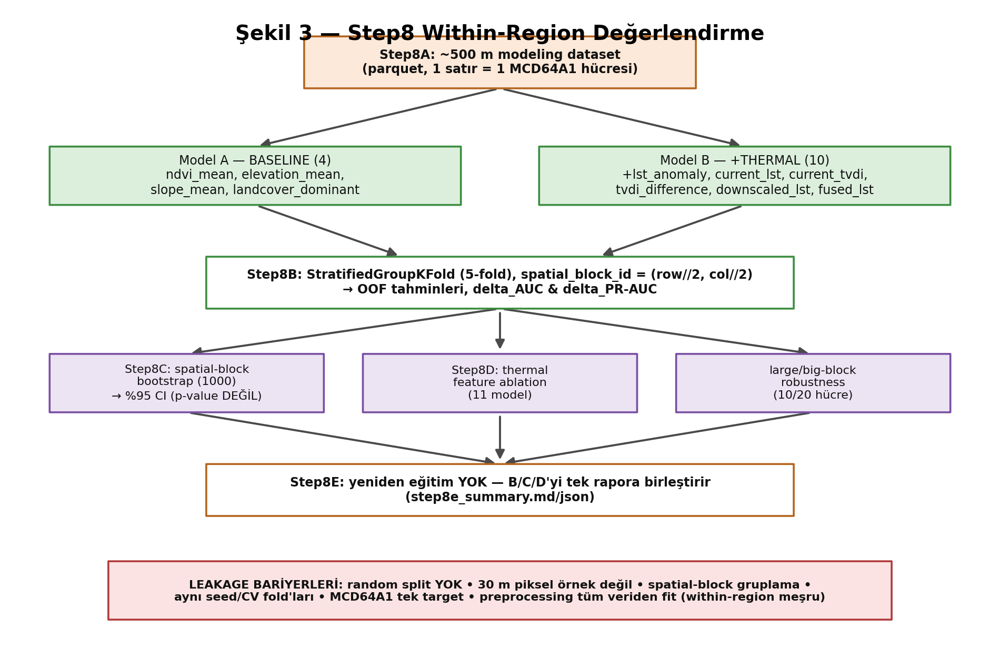

- **Step8A** label-honest ~500 m dataset (30 m → 500 m aggregation). Gerçek BurnDate DOY gerekir.
- **Step8B** baseline vs. +thermal, StratifiedGroupKFold (5-fold), `spatial_block_id=(row//2,col//2)`; delta_AUC & delta_PR-AUC.
- **Step8C** spatial-block bootstrap (1000) → %95 percentile CI (yeniden eğitim YOK).
- **Step8D** thermal feature ablation (11 model, aynı fold'lar).
- **Step8E** yeniden eğitim YOK; B/C/D'yi tek rapora birleştirir.

## 9.8 Bir AOI'yi Step8'den uçtan uca izleme (Manavgat)

Kanonik çıktılardan (`outputs/experiments/manavgat_2021/step8b/...`):

- Step8A → 24.087 hücre (796 burned, 23.291 unburned).
- Popülasyonlar: all_valid=24087, burnable_tree_shrub_grass=20511, burnable_tree_shrub=15538, cropland_dominant=1260 (atlandı: yalnız 2 pozitif).
- Step8B all_valid: baseline ROC=0.828, thermal ROC=0.887 (ΔAUC=+0.059); PR 0.123→0.222 (ΔPR=+0.100); interpretation=`thermal_improves`.
- Step8C bunu spatial-block bootstrap ile destekler (bkz. Bölüm 13).

> **Çıktıda nerede?** Bu sayıların kaynağı: `outputs/experiments/manavgat_2021/step8b/step8b_model_comparison_metrics.json` → `population_metrics.all_valid`.

## 9.9 Bölüm özdeğerlendirmesi

**Beş öz-kontrol sorusu:**
1. Deney-farkında ve legacy iş akışı veri erişiminde nasıl farklılaşır?
2. Step7 modeli neden transfer edilmez?
3. Step6B gate'i geçmek neden Step7 çalıştırma yetkisi vermez (Muğla)?
4. Step8C yeni model eğitir mi? Neyi girdi alır?
5. Step8A neden gerçek DOY gerektirir, binary maske neden yetmez?

**Depo gezinme egzersizi:** `outputs/experiments/mugla_2021/step8b/step8b_model_comparison_metrics.json` içinde `population_counts` ve `skipped_populations` alanlarını oku.

**"AI kullanmadan anlat" egzersizi:** Şekil 3'ü çizerek Manavgat'ı Step8A'dan Step8E'ye kadar anlat.

---

# Bölüm 10 — Cross-Region Transfer: Step9

Step9, Step8'in burned-area association modelini bir bölgede eğitip **tamamen bağımsız** bir bölgede test eder. Birincil popülasyon `burnable_tree_shrub_grass`.

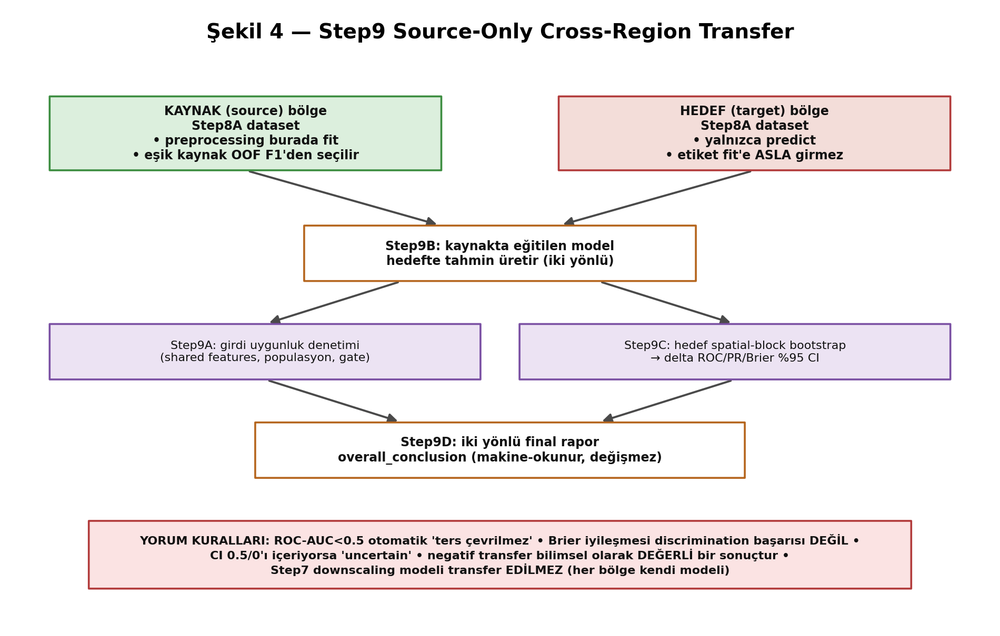

## 10.1 Step9A–D akışı

- **Step9A** — girdi uygunluk denetimi (shared feature'lar, populasyon yeterliliği, label kaynağı, gate kararı) fail-fast.
- **Step9B** — iki yönlü transfer; hedefte baseline+thermal tahminleri üretir.
- **Step9C** — hedef-bölge spatial-block bootstrap → %95 CI (yeniden eğitim YOK).
- **Step9D** — birleşik iki yönlü final rapor + makine-okunur `overall_conclusion`.

## 10.2 Source-only ön-işleme ve eşik

Tüm ön-işleme (numeric median imputation, kategorik landcover encoder) **yalnız kaynaktan** fit edilir. Sınıflandırma eşiği **yalnız kaynağın kendi spatial-block CV OOF tahminlerinden** (F1-optimal) seçilir. Pooled fit YOK, target fine-tuning YOK.

## 10.3 Ham transfer metrikleri (kanonik, tüm 8 çift)

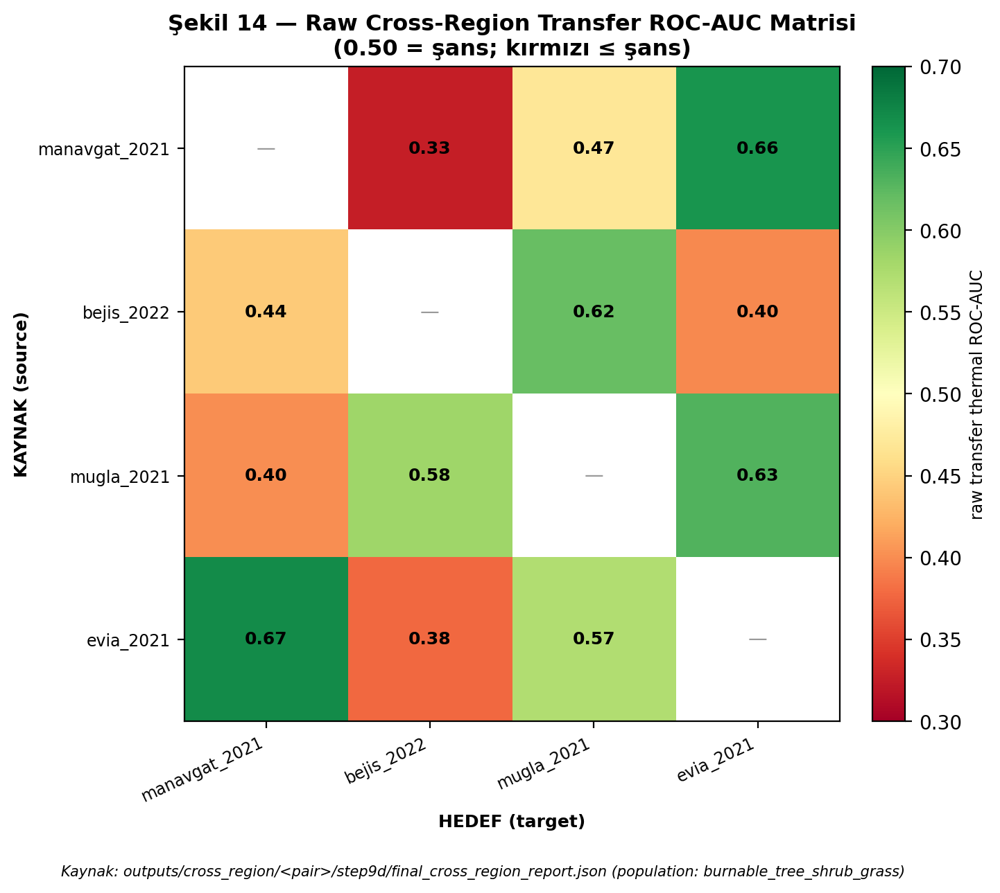

Tam sayılar Bölüm 13'te tablolanmıştır. Öne çıkanlar:

- Çoğu yön şans (0.5) civarında veya altında. En zayıf: manavgat→bejis thermal ROC=0.326.
- Bazı yönlerde yüksek mutlak ROC-AUC (ör. evia→manavgat=0.67) — **ama** bu, thermal'ın baseline'ı geçtiği anlamına gelmez; ilgili `overall_conclusion` manavgat↔evia için `transfer_not_supported`'tur çünkü **delta** (thermal−baseline) negatiftir.

> **Sık yapılan hata:** Mutlak ROC-AUC'yi transfer başarısı sanmak. Transfer iddiası **delta** (thermal vs. baseline) ve onun bootstrap CI'sına dayanır, mutlak değere değil.

## 10.4 Transfer belirsizliği (Step9C)

Delta ROC/PR/Brier için hedef spatial-block bootstrap %95 CI. Yorum kategorileri: `positive_bootstrap_support`, `negative_bootstrap_support`, `uncertain` (CI 0/0.5'i içerir).

## 10.5 Kritik yorum kuralları

- **ROC-AUC < 0.5 otomatik "ters çevrilmez".** Bir yönün 0.33 olması, "0.67'lik bir model" anlamına gelmez; yalnızca sıralamanın hedefte bozulduğunu gösterir.
- **Brier iyileşmesi ≠ discrimination başarısı.** Thermal, birçok yönde Brier'i düşürür (daha az "yanlış-güvenli" olasılık), ama ROC/PR delta'ları belirsiz/negatif kalabilir.
- **target-label post-hoc teşhis adaptasyona sızmamalı.** Step9E/9G hedef etiketleri yalnız transfer tamamlandıktan **sonra** teşhis için inceler.
- **Negatif transfer değerlidir.** "Genellenmedi" bulgusu, projenin en dürüst ve bilimsel açıdan en önemli sonucudur.
- **Step7 downscaling modeli transfer edilmez.**

## 10.6 Bir tam transfer yönünü izleme (bejis→manavgat, thermal)

`outputs/cross_region/manavgat_2021__bejis_2022/step9d/final_cross_region_report.json`:

- Kaynak: bejis Step8A (15.190 hücre) → eşik kaynak OOF F1'den (0.45).
- Hedef: manavgat (20.511 hücre, 784 pozitif).
- thermal ROC=0.444, PR=0.034, Brier=0.089. Delta ROC=+0.023 CI[−0.0004, 0.044] → `uncertain`; Delta Brier `positive_bootstrap_support`.
- Sonuç: discrimination transferi belirsiz; yalnız olasılık-hatası iyileşir.

## 10.7 Step9E/9F/9G (bkz. Bölüm 12)

Step9E dağılım-kayması, Step9F kesifsel feature-representation, Step9G univariate yön-reversal — hepsi post-hoc teşhistir; Step9A–D'yi değiştirmezler.

## 10.8 Bölüm özdeğerlendirmesi

**Beş öz-kontrol sorusu:**
1. Eşik neden kaynaktan seçilir?
2. ROC-AUC=0.33 neden "0.67'lik iyi model" değildir?
3. Brier iyileşmesi neden discrimination başarısı değildir?
4. `overall_conclusion` `transfer_not_supported` iken bir yönde ROC=0.67 nasıl olabilir?
5. Neden negatif transfer bilimsel olarak değerlidir?

**Depo gezinme egzersizi:** `manavgat_2021__mugla_2021/step9d/...json` içinde iki yönün delta CI yorumlarını oku.

**"AI kullanmadan anlat" egzersizi:** Şekil 4 ile bir transfer yönünü uçtan uca anlat.

---

# Bölüm 11 — Self-Calibrated Transfer: Step10

Step10, hedef bölgenin **etiketsiz** covariate istatistikleriyle transferi iyileştirmeyi dener. Frozen `analysis_id` her çift için manifestte kayıtlıdır.

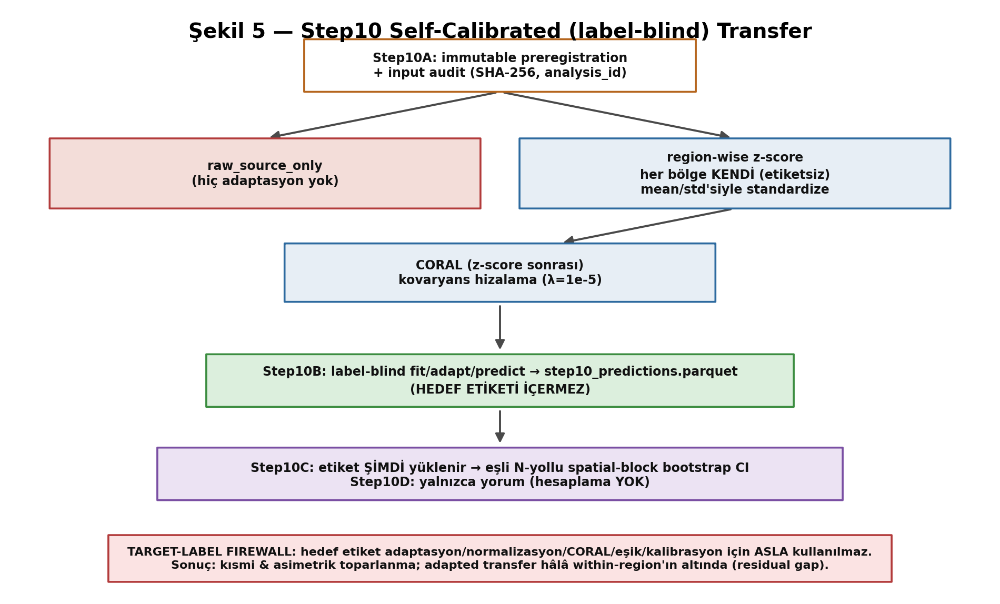

## 11.1 Üç varyant

- **`raw_source_only`** — adaptasyon yok (Step9B referansıyla aynı).
- **`regionwise_zscore`** — her bölge kendi (etiketsiz) mean/std'siyle standardize (yalnız numeric; kategorik ayrı ele alınır).
- **`coral_after_regionwise_zscore`** — z-score sonrası kovaryans hizalama (CORAL, λ=1e-5).

## 11.2 Step10A–D

- **Step10A** immutable preregistration + input audit (SHA-256, analysis_id).
- **Step10B** label-blind fit/adapt/predict → `step10_predictions.parquet` (**hedef etiketi İÇERMEZ**).
- **Step10C** etiket **şimdi** yüklenir → eşli N-yollu spatial-block bootstrap CI.
- **Step10D** yalnız yorum (hesaplama YOK).

## 11.3 Target-label firewall

Hedef etiket adaptasyon/normalizasyon/CORAL/eşik/kalibrasyon için **ASLA** kullanılmaz. `--force` preregistration'ı değiştirmez. Testler (`tests/test_step10.py`) bu firewall'ı ve raw reprodüksiyonu doğrular.

## 11.4 Kanonik Step10 sonuçları (thermal ROC-AUC)

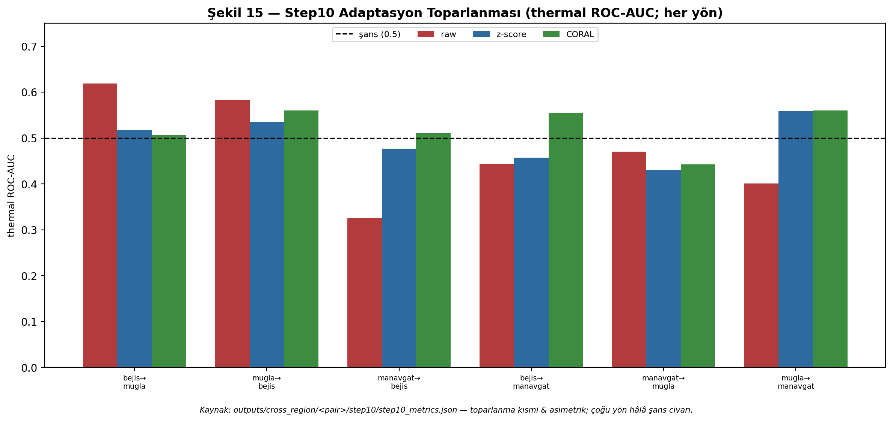

`outputs/cross_region/<pair>/step10/step10_metrics.json` (thermal, seçilmiş yönler):

| Yön | within | raw | z-score | CORAL |
|---|---|---|---|---|
| manavgat→bejis | 0.918 | 0.326 | 0.477 | 0.511 |
| bejis→manavgat | 0.870 | 0.444 | 0.457 | 0.555 |
| mugla→manavgat | 0.870 | 0.401 | 0.559 | 0.560 |
| manavgat→mugla | 0.859 | 0.470 | 0.431 | 0.443 |
| mugla→bejis | 0.918 | 0.583 | 0.535 | 0.560 |
| bejis→mugla | 0.859 | 0.619 | 0.518 | 0.507 |

## 11.5 Yorum

- Raw transfer birçok yönde şansın altında.
- z-score/CORAL bazı yönlerde toparlar, bazılarında **kötüleştirir** (asimetrik). Multi-AOI sentezi: 13 yön adaptation_supported, 9 yön adaptation_degraded, 2 belirsiz.
- CORAL yalnız bazı yönlerde bootstrap-destekli şansı aşar (ör. bejis→manavgat).
- **Adapted transfer hâlâ within-region'ın çok altında** (residual gap).

## 11.6 Neden Step9F ≠ Step10, ve neden inversion/target-calibration yasak

- Step9F median/IQR region-relative normalizasyon **kesifsel**dir; Step10 ise önceden-kayıtlı, hash-korumalı, hedef-etiket-körü bir deneydir. Biri diğerinin yerine geçmez.
- Hedef etiketlerini görüp tahmini ters çevirmek veya eşik kalibre etmek **leakage**tir ve yasaktır (Bölüm 15).

> **Claim sınırı:** "Step10, Step9'u düzeltti" / "Step10 operasyonel transferi kanıtlar" / "CORAL kesinlikle üstündür" ifadeleri **yasaktır**. Doğru ifade: bazı yön/yöntem kombinasyonlarında bootstrap-destekli kısmi toparlanma; residual within-region gap kalır.

## 11.7 Within vs. raw vs. adapted ayrımı

Üç değerlendirmeyi asla karıştırma. within (0.86–0.92) bir bölgenin *iç* ayrım gücüdür; raw (0.33–0.62) ham transferdir; adapted (0.43–0.56) etiketsiz uyarlamadır. Bir cümlede yalnız aynı türden sayılar karşılaştırılır.

## 11.8 Bölüm özdeğerlendirmesi

**Beş öz-kontrol sorusu:**
1. Üç Step10 varyantı nedir?
2. Step10B çıktısı neden hedef etiketi içermez?
3. "Residual gap" neyi gösterir?
4. Neden Step9F, Step10'un yerine geçmez?
5. z-score bazı yönleri neden kötüleştirir?

**Depo gezinme egzersizi:** `manavgat_2021__bejis_2022/step10/step10_bootstrap_summary.json` içinde bir CI oku.

**"AI kullanmadan anlat" egzersizi:** Şekil 5 + Şekil 15 ile Step10'un "kısmi ve asimetrik" sonucunu anlat.

---

# Bölüm 12 — Teşhis Analizleri ve Her Birinin Yanıtladığı Soru

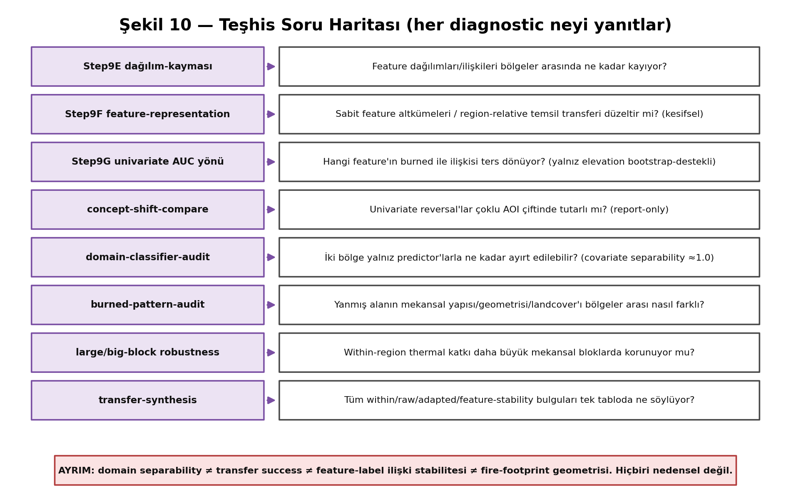

Her teşhis farklı bir soruyu yanıtlar. **Kritik ayrım:** domain separability ≠ transfer success ≠ feature-label ilişki stabilitesi ≠ fire-footprint geometrisi. Hiçbiri nedensel değildir.

## 12.1 Step9E — dağılım-kayması denetimi

**Soru:** Feature dağılımları/ilişkileri bölgeler arası ne kadar kayıyor? **Hedef:** teşhis (model yok). **Popülasyon:** primary. **Çıktı:** numeric/categorical shift CSV'leri, label-conditional ilişkiler, relationship_direction_flips, calibration_bins, heatmap/PNG'ler. **Yorum:** en çok kayan feature'lar + ilişki-yönü ters dönenler. **Sınır:** iki bölgeye özgü, nedensel değil.

## 12.2 Step9F — kesifsel feature-representation

**Soru:** Sabit feature altkümeleri / region-relative temsil transferi düzeltir mi? İki rejim: strict source-only (8 varyant) ve unsupervised target-covariate adaptive (2 varyant). **Sonuç:** hiçbir aday `candidate_for_third_region_freeze` kriterlerinin tümünü geçmedi. **Sınır:** kesifsel; validation DEĞİL.

## 12.3 Step9G — univariate feature-AUC yön-reversal

**Soru:** Hangi feature'ın burned ile ilişkisi ters dönüyor? **Yöntem:** ham feature değeriyle univariate burned ROC-AUC; inversion/normalizasyon/imputation YOK; 10-hücre bootstrap; landcover (kategorik) dışlanır. **Bulgu:** yalnız `elevation_mean` bootstrap-destekli reversal; dört LST/TVDI point reversal'ının CI'ları şansı içerir (bootstrap-destekli DEĞİL). **Sınır:** marjinal, nedensel değil, per-feature (model-seviyesi değil).

## 12.4 concept-shift-compare — çoklu AOI

**Soru:** Reversal'lar birden çok çiftte tutarlı mı? Report-only; frozen v1 raporlarından, 1e-12 toleransla çapraz-doğrulama.

## 12.5 domain-classifier-audit — covariate ayrılabilirliği

**Soru:** İki bölge yalnız predictor'larla ne kadar ayırt edilebilir? **Hedef değişken:** bölge kimliği (burned DEĞİL). **Bulgu (kanonik):** bejis↔manavgat 0.9998, bejis↔mugla 0.9999, manavgat↔mugla 0.982 — **neredeyse mükemmel ayrılabilirlik**. Bu, güçlü covariate shift'in doğrudan kanıtıdır ve transferin neden zor olduğunu açıklar. Legacy domain-classifier sonucu YOK; `spatial_block_domain_auc` tek birincil sonuç. **Sınır:** nedensellik kurmaz.

> **Neden önemli?** domain AUC≈1.0 iken transfer ROC-AUC≈0.4 olması çelişki değildir; tam tersine, uyumlu bir hikâyedir: bölgeler covariate uzayında o kadar ayrıktır ki kaynakta öğrenilen sınır hedefte anlamsızlaşır. Bu, "domain separability ≠ transfer success" ayrımının somut kanıtıdır.

## 12.6 burned-pattern-audit — fire-footprint geometrisi

**Soru:** Yanmış alanın mekansal yapısı bölgeler arası nasıl farklı? **Bulgu (burnable pop):**

| AOI | burned | bileşen | en büyük bileşen payı | baskın landcover | median elevation |
|---|---|---|---|---|---|
| bejis_2022 | 1100 | 1 | 1.00 | shrubland (0.56) | 935 m |
| manavgat_2021 | 784 | 15 | 0.88 | tree_cover (0.90) | 512 m |
| mugla_2021 | 2911 | 10 | 0.31 | tree_cover (0.92) | 563 m |

Bejís tek bitişik bileşen; Muğla çok parçalı (en büyük yalnız %31). **Sınır:** bileşenler yangın olayı sayısı DEĞİL; çözünürlüğe ve AOI kırpımına duyarlı.

## 12.7 large/big-block robustness

**Soru:** Within-region thermal katkı daha büyük mekansal bloklarda korunuyor mu? (bkz. Bölüm 13).

## 12.8 transfer-synthesis — sentez

**Soru:** Tüm within/raw/adapted/feature-stability bulguları tek tabloda ne söylüyor? Report-only. Bilimsel sınırlar 3-AOI sentezinde açıkça listelenir: "within-region performans taşınabilirliği ima etmez", "adaptasyon bazı yönlere yardım eder bazılarına zarar verir", vb.

## 12.9 Worked example: Manavgat–Bejís–Muğla

- **within:** üçü de thermal_improves (Bölüm 13).
- **raw transfer:** çoğu yön şans civarı; bidirectional destek yalnız bejis↔mugla çiftinde.
- **domain:** üç çift de ≈0.98–1.00 ayrılabilir.
- **burned-pattern:** geometriler dramatik farklı (tek bileşen vs. 15 vs. 10 parçalı).
- **concept-shift:** elevation reversal bejis↔manavgat ve manavgat↔mugla'da bootstrap-destekli.
- **Sentez:** within güçlü, cross-region zayıf; covariate + relationship shift + geometri farkları hepsi tutarlı ama hiçbiri nedensel kanıt değil.

## 12.10 Bölüm özdeğerlendirmesi

**Beş öz-kontrol sorusu:**
1. domain AUC≈1.0 ile transfer ROC≈0.4 neden çelişmez?
2. burned-pattern bileşen sayısı neden yangın olayı sayısı değildir?
3. Step9G'de tek bootstrap-destekli reversal hangisi?
4. Step9F neden validation değildir?
5. Dört ayrımı (separability/transfer/ilişki stabilitesi/geometri) tek cümleyle ayır.

**Depo gezinme egzersizi:** `outputs/diagnostics/domain_classifier_audit/comparison/multi_aoi_domain_classifier_comparison.json`'da üç çiftin AUC'lerini oku.

**"AI kullanmadan anlat" egzersizi:** Manavgat–Bejís–Muğla worked example'ını Şekil 10 + Şekil 14 ile anlat.

---

# Bölüm 13 — Güncel Kanonik Bilimsel Sonuçlar

Bu bölümdeki tüm sayılar **mevcut kanonik çıktı dosyalarından** okunmuştur (hatırlanan sayı yok). Her tablo, kaynağını belirtir. Popülasyon kanonik olarak `burnable_tree_shrub_grass` (cross-region primary) veya `all_valid` (formal within-region) olarak etiketlenir; ikisi karıştırılmaz.

## 13.1 Gate/popülasyon sonuçları

`outputs/experiments/<id>/validation/labels/burned_landcover_gate.json` ve `.../step8b/...json`:

| AOI | Gate | row_count | burned | all_valid | burnable_t_s_g |
|---|---|---|---|---|---|
| manavgat_2021 | wildfire_candidate_pass | 24087 | 796 | 24087 | 20511 |
| bejis_2022 | wildfire_candidate_pass | 15759 | 1103 | 15759 | 15190 |
| mugla_2021 | wildfire_candidate_pass | 73045 | 3026 | 73045 | 41730 |
| evia_2021 | wildfire_candidate_pass | 7728 | 2774 | 7728 | 3946 |

## 13.2 Within-region baseline vs. thermal (kanonik)

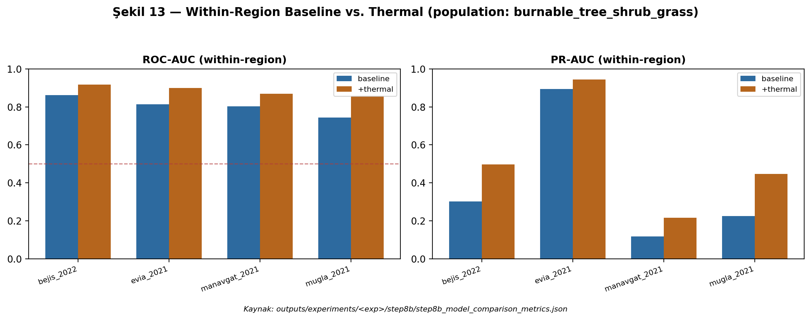

**Popülasyon `all_valid`** (Kaynak: `.../step8b/step8b_model_comparison_metrics.json`):

| AOI | ROC base | ROC thermal | ΔAUC | PR base | PR thermal | ΔPR | ΔBrier |
|---|---|---|---|---|---|---|---|
| manavgat_2021 | 0.828 | 0.887 | +0.059 | 0.123 | 0.222 | +0.100 | −0.020 |
| bejis_2022 | 0.869 | 0.917 | +0.048 | 0.309 | 0.487 | +0.178 | −0.028 |
| mugla_2021 | 0.841 | 0.913 | +0.072 | 0.212 | 0.436 | +0.224 | −0.030 |
| evia_2021 | 0.945 | 0.967 | +0.022 | 0.890 | 0.934 | +0.043 | −0.019 |

**Popülasyon `burnable_tree_shrub_grass`:**

| AOI | ROC base | ROC thermal | ΔAUC | PR base | PR thermal | ΔPR |
|---|---|---|---|---|---|---|
| manavgat_2021 | 0.803 | 0.870 | +0.067 | 0.119 | 0.216 | +0.097 |
| bejis_2022 | 0.862 | 0.918 | +0.056 | 0.303 | 0.498 | +0.195 |
| mugla_2021 | 0.743 | 0.859 | +0.116 | 0.225 | 0.447 | +0.222 |
| evia_2021 | 0.814 | 0.898 | +0.085 | 0.895 | 0.944 | +0.049 |

Dört AOI'de de interpretation=`thermal_improves`. **Not (Evia):** Evia'da burnable popülasyonda pozitif oranı çok yüksektir (2663/3946), bu yüzden PR-AUC baseline'ı bile yüksektir; bu, yüksek burn-prevalence'lı bir AOI'nin bir eseridir, üstün bir model değil.

## 13.3 Spatial-block large-block robustness (frozen, manavgat+bejis)

**Formal `all_valid`** (Kaynak: `outputs/robustness/step8_large_block_primary_all_valid/manavgat_2021__bejis_2022/...`):

| AOI | blok | ΔROC-AUC | ROC %95 CI | ΔPR-AUC | PR %95 CI |
|---|---|---|---|---|---|
| Manavgat | 10 (~5km) | +0.0532 | [0.0294, 0.0749] | +0.0488 | [0.0164, 0.0939] |
| Manavgat | 20 (~10km) | +0.0444 | [0.0147, 0.0776] | +0.0260 | [0.0006, 0.0555] |
| Bejís | 10 (~5km) | +0.0557 | [0.0308, 0.0781] | +0.1344 | [0.0591, 0.2264] |
| Bejís | 20 (~10km) | +0.0613 | [0.0397, 0.0871] | +0.0761 | [0.0140, 0.1554] |

Dört koşulun tümünde ROC ve PR delta CI'ları sıfırın üzerinde. **İzin verilen ifade:** "thermal contribution remained bootstrap-supported across both predefined large-block scales in both wildfire regions." Bu, "spatial autocorrelation eliminated" veya "best block size selected" **değildir**.

## 13.4 Ham cross-region transfer (kanonik, tüm çiftler)

Kaynak: `outputs/cross_region/<pair>/step9d/final_cross_region_report.json` (thermal, primary population). ΔAUC = thermal − baseline; CI = delta ROC-AUC bootstrap yorumu.

| Yön | thermal ROC | ΔAUC | ΔAUC CI yorumu | ΔBrier yorumu |
|---|---|---|---|---|
| manavgat→bejis | 0.326 | −0.006 | uncertain | positive |
| bejis→manavgat | 0.444 | +0.023 | uncertain | positive |
| manavgat→mugla | 0.470 | −0.038 | negative | positive |
| mugla→manavgat | 0.401 | −0.121 | negative | positive |
| mugla→bejis | 0.583 | +0.133 | positive | positive |
| bejis→mugla | 0.619 | +0.026 | positive | positive |
| manavgat→evia | 0.662 | −0.039 | negative | negative |
| evia→manavgat | 0.670 | −0.038 | negative | uncertain |
| mugla→evia | 0.630 | −0.022 | uncertain | negative |
| evia→mugla | 0.572 | +0.071 | positive | positive |
| bejis→evia | 0.397 | −0.089 | negative | positive |
| evia→bejis | 0.378 | +0.008 | uncertain | negative |

**overall_conclusion (Step9D):** çoğu çift `partial_transfer_supported`; manavgat↔evia `transfer_not_supported`.

> **Claim sınırı:** `overall_conclusion` makine-okunur bir kategoridir ve reprodüksiyon için değiştirilmez. Ama insan-okunur doğru yorum: **doğrudan cross-region discrimination generalization desteklenmez**; yalnız Brier iyileşmesi tutarlıdır. En kritik gözlem — mugla↔manavgat (aynı ülke, aynı yıl) bile discrimination'ı taşımaz (ΔAUC negatif her iki yönde): transfer başarısızlığı yalnız coğrafi mesafeyle açıklanamaz.

## 13.5 Step10 adaptasyon (kanonik, tamamlanmış çiftler)

Bölüm 11.4'teki tablo kanoniktir (Kaynak: `.../step10/step10_metrics.json`). Adapted ROC-AUC'ler 0.43–0.56 aralığında; within-region'ın (0.86–0.92) çok altında.

## 13.6 Univariate feature-AUC yönleri (Step9G)

Kaynak: `outputs/diagnostics/step9g_univariate_feature_auc_direction_reversal/<pair>/step9g_final_report.json`. **Bootstrap-destekli reversal:** `elevation_mean` (manavgat↔bejis; Manavgat 0.374 [0.289,0.471], Bejís 0.643 [0.558,0.729]). **Point reversal ama bootstrap-destekli DEĞİL:** current_lst, tvdi_difference, downscaled_lst, fused_lst. **Same-direction:** ndvi, slope, lst_anomaly, current_tvdi.

## 13.7 Domain-classifier AUC (kanonik)

Kaynak: `outputs/diagnostics/domain_classifier_audit/comparison/multi_aoi_domain_classifier_comparison.json`:

| Çift | domain AUC | %95 CI | feature | durum |
|---|---|---|---|---|
| bejis vs manavgat | 0.9998 | [0.9997, 0.9999] | 10 | no_legacy_precedent |
| bejis vs mugla | 0.9999 | [0.9998, 1.0000] | 10 | no_legacy_precedent |
| manavgat vs mugla | 0.9822 | [0.9785, 0.9859] | 10 | no_legacy_precedent |

## 13.8 Burned connected-component karşılaştırması

Bölüm 12.6'daki tablo kanoniktir (Kaynak: `.../burned_pattern_audit/comparison/...json`). bejis=1, manavgat=15, mugla=10 bileşen. **Bileşen bir yangın olayı sayısı değildir.**

## 13.9 Evia durumu

Evia within-region Step8 tamamdır (Bölüm 13.2). Cross-region step9d raporları beş yönde mevcuttur (13.4). Ancak Step10 evia için henüz tüm yönlerde yoktur ve son commit "Evia AOI at %90" olarak işaretlidir → **kısmen tamamlanmış** kabul edilmelidir.

## 13.10 Bekleyen/dondurulmuş analizler

- **Frozen:** manavgat+bejis large-block robustness (all_valid + burnable), Step10 (5 çift), Step9G v1 raporları, domain/burned-pattern/synthesis manifestleri.
- **Bekleyen:** Evia Step10 tüm yönler; üçüncü-bölge external validation için dondurulmuş bir feature stratejisi (henüz yok).

## 13.11 Sonuç sınıflandırması

- **Teknik başarılı ama bilimsel-nötr:** pipeline'ın çalışması (Step1–Step10 tüm AOI'lerde koştu).
- **Bilimsel destekli:** within-region thermal katkı (4 AOI) + large-block robustness (manavgat/bejis).
- **Belirsiz:** birçok transfer yönünün ΔAUC CI'si (uncertain).
- **Negatif:** doğrudan cross-region discrimination transferi.
- **Yalnız-teşhis:** domain AUC, burned-pattern geometrisi, univariate reversal.

## 13.12 Bölüm özdeğerlendirmesi

**Beş öz-kontrol sorusu:**
1. Hangi popülasyon within-region formal, hangisi cross-region primary?
2. mugla↔manavgat transfer sonucu staj sorusuna ne yanıt verir?
3. Evia burnable PR-AUC neden yüksek?
4. Frozen robustness hangi ifadeyi hangi ifadeyi yasaklar?
5. domain AUC≈1.0'ın anlamı nedir?

**Depo gezinme egzersizi:** Bölüm 13.4 tablosundaki bir satırı ilgili step9d JSON'undan doğrula.

**"AI kullanmadan anlat" egzersizi:** "Within-region güçlü, cross-region zayıf" hikâyesini kanonik sayılarla 5 dakikada anlat.

---

# Bölüm 14 — Projenin Desteklediği ve Desteklemediği İddialar

Bu bölüm katı bir "claim tablosu"dur. Her satır: iddia, destek durumu, kanıt, sınır, güvenli ifade, yasak ifade.

| İddia | Durum | Kanıt | Sınır | Güvenli ifade | Yasak ifade |
|---|---|---|---|---|---|
| Within-region thermal katkı | Destekli | Step8B ΔAUC>0, Step8C CI (4 AOI) | tek sezon | "thermal contribution was observed within-region" | "thermal significantly improves" |
| Large-block robustness | Kısmen (manavgat/bejis) | frozen 10/20 CI>0 | 2 bölge, 2 ölçek | "remained bootstrap-supported across both predefined scales" | "spatial autocorrelation eliminated" |
| Ham cross-region transfer | Desteklenmiyor | ΔAUC uncertain/negatif | 8 çift | "direct cross-region discrimination not supported" | "successful transfer" |
| Self-calibrated transfer | Kısmi/asimetrik | Step10 (5 çift) | residual gap | "unsupervised adaptation partially, asymmetrically recovered" | "Step10 corrected Step9" |
| Covariate shift | Destekli (betimsel) | domain AUC≈1.0 | nedensel değil | "regions are highly separable in covariate space" | "covariate shift causes failure" |
| Concept/relationship shift | Kısmi (elevation) | Step9G bootstrap reversal | marjinal | "diagnostic evidence consistent with relationship shift" | "concept shift is THE cause" |
| Domain separability | Destekli | domain AUC | ≠ transfer başarısı | "covariate-separable" | "domains are the same/different fires" |
| Coğrafi benzerlik | Desteklenmiyor | mugla↔manavgat da başarısız | — | "same-country same-year did not transfer either" | "closer regions transfer better" |
| Yangın tahmini | Desteklenmiyor | — | — | (yok) | "predicts wildfire" |
| Erken uyarı | Desteklenmiyor | — | — | (yok) | "operational early-warning" |
| Nedensellik | Desteklenmiyor | — | — | (yok) | "causal thermal effect" |
| Olayların ötesine genelleme | Desteklenmiyor | tek olay/AOI | — | "results are event/AOI-specific" | "generalizes to Mediterranean wildfires" |

## 14.1 Asla yazılmaması gereken cümleler (örnekler)

- "Bu sistem yangınları tahmin eder / erken uyarı verir."
- "Termal feature'lar yanmayı istatistiksel olarak anlamlı şekilde iyileştirir."
- "Model başarıyla bölgeler arası genelledi."
- "En iyi block size seçildi / spatial autocorrelation elimine edildi."
- "CORAL kesinlikle z-score'dan üstündür."
- "Manavgat/Bejís üzerinde kanıtlanmış transfer-safe feature seti" (etiketleri görülmüş iki bölge).
- "Kozan doğal-bitki-örtüsü yangın davranışını doğruladı."

## 14.2 Bölüm özdeğerlendirmesi

**Beş öz-kontrol sorusu:**
1. Hangi iki iddia "destekli", hangileri "desteklenmiyor"?
2. Coğrafi benzerlik iddiasını hangi sonuç çürütür?
3. "significant" kelimesi neden yasak?
4. Large-block sonucu için izin verilen tam ifade nedir?
5. Concept shift iddiasının sınırı nedir?

**Depo gezinme egzersizi:** `README.md` Bölüm 19'daki izin verilen/yasak ifadeler listesini bu tabloyla karşılaştır.

**"AI kullanmadan anlat" egzersizi:** Bir jüri üyesi "modeliniz yangını tahmin ediyor mu?" derse verilecek güvenli yanıtı formüle et.

---

# Bölüm 15 — Leakage ve Metodolojik Bütünlük

Leakage (sızıntı), test performansını yapay olarak şişiren her türlü bilgi akışıdır. Bu proje leakage'a karşı hem **kod bariyerleri** hem **insan disiplini** ile korunur.

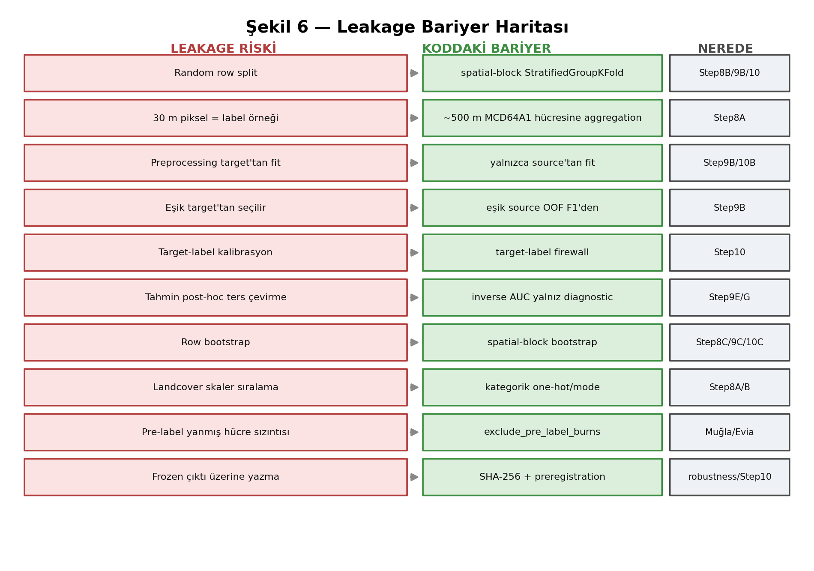

## 15.1 Leakage yolları ve bariyerleri

- **Random row split:** Komşu hücreler benzer olduğundan aynı yangının hücreleri hem train hem test'e düşer. **Bariyer:** `StratifiedGroupKFold` + `spatial_block_id` (Step8B/9B/10). `random_split_used=False`.
- **30 m piksel = label örneği:** pseudo-replication. **Bariyer:** Step8A ~500 m aggregation; her satır bir hücre.
- **Preprocessing target'tan fit:** hedef bilgisi ön-işlemeye sızar. **Bariyer:** yalnız kaynaktan fit (Step9B/10B).
- **Eşik target'tan seçilir:** **Bariyer:** eşik kaynak OOF F1'den (Step9B).
- **Target-label kalibrasyon/feature seçimi/inversion:** **Bariyer:** target-label firewall (Step10); Step9E/9G etiketleri yalnız post-hoc teşhis için görür; tahmin **ters çevrilmez**.
- **Row bootstrap:** mekansal bağımlılığı yok sayar. **Bariyer:** spatial-block bootstrap (Step8C/9C/10C).
- **Koordinat/experiment-ID leakage:** modelin bölgeyi ezberlemesi. **Bariyer:** domain-classifier bile koordinat/experiment-ID/burned kullanmaz; Step8 feature'ları koordinat içermez.
- **Landcover skaler sıralama:** kategorik sınıfı ordinal saymak. **Bariyer:** `landcover_dominant` kategorik işlenir.
- **Pre-label yanmış hücre sızıntısı:** predictor penceresinde yanan hücreler. **Bariyer:** `exclude_pre_label_burns` (Muğla/Evia).
- **Frozen çıktı üzerine yazma:** **Bariyer:** SHA-256 input hash + immutable preregistration; `--force` bunları değiştiremez.

## 15.2 Kodun önlediği vs. insan disiplini gerektiren

**Kod önler (fail-fast):** window overlap, random split (varsayılan kapalı), namespace sızıntısı, pre-label burns, hash uyuşmazlığı, disabled deney seçimi.

**İnsan disiplini gerekir:** post-hoc feature seçimini "validation" gibi sunmamak; aynı iki bölgede etiketleri görüp "unbiased" ilan etmemek; mutlak ROC-AUC'yi transfer başarısı sanmamak; teşhis sonuçlarını nedensel yorumlamamak.

> **Leakage riski:** En sinsi leakage kod değil, **anlatı** leakage'ıdır: "Manavgat ve Bejís'te transfer-safe bir feature seti bulduk" demek — çünkü bu iki bölgenin etiketleri zaten görülmüştür. Böyle bir strateji ancak **dondurulup üçüncü bağımsız bir bölgede** test edilirse doğrulanabilir (Bölüm 18).

## 15.3 Ön-koşu (pre-run) leakage kontrol listesi

- [ ] Popülasyon doğru mu (all_valid vs. burnable karışmıyor mu)?
- [ ] Kaynak/hedef doğru atanmış mı?
- [ ] `exclude_pre_label_burns` gereken AOI'lerde açık mı?
- [ ] `--force` frozen dosyaları hedeflemiyor mu?
- [ ] Runtime konfigürasyon manifest ile uyumlu mu (hash)?

## 15.4 Koşu-sonrası (post-run) leakage kontrol listesi

- [ ] `random_split_used=False` mı?
- [ ] Eşik `source_oof_f1_optimal` mı?
- [ ] Step10 predictions parquet'i hedef etiketi içermiyor mu?
- [ ] Input hash'ler değişmemiş mi (frozen korundu mu)?
- [ ] Yorum, mutlak değil delta+CI'ya mı dayanıyor?

## 15.5 Bölüm özdeğerlendirmesi

**Beş öz-kontrol sorusu:**
1. En sinsi leakage türü nedir ve neden koddan değil disiplinden gelir?
2. `spatial_block_id` hangi leakage'ı önler?
3. Eşik neden target'tan seçilemez?
4. Pre-label burns neden negatif değil, dışlanan hücre olmalıdır?
5. İki post-hoc kontrol maddesini say.

**Depo gezinme egzersizi:** bir step9b metrics JSON'unda `threshold_selection.method` alanını bul.

**"AI kullanmadan anlat" egzersizi:** Şekil 6'yı çizerek 5 leakage bariyerini anlat.

---

# Bölüm 16 — Çıktı ve Manifest Anatomisi


## 16.1 Namespace tasarımı

| Namespace | Sahip komut | İçerik |
|---|---|---|
| `outputs/experiments/<id>/` | `experiment` | data, gate, step5/5c, step7a-e, step8a-e, qa, robustness |
| `outputs/kozan-legacy/` | `legacy` | Kozan Step1–8E paylaşılan yollar |
| `outputs/cross_region/<src>__<tgt>/` | `transfer`/`shift-audit`/`step10` | step9a-g, step10 |
| `outputs/robustness/step8_large_block[_primary_all_valid]/` | `step8-robustness`/`large-block-robustness` | frozen robustness |
| `outputs/diagnostics/<analysis>/` | audit/compare/synthesis | teşhis çıktıları |

## 16.2 Bir çıktı ailesinin dosyaları

Örnek (Step9B): `cross_region_transfer_metrics.json` (metrikler), `cross_region_transfer_predictions.parquet` (OOF/transfer tahminleri), Step9C `cross_region_bootstrap_metrics.json` (CI), Step9D `final_cross_region_report.{json,md}` (birleşik).

## 16.3 Manifest anatomisi

Bir `manifest.json` / `*_manifest.json` / preregistration şunları içerir: `analysis_id` (girdilerden SHA-256), girdi dosya yolları + hash'leri, şema versiyonu, `created_at`, bilimsel konfigürasyon (feature seti, CV, bootstrap), ve koruma alanları.

## 16.4 Nasıl incelenir

```bash
# manifest / metrics oku
python -c "import json;d=json.load(open('outputs/cross_region/manavgat_2021__bejis_2022/step10/step10_metrics.json'));print(d['analysis_id'])"

# parquet şeması (etiket sızıntısı kontrolü)
python -c "import pyarrow.parquet as pq;print(pq.read_schema('outputs/cross_region/manavgat_2021__bejis_2022/step10/step10_predictions.parquet'))"

# markdown rapor oku
sed -n '1,40p' outputs/cross_region/manavgat_2021__bejis_2022/step9d/final_cross_region_report.md
```

## 16.5 İki çıktı bilimsel olarak aynı mı? — karar prosedürü

1. **analysis_id eşit mi?** → aynı girdiler + aynı konfigürasyon.
2. **Input hash'ler eşit mi?** → girdiler değişmemiş.
3. **Şema versiyonu aynı mı?** → format uyumlu.
4. **report-only mu, recompute mu?** → manifest bunu belirtir (`--report-only`/`--regenerate-reports-only` recompute yapmaz).
5. **Sayılar 1e-6/1e-12 içinde mi?** → sayısal olarak yeniden üretilmiş.

Sonuç tipleri: **scientifically identical** (aynı analysis_id + hash), **numerically reproduced** (yeni koşu, aynı sayı tolerans içinde), **report-only revised** (yalnız rapor formatı/wording değişti), **actually recomputed** (yeni fit/bootstrap).

## 16.6 SHA-256 ve Parquet uyarısı

> **Sık yapılan hata:** İki parquet dosyasının SHA-256'sını karşılaştırıp "sonuç değişti" sonucuna varmak. Parquet serileştirmesi (sıkıştırma, satır-grup düzeni, metadata zaman damgası) aynı veriden farklı byte'lar üretebilir. Bilimsel eşitlik için **içeriği** (değerleri, tolerans içinde) karşılaştır, ham dosya hash'ini değil. Input-hash koruması içerik-hash'idir; çıktı parquet byte-hash'i değildir.

## 16.7 Bölüm özdeğerlendirmesi

**Beş öz-kontrol sorusu:**
1. `analysis_id` neyi garanti eder?
2. Kozan çıktıları hangi namespace'tedir?
3. report-only ile recompute farkını nasıl anlarsın?
4. İki parquet'in byte-hash'i neden yanıltıcı olabilir?
5. Step10 predictions parquet'inin şemasında ne OLMAMALI?

**Depo gezinme egzersizi:** bir step9g manifest.json'da `analysis_id` ve şema alanlarını oku.

**"AI kullanmadan anlat" egzersizi:** "İki çıktı aynı mı?" prosedürünü 5 adımda anlat.

---

# Bölüm 17 — Hata Ayıklama ve Sorun Giderme

Proje-özel troubleshooting rehberi. Her madde: belirti → olası neden → inceleme komutu → güvenli çözüm → kaçınılacaklar.

## 17.1 Eksik Step8A
**Belirti:** Step8B "input dataset not found". **Neden:** Step8A çalışmamış. **İnceleme:** `ls outputs/experiments/<id>/step8a/`. **Çözüm:** `experiment --from-stage step8 ... --dry-run` sonra `--force`. **Kaçın:** Step8B'yi elle boş datasetle çalıştırmak.

## 17.2 Stale (bayat) çıktılar
**Belirti:** sayılar beklenenle uyuşmuyor. **Neden:** girdi değişti, çıktı yenilenmedi. **İnceleme:** manifest input-hash'lerini karşılaştır. **Çözüm:** ilgili aşamayı `--force` ile yeniden çalıştır. **Kaçın:** modification-time'a güvenmek.

## 17.3 Hash uyuşmazlığı
**Belirti:** robustness/Step10 "protected input hash mismatch". **Neden:** korunan Step8 girdisi değişmiş. **İnceleme:** preregistration'daki hash vs. güncel dosya. **Çözüm:** girdiyi bilinçli değiştirdiysen yeni analiz olarak ele al; değilse girdi bozulmuş demektir. **Kaçın:** hash kontrolünü bypass etmeye çalışmak.

## 17.4 Yanlış experiment ID / CLI typo
**Belirti:** "Bilinmeyen experiment_id". **İnceleme:** `core/regions.py:EXPERIMENTS` anahtarları. **Çözüm:** doğru ID (ör. `mugla_2021`).

## 17.5 WSL yolları
**Belirti:** yol bulunamadı. **Neden:** Windows/WSL yol karışımı. **Çözüm:** repo kökünden göreli yol kullan; `core/paths.py:PROJECT_ROOT` esas.

## 17.6 GEE authentication
**Belirti:** `export` modu EE hatası. **Çözüm:** `earthengine authenticate` (kullanıcı `! earthengine authenticate` ile çalıştırabilir). `.env` yalnız `legacy` için gerekli.

## 17.7 Eksik bağımlılık
**Belirti:** ImportError. **İnceleme:** `pip freeze | grep <paket>`. **Çözüm:** `pip install -r requirements.txt` (venv içinde).

## 17.8 Boş/geçersiz fold, tek-sınıf bootstrap replikası
**Belirti:** "too few positives" / "single-class replicate". **Neden:** nadir pozitif + küçük popülasyon. **İnceleme:** step8b `skipped_populations`, bootstrap `n_invalid_single_class`. **Çözüm:** popülasyonu/blok boyutunu kontrol et; bu bir veri sınırıdır, bir bug değil. **Kaçın:** min_positives eşiğini gizlice düşürmek.

## 17.9 Blok çakışması / overwrite koruması
**Belirti:** "output exists, use --force". **Çözüm:** bilinçliyse `--force`; frozen ise ASLA.

## 17.10 dry-run vs. gerçek; report-only vs. recompute
**Belirti:** "hiçbir şey yazılmadı". **Neden:** `--dry-run` veya `--report-only`. **Çözüm:** gerçek koşu için bayrağı kaldır / `--force` ekle.

## 17.11 Tutarsız popülasyon sayıları
**Belirti:** iki rapor farklı N. **Neden:** farklı popülasyon (all_valid vs. burnable) veya farklı AOI. **Çözüm:** popülasyon etiketini doğrula.

## 17.12 Eksik provenance / güncel olmayan README
**Belirti:** doküman ile çıktı çelişiyor. **Çözüm:** registry+outputs kanoniktir (Bölüm 4.5); README'yi stale kabul et.

## 17.13 Kısmi/başarısız koşu
**Belirti:** zincir ortada durdu. **İnceleme:** `logs/<step>_<ts>.log`. **Çözüm:** hatalı aşamadan `--from-stage` ile devam; orkestratör hatayı yutmaz, log'da hangi aşamada durduğu yazılıdır.

## 17.14 Bölüm özdeğerlendirmesi

**Beş öz-kontrol sorusu:**
1. Hash uyuşmazlığında ne YAPMAMALISIN?
2. "Hiçbir şey yazılmadı" mesajının iki olası nedeni?
3. Stale çıktıyı nasıl teşhis edersin (mtime değil)?
4. Tek-sınıf bootstrap replikası bir bug mı?
5. Kısmi koşuda hangi log'a bakarsın?

**Depo gezinme egzersizi:** `logs/` dizinindeki en son log dosyasını bul ve son 20 satırını oku.

**"AI kullanmadan anlat" egzersizi:** "Step10 hash mismatch verdi, ne yaparım?" senaryosunu anlat.

---

# Bölüm 18 — Bir AOI'yi Güvenle Ekleme veya Değiştirme

Bu bölüm, gelecekte üçüncü/dördüncü bir bağımsız bölge eklemenin tam prosedürünü verir. Muğla ve Evia'nın nasıl eklendiği bu prosedürün gerçek örnekleridir.

## 18.1 Prosedür (sıralı)

1. **Olay seçimi:** İyi belgelenmiş bir Akdeniz doğal-bitki-örtüsü yangını seç (MCD64A1 kapsamı olan).
2. **Rol tanımı:** `anchor_wildfire` / `mediterranean_transfer_wildfire` / `same_country_same_year_transfer_wildfire` / `negative_control`.
3. **Pencereler:** predictor (yangından önce biter), label (yangın sonrası), baseline_years (önceki 4 yıl). Çakışma YOK.
4. **Geometri:** AOI bbox'ı **tek yerde** tanımla (`build_regions()` + gerekiyorsa module-level sabit). Kesin perimetri değil, çalışma alanı.
5. **Registry kaydı:** `EXPERIMENTS`'e yeni girdi (`enabled`, `region_key`, pencereler, `baseline_years`, `output_namespace`, `notes`). Pre-label yangın varsa `exclude_pre_label_burns=True` + `pre_label_burn_window`.
6. **Gate:** `experiment --from-stage gate --to-stage gate --export-labels` → gate kararını danışmana gönder. `wildfire_candidate_pass` beklenir.
7. **Earth Engine/indirme:** `experiment --from-stage predictors --predictor-mode export` (GEE auth gerekir).
8. **Step7:** downscaling/fusion (deney kendi modelini eğitir).
9. **Step8:** within-region modelleme.
10. **Robustness:** `step8-big-block-robustness --experiment <id>`.
11. **Transfer eşleştirme:** `transfer --source <id> --target <diğer>` (her yön).
12. **Diagnostics:** shift-audit, concept-shift, domain-classifier-audit, burned-pattern-audit.
13. **Preregistration/freeze:** yeni bir feature stratejisi seçilecekse **önce dondur**, sonra bu yeni bölgede test et.
14. **Dokümantasyon:** registry notes + bu handbook'un durum matrisini güncelle.

## 18.2 Bağımlılık grafiği (ne, neyi yeniden çalıştırır)

```
registry pencereleri değişti
  -> gate -> predictors -> step7 -> step8 -> robustness
  -> (yeni AOI ise) tüm cross_region çiftleri + diagnostics
AOI geometrisi değişti      -> aynı zincir (predictors'tan)
gate eşiği değişti          -> gate + step8a+ (popülasyon değişir)
feature seti değişti        -> step8b+ ve TÜM transfer/step10
```

## 18.3 Kontrol listesi

- [ ] Geometri tek yerde mi tanımlı?
- [ ] Pencereler çakışmıyor mu?
- [ ] Pre-label yangın kontrol edildi mi?
- [ ] Gate danışmana gönderildi mi (downstream_authorized)?
- [ ] Çıktılar namespaced mi (legacy'ye yazmıyor mu)?
- [ ] Yeni strateji önce donduruldu mu?

> **Claim sınırı:** Yeni bir AOI'de "transfer düzeldi" demek için, o AOI'nin etiketleri **önce** dondurulmuş bir strateji ile test edilmeli; etiketleri görüp sonra strateji seçmek `candidate_for_third_region_freeze` ihlalidir ve yasaktır.

## 18.4 Bölüm özdeğerlendirmesi

**Beş öz-kontrol sorusu:**
1. Yeni AOI eklerken geometri neden tek yerde tanımlanır?
2. Gate geçmek downstream'i otomatik yetkilendirir mi?
3. Feature seti değişirse ne yeniden çalışmalı?
4. Yeni strateji neden önce dondurulmalı?
5. Muğla/Evia bu prosedürün hangi adımlarını örnekler?

**Depo gezinme egzersizi:** `core/regions.py`'de Evia girdisini bul; Muğla ile aynı `exclude_pre_label_burns` mekanizmasını nasıl kullandığını gör.

**"AI kullanmadan anlat" egzersizi:** "Zamora'yı nasıl eklerdim?" sorusunu 14 adımla anlat.

---

---

# Bölüm 19 — Geliştirici Referansı (Tüm Modüller)

Bu bölüm, `venv/` ve `old_codes/` dışındaki **tüm** izlenen ve yeni (untracked) Python modüllerini kapsar (toplam 130 modül). Statik AST incelemesiyle üretilmiştir; her modül için amaç, durum, LOC, public fonksiyon/sınıf sayısı, önemli sabitler ve public API listelenir. Hiçbir modül sessizce atlanmamıştır.

**Durum etiketleri:** `canonical` (aktif bilimsel/altyapı), `canonical (QA)` (seam/provenance QA katmanı), `legacy (Kozan)` (yalnız tarihsel Kozan zinciri), `legacy yardımcı` (canonical CLI'dan çağrılmayan yardımcı), `test-only`.

## 19.1 core/ — paylaşılan altyapı

### `core/config.py`

- **Durum:** canonical · **LOC:** 698 · **public fonksiyon:** 0 · **sınıf:** 0 · **sabit:** 201
- **Amaç:** (modül docstring yok)
- **İç bağımlılıklar:** `core.regions`
- **Önemli sabitler:** `GEE_PROJECT`, `MODIS_COLLECTION`, `LANDSAT_COLLECTION`, `START_DATE`, `END_DATE`, `EXPORT_FOLDER`, `DRIVE_TASK_POLLING_ENABLED`, `DRIVE_TASK_POLL_INTERVAL_SECONDS`, `DRIVE_TASK_TIMEOUT_SECONDS`, `DRIVE_AUTO_DOWNLOAD_AFTER_EXPORT`, `GOOGLE_DRIVE_EXPORT_FOLDER_URL`, `GOOGLE_DRIVE_EXPORT_FOLDER_ID`, `DRIVE_DOWNLOAD_STAGING_SUBDIR`, `DRIVE_DOWNLOAD_OVERWRITE` …(+187)

### `core/cross_region_experiment.py`

- **Durum:** canonical · **LOC:** 328 · **public fonksiyon:** 10 · **sınıf:** 0 · **sabit:** 12
- **Amaç:** (kısa docstring; ayrıntı kod başında)
- **İç bağımlılıklar:** `core.config`, `src.step8b_train_baseline_vs_thermal_model`, `src.step9a_audit_cross_region_inputs`, `src.step9b_run_cross_region_transfer`
- **Önemli sabitler:** `EPSILON_IQR`, `F1_THRESHOLD_GRID`, `CATEGORICAL_FEATURES`, `ORIGINAL_THERMAL_FEATURES`, `FIXED_VARIANTS`, `VARIANT_PURPOSE`, `REGIME_B_VARIANTS`, `REGIME_A_LABEL`, `REGIME_B_LABELS`, `PRIMARY_REFERENCE_VARIANT`, `BASELINE_REFERENCE_VARIANT`, `REPRODUCTION_TOLERANCE`
- **Public fonksiyonlar:**
  - `check_no_forbidden_features(feature_list: list[str])`
  - `step9f_output_dir(source_id: str, target_id: str)`
  - `resolve_step9_stage_dir(source_id: str, target_id: str, stage: str)`
  - `assert_paths_are_safely_namespaced(source_id: str, target_id: str, path: Path)` — Step9E ile AYNI konvansiyon: Step9F'in YALNIZCA kendi (source, target)
  - `compute_region_robust_stats(df: pd.DataFrame, numeric_features: list[str])` — Bir bolgenin KENDI 'all_valid' (valid_for_modeling==True) populasyonu
  - `apply_region_robust_transform(df: pd.DataFrame, stats: dict, numeric_features: list[str])` — `stats` (compute_region_robust_stats ciktisi) ile numeric feature'lari
  - `run_source_oof(pipeline_template, X: pd.DataFrame, y: np.ndarray, groups: np.ndarray, n_splits: int=ST...)`
  - `select_threshold_from_oof_predictions(y: np.ndarray, oof_prob: np.ndarray, covered_mask: np.ndarray)` — Step9B:select_threshold_from_source_oof ile AYNI F1-grid secim
  - `paired_spatial_block_bootstrap(df_group: pd.DataFrame, block_col: str, y_col: str, candidate_prob_col: str, reference_...)` — Hedef-bolge spatial_block_id'lerini yerine-koyarak (with replacement)
  - `bootstrap_support_category(lo: float | None, hi: float | None, higher_is_better: bool)` — positive_support / negative_support / uncertain -- p-value DEGILDIR.

### `core/drive_downloader.py`

- **Durum:** legacy yardımcı · **LOC:** 372 · **public fonksiyon:** 2 · **sınıf:** 1 · **sabit:** 0
- **Amaç:** (kısa docstring; ayrıntı kod başında)
- **class `TaskPoller`**: GEE task'lerinin durumunu izler ve tamamlanınca dosyaları indirir.
- **Public fonksiyonlar:**
  - `export_and_download_image(image: ee.Image, region: ee.Geometry, description: str, output_path: Path, scale: int=3...)` — Görüntüyü export edip otomatik olarak indirir.
  - `batch_export_and_wait(tasks: list[ee.batch.Task], check_interval: int=30, timeout: int=3600)` — Birden fazla task'i batch olarak bekler.

### `core/experiment_context.py`

- **Durum:** canonical · **LOC:** 246 · **public fonksiyon:** 3 · **sınıf:** 0 · **sabit:** 1
- **Amaç:** (kısa docstring; ayrıntı kod başında)
- **İç bağımlılıklar:** `core.paths`, `core.regions`
- **Önemli sabitler:** `BASE_DIR`
- **Public fonksiyonlar:**
  - `build_experiment_context(experiment_id: str)` — Bir deney icin Step1-Step5/5C predictor uretiminde kullanilacak TUM
  - `get_region(ctx: dict)` — ctx icin AOI geometrisini cozer (GEE init gerektirir).
  - `log_context_summary(ctx: dict, log)` — Bir context'in tum onemli alanlarini standart formatta loglar.

### `core/gee_utils.py`

- **Durum:** canonical · **LOC:** 9 · **public fonksiyon:** 1 · **sınıf:** 0 · **sabit:** 0
- **Amaç:** (modül docstring yok)
- **İç bağımlılıklar:** `core.config`
- **Public fonksiyonlar:**
  - `init_gee(project: str=GEE_PROJECT)`

### `core/io_utils.py`

- **Durum:** canonical · **LOC:** 35 · **public fonksiyon:** 1 · **sınıf:** 0 · **sabit:** 0
- **Amaç:** (modül docstring yok)
- **İç bağımlılıklar:** `core.paths`
- **Public fonksiyonlar:**
  - `setup_logger(step_name: str)`

### `core/paths.py`

- **Durum:** canonical · **LOC:** 13 · **public fonksiyon:** 1 · **sınıf:** 0 · **sabit:** 1
- **Amaç:** (modül docstring yok)
- **Önemli sabitler:** `PROJECT_ROOT`
- **Public fonksiyonlar:**
  - `ensure_project_root_on_path()` — Make repo-root imports work when files are run directly.

### `core/pipeline_orchestrator.py`

- **Durum:** canonical · **LOC:** 861 · **public fonksiyon:** 28 · **sınıf:** 1 · **sabit:** 6
- **Amaç:** (kısa docstring; ayrıntı kod başında)
- **İç bağımlılıklar:** `core.io_utils`, `core.paths`, `core.regions`
- **Önemli sabitler:** `BASE_DIR`, `STAGE_ORDER`, `PREDICTOR_MODES`, `LEGACY_EXPERIMENT_ID`, `LEGACY_COMPATIBLE_EXPERIMENT_IDS`, `STAGE_DISPATCH`
- **class `OrchestratorError`** (SystemExit): Fail-fast error for the orchestrator (diğer step'lerle aynı konvansiyon).
- **Public fonksiyonlar:**
  - `validate_stage_range(from_stage: str, to_stage: str)` — --from-stage/--to-stage'i dogrular ve calistirilacak asama listesini
  - `describe_experiment_plan(experiment_id: str, from_stage: str, to_stage: str, predictor_mode: str, export_labels:...)` — Bir 'experiment' calistirmasi icin insan-okunabilir bir plan uretir.
  - `log_experiment_plan(plan: dict)` — describe_experiment_plan() ciktisini standart, okunabilir formatta loglar.
  - `run_gate_stage(experiment_id: str, dry_run: bool, force: bool, export_labels: bool)` — gate asamasi: Step6A gate-input hazirlama (Kozan-disi) + opsiyonel raw
  - `run_predictors_stage(experiment_id: str, dry_run: bool, force: bool, predictor_mode: str)` — predictors asamasi: experiment-aware direkt/tiled GEE local download
  - `run_step7_stage(experiment_id: str, dry_run: bool, force: bool)` — step7 asamasi: experiment-aware Step7A-E (MODIS->Landsat LST
  - `run_step8_stage(experiment_id: str, dry_run: bool, force: bool)` — step8 asamasi: experiment-aware Step8A-E (label-honest ~500 m
  - `run_seam_audit_stage(experiment_id: str, dry_run: bool, force: bool, products: list[str] | str | None=None, ...)` — Read-only Seam Audit V2 stage; V1 remains available as an audit record.
  - `run_scene_provenance_stage(experiment_id: str, dry_run: bool, force: bool, mode: str='metadata_only')` — Build local scene metadata and lineage; never submit GEE tasks.
  - `run_seam_localization_stage(experiment_id: str, dry_run: bool, force: bool, manual_boundaries: list[str] | str | No...)` — Track stable boundary identities through producer-ordered artifacts.
  - `dispatch_stage(stage: str, experiment_id: str, dry_run: bool, force: bool, predictor_mode: str, export...)` — Tek bir asamayi ilgili runner'a dispatch eder.
  - `run_experiment_plan(experiment_id: str, from_stage: str, to_stage: str, predictor_mode: str, export_labels:...)` — Tam bir 'experiment' calistirmasini (plan + sirali asama dispatch)
  - `run_transfer_stage(source_id: str, target_id: str, reverse: bool, dry_run: bool, force: bool)` — scripts/run_cross_region_transfer.py:main() -- Step9A-D.
  - `run_shift_audit_stage(source_id: str, target_id: str, dry_run: bool, force: bool, report_only: bool=False)` — scripts/run_cross_region_shift_audit.py:main() -- Step9E (post-hoc,
  - `run_transfer_explore_stage(source_id: str, target_id: str, reverse: bool, dry_run: bool, force: bool, bootstrap_re...)` — scripts/run_exploratory_transfer_features.py:main() -- Step9F (kesifsel,
  - `run_self_cal_transfer_stage(source_id: str, target_id: str, reverse: bool, dry_run: bool, force: bool, bootstrap_re...)` — scripts/run_step10_self_calibrated_transfer.py:main() -- Step10
  - `run_step8_robustness_stage(experiments: list[str], block_sizes_cells: list[int], dry_run: bool, force: bool)` — Dispatch the frozen Step8 large-block robustness runner unchanged.
  - `run_step10_stage(source_id: str, target_id: str, reverse: bool, dry_run: bool, force: bool, report_only:...)` — Thin alias of run_self_cal_transfer_stage for the user-facing `step10`
  - `run_large_block_robustness_stage(dry_run: bool, force: bool, run_large_block_fit: bool=False)` — Dispatch the FORMAL Step8B primary-population (all_valid) large-block
  - `run_step8_big_block_robustness_stage(experiment: str, block_sizes: list[int], dry_run: bool, force: bool, regenerate_reports...)` — Dispatch the single-experiment Step8 big-spatial-block robustness
  - `run_concept_shift_stage(source_id: str, target_id: str, dry_run: bool, force: bool)` — Dispatch the completed Step9G univariate feature-AUC direction-reversal
  - `run_concept_shift_integration_stage(source_id: str, target_id: str, dry_run: bool, force: bool)` — Dispatch the CANONICAL Step9G integration-v2 report layer. This is
  - `run_concept_shift_report_revision_stage(source_id: str, target_id: str, dry_run: bool, force: bool)` — Dispatch the Step9G v1 final-report REPORT-ONLY semantic revision
  - `run_concept_shift_compare_stage(experiments: list[str], dry_run: bool, force: bool)` — Dispatch the generic, REPORT-ONLY multi-experiment Step9G
  - `run_multi_aoi_transfer_synthesis_stage(aois: list[str], dry_run: bool, force: bool, output_root: Optional[str]=None)` — Dispatch the generic, REPORT-ONLY multi-AOI transfer synthesis for a
  - `run_burned_pattern_audit_stage(experiments: Optional[list[str]], all_enabled: bool, dry_run: bool, force: bool)` — Dispatch the generic multi-experiment burned-area spatial-structure
  - `run_domain_classifier_audit_stage(experiments: Optional[list[str]], all_enabled: bool, dry_run: bool, force: bool)` — Dispatch the generic multi-experiment pairwise domain-classifier
  - `run_legacy_kozan_pipeline(force: bool=False)` — LEGACY (Google Drive tabanli) Step1->Step8E tam pipeline'ini,

### `core/regions.py`

- **Durum:** canonical · **LOC:** 487 · **public fonksiyon:** 7 · **sınıf:** 0 · **sabit:** 4
- **Amaç:** (kısa docstring; ayrıntı kod başında)
- **İç bağımlılıklar:** `core.paths`
- **Önemli sabitler:** `MUGLA_AOI_BBOX`, `NORTH_EVIA_AOI_BBOX`, `EXPERIMENTS`, `DEFAULT_EXPERIMENT_ID`
- **Public fonksiyonlar:**
  - `build_regions()` — Geriye donuk uyumlu bolge geometrisi sozlugu.
  - `get_experiment(experiment_id: str)` — Verilen experiment_id icin deney konfigurasyonunu dondurur.
  - `get_active_experiment(experiment_id: Optional[str]=None, allow_disabled: bool=False)` — Aktif deneyi cozer ve dondurur.
  - `list_experiments(include_disabled: bool=False)` — Kayit defterindeki deneylerin listesini dondurur (loglama/debug icin).
  - `get_region_for_experiment(experiment_id: str)` — experiment_id -> region_key -> ee.Geometry cozer.
  - `get_experiment_output_root(experiment_id: str)` — `outputs/experiments/<output_namespace>/` yolunu dondurur.
  - `get_step_output_dir(experiment_id: str, step_name: str, create: bool=False)` — `outputs/experiments/<output_namespace>/<step_name>/` yolunu dondurur.

### `core/seam_audit_config.py`

- **Durum:** canonical (QA) · **LOC:** 221 · **public fonksiyon:** 3 · **sınıf:** 0 · **sabit:** 3
- **Amaç:** Config-driven product registry and defaults for the read-only seam audit.
- **İç bağımlılıklar:** `core.regions`
- **Önemli sabitler:** `AUDIT_VERSION`, `DEFAULT_SEAM_AUDIT_CONFIG`, `PRODUCT_REGISTRY`
- **Public fonksiyonlar:**
  - `seam_audit_config(experiment_id: str)` — Return defaults recursively updated by an experiment's config block.
  - `resolve_product_registry(ctx: dict[str, Any], requested_products: list[str] | None=None)` — Resolve product paths without filesystem discovery or AOI conditions.
  - `qa_output_dir(ctx: dict[str, Any])` — Versioned, experiment-isolated QA namespace; does not create it.

### `core/seam_audit_v2_config.py`

- **Durum:** canonical (QA) · **LOC:** 550 · **public fonksiyon:** 4 · **sınıf:** 0 · **sabit:** 6
- **Amaç:** Boundary-lineage-aware configuration and artifact resolution for seam audit V2.
- **İç bağımlılıklar:** `core.regions`
- **Önemli sabitler:** `AUDIT_VERSION`, `SCHEMA_VERSION`, `DEFAULT_SEAM_AUDIT_V2_CONFIG`, `_EXPORT_SOURCE_NODATA`, `PRODUCT_REGISTRY_V2`, `_SEMANTIC_IDENTITIES`
- **Public fonksiyonlar:**
  - `seam_audit_v2_config(experiment_id: str)`
  - `resolve_product_registry_v2(ctx: dict[str, Any], requested_products: list[str] | None=None)`
  - `detect_artifact_identity_conflicts(products: list[dict[str, Any]])` — Flag different semantic identities sharing a path without an explicit alias.
  - `qa_output_dir_v2(ctx: dict[str, Any])`

### `core/seam_localization_config.py`

- **Durum:** canonical (QA) · **LOC:** 51 · **public fonksiyon:** 1 · **sınıf:** 0 · **sabit:** 3
- **Amaç:** Configuration for read-only earliest-stage seam localization V1.
- **İç bağımlılıklar:** `core.regions`, `core.seam_audit_v2_config`
- **Önemli sabitler:** `VERSION`, `SCHEMA_VERSION`, `DEFAULT_SEAM_LOCALIZATION_CONFIG`
- **Public fonksiyonlar:**
  - `seam_localization_config(experiment_id: str)`

### `core/source_scene_provenance_config.py`

- **Durum:** canonical (QA) · **LOC:** 71 · **public fonksiyon:** 1 · **sınıf:** 0 · **sabit:** 3
- **Amaç:** Configuration contract for experiment-aware source-scene provenance V1.
- **İç bağımlılıklar:** `core.regions`
- **Önemli sabitler:** `VERSION`, `SCHEMA_VERSION`, `DEFAULT_SOURCE_SCENE_PROVENANCE_CONFIG`
- **Public fonksiyonlar:**
  - `source_scene_provenance_config(experiment_id: str)`

### `core/step10_shared.py`

- **Durum:** canonical · **LOC:** 315 · **public fonksiyon:** 20 · **sınıf:** 1 · **sabit:** 8
- **Amaç:** (kısa docstring; ayrıntı kod başında)
- **İç bağımlılıklar:** `core.config`, `core.cross_region_experiment`, `core.paths`, `src.step9a_audit_cross_region_inputs`
- **Önemli sabitler:** `EPSILON_STD`, `MODEL_NAME`, `MODEL_FAMILIES`, `ADAPTATION_METHODS`, `REGIONWISE_ZSCORE_METADATA_CLASS`, `PRIMARY_POPULATION`, `FEATURE_LISTS`, `NUMERIC_FEATURE_POOL`
- **class `Step10Error`** (SystemExit): Fail-fast error for Step10 (diğer step'lerle aynı konvansiyon).
- **Public fonksiyonlar:**
  - `check_no_forbidden_features(feature_list: list[str])`
  - `step10_output_dir(source_id: str, target_id: str)`
  - `resolve_step8b_predictions_path(experiment_id: str)`
  - `resolve_step8b_metrics_path(experiment_id: str)`
  - `resolve_step9b_metrics_path(source_id: str, target_id: str)`
  - `resolve_step9b_predictions_path(source_id: str, target_id: str)`
  - `sha256_file(path: Path)`
  - `canonical_json(obj: dict)`
  - `compute_analysis_id(scientific_config: dict)`
  - `git_commit_if_available()`
  - `package_versions()`
  - `compute_regionwise_zscore_stats(X: pd.DataFrame, numeric_features: list[str])` — SADECE X (feature matrisi) alir. Etiket parametresi YOKTUR -- bu
  - `apply_regionwise_zscore(X: pd.DataFrame, stats: dict, numeric_features: list[str])` — SADECE X alir. z = (x - mean) / std; eksik degerler ONCE bolgenin
  - `fit_coral_alignment(Xs_z_numeric: np.ndarray, Xt_z_numeric: np.ndarray, lambda_: float=STEP10_CORAL_LAMBDA)` — SADECE numeric X matrislerini (region-wise z-score SONRASI) alir. y
  - `apply_coral(Xs_z_numeric: np.ndarray, coral_fit: dict)` — SADECE kaynak numeric X matrisini alir. y PARAMETRESI YOKTUR. Hedef
  - `compute_threshold_free_metrics(y_true: np.ndarray, y_prob: np.ndarray)`
  - `assert_label_blind(df: pd.DataFrame, context: str='')` — Verilen DataFrame'in HEDEF ETIKETI (`burned`) icermedigini dogrular --
  - `run_n_way_paired_bootstrap(df: pd.DataFrame, block_col: str, y_col: str, prob_columns: dict[str, str], n_replicate...)`
  - `percentile_ci(values: pd.Series)`
  - `is_bootstrap_unstable(n_valid: int)`

### `core/utils/__init__.py`

- **Durum:** canonical · **LOC:** 10 · **public fonksiyon:** 0 · **sınıf:** 0 · **sabit:** 0
- **Amaç:** utils — reusable, project-agnostic raster utilities.

### `core/utils/geotiff_validation.py`

- **Durum:** canonical · **LOC:** 560 · **public fonksiyon:** 7 · **sınıf:** 0 · **sabit:** 5
- **Amaç:** utils/geotiff_validation.py
- **Önemli sabitler:** `PRODUCT_VALUE_RANGES`, `IMPOSSIBLE_RANGE_HARD`, `DEFAULT_TRANSFORM_TOLERANCE`, `DEFAULT_BOUNDS_TOLERANCE`, `DEFAULT_RESOLUTION_TOLERANCE`
- **Public fonksiyonlar:**
  - `compute_raster_stats(path: Path | str, sample: bool=False)` — Raster için kompakt istatistikler hesaplar.
  - `validate_geotiff_basic(path: Path | str, expected: dict | None=None)` — Temel GeoTIFF bütünlük kontrolleri + opsiyonel beklenen-değer kontrolleri.
  - `validate_no_all_nan(path: Path | str, stats: dict | None=None)` — Raster tamamen NaN / nodata ise kritik hata döndürür.
  - `validate_no_all_constant(path: Path | str, stats: dict | None=None)` — Raster tamamen sabit ise uyarı döndürür (kritik değil).
  - `validate_value_range(path: Path | str, product_type: str, stats: dict | None=None)` — Ürün tipine göre makul değer aralığı kontrolü.
  - `validate_alignment(reference_path: Path | str, candidate_path: Path | str, transform_tolerance: float=DEFA...)` — İki rasterın CRS / transform / boyut / bounds uyumunu kontrol eder.
  - `write_geotiff_validation_report(results: list[dict], output_path: Path | str)` — Doğrulama sonuçlarını JSON + Markdown olarak yazar.

### `core/utils/tiling.py`

- **Durum:** canonical · **LOC:** 333 · **public fonksiyon:** 10 · **sınıf:** 0 · **sabit:** 0
- **Amaç:** utils/tiling.py
- **Public fonksiyonlar:**
  - `make_tile_grid(dataset_or_profile, tile_size_pixels: int=512, overlap_pixels: int=0)` — Bir dataset veya profile'dan tile grid tanımı üretir.
  - `summarize_tile_grid(tile_grid: dict)` — Tile grid için kompakt özet döndürür (raporlama amaçlı).
  - `iter_windows(dataset, tile_size_pixels: int=512, overlap_pixels: int=0)` — Dataset üzerinde (write_window, read_window) rasterio.windows.Window çiftlerini üretir.
  - `get_window_transform(dataset, window: Window)` — Verilen pencere için affine transform döndürür (CRS/hizalama korunur).
  - `read_window(dataset, window: Window, boundless: bool=False, fill_value=None, band: int=1)` — Tek bandı verilen pencereden okur (masked -> NaN doldurma ile float32).
  - `read_window_stack(paths, window: Window)` — Aynı pencereyi birden çok rasterdan okuyup (bands, h, w) stack döndürür.
  - `write_window(output_dataset, window: Window, array: np.ndarray, band: int=1)` — Bir diziyi açık output dataset'e verilen pencerede yazar.
  - `create_output_profile_like(reference_path: Path | str, output_path: Path | str, dtype: str | None=None, nodata=Non...)` — Referans rasterın profilini temel alarak bir output profile üretir.
  - `mosaic_tiles(tile_paths, output_path: Path | str, reference_profile: dict)` — Tile rasterlarını referans profile gridine göre tek rastera birleştirir.
  - `compare_rasters(reference_path: Path | str, candidate_path: Path | str, tolerance: float=1e-06)` — İki rasterı pencere bazlı karşılaştırır (NaN/nodata eşitliği doğru ele alınır).

### `core/validation_burned_area.py`

- **Durum:** canonical · **LOC:** 323 · **public fonksiyon:** 8 · **sınıf:** 0 · **sabit:** 0
- **Amaç:** (kısa docstring; ayrıntı kod başında)
- **İç bağımlılıklar:** `core.config`, `core.io_utils`
- **Public fonksiyonlar:**
  - `get_mcd64a1_burned_area(region: ee.Geometry, start: str, end: str)` — MCD64A1 (500 m) yanmış alan maskesi taslağı.
  - `get_firecci51_burned_area(region: ee.Geometry, start: str, end: str)` — FireCCI51 (250 m) yanmış alan maskesi taslağı.
  - `get_firecci51_burned_area_safe(region: ee.Geometry, start: str, end: str)` — FireCCI51 yanmış alan maskesini GÜVENLİ şekilde kurar.
  - `get_mcd64a1_burned_area_safe(region: ee.Geometry, start: str, end: str)` — MCD64A1 yanmış alan maskesini GÜVENLİ şekilde kurar (aynı boş/bandsiz koruması).
  - `get_firms_active_fire(region: ee.Geometry, start: str, end: str)` — FIRMS (MODIS) aktif yangın yoğunluğu taslağı.
  - `get_firms_modis_active_fire(region: ee.Geometry, start: str, end: str)` — FIRMS MODIS (T21) aktif yangın görüntüsü. get_firms_active_fire ile aynı.
  - `get_firms_viirs_active_fire_safe(region: ee.Geometry, start: str, end: str)` — FIRMS VIIRS aktif yangın görüntüsünü güvenli şekilde döndürür.
  - `build_validation_inputs(region: ee.Geometry, start: str, end: str)` — Üç kaynağı tek dict'te toplayan üst seviye taslak.

## 19.2 src/ — bilimsel adımlar, robustness ve diagnostics

### `src/burned_pattern_audit.py`

- **Durum:** canonical · **LOC:** 1257 · **public fonksiyon:** 26 · **sınıf:** 3 · **sabit:** 22
- **Amaç:** Generic, multi-experiment burned-area spatial-structure and descriptive
- **İç bağımlılıklar:** `core.config`, `core.paths`, `core.pipeline_orchestrator`, `core.regions`, `src.step8_large_block_robustness`, `src.step8a_prepare_500m_modeling_dataset`
- **Önemli sabitler:** `ANALYSIS_SCHEMA_VERSION`, `REQUIRED_COLUMNS`, `OPTIONAL_COLUMNS`, `BURNABLE_MASK_COLUMN`, `ANALYSIS_ELIGIBLE_COLUMN`, `PRE_LABEL_EXCLUDED_COLUMN`, `POPULATION_ALL_VALID_BURNED`, `POPULATION_BURNABLE_TSG_BURNED`, `POPULATIONS`, `POPULATION_DEFINITIONS`, `CONNECTIVITY_DEFINITION`, `_NEIGHBOUR_OFFSETS`, `LANDCOVER_MAPPING_SOURCE`, `CELL_AREA_KM2_SOURCE` …(+8)
- **class `BurnedPatternAuditError`** (SystemExit): Fail-fast error for the burned-pattern audit (same convention as
- **class `ExperimentResolution`**: 
- **class `_UnionFind`**: __init__, find, union
- **Public fonksiyonlar:**
  - `canonical_step8a_path(experiment_id: str)` — `outputs/experiments/<output_namespace>/step8a/...` for `experiment_id`.
  - `canonical_gate_path(experiment_id: str)` — `outputs/experiments/<output_namespace>/validation/labels/burned_landcover_gate.json`
  - `resolve_analysis_eligible_mask(df: pd.DataFrame)` — The canonical label-analysis eligibility mask already computed by
  - `gate_provenance(experiment_id: str)` — Read-only provenance snapshot of the canonical burned-landcover gate
  - `validate_against_gate(experiment_id: str, df: pd.DataFrame, analysis_eligible_mask: pd.Series, corrected_burn...)` — Cross-validate the audit's corrected analysis universe / burned
  - `resolve_experiments(experiments: Optional[list[str]]=None, all_enabled: bool=False)` — Resolve the experiment ID set for this audit.
  - `dataset_schema_columns(path: Path)` — Column names only, via the parquet footer -- no row data is read.
  - `validate_required_columns(columns: list[str] | pd.Index, experiment_id: str)`
  - `validate_grid_uniqueness(df: pd.DataFrame, experiment_id: str)`
  - `validate_burned_values(df: pd.DataFrame, experiment_id: str)`
  - `build_components(coords: list[tuple[int, int]])` — Assign deterministic component IDs (starting at 1) to a list of
  - `compute_edge_touching(components: list[dict[str, Any]], coords: list[tuple[int, int]], valid_extent: set[tupl...)` — A component touches the analysis boundary if any of its cells has an
  - `component_population_metrics(components: list[dict[str, Any]], burned_cell_count: int)`
  - `edge_diagnostics(components: list[dict[str, Any]], touching: dict[int, bool])`
  - `elevation_summary(series: pd.Series)`
  - `landcover_label(code: Any)`
  - `landcover_mix(series: pd.Series)`
  - `burn_date_component_summary(df_population: pd.DataFrame, membership: list[int])` — Descriptive-only per-component BurnDate stats. NEVER used to split,
  - `scientific_configuration(resolved_experiment_ids: tuple[str, ...], input_hashes: dict[str, str])`
  - `build_analysis_id(resolved_experiment_ids: tuple[str, ...], input_hashes: dict[str, str])`
  - `analyze_experiment(experiment_id: str, dry_run: bool=False, force: bool=False)` — Run (or dry-run-plan) the burned-pattern audit for a single resolved
  - `render_experiment_markdown(experiment_id: str, populations: dict[str, Any], manifest: dict[str, Any])`
  - `comparison_row(experiment_id: str, population_name: str, pop: dict[str, Any])`
  - `render_comparison_markdown(resolution: ExperimentResolution, results: dict[str, dict[str, Any]], manifest: dict[st...)`
  - `run_comparison(resolution: ExperimentResolution, dry_run: bool, force: bool)`
  - `run_analysis(experiments: Optional[list[str]]=None, all_enabled: bool=False, dry_run: bool=False, fo...)` — Top-level entry point: resolve experiments, then run (or dry-run)

### `src/domain_classifier_audit.py`

- **Durum:** canonical · **LOC:** 820 · **public fonksiyon:** 17 · **sınıf:** 1 · **sabit:** 23
- **Amaç:** Generic, multi-experiment PAIRWISE domain-classifier (covariate-
- **İç bağımlılıklar:** `core.paths`, `src.burned_pattern_audit`, `src.step8_large_block_robustness`, `src.step8b_train_baseline_vs_thermal_model`, `src.step9a_audit_cross_region_inputs`, `src.step9g_univariate_feature_auc_direction_reversal`
- **Önemli sabitler:** `ANALYSIS_SCHEMA_VERSION`, `PRIMARY_POPULATION`, `BURNABLE_MASK_COLUMN`, `LEGACY_METHOD_AVAILABLE`, `DOMAIN_CLASSIFIER_FEATURES`, `FEATURE_SET_ID`, `MODEL_NAME`, `BLOCK_SIZE_CELLS`, `NOMINAL_BLOCK_SCALE`, `N_SPLITS`, `RANDOM_SEED`, `BOOTSTRAP_REPLICATES`, `BOOTSTRAP_SEED`, `CI_LOWER_PCT` …(+9)
- **class `DomainClassifierAuditError`** (SystemExit): Fail-fast error for the domain-classifier audit.
- **Public fonksiyonlar:**
  - `resolve_experiments(experiments: Optional[list[str]]=None, all_enabled: bool=False)`
  - `generate_pairs(resolved_ids: tuple[str, ...])` — Every unordered pair among resolved_ids, canonically sorted, each
  - `pair_output_dir(experiment_a: str, experiment_b: str)`
  - `leakage_audit()` — Every predictor column vs the fixed exclusion list, plus an explicit
  - `resolve_population(df: pd.DataFrame, experiment_id: str)` — Canonical analysis-eligible rows (see src.burned_pattern_audit;
  - `assign_domain_blocks(df: pd.DataFrame, experiment_id: str)` — Namespaces spatial-block IDs by experiment (id_prefix=experiment_id)
  - `build_combined_frame(pop_a: pd.DataFrame, pop_b: pd.DataFrame, experiment_a: str, experiment_b: str)` — domain 0 = experiment_a (canonical-sorted first), domain 1 =
  - `fit_oof_predictions(combined: pd.DataFrame)`
  - `block_bootstrap_domain_auc(combined: pd.DataFrame, oof_probs: np.ndarray, n_replicates: int=BOOTSTRAP_REPLICATES, ...)`
  - `scientific_configuration(resolved_experiment_ids: tuple[str, ...], input_hashes: dict[str, str])`
  - `build_analysis_id(resolved_experiment_ids: tuple[str, ...], input_hashes: dict[str, str])`
  - `analyze_pair(experiment_a: str, experiment_b: str, dry_run: bool=False, force: bool=False)`
  - `render_pair_markdown(metrics: dict[str, Any], manifest: dict[str, Any])`
  - `comparison_row(metrics: dict[str, Any])`
  - `render_comparison_markdown(resolution: ExperimentResolution, results: dict[str, dict[str, Any]], manifest: dict[st...)`
  - `run_comparison(resolution: ExperimentResolution, dry_run: bool, force: bool)`
  - `run_analysis(experiments: Optional[list[str]]=None, all_enabled: bool=False, dry_run: bool=False, fo...)` — Top-level entry point: resolve experiments, generate all unordered

### `src/multi_aoi_transfer_synthesis/__init__.py`

- **Durum:** canonical · **LOC:** 27 · **public fonksiyon:** 0 · **sınıf:** 0 · **sabit:** 0
- **Amaç:** multi_aoi_transfer_synthesis: generic, report-only cross-AOI synthesis.

### `src/multi_aoi_transfer_synthesis/aoi_set.py`

- **Durum:** canonical · **LOC:** 119 · **public fonksiyon:** 2 · **sınıf:** 2 · **sabit:** 4
- **Amaç:** Generic AOI-set validation, canonical ordering, and pair/direction
- **Önemli sabitler:** `MIN_AOI_COUNT`, `MAX_AOI_COUNT`, `_MAX_SLUG_LEN`, `_SAFE_TOKEN_RE`
- **class `AoiSetError`** (ValueError): Raised when the caller-supplied AOI selection is invalid.
- **class `AoiSet`**: A validated selection of 2-5 AOI experiment IDs.
- **Public fonksiyonlar:**
  - `canonicalize_pair(experiment_a: str, experiment_b: str)` — Canonicalize an unordered AOI pair the same way AOI sets are
  - `validate_aoi_set(aois: list[str])` — Validate a caller-supplied AOI experiment-id list and return an

### `src/multi_aoi_transfer_synthesis/build.py`

- **Durum:** canonical · **LOC:** 599 · **public fonksiyon:** 1 · **sınıf:** 1 · **sabit:** 2
- **Amaç:** Top-level orchestration for the multi-AOI transfer synthesis:
- **İç bağımlılıklar:** `src.multi_aoi_transfer_synthesis`, `src.multi_aoi_transfer_synthesis.aoi_set`, `src.multi_aoi_transfer_synthesis.resolvers`
- **Önemli sabitler:** `MODEL_FAMILIES`, `SCIENTIFIC_BOUNDARIES`
- **class `SynthesisBuildError`** (Exception): Raised for fail-fast conditions during synthesis assembly (missing
- **Public fonksiyonlar:**
  - `build_synthesis(aois: list[str], dry_run: bool=False, output_root: Optional[str]=None)` — Resolve, adapt, and assemble the normalized multi-AOI transfer

### `src/multi_aoi_transfer_synthesis/manifest.py`

- **Durum:** canonical · **LOC:** 68 · **public fonksiyon:** 2 · **sınıf:** 0 · **sabit:** 0
- **Amaç:** Builds `multi_aoi_manifest.json`: the full list of resolved-input
- **Public fonksiyonlar:**
  - `build_manifest(synthesis: dict, output_paths: Optional[dict[str, Path]]=None)` — `output_paths`: {basename: Path} for the already-written report files
  - `render_manifest(synthesis: dict, output_paths: dict[str, Path], manifest_path: Path)`

### `src/multi_aoi_transfer_synthesis/render.py`

- **Durum:** canonical · **LOC:** 303 · **public fonksiyon:** 6 · **sınıf:** 0 · **sabit:** 6
- **Amaç:** Renders the normalized multi-AOI transfer synthesis object (produced by
- **İç bağımlılıklar:** `src.multi_aoi_transfer_synthesis`
- **Önemli sabitler:** `WITHIN_REGION_COLUMNS`, `TRANSFER_MATRIX_COLUMNS`, `FEATURE_STABILITY_COLUMNS`, `_ADAPTED_MINUS_RAW_STATUS_PHRASES`, `_ROC_AUC_CHANCE_STATUS_PHRASES`, `_RECOVERY_PATTERN_STATUS_PHRASES`
- **Public fonksiyonlar:**
  - `render_json(synthesis: dict, path: Path)`
  - `render_within_region_csv(synthesis: dict, path: Path)`
  - `render_transfer_matrix_csv(synthesis: dict, path: Path)`
  - `render_feature_stability_csv(synthesis: dict, path: Path)`
  - `render_markdown(synthesis: dict)`
  - `render_all(synthesis: dict, output_dir: Path)` — Write all 4 report files (JSON/MD + 3 CSVs) into `output_dir` and

### `src/multi_aoi_transfer_synthesis/resolvers.py`

- **Durum:** canonical · **LOC:** 787 · **public fonksiyon:** 6 · **sınıf:** 1 · **sabit:** 3
- **Amaç:** Frozen-output resolvers for the multi-AOI transfer synthesis.
- **İç bağımlılıklar:** `core.paths`, `core.regions`
- **Önemli sabitler:** `PRIMARY_POPULATION`, `_STEP9E_PAIR_GLOBAL_FIELDS`, `_STEP9E_DIRECTION_SPECIFIC_FIELDS`
- **class `InputResolutionError`** (Exception): Raised when a required frozen input cannot be found, is ambiguous,
- **Public fonksiyonlar:**
  - `resolve_step8_within_region(experiment_id: str)`
  - `resolve_large_block_robustness(experiment_id: str, other_experiment_ids: list[str])` — Returns (record, raw_payload, unavailable_reason). Exactly one of
  - `resolve_step9_transfer(source_id: str, target_id: str)`
  - `resolve_step9e_shift(source_id: str, target_id: str)` — Resolve the Step9E shift-audit artifact for ordered direction
  - `resolve_step9g_pair(experiment_a: str, experiment_b: str)`
  - `resolve_step10_pair(experiment_a: str, experiment_b: str)`

### `src/multi_aoi_transfer_synthesis/schema_adapters.py`

- **Durum:** canonical · **LOC:** 499 · **public fonksiyon:** 9 · **sınıf:** 0 · **sabit:** 0
- **Amaç:** Per-schema-version parsing of resolved frozen-output payloads into a
- **İç bağımlılıklar:** `src.multi_aoi_transfer_synthesis.resolvers`
- **Public fonksiyonlar:**
  - `adapt_step8_within_region(raw: dict, experiment_id: str)` — Normalized shape:
  - `adapt_large_block_robustness_generic(raw: dict, experiment_id: str)` — Normalized shape (generic per-experiment `step8.big_block_robustness.v2`):
  - `adapt_large_block_robustness_legacy(payload: dict, experiment_id: str)` — Normalized shape (legacy pair-relative `step8.large_block_robustness*`
  - `unavailable_large_block_robustness(reason: str)`
  - `adapt_step9_transfer_step9d(raw: dict, source_id: str, target_id: str)` — Normalized shape:
  - `adapt_step9_transfer_fallback(payload: dict, source_id: str, target_id: str)` — Normalized shape identical to `adapt_step9_transfer_step9d`, built
  - `adapt_step9e_shift(raw: dict, source_id: str, target_id: str)` — Normalized shape:
  - `adapt_step9g_pair(payload: dict, experiment_a: str, experiment_b: str)` — Normalized shape:
  - `adapt_step10_pair(raw: dict, experiment_a: str, experiment_b: str)` — Normalized shape:

### `src/multi_aoi_transfer_synthesis/status_derivation.py`

- **Durum:** canonical · **LOC:** 384 · **public fonksiyon:** 10 · **sınıf:** 0 · **sabit:** 42
- **Amaç:** Pure functions deriving conservative status labels from numeric
- **Önemli sabitler:** `RAW_DISCRIMINATION_NOT_SUPPORTED`, `RAW_ROC_SUPPORTED_PR_UNCERTAIN`, `RAW_ROC_AND_PR_SUPPORTED`, `RAW_TRANSFER_STATUSES`, `ADAPTATION_SUPPORTED`, `ADAPTATION_DEGRADED_TRANSFER`, `ADAPTATION_EFFECT_UNCERTAIN`, `ADAPTATION_SUPPORT_STATUSES`, `RESIDUAL_GAP_REMAINS`, `RESIDUAL_GAP_UNCERTAIN`, `RESIDUAL_GAP_NOT_SUPPORTED`, `RESIDUAL_GAP_STATUSES`, `BIDIRECTIONAL_RECOVERY`, `DIRECTION_DEPENDENT_RECOVERY` …(+28)
- **Public fonksiyonlar:**
  - `derive_raw_transfer_status(roc_auc_ci_low: Optional[float], pr_auc_ci_low: Optional[float], pr_auc_chance_ci_low: ...)` — Derive the raw-transfer status for one (direction, model_family) from
  - `derive_adaptation_support_status(ci_low: Optional[float], ci_high: Optional[float])` — Derive whether an adapted-vs-raw paired difference is a supported
  - `derive_residual_gap_status(ci_low: Optional[float], ci_high: Optional[float])` — Derive whether a remaining (post-adaptation) within-region-vs-target
  - `derive_recovery_pattern_status(direction_statuses: Sequence[str])` — Given the `adaptation_support_status` values for the two directions
  - `derive_shift_categories(numeric_feature_rows: Sequence[dict])` — Roll up per-feature Step9E numeric-shift boolean flags for one
  - `derive_ranking_reversal_suspected(numeric_feature_rows: Sequence[dict])` — Conservative boolean: True only if the Step9E audit rows for this
  - `merge_shift_categories(locally_derived_categories: Sequence[str], frozen_diagnosis_categories: Sequence[str])` — Union the locally-derived SMD/PSI/support-mismatch categories (see
  - `derive_ranking_reversal(direction_specific_rows: Sequence[dict], pair_global_value: Optional[bool])` — Returns (ranking_reversal_value, ranking_reversal_scope). Both are
  - `bucket_roc_auc_chance_status(value: Optional[str])` — Validate/normalize a frozen Step10 `roc_auc_chance_status` value
  - `bucket_reversal_status(reversal_status: Optional[str])` — Normalize/validate a frozen Step9G `reversal_status` value into the

### `src/seam_audit.py`

- **Durum:** canonical (QA) · **LOC:** 697 · **public fonksiyon:** 14 · **sınıf:** 2 · **sabit:** 1
- **Amaç:** Read-only, bounded-memory seam/discontinuity audit primitives.
- **Önemli sabitler:** `STATUS_RANK`
- **class `SeamAuditError`** (RuntimeError): Explicit seam-audit failure (including grid mismatch).
- **class `BoundarySegment`**: 
- **Public fonksiyonlar:**
  - `discover_straight_boundaries(ctx: dict[str, Any], product: dict[str, Any], boundary_type: str, src: rasterio.Dataset...)` — Return straight manifest/window boundaries and availability metadata.
  - `read_boundary_pairs(src: rasterio.DatasetReader, segment: BoundarySegment, band: int=1, buffer_pixels: int=...)` — Read only the two strips bordering one segment, in bounded chunks.
  - `sample_control_pairs(src: rasterio.DatasetReader, orientation: str, count: int, rng: np.random.Generator, ex...)` — Reproducibly sample comparable adjacent pairs away from real boundaries.
  - `compare_with_controls(boundary: dict[str, Any], control: dict[str, Any], control_abs: np.ndarray)`
  - `classify_metrics(metrics: dict[str, Any], thresholds: dict[str, Any], minimum_valid_pairs: int)`
  - `thresholds_for(product: dict[str, Any], config: dict[str, Any])`
  - `measure_segment_native(src: rasterio.DatasetReader, segment: BoundarySegment, product: dict[str, Any], config:...)`
  - `measure_segment_modeling(src: rasterio.DatasetReader, segment: BoundarySegment, product: dict[str, Any], config:...)`
  - `scan_nodata_edges(src: rasterio.DatasetReader, product: dict[str, Any], config: dict[str, Any])` — Scan coverage transitions block-by-block; memory is bounded by one block.
  - `scan_gapfill_transitions(src: rasterio.DatasetReader, source_mask_path: Path, product: dict[str, Any], config: d...)` — Measure observed(1)-gapfill(2) transitions without loading full rasters.
  - `scan_categorical_boundaries(src: rasterio.DatasetReader, provenance_path: Path, product: dict[str, Any], config: di...)` — Measure product jumps wherever a categorical provenance ID changes.
  - `propagation_status(native_status: str | None, modeling_status: str | None)`
  - `aggregate_product_status(rows: list[dict[str, Any]], scale: str)`
  - `segment_geometry(segment_row: dict[str, Any], src: rasterio.DatasetReader)` — Return an EPSG:4326 GeoJSON LineString for a straight segment.

### `src/seam_audit_v2.py`

- **Durum:** canonical (QA) · **LOC:** 1014 · **public fonksiyon:** 18 · **sınıf:** 1 · **sabit:** 3
- **Amaç:** Seam Audit V2 primitives.
- **İç bağımlılıklar:** `core.utils.tiling`
- **Önemli sabitler:** `DETECTED`, `INCOMPLETE`, `_TILE_RE`
- **class `BoundaryRecord`**: 
- **Public fonksiyonlar:**
  - `boundary_row(boundary: BoundaryRecord)`
  - `processing_window_boundaries(ctx: dict[str, Any], product: dict[str, Any], src: rasterio.DatasetReader)` — Resolve Step7 inference windows; Step7A is intentionally never read.
  - `export_tile_boundaries(ctx: dict[str, Any], product: dict[str, Any], src: rasterio.DatasetReader)` — Build verified shared edges from actual tile raster footprints.
  - `source_scene_boundaries(ctx: dict[str, Any], product: dict[str, Any], src: rasterio.DatasetReader)` — Consume versioned source-scene LineStrings while preserving stable IDs.
  - `read_boundary_pairs(src: rasterio.DatasetReader, boundary: BoundaryRecord, band: int=1, buffer_pixels: int=...)`
  - `pair_metrics(a: np.ndarray, b: np.ndarray, av: np.ndarray, bv: np.ndarray, large_jump_absolute: float)`
  - `thresholds_for(product: dict[str, Any], config: dict[str, Any])`
  - `classify_continuous(metrics: dict[str, Any], thresholds: dict[str, Any], config: dict[str, Any])`
  - `local_control_boundaries(src: rasterio.DatasetReader, boundary: BoundaryRecord, all_boundaries: list[BoundaryRec...)`
  - `measure_native_boundary(src: rasterio.DatasetReader, boundary: BoundaryRecord, product: dict[str, Any], config:...)`
  - `canonical_grid_info(ctx: dict[str, Any])`
  - `map_boundary_to_canonical_pairs(boundary: BoundaryRecord, canonical: dict[str, Any])`
  - `measure_modeling_boundary(src: rasterio.DatasetReader, boundary: BoundaryRecord, product: dict[str, Any], config:...)`
  - `scan_nodata_coverage(src: rasterio.DatasetReader, product: dict[str, Any], config: dict[str, Any])` — Internal adjacency audit; raster perimeter is never in the denominator.
  - `measure_gapfill_transition(ctx: dict[str, Any], src: rasterio.DatasetReader, product: dict[str, Any], config: dict...)`
  - `same_boundary_propagation(rows: list[dict[str, Any]])`
  - `summarize_product(product: dict[str, Any], rows: list[dict[str, Any]], config: dict[str, Any])`
  - `blocker_and_rerun(products: list[dict[str, Any]], summaries: dict[str, dict[str, Any]], all_rows: list[di...)`

### `src/seam_localization.py`

- **Durum:** canonical (QA) · **LOC:** 1287 · **public fonksiyon:** 10 · **sınıf:** 0 · **sabit:** 3
- **Amaç:** Read-only, lineage-aware earliest-stage seam localization V1.
- **İç bağımlılıklar:** `core.seam_audit_v2_config`, `src.seam_audit_v2`
- **Önemli sabitler:** `DETECTED`, `EVALUABLE`, `MISSING`
- **Public fonksiyonlar:**
  - `load_boundaries(paths: list[Path], boundary_source: str='source_scene_provenance')`
  - `manual_boundary_feature(coordinates: Iterable[Iterable[float]], crs: str='EPSG:4326')`
  - `inline_manual_boundaries(collections: list[dict[str, Any]] | None)`
  - `boundary_for_raster(item: dict[str, Any], src: rasterio.DatasetReader)` — Compatibility record; arbitrary lines are measured by pixel-pair sampling.
  - `classify_propagation(previous: dict[str, Any] | None, current: dict[str, Any])`
  - `localize_trace(rows: list[dict[str, Any]])`
  - `visualization_check(path: Path, semantic_group: str, config: dict[str, Any])`
  - `visualization_artifact_suspected(numeric_status: str, fixed_visible: bool, robust_visible: bool, per_tile_visible: bool)`
  - `run_localization(ctx: dict[str, Any], config: dict[str, Any], manual_boundaries: list[Path] | None=None,...)`
  - `write_localization(result: dict[str, Any], output_dir: Path, force: bool)`

### `src/source_scene_provenance.py`

- **Durum:** canonical (QA) · **LOC:** 781 · **public fonksiyon:** 8 · **sınıf:** 3 · **sabit:** 3
- **Amaç:** Read-only source-scene provenance and artifact-lineage construction.
- **İç bağımlılıklar:** `core.seam_audit_v2_config`, `core.source_scene_provenance_config`
- **Önemli sabitler:** `SCENE_COLUMNS`, `_REDUCER_COMPOSITES`, `_SELECTING_COMPOSITES`
- **class `ArtifactLineageProvider`** (ABC): Layout adapter. Selection depends on context layout, never AOI identity.
- **class `NamespacedExperimentProvider`** (ArtifactLineageProvider): provider_name, metadata_paths
- **class `LegacyExperimentProvider`** (ArtifactLineageProvider): provider_name, metadata_paths
- **Public fonksiyonlar:**
  - `normalize_scene(raw: dict[str, Any], role: str | None, source: Path)`
  - `provider_for_context(ctx: dict[str, Any])`
  - `collect_scene_manifest(provider: ArtifactLineageProvider)`
  - `footprint_collection(records: list[dict[str, Any]])`
  - `scene_boundaries(records: list[dict[str, Any]])` — Create only verified shared polygon-edge segments from real footprints.
  - `build_artifact_lineage(ctx: dict[str, Any], config: dict[str, Any])`
  - `build_provenance(ctx: dict[str, Any], config: dict[str, Any])`
  - `write_provenance(result: dict[str, Any], output_dir: Path, *, force: bool)`

### `src/step10a_preregistration_and_audit.py`

- **Durum:** canonical · **LOC:** 366 · **public fonksiyon:** 5 · **sınıf:** 0 · **sabit:** 4
- **Amaç:** (kısa docstring; ayrıntı kod başında)
- **İç bağımlılıklar:** `core.config`, `core.io_utils`, `core.paths`, `core.step10_shared`, `src.step8b_train_baseline_vs_thermal_model`, `src.step9a_audit_cross_region_inputs`
- **Önemli sabitler:** `_PROJECT_ROOT`, `BASE_DIR`, `INTERPRETATION_RULES`, `PROHIBITED_ACTIONS`
- **Public fonksiyonlar:**
  - `build_scientific_config(source_id: str, target_id: str)` — Step10'un TUM bilimsel tasarimini (feature setleri, model
  - `planned_output_files(output_dir: Path)`
  - `run_input_audit(source_id: str, target_id: str)`
  - `main(source_id: str, target_id: str, force: bool=False, dry_run: bool=False)`
  - `parse_args(argv=None)`

### `src/step10b_label_blind_adaptation.py`

- **Durum:** canonical · **LOC:** 240 · **public fonksiyon:** 4 · **sınıf:** 0 · **sabit:** 3
- **Amaç:** (kısa docstring; ayrıntı kod başında)
- **İç bağımlılıklar:** `core.config`, `core.io_utils`, `core.paths`, `core.step10_shared`, `src.step8b_train_baseline_vs_thermal_model`, `src.step9a_audit_cross_region_inputs`, `src.step9b_run_cross_region_transfer`
- **Önemli sabitler:** `_PROJECT_ROOT`, `BASE_DIR`, `_ID_AND_MASK_COLUMNS`
- **Public fonksiyonlar:**
  - `strip_target_to_label_blind(df_full: pd.DataFrame)` — Hedef DataFrame'i, YALNIZCA id/mask/feature kolonlarini tutarak
  - `generate_predictions_for_direction(source_df: pd.DataFrame, target_X: pd.DataFrame, source_id: str, target_id: str, random...)` — source_df: TAM kaynak veri seti (X + y) -- kaynak etiketleri KULLANILIR.
  - `run_step10b(source_id: str, target_id: str, analysis_id: str, force: bool=False, random_state: int=...)`
  - `parse_args(argv=None)`

### `src/step10c_paired_evaluation_bootstrap.py`

- **Durum:** canonical · **LOC:** 596 · **public fonksiyon:** 10 · **sınıf:** 0 · **sabit:** 8
- **Amaç:** (kısa docstring; ayrıntı kod başında)
- **İç bağımlılıklar:** `core.config`, `core.io_utils`, `core.paths`, `core.step10_shared`, `src.step9a_audit_cross_region_inputs`, `src.step9b_run_cross_region_transfer`
- **Önemli sabitler:** `_PROJECT_ROOT`, `BASE_DIR`, `RAW_REPRODUCTION_TOLERANCE`, `WITHIN_REGION_REPRODUCTION_TOLERANCE`, `STEP9_SCHEMA_STEP9B_RESULTS`, `STEP9_SCHEMA_STEP9D_DIRECTION_SUMMARIES`, `REQUIRED_STEP9_RAW_METRICS`, `SERIES_METHOD_NAMES`
- **Public fonksiyonlar:**
  - `build_aligned_direction_frame(predictions_df: pd.DataFrame, direction: str, source_id: str, target_id: str)` — Tek bir yon icin: Step10B tahminlerini WIDE formata pivotlar, hedef
  - `compute_point_metrics(merged: pd.DataFrame)`
  - `verify_within_region_reproduction(merged: pd.DataFrame, point_metrics: dict, target_id: str, direction: str)`
  - `resolve_step9_raw_reference(source_id: str, target_id: str, direction: str)` — Resolve frozen Step9 metrics for one requested logical direction.
  - `verify_raw_reproduction(point_metrics: dict, source_id: str, target_id: str, direction: str)` — FAIL-FAST: step10 raw_source_only metrikleri Step9B'yi 1e-6 tolerans
  - `compute_decomposition(point_metrics: dict, direction: str)`
  - `run_bootstrap_for_direction(merged: pd.DataFrame, n_replicates: int, seed: int)`
  - `summarize_bootstrap(replicates_df: pd.DataFrame)`
  - `run_step10c(source_id: str, target_id: str, analysis_id: str, force: bool=False, n_replicates: int=...)`
  - `parse_args(argv=None)`

### `src/step10d_final_report.py`

- **Durum:** canonical · **LOC:** 652 · **public fonksiyon:** 15 · **sınıf:** 0 · **sabit:** 7
- **Amaç:** Deterministic Step10D QA report built only from frozen Step10A-C outputs.
- **İç bağımlılıklar:** `core.io_utils`, `core.step10_shared`
- **Önemli sabitler:** `_PROJECT_ROOT`, `PROTECTED_INPUT_FILENAMES`, `REPORT_FILENAMES`, `ADAPTED_METHODS`, `METRICS`, `SAFE_WORDING`, `NEVER_CLAIMS`
- **Public fonksiyonlar:**
  - `sha256_file(path: Path)`
  - `protected_input_hashes(output_dir: Path)`
  - `assert_protected_hashes_unchanged(before: dict[str, str], after: dict[str, str])`
  - `validate_input_analysis_ids(output_dir: Path, requested: str)`
  - `classify_chance_status(low: float | None, high: float | None)`
  - `classify_paired_difference_support(low: float | None, high: float | None)`
  - `classify_residual_gap_support(low: float | None, high: float | None)`
  - `find_prohibited_prediction_columns(columns: list[str])`
  - `inspect_predictions_for_qa(path: Path)`
  - `build_scientific_summary(source_id: str, target_id: str, per_direction: dict[str, Any])` — Generate report claims only from the selected pair's interpreted data.
  - `build_final_report(source_id: str, target_id: str, analysis_id: str, protected_hashes: dict[str, str] | No...)`
  - `render_final_report_md(report: dict[str, Any])`
  - `report_only_plan(source_id: str, target_id: str)`
  - `run_step10d(source_id: str, target_id: str, analysis_id: str, force: bool=False, report_only_genera...)`
  - `parse_args(argv=None)`

### `src/step1_fetch_modis.py`

- **Durum:** legacy (Kozan) · **LOC:** 153 · **public fonksiyon:** 3 · **sınıf:** 0 · **sabit:** 3
- **Amaç:** step1_gee_setup_and_fetch.py
- **İç bağımlılıklar:** `core.config`, `core.gee_utils`, `core.io_utils`, `core.paths`, `core.regions`
- **Önemli sabitler:** `_PROJECT_ROOT`, `BASE_DIR`, `OUTPUTS_DIR`
- **Public fonksiyonlar:**
  - `fetch_modis_lst(region: ee.Geometry, region_name: str, start: str=START_DATE, end: str=END_DATE)` — MODIS MOD11A1 koleksiyonunu verilen bölge ve tarih aralığına göre filtreler.
  - `save_metadata(metadata: dict, filename: str='step1_metadata.json')` — Metadata bilgisini outputs klasörüne JSON olarak kaydeder.
  - `main()`

### `src/step2_modis_5year_mean.py`

- **Durum:** legacy (Kozan) · **LOC:** 187 · **public fonksiyon:** 3 · **sınıf:** 0 · **sabit:** 3
- **Amaç:** (kısa docstring; ayrıntı kod başında)
- **İç bağımlılıklar:** `core.config`, `core.gee_utils`, `core.io_utils`, `core.paths`, `core.regions`
- **Önemli sabitler:** `_PROJECT_ROOT`, `BASE_DIR`, `OUTPUTS_DIR`
- **Public fonksiyonlar:**
  - `process_summer_mean(region: ee.Geometry, region_name: str, start: str, end: str, month_start: int=SUMMER_MO...)` — 2019-2022 arası yaz aylarının (Haziran-Eylül) MODIS LST ortalamasını hesaplar.
  - `save_metadata(metadata: dict, filename: str='step2_metadata.json')` — Step 2 metadata bilgisini JSON olarak kaydeder.
  - `main()`

### `src/step2b_dem.py`

- **Durum:** legacy (Kozan) · **LOC:** 285 · **public fonksiyon:** 4 · **sınıf:** 0 · **sabit:** 3
- **Amaç:** (kısa docstring; ayrıntı kod başında)
- **İç bağımlılıklar:** `core.config`, `core.gee_utils`, `core.io_utils`, `core.paths`, `core.regions`
- **Önemli sabitler:** `_PROJECT_ROOT`, `BASE_DIR`, `OUTPUTS_DIR`
- **Public fonksiyonlar:**
  - `select_dem_elevation(region: ee.Geometry)` — DEM yükseklik (elevation) görüntüsünü ve native projeksiyonunu seçer.
  - `prepare_dem_products(region: ee.Geometry, region_name: str)` — DEM elevation ve slope (ee.Terrain.slope) ürünlerini hazırlar.
  - `save_metadata(metadata: dict, filename: str='step2b_dem_metadata.json')` — Step2B DEM metadata bilgisini JSON olarak kaydeder.
  - `main()`

### `src/step3_landsat_lst.py`

- **Durum:** legacy (Kozan) · **LOC:** 885 · **public fonksiyon:** 11 · **sınıf:** 0 · **sabit:** 3
- **Amaç:** (kısa docstring; ayrıntı kod başında)
- **İç bağımlılıklar:** `core.config`, `core.gee_utils`, `core.io_utils`, `core.paths`, `core.regions`
- **Önemli sabitler:** `_PROJECT_ROOT`, `BASE_DIR`, `OUTPUTS_DIR`
- **Public fonksiyonlar:**
  - `apply_qa_mask(image: ee.Image)` — Landsat QA_PIXEL bandındaki bulut/gölge/kar/dolgu piksellerini maskeler.
  - `add_ndvi_band(image: ee.Image)` — Landsat 8/9 C2L2 yüzey yansıması (SR) bantlarından geçerli NDVI bandı üretir.
  - `mask_ndvi_physical_range(ndvi_band: ee.Image)` — NDVI composite'ine fiziksel aralık maskesini (yeniden) uygular.
  - `get_landsat_daily_median_collection(region: ee.Geometry, region_name: str, start: str=START_DATE, end: str=END_DATE)` — Step4 tarafindan export edilecek temiz Landsat zaman serisi collection'ini hazirlar.
  - `get_landsat_baseline_window_median_collection(region: ee.Geometry, region_name: str, current_end_date: str, window_days: int, baselin...)` — Current period ile simetrik geçmiş yıl pencere medianları üretir.
  - `get_current_period_median(region: ee.Geometry, region_name: str, end_date: str, window_days: int=60)` — Anomali hesabı için 'current state' tanımlar.
  - `get_current_period_ndvi_median(region: ee.Geometry, region_name: str, end_date: str, window_days: int=CURRENT_PERIOD_DAYS)` — Current period için QA-maskeli NDVI median composite üretir.
  - `get_landsat_baseline_window_ndvi_collection(region: ee.Geometry, region_name: str, current_end_date: str, window_days: int, baselin...)` — NDVI için pencere-simetrik baseline median collection'ı üretir.
  - `save_metadata(metadata: dict, filename: str='step3_metadata.json')` — Step3 metadata bilgisini JSON olarak kaydeder.
  - `prepare_landsat_anomaly_inputs(region: ee.Geometry, region_name: str, current_end_date: str=CURRENT_PERIOD_END_DATE, w...)` — Landsat anomaly pipeline girdilerini tek yerde hazırlar.
  - `main()`

### `src/step4_export_geotiff.py`

- **Durum:** legacy (Kozan) · **LOC:** 861 · **public fonksiyon:** 10 · **sınıf:** 0 · **sabit:** 4
- **Amaç:** (kısa docstring; ayrıntı kod başında)
- **İç bağımlılıklar:** `core.config`, `core.gee_utils`, `core.io_utils`, `core.paths`, `core.regions`, `src.step2_modis_5year_mean`, `src.step2b_dem`, `src.step3_landsat_lst`
- **Önemli sabitler:** `_PROJECT_ROOT`, `BASE_DIR`, `OUTPUTS_DIR`, `DRIVE_EXPORT_TASKS`
- **Public fonksiyonlar:**
  - `register_drive_task(task: ee.batch.Task, metadata_ref: dict, description: str, file_name_prefix: str, outpu...)` — Drive export task'ını polling aşamasında takip edebilmek için kaydeder.
  - `get_legacy_download_mode()`
  - `log_drive_download_configuration()`
  - `export_image_to_drive(image: ee.Image, region: ee.Geometry, description: str, folder: str, file_name_prefix: ...)` — Verilen ee.Image nesnesini belirtilen bölge,
  - `export_landsat_timeseries_lst_and_qa_to_drive(collection: ee.ImageCollection, date_list: list[str], region: ee.Geometry, folder: str,...)` — Landsat günlük composite collection'ındaki her görüntü için
  - `export_ndvi_timeseries_to_drive(collection: ee.ImageCollection, date_list: list[str], region: ee.Geometry, folder: str,...)` — NDVI pencere-simetrik baseline collection'ındaki her görüntü için NDVI bandını
  - `export_dem_products_to_drive(dem_image: ee.Image, region: ee.Geometry, folder: str, scale: int=DEM_EXPORT['scale'], ...)` — DEM elevation ve slope bantlarını Landsat/MODIS ile aynı export mekanizması
  - `poll_drive_export_tasks(task_records: list[dict], poll_interval_seconds: int=DRIVE_TASK_POLL_INTERVAL_SECONDS, ...)` — Başlatılmış Earth Engine Drive export task'larını tamamlanana kadar izler.
  - `save_metadata(metadata: dict, filename: str='step4_metadata.json')` — Step4 metadata bilgisini JSON olarak kaydeder.
  - `main(step3_result: dict | None=None)`

### `src/step4b_download_drive_export.py`

- **Durum:** legacy (Kozan) · **LOC:** 1078 · **public fonksiyon:** 17 · **sınıf:** 1 · **sabit:** 4
- **Amaç:** step4b_download_drive_exports.py
- **İç bağımlılıklar:** `core.config`, `core.io_utils`, `core.paths`, `core.utils.geotiff_validation`
- **Önemli sabitler:** `_PROJECT_ROOT`, `BASE_DIR`, `OUTPUTS_DIR`, `DUPLICATE_RE`
- **class `GeoTiffValidationError`** (RuntimeError): Kritik GeoTIFF doğrulama hatası (Step4B loud fail).
- **Public fonksiyonlar:**
  - `extract_google_drive_folder_id(url_or_id: str | None)` — Google Drive klasör URL'sinden veya doğrudan ID değerinden klasör ID'sini çıkarır.
  - `resolve_drive_folder_reference()` — Config/env değerlerinden Drive klasör URL ve ID referansını çözer.
  - `ensure_step5_data_dirs()` — İndirilen rasterlar için Step5'in beklediği yerel veri klasörlerini hazırlar.
  - `copy_with_overwrite_control(source_path: Path, target_path: Path)` — Dosyayı hedefe kopyalar; overwrite ayarı kapalıysa mevcut dosyayı korur.
  - `is_landsat_qa_export_name(filename: str)` — Landsat QA export adını tek parça ve GEE parçalı dosya adlarında tanır.
  - `resolve_dem_target_name(filename: str, product: str)` — DEM export dosyasını kanonik isme (elevation.tif / slope.tif) eşler.
  - `classify_dem_tif(filename: str)` — İndirilen GeoTIFF DEM elevation mı slope mı ürünü, değilse None döner.
  - `classify_downloaded_tif(source_path: Path)` — İndirilen GeoTIFF'i Step5 data klasörlerinden doğru hedefe sınıflandırır.
  - `place_downloaded_drive_tifs(staging_dir: Path)` — Drive staging klasöründeki GeoTIFF dosyalarını Step5 data klasörlerine dağıtır.
  - `download_drive_exports_with_geemap()` — Google Drive export klasörünü indirir ve GeoTIFF dosyalarını Step5 klasörlerine dağıtır.
  - `build_validation_manifest()` — Doğrulama manifest'ini (registry) kurar.
  - `validate_downloaded_geotiffs(download_metadata: dict, strict: bool=False, mode: str='download')` — Manifest-driven doğrulama (tek manifest; her dosya kategorili).
  - `write_validation_report_sections(results: list[dict], output_path: Path)` — Doğrulama raporunu kategori bölümlerine ayırarak JSON + MD yazar.
  - `run_validation_and_maybe_fail(download_metadata: dict, strict: bool=False, mode: str='download')` — Doğrulamayı çalıştırır; aktif+required ürün kritik hata verirse loud fail eder.
  - `save_metadata(metadata: dict, filename: str='step4b_metadata.json')` — Step4b download/placement metadata bilgisini JSON olarak kaydeder.
  - `main(skip_validation: bool=False, validation_only: bool=False, strict_validation: bool=False)` — Drive export klasörünü indirir ve GeoTIFF dosyalarını Step5 klasörlerine dağıtır.
  - `parse_args(argv=None)`

### `src/step5_preprocess_timeseries.py`

- **Durum:** canonical · **LOC:** 1163 · **public fonksiyon:** 26 · **sınıf:** 1 · **sabit:** 8
- **Amaç:** (kısa docstring; ayrıntı kod başında)
- **İç bağımlılıklar:** `core.config`, `core.io_utils`, `core.paths`
- **Önemli sabitler:** `_PROJECT_ROOT`, `BASE_DIR`, `BASELINE_INPUT_DIR`, `QA_DIR`, `CURRENT_PERIOD_DIR`, `MODIS_INPUT_DIR`, `OUTPUT_DIR`, `STEP4_METADATA_PATH`
- **class `RunningStats`**: Pencere pencere üretilen rasterlar için global özet istatistik tutar.
- **Public fonksiyonlar:**
  - `extract_date_from_filename(path: Path)` — Dosya adından tarih bilgisini çıkarır.
  - `dn_to_celsius(dn_array: np.ndarray)` — Landsat Collection 2 Level 2 ST_B10 DN değerlerini Celsius'a çevirir.
  - `build_cloud_mask_from_qa(qa_array: np.ndarray)` — Landsat QA_PIXEL bandından temiz piksel maskesi üretir.
  - `list_baseline_tifs(ctx: dict | None=None)` — Baseline zaman serisini oluşturan GeoTIFF dosyalarını listeler.
  - `list_baseline_tifs_from_step4_metadata(ctx: dict | None=None)` — Step4 metadata varsa yalnız son export edilen baseline LST dosyalarını seçer.
  - `list_current_period_tifs(ctx: dict | None=None)` — Current period median GeoTIFF dosyalarını listeler.
  - `list_modis_context_tifs(ctx: dict | None=None)` — Step4b'nin data/modis klasörüne yerleştirdiği MODIS mean/std GeoTIFF'lerini listeler.
  - `is_qa_tif_name(filename: str)` — Landsat QA GeoTIFF adını tek parça ve GEE parçalı export adlarında yakalar.
  - `find_qa_path_for_landsat_tif(tif_path: Path, ctx: dict | None=None)` — LST GeoTIFF için eşleşen QA dosyasını bulur.
  - `read_window(src: rasterio.io.DatasetReader, window: Window)` — Tek bant rasterdan belirtilen pencereyi float32 olarak okur.
  - `read_band_window(src: rasterio.io.DatasetReader, window: Window, band_index: int, default: float=np.nan)` — İstenen bandı float32 okur; bant yoksa aynı pencere boyutunda default döndürür.
  - `read_qa_window(src: rasterio.io.DatasetReader, window: Window)` — QA rasterından belirtilen pencereyi uint16 olarak okur.
  - `iter_windows(width: int, height: int, window_size: int)` — Raster boyutunu sabit kenarlı pencerelere böler.
  - `count_windows(width: int, height: int, window_size: int)` — Verilen raster boyutu ve pencere kenarına göre toplam pencere sayısını hesaplar.
  - `validate_same_grid(profile: dict, path: Path)` — Girdi rasterının referans grid ile aynı boyut ve transform'a sahip olduğunu doğrular.
  - `output_profile(profile: dict)` — Çıktı GeoTIFF profili üretir.
  - `mask_physical_celsius(array: np.ndarray)` — Fiziksel LST aralığı dışındaki değerleri NaN yapar.
  - `open_output(path: Path, profile: dict)` — Çıktı GeoTIFF dosyasını yazma modunda açar.
  - `estimated_stack_memory_mb(time_count: int, window_size: int)` — Bir baseline pencere yığınının yaklaşık bellek kullanımını MB cinsinden hesaplar.
  - `read_baseline_stack_window(datasets: list[rasterio.io.DatasetReader], qa_datasets: list[rasterio.io.DatasetReader ...)` — Baseline rasterlarının aynı penceresini zaman boyutunda yığın olarak okur.
  - `nanmean_float32(stack: np.ndarray)` — NaN değerleri yok sayarak zaman ekseninde ortalama hesaplar.
  - `nanstd_float32(stack: np.ndarray)` — NaN değerleri yok sayarak zaman ekseninde standart sapma hesaplar.
  - `process_step5_windowed(tif_files: list[Path], current_path: Path, modis_path: Path | None=None, ctx: dict | No...)` — Step5 işlemini bellek dostu pencere tabanlı akışla çalıştırır.
  - `write_metadata(result: dict, tif_files: list[Path], current_path: Path, ctx: dict | None=None)` — Step5 çıktıları için metadata JSON dosyasını yazar.
  - `run_step5(ctx: dict | None=None)` — Step5 windowed akışını çalıştırır.
  - `main()` — Komut satırından çalıştırıldığında Step5 pencere bazlı akışı (legacy Kozan) başlatır.

### `src/step5b_diagnostic_report.py`

- **Durum:** canonical · **LOC:** 1847 · **public fonksiyon:** 42 · **sınıf:** 2 · **sabit:** 14
- **Amaç:** (kısa docstring; ayrıntı kod başında)
- **İç bağımlılıklar:** `core.config`, `core.experiment_context`, `core.io_utils`, `core.paths`
- **Önemli sabitler:** `_PROJECT_ROOT`, `BASE_DIR`, `STEP5_OUTPUT_DIR`, `STEP5C_OUTPUT_DIR`, `DIAGNOSTIC_DIR`, `_LEGACY_SHARED_DIRS`, `MAX_EDGE_MASK_DENSITY_PERCENT`, `EVIDENCE_STRONG_THRESHOLD`, `EVIDENCE_MODERATE_THRESHOLD`, `EVIDENCE_WEAK_THRESHOLD`, `RASTER_CANDIDATES`, `STEP5_REQUIRED_FILES`, `STEP5C_REQUIRED_FILES`, `TVDI_ZSCORE_HEAVY_MASKING_THRESHOLD`
- **class `Step5BError`** (SystemExit): Fail-fast error for Step5B (diğer step'lerle aynı konvansiyon).
- **class `RasterLayer`**: In-memory raster layer and minimal grid metadata.
- **Public fonksiyonlar:**
  - `find_existing_raster(candidates: list[str])` — Return the first existing Step5 raster matching candidate filenames.
  - `load_raster(key: str, path: Path)` — Load a single-band raster as float32 with nodata converted to NaN.
  - `load_layers()` — Load all available diagnostic rasters and record missing candidates.
  - `same_grid(reference: RasterLayer, other: RasterLayer)` — Check whether two raster layers share the same grid.
  - `grid_report(layers: dict[str, RasterLayer])` — Report grid compatibility against the anomaly raster.
  - `finite_values(array: np.ndarray)` — Return finite values from an array as float64.
  - `raster_stats(layer: RasterLayer)` — Compute basic raster statistics.
  - `anomaly_histogram_stats(anomaly: np.ndarray)` — Compute histogram-oriented statistics for z-score anomaly.
  - `mask_overlap(reference_mask: np.ndarray, candidate_mask: np.ndarray)` — Compute overlap ratios between two boolean masks.
  - `comparable_layer(layers: dict[str, RasterLayer], key: str)` — Return layer only if it exists and shares anomaly grid.
  - `low_confidence_masks(layers: dict[str, RasterLayer])` — Build low-confidence masks from available same-grid support rasters.
  - `gradient_strength(array: np.ndarray)` — Compute simple gradient magnitude without smoothing the source raster.
  - `high_gradient_mask(array: np.ndarray, percentile: float=98.0)` — Return top-percentile gradient mask for seam candidate comparison.
  - `local_change_mask(array: np.ndarray, min_delta: float=1.0)` — Detect abrupt local value changes without smoothing.
  - `count_edge_mask(array: np.ndarray)` — Build edge mask for valid-count rasters.
  - `std_edge_mask(array: np.ndarray)` — Build edge mask for baseline std raster.
  - `anomaly_edge_mask(array: np.ndarray)` — Build edge mask for anomaly raster.
  - `seam_candidate_masks(layers: dict[str, RasterLayer])` — Build seam candidate masks that do not treat all valid support pixels as evidence.
  - `seam_evidence_scores(seam_masks: dict[str, np.ndarray])` — Score how strongly support-layer edges overlap anomaly edges.
  - `usable_score(scores: dict[str, dict[str, Any]], key: str)` — Return anomaly-edge overlap only if the source edge mask is usable.
  - `degenerate_warning(scores: dict[str, dict[str, Any]], key: str, label: str)` — Build a source-classification warning for degenerate masks.
  - `evidence_level(score: float | None)` — Classify edge-overlap evidence strength.
  - `evidence_sentence(label: str, score: float | None)` — Format one edge-overlap evidence sentence for summary output.
  - `safe_corrcoef(a: np.ndarray, b: np.ndarray)` — Compute correlation/agreement if arrays share enough finite pixels.
  - `seam_source_interpretation(layers: dict[str, RasterLayer], masks: dict[str, np.ndarray], overlap_stats: dict[str, ...)` — Generate a cautious rule-based seam/source interpretation.
  - `plot_map(array: np.ndarray, title: str, output_path: Path, vmin: float | None=None, vmax: float ...)` — Write a raster-like PNG map.
  - `plot_histogram(array: np.ndarray, output_path: Path)` — Write anomaly histogram PNG.
  - `plot_extreme_overlay(anomaly: np.ndarray, output_path: Path)` — Write an extreme anomaly overlay without changing source values.
  - `plot_mask(mask: np.ndarray, title: str, output_path: Path)` — Write a binary mask PNG.
  - `plot_seam_evidence_overlay(anomaly: np.ndarray, seam_masks: dict[str, np.ndarray], output_path: Path)` — Overlay support-layer seam evidence on anomaly map.
  - `plot_landsat_modis_edge_agreement(anomaly: np.ndarray, seam_masks: dict[str, np.ndarray], output_path: Path)` — Overlay Landsat anomaly/current edges with MODIS context edges.
  - `compute_tvdi_stats(lst_anomaly: np.ndarray | None=None)` — Step5C TVDI rasterlarının numeric istatistiklerini üretir.
  - `write_tvdi_png_outputs()` — Step5C'nin ürettiği TVDI rasterlarını PNG'ye çevirir.
  - `write_png_outputs(layers: dict[str, RasterLayer], seam_masks: dict[str, np.ndarray])` — Create requested PNG diagnostic figures.
  - `build_report()` — Build complete diagnostics report data.
  - `pct(value: float | None)` — Format optional percentage values.
  - `scalar(value: Any)` — Format optional scalar values for markdown.
  - `write_summary_markdown(report: dict[str, Any])` — Write human-readable diagnostics summary.
  - `resolve_step5b_paths(ctx: dict | None=None)` — Step5B'nin okuyacagi (Step5/Step5C) ve yazacagi (kendi diagnostic)
  - `run_step5b(ctx: dict | None=None, force: bool=False, output_dir_override: Path | None=None)` — Step5B diagnostic raporunu üretir.
  - `main()` — CLI entry point (argümansız/legacy çağrı: Kozan, BİREBİR eski davranış).
  - `parse_args(argv=None)`

### `src/step5c_tvdi.py`

- **Durum:** canonical · **LOC:** 886 · **public fonksiyon:** 16 · **sınıf:** 0 · **sabit:** 8
- **Amaç:** (kısa docstring; ayrıntı kod başında)
- **İç bağımlılıklar:** `core.config`, `core.io_utils`, `core.paths`, `src.step5_preprocess_timeseries`
- **Önemli sabitler:** `_PROJECT_ROOT`, `BASE_DIR`, `STEP5_OUTPUT_DIR`, `NDVI_BASELINE_DIR`, `NDVI_CURRENT_DIR`, `OUTPUT_DIR`, `CURRENT_LST_PATH`, `BASELINE_LST_MEAN_PATH`
- **Public fonksiyonlar:**
  - `mask_valid_ndvi(array: np.ndarray)` — Fiziksel/geçerli NDVI aralığı dışındaki değerleri NaN yapar.
  - `list_current_ndvi_tif()` — Current period NDVI median GeoTIFF'ini bulur.
  - `list_baseline_ndvi_tifs()` — Baseline pencere-simetrik NDVI median GeoTIFF'lerini listeler.
  - `ndvi_bin_edges()` — NDVI eksenini eşit genişlikli bin sınırlarına böler.
  - `assign_ndvi_bins(ndvi: np.ndarray, edges: np.ndarray)` — Her NDVI değerini bir bin indeksine atar (geçersiz/aralık dışı = -1).
  - `collect_bin_lst_samples(current_lst_path: Path, current_ndvi_path: Path, edges: np.ndarray)` — Birinci geçiş: current LST ve current NDVI'yi windowed okuyup her NDVI bin'i
  - `compute_edges_from_samples(bin_samples: dict[int, list[np.ndarray]], edges: np.ndarray)` — Her NDVI bin'i için wet_edge (düşük LST percentile) ve dry_edge (yüksek LST
  - `summarize_edge_diagnostics(bin_records: list[dict])` — Compact summary for raw edge spans, including invalid finite spans.
  - `write_edge_diagnostics(bin_records: list[dict])` — Write per-bin edge diagnostics as CSV and return its compact summary.
  - `plot_edge_diagnostics(bin_records: list[dict])` — Plot NDVI bin center against wet/dry edges for edge-quality review.
  - `tvdi_from_lst_ndvi(lst: np.ndarray, ndvi: np.ndarray, edges: np.ndarray, wet_edges: np.ndarray, dry_edges:...)` — Verilen LST ve NDVI pencereleri için TVDI hesaplar.
  - `compute_current_tvdi(current_lst_path: Path, current_ndvi_path: Path, edges: np.ndarray, wet_edges: np.ndarr...)` — İkinci geçiş (current): windowed olarak current TVDI rasterını yazar.
  - `compute_baseline_tvdi(baseline_lst_mean_path: Path, baseline_ndvi_tifs: list[Path], edges: np.ndarray, wet_ed...)` — Baseline TVDI mean/std ve current TVDI z-score'unu üretir.
  - `write_metadata(metadata: dict)` — Step5c TVDI metadata JSON dosyasını yazar.
  - `main()` — TVDI pipeline'ını çalıştırır. Mevcut Step5/Step5B çıktılarını değiştirmez.
  - `run_step5c(ctx: dict | None=None)` — Step5C TVDI pipeline'ını çalıştırır.

### `src/step6_validate_fire_relation.py`

- **Durum:** canonical · **LOC:** 2813 · **public fonksiyon:** 43 · **sınıf:** 1 · **sabit:** 19
- **Amaç:** (kısa docstring; ayrıntı kod başında)
- **İç bağımlılıklar:** `core.config`, `core.io_utils`, `core.paths`
- **Önemli sabitler:** `_PROJECT_ROOT`, `BASE_DIR`, `STEP5_OUTPUT_DIR`, `STEP5C_OUTPUT_DIR`, `CURRENT_PERIOD_DIR`, `NDVI_CURRENT_DIR`, `LANDCOVER_CANDIDATE_DIRS`, `OUTPUT_DIR`, `LABEL_DIR`, `VALIDATION_LABEL_DIR`, `BURNABLE_NDVI_THRESHOLD`, `VEGETATION_NDVI_THRESHOLDS`, `NDVI_STRATA`, `LANDSAT_QA_WATER_BIT` …(+5)
- **class `ValidationError`** (Exception): Step6'da net hata mesajıyla durmak için.
- **Public fonksiyonlar:**
  - `resolve_predictor_path(key: str)` — Predictor için ilk var olan aday dosya yolunu döndürür (yoksa None).
  - `reference_predictor_path()` — Etiketlerin hizalanacağı referans predictor grid'ini seçer.
  - `read_predictor(path: Path)` — Tek bantlı predictor rasterını float32 + NaN olarak okur.
  - `read_raster_to_grid(path: Path, grid: dict, band_index: int=1, resampling: Resampling=Resampling.bilinear)` — Read one raster band and align it to the validation reference grid.
  - `list_current_ndvi_tif()` — Return the current-period NDVI raster used by Step5C, if present.
  - `list_current_period_tif()` — Return the current-period Landsat raster, if available for QA water masking.
  - `list_landcover_tif()` — Return an optional local land-cover raster, if one has been staged.
  - `read_current_ndvi_to_grid(grid: dict)` — Read current NDVI to the validation grid and describe the source.
  - `read_water_mask_to_grid(grid: dict)` — Read the Landsat QA water bit as a diagnostic water mask when available.
  - `read_landcover_burnable_mask_to_grid(grid: dict, water_mask: np.ndarray | None)` — Build an optional land-cover burnable mask from a local categorical raster.
  - `mask_summary(mask: np.ndarray, base_valid: np.ndarray)` — Compact population mask summary.
  - `build_validation_population_masks(grid: dict, burned: np.ndarray)` — Build named validation populations.
  - `build_ndvi_strata_masks(grid: dict, burned: np.ndarray)` — Build NDVI strata masks for direction diagnostics.
  - `read_reference_grid(path: Path)` — Referans grid profilini (transform, crs, shape) döndürür.
  - `export_label_to_grid(image: 'ee.Image', region: 'ee.Geometry', grid: dict, out_path: Path, label_name: str, ...)` — GEE binary etiket image'ini referans predictor grid'ine indirir/resample eder.
  - `build_raw_burndate_image(region: 'ee.Geometry', start: str, end: str)` — [start, end] BILIMSEL label penceresi icin ham MCD64A1 BurnDate DOY
  - `export_raster_image(image: 'ee.Image', out_path: Path, scale: int, region: 'ee.Geometry', crs: str, force: ...)` — GEE image'ini verilen scale/region/crs ile GeoTIFF olarak indirir.
  - `inspect_raw_burndate_output(path: Path, start: str, end: str)` — Export sonrasi hizli dogruluk kontrolu: rasterin gercekten DOY degerleri
  - `export_raw_mcd64a1_labels(region: 'ee.Geometry | None'=None, start: str | None=None, end: str | None=None, also_b...)` — ZORUNLU (required), hata-toleransli OLMAYAN canonical export: gercek
  - `export_raw_mcd64a1_prelabel_labels(experiment_id: str, pre_label_start: str | None=None, pre_label_end: str | None=None, r...)` — Exports a SEPARATE raw MCD64A1 BurnDate raster over the PRE-LABEL window
  - `build_binary_label(label_arrays: list[np.ndarray])` — Birden çok etiket kaynağını tek binary 'burned' maskesine birleştirir (OR).
  - `firecci51_window_available(label_start: str, label_end: str)` — İstenen label penceresinin FireCCI51 veri kapsamında olup olmadığını kontrol
  - `fetch_labels(grid: dict, label_start: str, label_end: str)` — GEE'den yanmış alan / aktif yangın etiketlerini indirip predictor grid'ine
  - `run_firms_crosscheck(grid: dict, label_start: str, label_end: str, predictors: dict, predictor_sources: dict...)` — FIRMS (MODIS + VIIRS) BAĞIMSIZ aktif-yangın cross-check'i.
  - `downsample_roc(fpr: np.ndarray, tpr: np.ndarray, thresholds: np.ndarray, max_points: int)` — ROC eğrisini JSON önizlemesi için max_points noktaya indirger.
  - `predictor_label_stats(predictor: np.ndarray, burned: np.ndarray, rng: np.random.Generator, population_mask: n...)` — Tek bir predictor için burned/unburned ayrışmasını ve ROC/AUC'yi hesaplar.
  - `auc_only(score: np.ndarray, burned: np.ndarray, population_mask: np.ndarray | None=None)` — Compact AUC-only diagnostic for predictor direction checks.
  - `compute_direction_diagnostics(predictors: dict, burned: np.ndarray, population_mask: np.ndarray | None=None)` — Report original and inverted AUCs for TVDI predictors.
  - `compute_population_predictor_metrics(predictors: dict, burned: np.ndarray, predictor_sources: dict, population_mask: np.ndar...)` — Compute per-predictor metrics for one validation population.
  - `compute_ndvi_stratified_auc(predictors: dict, burned: np.ndarray, strata_masks: dict)` — AUC diagnostics for selected TVDI predictors inside NDVI strata.
  - `plot_roc_comparison(per_predictor: dict, roc_arrays: dict, out_path: Path)` — Tüm predictor'ların ROC eğrilerini tek figürde çizer.
  - `plot_boxplot(predictors: dict, burned: np.ndarray, out_path: Path)` — Her predictor için burned vs unburned dağılımını boxplot ile gösterir.
  - `plot_predictor_maps_with_overlay(predictors: dict, burned: np.ndarray, out_path: Path)` — Her predictor haritasını, yanmış alan konturuyla birlikte çizer.
  - `write_stats_json(report: dict)` — validation_stats.json yazar.
  - `fmt(value, digits: int=4)` — Markdown için sayı formatlama.
  - `write_summary_markdown(report: dict)` — validation_summary.md yazar.
  - `resolve_windows()` — Validation moduna göre predictor ve label pencerelerini belirler.
  - `temporal_lead_days(predictor_end: str, label_start: str, mode: str)` — Predictor penceresi bitişi ile label penceresi başlangıcı arası gerçek lead (gün).
  - `read_json_file(path: Path)` — Read a compact JSON metadata file with a clear Step6 error on failure.
  - `first_present(metadata: dict, keys: list[tuple[str, ...]])` — Return the first present nested metadata value.
  - `compact_predictor_metadata(name: str, path: Path, metadata: dict)` — Extract the Step6 metadata contract from Step5/Step5C metadata.
  - `validate_predictor_metadata_for_prefire(windows: dict)` — Verify predictor raster metadata in pre_fire mode.
  - `main()` — Step6 burned-area association testini çalıştırır.

### `src/step6a_prepare_gate_inputs.py`

- **Durum:** canonical · **LOC:** 339 · **public fonksiyon:** 4 · **sınıf:** 1 · **sabit:** 8
- **Amaç:** (kısa docstring; ayrıntı kod başında)
- **İç bağımlılıklar:** `core.config`, `core.io_utils`, `core.paths`, `core.regions`
- **Önemli sabitler:** `_PROJECT_ROOT`, `BASE_DIR`, `GATE_REFERENCE_SCALE_M`, `WORLDCOVER_COLLECTION`, `WORLDCOVER_BAND`, `WORLDCOVER_NATIVE_RESOLUTION_M`, `GATE_LANDCOVER_EXPORT_SCALE_M`, `WORLDCOVER_EXPORT_SCALE_M`
- **class `Step6AError`** (SystemExit): Fail-fast error for Step6A (diger step'lerle ayni konvansiyon).
- **Public fonksiyonlar:**
  - `get_gate_inputs_dir(experiment_id: str)`
  - `get_gate_input_paths(experiment_id: str)` — Step6A ciktilarinin (planlanan) yollarini dondurur; hicbir sey yazmaz.
  - `prepare_gate_inputs(experiment_id: str, force: bool=False)` — Step6B icin gerekli referans grid + hizalanmis landcover rasterlarini
  - `parse_args(argv=None)`

### `src/step6b_burned_landcover_gate.py`

- **Durum:** canonical · **LOC:** 1210 · **public fonksiyon:** 8 · **sınıf:** 1 · **sabit:** 7
- **Amaç:** (kısa docstring; ayrıntı kod başında)
- **İç bağımlılıklar:** `core.config`, `core.io_utils`, `core.paths`, `core.utils.tiling`, `src.step8a_prepare_500m_modeling_dataset`
- **Önemli sabitler:** `_PROJECT_ROOT`, `BASE_DIR`, `GATE_LEVEL_500M`, `PRE_LABEL_EXCLUSION_MANIFEST_PARQUET`, `PRE_LABEL_EXCLUSION_MANIFEST_CSV`, `PRE_LABEL_EXCLUSION_MANIFEST_METADATA`, `_MANIFEST_COLUMNS`
- **class `Step6BError`** (SystemExit): Fail-fast error for Step6B (extends SystemExit like other steps).
- **Public fonksiyonlar:**
  - `classify_gate_decision(burned_count: int, natural_fraction, cropland_fraction, min_positives: int, natural_thr...)` — Pure, testable implementation of the supervisor-specified gate decision
  - `compute_gate(label_path: Path, label_kind: str, reference_path: Path, landcover_path: Path, label_st...)` — Reconstructs approximate native ~500 m MCD64A1 cells from the 30 m
  - `write_json(gate: dict, out_path: Path)`
  - `write_csv(gate: dict, out_path: Path)`
  - `write_markdown(gate: dict, out_path: Path)`
  - `write_pre_label_exclusion_manifest(rows: list[dict], experiment_id: str, output_dir: Path, exclusion_rule: str, predictor_...)` — Writes the canonical CELL-LEVEL pre-label exclusion manifest (parquet +
  - `main(output_dir_arg: str=STEP6_LABEL_OUTPUT_DIR, force: bool=False, label_raster_arg: str | ...)` — Path-aware davranis (Step0C):
  - `parse_args(argv=None)`

### `src/step7a_tiling_infrastructure.py`

- **Durum:** canonical · **LOC:** 364 · **public fonksiyon:** 6 · **sınıf:** 0 · **sabit:** 3
- **Amaç:** (kısa docstring; ayrıntı kod başında)
- **İç bağımlılıklar:** `core.io_utils`, `core.paths`, `core.utils.tiling`
- **Önemli sabitler:** `_PROJECT_ROOT`, `BASE_DIR`, `OUTPUTS_DIR`
- **Public fonksiyonlar:**
  - `select_reference_raster(explicit: str | None=None)` — Tiling testi için referans rasterı seçer (öncelik sırasına göre).
  - `run_tiling_test(reference_path: Path, tile_size: int=512, overlap: int=0, tolerance: float=1e-06, force...)` — Referans rasterı tile'lara böler, yeniden birleştirir ve karşılaştırır.
  - `write_summary(summary: dict)`
  - `main(reference_raster: str | None=None, tile_size: int=512, overlap: int=0, tolerance: float...)`
  - `run_step7a(ctx: dict | None=None, force: bool=False)` — Step7A tiling infrastructure testini calistirir.
  - `parse_args(argv=None)`

### `src/step7b_prepare_downscaling_dataset.py`

- **Durum:** canonical · **LOC:** 1382 · **public fonksiyon:** 12 · **sınıf:** 1 · **sabit:** 5
- **Amaç:** (kısa docstring; ayrıntı kod başında)
- **İç bağımlılıklar:** `core.config`, `core.io_utils`, `core.paths`, `core.utils.tiling`
- **Önemli sabitler:** `_PROJECT_ROOT`, `BASE_DIR`, `OUTPUTS_DIR`, `MODIS_MEAN_FEATURE_NAME`, `MODIS_STD_FEATURE_NAME`
- **class `Step7BModisValidationError`** (SystemExit): Fail-fast MODIS kaynak-raster dogrulama hatasi (hizalamadan ONCE).
- **Public fonksiyonlar:**
  - `validate_modis_source_rasters(core_features: list[dict])` — Deney-farkında (Kozan-dışı) çalıştırmalarda, MODIS mean/std kaynak
  - `resolve_target(ctx: dict | None=None)` — Landsat LST target rasterını çözer (öncelik: step5 celsius -> current_period).
  - `build_feature_registry(include_tvdi: bool=STEP7B_INCLUDE_OPTIONAL_TVDI_FEATURES, include_anomaly: bool=STEP7B_...)` — Feature kaynaklarını çözer.
  - `read_feature_into_target_window(feature_src, feature_resampling: str, target_window, target_transform, target_crs, win_...)` — Bir feature rasterını target pencere grid'ine okur/resample eder.
  - `align_feature_to_reference(feature_name: str, source_path: Path, resampling: str, ref_w: int, ref_h: int, ref_crs,...)` — Bir feature rasterini referans (Step5 current_period_median_celsius.tif)
  - `align_features_to_reference(ctx: dict, target_path: Path, core_features: list[dict], optional_features: list[dict],...)` — Kozan-dışı (deney-farkında) çalıştırmalar için: TÜM feature rasterlarını
  - `build_dataset(target_path: Path, target_band: int, core_features: list[dict], optional_features: list...)` — Pencere pencere geçerli örnekleri toplar (chunked) ve sayaçları döndürür.
  - `write_outputs(dataset: dict, formats: list[str], force: bool)` — Parquet/CSV yazar. pyarrow yoksa CSV yazılır, parquet_written=False.
  - `write_stats_and_summary(target_path: Path, target_band: int, core_features: list[dict], optional_features: list...)` — downscaling_dataset_stats.json + downscaling_dataset_summary.md yazar.
  - `main(max_samples: int | None=STEP7B_MAX_SAMPLES, tile_size: int=STEP7B_TILE_SIZE, output_for...)`
  - `run_step7b(ctx: dict | None=None, force: bool=False, **kwargs)` — Step7B MODIS downscaling training dataset'ini uretir.
  - `parse_args(argv=None)`

### `src/step7c_train_downscaling_model.py`

- **Durum:** canonical · **LOC:** 1123 · **public fonksiyon:** 16 · **sınıf:** 0 · **sabit:** 7
- **Amaç:** (kısa docstring; ayrıntı kod başında)
- **İç bağımlılıklar:** `core.config`, `core.io_utils`, `core.paths`
- **Önemli sabitler:** `_PROJECT_ROOT`, `BASE_DIR`, `OUTPUTS_DIR`, `TARGET_COLUMN`, `LEAKAGE_FEATURES`, `SAFE_FEATURE_CANDIDATES`, `PLOT_MAX_POINTS`
- **Public fonksiyonlar:**
  - `load_dataset(ctx: dict | None=None)` — Step7B parquet/csv veri setini yükler (parquet tercih edilir).
  - `engineer_and_validate(df: pd.DataFrame)` — row_norm/col_norm ekler, güvenli özellik listesini belirler, geçersiz
  - `add_spatial_block_id(df: pd.DataFrame, block_size: int)` — row/col'dan sağlam bir mekansal blok kimliği (spatial_block_id) üretir.
  - `summarize_samples_per_group(df: pd.DataFrame, group_col: str)` — Grup başına örnek sayısı için min/medyan/ortalama/max özet döndürür.
  - `grouped_split(df: pd.DataFrame, test_size: float, val_size: float, seed: int, allow_random_split: boo...)` — Gruplara göre train/val/test ayırır (aynı grup aynı split'te kalır;
  - `build_model(model_type: str, fast: bool, seed: int)` — model_type'a göre regressor kurar (RF varsayılan, sklearn-only).
  - `compute_metrics(y_true: np.ndarray, y_pred: np.ndarray)` — RMSE/MAE/R2/bias/medyan mutlak hata/residual std/n döndürür.
  - `improvement(model_metrics: dict, baseline_metrics: dict)` — Model'in baseline'a göre RMSE/MAE/R2 iyileşmesini hesaplar (%).
  - `compute_feature_importance(model, feature_names: list[str], val_df: pd.DataFrame, model_type: str)` — RF/HGB için feature_importances_; yoksa val alt kümesinde permutation importance.
  - `plot_predicted_vs_actual(y_true: np.ndarray, y_pred: np.ndarray, path: Path)`
  - `plot_residual_histogram(residual: np.ndarray, path: Path)`
  - `residual_by_feature_summary(test_df: pd.DataFrame, residual: np.ndarray, features: list[str])` — residual vs elevation / ndvi gibi özellikler için binned özet tablo.
  - `main(model_type: str=STEP7C_MODEL_TYPE, fast: bool=False, max_train_samples: int | None=STEP...)`
  - `write_summary_markdown(metadata: dict, metrics: dict, fi_df: pd.DataFrame, safe_features: list[str])`
  - `run_step7c(ctx: dict | None=None, force: bool=False, **kwargs)` — Step7C: yalnızca MODIS->Landsat LST downscaling modelini eğitir.
  - `parse_args(argv=None)`

### `src/step7d_predict_downscaled_lst.py`

- **Durum:** canonical · **LOC:** 1253 · **public fonksiyon:** 16 · **sınıf:** 0 · **sabit:** 8
- **Amaç:** (kısa docstring; ayrıntı kod başında)
- **İç bağımlılıklar:** `core.config`, `core.io_utils`, `core.paths`, `core.utils.tiling`
- **Önemli sabitler:** `_PROJECT_ROOT`, `BASE_DIR`, `LEAKAGE_FEATURES`, `LEAKAGE_RASTER_PATHS`, `DERIVED_COORD_FEATURES`, `LANDCOVER_ALIGNED_RELPATH`, `LANDCOVER_SOURCE_RELPATH`, `FEATURE_RASTER_CANDIDATES`
- **Public fonksiyonlar:**
  - `load_model_and_metadata(model_path: Path, metadata_path: Path)` — joblib model bundle'ini ve Step7C metadata JSON'ini yukler.
  - `confirm_leakage_guard(metadata: dict, safe_features: list[str])` — Step7C leakage guard'inin etkin oldugunu ve leakage ozelligi kullanilmadigini dogrular.
  - `resolve_reference_grid(ctx: dict | None=None)` — Step7B/Step7C ile ayni target rasterini (referans grid) cozer.
  - `prepare_aligned_landcover(reference_path: Path, source_path: Path | None, aligned_path: Path)` — ESA WorldCover (kategorik) landcover rasterini nearest-neighbor ile
  - `resolve_feature_rasters(safe_features: list[str], reference_path: Path, ctx: dict | None=None)` — Metadata'daki safe_feature_columns icin gercek raster yollarini cozer.
  - `validate_grid_alignment(reference_path: Path, feature_paths: dict[str, Path])` — Tum feature rasterlarinin referans grid ile birebir eslestigini dogrular.
  - `build_coord_arrays(write_win: Window, transform, raster_height: int, raster_width: int)` — Pencere icin row, col, lon, lat, row_norm, col_norm 2B dizilerini uretir.
  - `run_prediction(model, safe_features: list[str], reference_path: Path, reference_band: int, feature_pat...)` — Tum raster gridini pencere pencere gezerek tahmin uretir ve yazar.
  - `write_plots(run_result: dict, output_dir: Path, sample_size: int)`
  - `load_step7c_metrics_summary()` — Varsa Step7C metrics.json'dan kompakt bir ozet dondurur (referans amacli).
  - `write_metadata(output_dir: Path, model_path: Path, metadata_path: Path, model_metadata: dict, safe_fea...)`
  - `write_stats(output_dir: Path, run_result: dict, tile_size: int)`
  - `write_summary(output_dir: Path, model_metadata: dict, safe_features: list[str], run_result: dict, wri...)`
  - `main(model_path: str=STEP7D_MODEL_PATH, model_metadata_path: str=STEP7D_MODEL_METADATA_PATH,...)`
  - `run_step7d(ctx: dict | None=None, force: bool=False, **kwargs)` — Step7C modelini tam Manavgat/Kozan grid'ine uygular (windowed inference).
  - `parse_args(argv=None)`

### `src/step7e_fuse_landsat_downscaled_lst.py`

- **Durum:** canonical · **LOC:** 872 · **public fonksiyon:** 11 · **sınıf:** 0 · **sabit:** 6
- **Amaç:** (kısa docstring; ayrıntı kod başında)
- **İç bağımlılıklar:** `core.config`, `core.io_utils`, `core.paths`, `core.utils.tiling`
- **Önemli sabitler:** `_PROJECT_ROOT`, `BASE_DIR`, `SOURCE_INVALID`, `SOURCE_OBSERVED`, `SOURCE_GAPFILL`, `SOURCE_MASK_CODES`
- **Public fonksiyonlar:**
  - `resolve_observed_path(explicit: str | None)` — Gozlemlenen Landsat current-period LST rasterini (referans grid) cozer.
  - `validate_grid_alignment(reference_path: Path, other_paths: dict[str, Path])` — Tum rasterlarin (downscaled LST, valid mask) referans gridle (gozlemlenen
  - `load_step7d_context(ctx: dict | None=None)` — Step7D metadata/stats'tan (varsa) bilgilendirici baglam okur; kritik degildir.
  - `run_fusion(observed_path: Path, downscaled_path: Path, downscaled_mask_path: Path, output_dir: Pat...)` — Tum raster gridini pencere pencere gezerek gozlem-oncelikli fuzyonu uretir.
  - `write_plots(run_result: dict, output_dir: Path, source_mask_path: Path)`
  - `write_metadata(output_dir: Path, observed_path: Path, downscaled_path: Path, downscaled_mask_path: Pat...)`
  - `write_stats(output_dir: Path, run_result: dict, tile_size: int)`
  - `write_summary(output_dir: Path, run_result: dict, step7d_context: dict, warnings_list: list[str])`
  - `main(observed_path_arg: str | None=None, downscaled_path_arg: str | None=None, downscaled_ma...)`
  - `run_step7e(ctx: dict | None=None, force: bool=False, **kwargs)` — Gozlemlenen Landsat current LST ile Step7D downscaled LST'yi fuse eder.
  - `parse_args(argv=None)`

### `src/step8_big_block_robustness.py`

- **Durum:** canonical · **LOC:** 1568 · **public fonksiyon:** 39 · **sınıf:** 1 · **sabit:** 12
- **Amaç:** Preregistered Step8 large-spatial-block robustness analysis for a SINGLE
- **İç bağımlılıklar:** `core.config`, `core.io_utils`, `core.paths`, `src.step8_large_block_robustness`, `src.step8b_train_baseline_vs_thermal_model`, `src.step8c_spatial_block_bootstrap_uncertainty`
- **Önemli sabitler:** `ANALYSIS_SCHEMA_VERSION`, `MODEL_NAME`, `MIN_VALID_BOOTSTRAP`, `PRIMARY_POPULATION`, `DEFAULT_BLOCK_SIZES`, `BLOCK_COLUMN`, `EFFECT_MAGNITUDE_STABLE_BAND`, `MIGRATION_NOTES_V1_TO_V2`, `EXPECTED_SMALL_BLOCK_REFERENCE`, `REFERENCE_TOLERANCE`, `LST_ANOMALY_SEMANTIC_NOTE`, `_FINAL_ROBUSTNESS_TABLE`
- **class `Step8BigBlockRobustnessError`** (SystemExit): Fail-fast error for the single-experiment big-block robustness analysis.
- **Public fonksiyonlar:**
  - `experiment_output_root(experiment_id: str)`
  - `protected_paths_for_experiment(experiment_id: str)`
  - `nominal_scale_label(block_size_cells: int)`
  - `validate_block_sizes(block_sizes: list[int] | tuple[int, ...])`
  - `hash_all_protected(experiment_id: str)`
  - `assert_all_protected_unchanged(before: dict[str, Any], after: dict[str, Any])`
  - `canonical_grid_reference(experiment_id: str)`
  - `original_small_block_reference(experiment_id: str)`
  - `frozen_step8b_predictions(experiment_id: str)`
  - `reporting_provenance(experiment_id: str, block_size_cells: int | None=None, output_root: Path | None=None)`
  - `classify_metric_support(ci_low: float | None, ci_high: float | None)`
  - `classify_brier_improvement_support(ci_low: float | None, ci_high: float | None)` — Canonical Brier decision rule. ci_low/ci_high are bounds of
  - `classify_brier_support(ci_low: float | None, ci_high: float | None)` — Deprecated (v1 reporting schema). Takes the LEGACY delta_brier CI
  - `brier_improvement_definition()`
  - `brier_improvement_point_fields(legacy_delta_brier: float | None)` — Point-estimate (no CI) canonical Brier fields, derived from the
  - `brier_improvement_ci_fields(legacy_ci_low: float | None, legacy_ci_high: float | None)` — CI-level canonical Brier fields, derived from the already-computed
  - `relative_reduction(previous: float | None, current: float | None)` — Fractional reduction from `previous` to `current`, relative to
  - `compute_effect_magnitude_details(delta_roc_small: float | None, delta_roc_10: float | None, delta_roc_20: float | None, ...)` — Metric-specific relative-reduction fields for delta_roc_auc and
  - `classify_effect_magnitude_stability(details: dict[str, Any])` — Classifies whether the SIZE of the paired delta_roc_auc effect grows,
  - `classify_overall_support(roc_status: str, pr_status: str)`
  - `classify_final_robustness(status_10: str, status_20: str)`
  - `run_big_block_condition(df_all: pd.DataFrame, experiment_id: str, block_size_cells: int, analysis_id: str)`
  - `build_fold_diagnostics(df_pop: pd.DataFrame, result: dict[str, Any], block_column: str)` — Per-fold train/test row/block/class counts and per-fold ROC/PR/Brier
  - `build_block_audit(df_pop: pd.DataFrame, y: np.ndarray, fold_diagnostics: list[dict[str, Any]], block_colu...)`
  - `paired_big_block_bootstrap(predictions: pd.DataFrame, n_replicates: int=STEP8C_N_BOOTSTRAP, seed: int=STEP8C_RANDO...)`
  - `derive_brier_improvement_series(legacy_series: dict[str, float | None])` — Sign-flips (and swaps the CI bounds of) an already-computed legacy
  - `scientific_configuration(experiment_id: str, block_sizes: list[int], protected: dict[str, Any])`
  - `build_manifest(experiment_id: str, block_sizes: list[int], protected: dict[str, Any])`
  - `validate_or_write_manifest(output_root: Path, experiment_id: str, block_sizes: list[int], protected: dict[str, Any])`
  - `assert_downstream_outputs_writable(output_root: Path, force: bool)`
  - `write_condition_outputs(output_dir: Path, analysis_id: str, experiment_id: str, block_size_cells: int, result: ...)`
  - `load_condition_artifacts(output_dir: Path)` — Reads back a prior full run's per-condition JSON/Parquet artifacts and
  - `write_condition_reports_only(output_dir: Path, experiment_id: str, block_size_cells: int, analysis_id: str)` — Regenerates step8b_metrics.{json,md}, bootstrap_summary.{json,md}, and
  - `reference_small_block_row(experiment_id: str, analysis_id: str)`
  - `big_block_comparison_row(condition: dict[str, Any], analysis_id: str)`
  - `write_final_report(output_root: Path, analysis_id: str, experiment_id: str, comparison: list[dict[str, Any...)`
  - `dry_run_plan(experiment_id: str, block_sizes: list[int], output_root: Path | None=None)`
  - `regenerate_reports_from_frozen_artifacts(experiment_id: str, dry_run: bool=False, output_root: Path | None=None)` — Regenerates JSON/Markdown/CSV/manifest reporting artifacts from a
  - `run_analysis(experiment_id: str, block_sizes: list[int] | None=None, dry_run: bool=False, force: boo...)` — Normal (full fit + bootstrap) analysis path. Unchanged immutable

### `src/step8_large_block_robustness.py`

- **Durum:** canonical · **LOC:** 571 · **public fonksiyon:** 27 · **sınıf:** 1 · **sabit:** 9
- **Amaç:** Frozen Step8 robustness analysis at predefined 10-cell and 20-cell blocks.
- **İç bağımlılıklar:** `core.config`, `core.io_utils`, `core.paths`, `src.step8b_train_baseline_vs_thermal_model`, `src.step8c_spatial_block_bootstrap_uncertainty`
- **Önemli sabitler:** `ANALYSIS_SCHEMA_VERSION`, `EXPECTED_EXPERIMENTS`, `EXPECTED_BLOCK_SIZES`, `NOMINAL_SCALES`, `PRIMARY_POPULATION`, `MODEL_NAME`, `MIN_VALID_BOOTSTRAP`, `OUTPUT_ROOT`, `PROTECTED_RELATIVE_PATHS`
- **class `Step8RobustnessError`** (SystemExit): Fail-fast error for the frozen large-block robustness analysis.
- **Public fonksiyonlar:**
  - `canonical_json(value: Any)`
  - `sha256_bytes(value: bytes)`
  - `sha256_file(path: Path)`
  - `validate_analysis_request(experiments: list[str] | tuple[str, ...], block_sizes: list[int] | tuple[int, ...])`
  - `experiment_step8_root(experiment_id: str)`
  - `protected_paths(experiments: tuple[str, ...]=EXPECTED_EXPERIMENTS)`
  - `hash_protected_inputs(paths: dict[str, Path] | None=None)`
  - `assert_protected_hashes_unchanged(before: dict[str, dict[str, Any]], after: dict[str, dict[str, Any]])`
  - `original_reference_payload(experiment_id: str)`
  - `scientific_configuration(protected: dict[str, dict[str, Any]])`
  - `build_manifest(protected: dict[str, dict[str, Any]])`
  - `validate_or_write_manifest(output_root: Path, protected: dict[str, dict[str, Any]])`
  - `assert_downstream_outputs_writable(output_root: Path, force: bool)` — Fail before fitting if any non-preregistration robustness output exists.
  - `validate_canonical_grid(df: pd.DataFrame)`
  - `assign_large_blocks(df: pd.DataFrame, block_size_cells: int)` — Label-independent fixed-origin block assignment, before population filtering.
  - `make_strict_spatial_folds(y: np.ndarray, groups: np.ndarray, n_splits: int=STEP8B_N_SPLITS, random_state: int=STE...)`
  - `block_and_fold_qa(df: pd.DataFrame, folds: list[tuple[np.ndarray, np.ndarray]])`
  - `run_oof_condition(df_all: pd.DataFrame, experiment_id: str, block_size_cells: int, analysis_id: str, pipe...)`
  - `paired_large_block_bootstrap(predictions: pd.DataFrame, n_replicates: int=STEP8C_N_BOOTSTRAP, seed: int=STEP8C_RANDO...)`
  - `classify_interval(ci: list[float | None] | tuple[float | None, float | None])`
  - `classify_joint(roc_status: str, pr_status: str)`
  - `write_condition_outputs(output_dir: Path, analysis_id: str, experiment_id: str, block_size: int, result: dict[s...)`
  - `reference_comparison_row(experiment_id: str, analysis_id: str)`
  - `large_comparison_row(condition: dict[str, Any], analysis_id: str)`
  - `write_final_report(output_root: Path, analysis_id: str, comparison: list[dict[str, Any]], conditions: list...)`
  - `dry_run_plan(experiments: list[str], block_sizes: list[int], output_root: Path=OUTPUT_ROOT)`
  - `run_analysis(experiments: list[str], block_sizes: list[int], dry_run: bool=False, force: bool=False,...)`

### `src/step8_large_block_robustness_primary_all_valid.py`

- **Durum:** canonical · **LOC:** 813 · **public fonksiyon:** 20 · **sınıf:** 1 · **sabit:** 6
- **Amaç:** Preregistered Step8 large-spatial-block robustness analysis for the
- **İç bağımlılıklar:** `core.config`, `core.io_utils`, `core.paths`, `src.step8_large_block_robustness`, `src.step8b_train_baseline_vs_thermal_model`
- **Önemli sabitler:** `ANALYSIS_SCHEMA_VERSION`, `MODEL_NAME`, `MIN_VALID_BOOTSTRAP`, `PRIMARY_POPULATION`, `OUTPUT_ROOT`, `V1_EXPECTED_ANALYSIS_ID`
- **class `Step8RobustnessPrimaryError`** (SystemExit): Fail-fast error for the primary-population (all_valid) large-block analysis.
- **Public fonksiyonlar:**
  - `hash_v1_robustness_tree(root: Path | None=None)` — SHA-256 of every file under the frozen v1 robustness namespace.
  - `assert_v1_analysis_id_matches(root: Path | None=None)`
  - `assert_hash_dict_unchanged(before: dict[str, str], after: dict[str, str], label: str)`
  - `hash_all_protected()` — Hashes BOTH the original Step8A/B/C/E inputs/outputs AND the frozen
  - `assert_all_protected_unchanged(before: dict[str, Any], after: dict[str, Any])`
  - `original_reference_payload(experiment_id: str)`
  - `frozen_step8b_predictions(experiment_id: str)`
  - `scientific_configuration(protected: dict[str, Any])`
  - `build_manifest(protected: dict[str, Any])`
  - `validate_or_write_manifest(output_root: Path, protected: dict[str, Any])`
  - `assert_downstream_outputs_writable(output_root: Path, force: bool)`
  - `run_two_cell_equivalence_gate(experiment_id: str, tolerance: float=1e-12)` — Reproduces the frozen original Step8B "all_valid" run via the SAME
  - `write_equivalence_audit(output_root: Path, analysis_id: str, gate_results: list[dict[str, Any]])`
  - `run_large_block_condition(df_all: pd.DataFrame, experiment_id: str, block_size_cells: int, analysis_id: str)`
  - `write_condition_outputs(output_dir: Path, analysis_id: str, experiment_id: str, block_size: int, result: dict[s...)`
  - `reference_comparison_row(experiment_id: str, analysis_id: str)`
  - `large_comparison_row(condition: dict[str, Any], analysis_id: str)`
  - `write_final_report(output_root: Path, analysis_id: str, comparison: list[dict[str, Any]], conditions: list...)`
  - `dry_run_plan(output_root: Path | None=None)`
  - `run_analysis(dry_run: bool=False, force: bool=False, run_large_block_fit: bool=False, output_root: P...)` — run_large_block_fit=False (default): runs everything through the 2-cell

### `src/step8a_prepare_500m_modeling_dataset.py`

- **Durum:** canonical · **LOC:** 2794 · **public fonksiyon:** 28 · **sınıf:** 1 · **sabit:** 35
- **Amaç:** (kısa docstring; ayrıntı kod başında)
- **İç bağımlılıklar:** `core.config`, `core.io_utils`, `core.paths`, `core.utils.tiling`
- **Önemli sabitler:** `_PROJECT_ROOT`, `BASE_DIR`, `LC_TREE_COVER`, `LC_SHRUBLAND`, `LC_GRASSLAND`, `LC_CROPLAND`, `LC_BUILTUP`, `LC_BARE_SPARSE`, `LC_SNOW_ICE`, `LC_PERMANENT_WATER`, `LC_HERBACEOUS_WETLAND`, `LC_MANGROVES`, `LC_MOSS_LICHEN`, `ESA_WORLDCOVER_CLASSES` …(+21)
- **class `Step8AError`** (SystemExit): Fail-fast error for Step8A (extends SystemExit like other steps).
- **Public fonksiyonlar:**
  - `resolve_reference_30m(explicit: str | None)` — Resolves the 30 m reference predictor grid (default: Step5 current-period LST).
  - `resolve_label_raster(explicit: str | None)` — Discovers the MCD64A1 label raster exported by Step6.
  - `resolve_continuous_predictors(ctx: dict | None=None)` — Resolves paths for the continuous predictor registry.
  - `prepare_aligned_landcover(reference_path: Path, source_path: Path | None, aligned_path: Path)` — Aligns the categorical ESA WorldCover landcover raster to the reference
  - `resolve_landcover(reference_path: Path, explicit: str | None=None)` — Resolves the landcover raster, aligning the fallback source if needed.
  - `validate_grid_alignment(reference_path: Path, other_paths: dict[str, Path])` — Confirms every non-landcover predictor raster matches the reference grid
  - `label_window_doy_bounds(label_start: str, label_end: str)` — Returns (start_doy, end_doy, year) for the label window. Assumes the window
  - `inspect_label_raster(label_path: Path, label_kind: str, label_start: str, label_end: str)` — Inspects the selected MCD64A1 label raster BEFORE aggregation and returns a
  - `align_label_to_reference(label_path: Path, ref_profile: dict, out_dir: Path)` — Ensures the MCD64A1 BurnDate raster matches the reference 30 m grid.
  - `doy_to_month_and_date(doy: float, label_start: str, label_end: str)` — Converts an MCD64A1 BurnDate day-of-year value to (month, iso_date).
  - `classify_burndate_relative_to_label(doy: float, label_start: str, label_end: str)` — Classifies an MCD64A1 BurnDate day-of-year relative to the label window.
  - `compute_block_size_pixels()`
  - `compute_cell_identity(row_off: int, col_off: int, block_size: int)` — Canonical ~500 m reconstructed-cell identity from a tile's pixel-space
  - `mode_and_agreement(values: np.ndarray)` — Returns (mode_value, mode_count, valid_count) for a 1-D array of finite
  - `continuous_stats(values: np.ndarray, total_pixels: int)`
  - `read_pre_label_exclusion_manifest(manifest_path: Path, experiment_id: str | None=None)` — Reads the canonical Step6B gate pre-label exclusion manifest (parquet;
  - `build_dataset(reference_path: Path, label_path: Path, label_kind: str, predictor_paths: dict[str, Pat...)`
  - `compute_burnable_landcover_diagnostics(df: pd.DataFrame, burn_month_available: bool)` — Computes burnable-mask / landcover diagnostics restricted to the actual
  - `write_diagnostic_rasters(result: dict, output_dir: Path)`
  - `write_cell_preview_geojson(df: pd.DataFrame, result: dict, output_dir: Path, max_features: int=5000)` — Writes a lightweight GeoJSON preview of 500 m cell footprints (subset only).
  - `write_stats(output_dir: Path, result: dict, reference_path: Path, label_path: Path, predictor_paths...)`
  - `write_summary(output_dir: Path, result: dict, stats_path: Path, label_start: str=LABEL_START_DATE, la...)`
  - `assert_metadata_dates_consistent(stats_data: dict, ctx: dict | None)` — Step8A ciktilari YAZILMADAN once calisan sert (hard) tutarlilik kontrolu.
  - `assert_no_stale_kozan_dates_in_outputs(paths: list[Path], ctx: dict | None)` — Kozan-disi bir deneyin YAZILMIS ciktilarini (JSON/markdown/vb.) tarayip
  - `run_quality_checks(df: pd.DataFrame, result: dict, ref_pixel_total: int, allow_all_burned: bool, label_sta...)` — Runs sanity checks. Returns (fatal_problems, soft_warnings).
  - `main(output_dir_arg: str=STEP8A_OUTPUT_DIR, force: bool=False, write_csv: bool=STEP8A_WRITE_...)`
  - `run_step8a(ctx: dict | None=None, force: bool=False, **kwargs)` — Step8A: label-honest ~500 m MCD64A1-cell modeling dataset olusturur.
  - `parse_args(argv=None)`

### `src/step8b_train_baseline_vs_thermal_model.py`

- **Durum:** canonical · **LOC:** 1380 · **public fonksiyon:** 26 · **sınıf:** 1 · **sabit:** 16
- **Amaç:** (kısa docstring; ayrıntı kod başında)
- **İç bağımlılıklar:** `core.config`, `core.io_utils`, `core.paths`
- **Önemli sabitler:** `_PROJECT_ROOT`, `BASE_DIR`, `TARGET_COLUMN`, `LC_CROPLAND`, `BASELINE_FEATURES`, `THERMAL_FEATURES`, `THERMAL_MODEL_FEATURES`, `CATEGORICAL_FEATURES`, `FORBIDDEN_FEATURE_COLUMNS`, `REQUIRED_COLUMNS`, `POPULATION_ORDER`, `DIAGNOSTIC_ONLY_POPULATIONS`, `MONTHS`, `MONTH_NAMES` …(+2)
- **class `Step8BError`** (SystemExit): Fail-fast error for Step8B (extends SystemExit like other steps).
- **Public fonksiyonlar:**
  - `load_dataset(input_arg: str | None)`
  - `validate_input(df: pd.DataFrame)` — Fail-fast checks on the loaded Step8A dataset. Returns warnings.
  - `check_no_forbidden_features(feature_list: list[str])`
  - `add_spatial_block_id(df: pd.DataFrame, block_size_cells: int, column_name: str='spatial_block_id', id_prefix...)` — Shared spatial-block-grouping construction: block_row = floor(row_500m /
  - `make_spatial_folds(y: np.ndarray, groups: np.ndarray, n_splits_requested: int, random_state: int, min_posi...)` — Builds spatial-block-grouped, stratified CV folds. NEVER falls back to a
  - `build_classifier(model_name: str, random_state: int)`
  - `build_pipeline(feature_list: list[str], model_name: str, random_state: int)`
  - `get_expanded_feature_names(pipeline: Pipeline, feature_list: list[str])`
  - `compute_binary_metrics(y_true: np.ndarray, y_prob: np.ndarray)`
  - `interpret_delta(delta_auc: float | None)`
  - `train_population(df_pop: pd.DataFrame, population_name: str, n_splits: int, random_state: int, model_nam...)` — Trains Model A (baseline) and Model B (baseline+thermal) on the SAME
  - `gapfill_sensitivity(df_pop: pd.DataFrame, y: np.ndarray, oof_baseline: np.ndarray, oof_thermal: np.ndarray)` — Evaluates EXISTING out-of-fold predictions on gap-fill-filtered subsets.
  - `plot_roc_curves(results: dict, output_dir: Path)`
  - `plot_pr_curves(results: dict, output_dir: Path)`
  - `build_predictions_table(df: pd.DataFrame, results: dict, population_masks: dict)`
  - `write_fold_metrics_csv(results: dict, output_dir: Path)`
  - `write_feature_importance_csv(results: dict, output_dir: Path)`
  - `write_delta_auc_by_population_csv(results: dict, output_dir: Path)`
  - `write_monthly_leadtime_csv(results: dict, output_dir: Path)`
  - `write_stats_json(output_dir: Path, input_path: Path, df: pd.DataFrame, results: dict, population_masks: ...)`
  - `write_summary_md(output_dir: Path, results: dict, sensitivity: dict, stats_path: Path, warnings_list: li...)`
  - `filter_valid_for_modeling(df: pd.DataFrame)` — Shared valid-row filtering: keeps only Step8A's own
  - `build_population_masks(df: pd.DataFrame)` — Shared population-mask construction (all_valid / cropland_dominant /
  - `main(input_arg: str | None=None, output_dir_arg: str=STEP8B_OUTPUT_DIR, force: bool=False, n...)`
  - `run_step8b(ctx: dict | None=None, force: bool=False, **kwargs)` — Step8B: hucre seviyesinde baseline vs. baseline+thermal karsilastirmasini
  - `parse_args(argv=None)`

### `src/step8c_spatial_block_bootstrap_uncertainty.py`

- **Durum:** canonical · **LOC:** 899 · **public fonksiyon:** 14 · **sınıf:** 1 · **sabit:** 10
- **Amaç:** (kısa docstring; ayrıntı kod başında)
- **İç bağımlılıklar:** `core.config`, `core.io_utils`, `core.paths`
- **Önemli sabitler:** `_PROJECT_ROOT`, `BASE_DIR`, `PRIMARY_POPULATION`, `CORE_POPULATIONS`, `OPTIONAL_DIAGNOSTIC_POPULATIONS`, `MONTHS`, `MONTH_NAMES`, `GAPFILL_FILTERS`, `REQUIRED_PREDICTION_COLUMNS`, `EXPECTED_PREDICTION_COLUMNS`
- **class `Step8CError`** (SystemExit): Fail-fast error for Step8C (extends SystemExit like other steps).
- **Public fonksiyonlar:**
  - `load_predictions(input_arg: str | None)`
  - `reconstruct_spatial_block_id(df: pd.DataFrame, step8a_dataset_path: Path | None=None)` — Fallback: if spatial_block_id is missing from the predictions table,
  - `validate_predictions(df: pd.DataFrame)`
  - `compute_metrics(y: np.ndarray, prob_baseline: np.ndarray, prob_thermal: np.ndarray)` — Returns None if the sample has only one class (metrics undefined).
  - `build_block_index(df_subset: pd.DataFrame)` — Maps each unique spatial_block_id to the row-positions (0-based, into
  - `spatial_block_bootstrap(df_subset: pd.DataFrame, n_bootstrap: int, rng: np.random.Generator, population: str, a...)` — Runs the spatial-block bootstrap on df_subset (must contain 'burned',
  - `summarize_bootstrap(successful: list[dict], n_requested: int)` — Computes CI (2.5/50/97.5 percentile, mean, std) for each metric, plus
  - `interpret_ci(ci95: list[float])`
  - `point_estimate_from_predictions(df_subset: pd.DataFrame)` — Point estimate computed directly from ALL rows of df_subset (no
  - `plot_delta_distribution(bootstrap_by_population: dict[str, list[dict]], metric_key: str, title: str, output_pat...)`
  - `main(input_arg: str | None=None, output_dir_arg: str=STEP8C_OUTPUT_DIR, force: bool=False, n...)`
  - `write_summary_md(output_dir: Path, populations_evaluated: list[str], point_estimates: dict, overall_ci: ...)`
  - `run_step8c(ctx: dict | None=None, force: bool=False, **kwargs)` — Step8C: Step8B'nin out-of-fold tahminleri uzerinde spatial-block
  - `parse_args(argv=None)`

### `src/step8d_thermal_feature_ablation.py`

- **Durum:** canonical · **LOC:** 1221 · **public fonksiyon:** 25 · **sınıf:** 1 · **sabit:** 18
- **Amaç:** (kısa docstring; ayrıntı kod başında)
- **İç bağımlılıklar:** `core.config`, `core.io_utils`, `core.paths`
- **Önemli sabitler:** `_PROJECT_ROOT`, `BASE_DIR`, `TARGET_COLUMN`, `LC_CROPLAND`, `BASELINE_FEATURES`, `CATEGORICAL_FEATURES`, `THERMAL_GROUPS`, `ALL_THERMAL_FEATURES`, `MODEL_NAMES`, `FORBIDDEN_FEATURE_COLUMNS`, `REQUIRED_COLUMNS`, `POPULATION_ORDER`, `DIAGNOSTIC_ONLY_POPULATIONS`, `CORE_POPULATIONS` …(+4)
- **class `Step8DError`** (SystemExit): Fail-fast error for Step8D (extends SystemExit like other steps).
- **Public fonksiyonlar:**
  - `load_dataset(input_arg: str | None)`
  - `validate_input(df: pd.DataFrame)`
  - `check_no_forbidden_features(feature_list: list[str])`
  - `add_spatial_block_id(df: pd.DataFrame, block_size_cells: int)`
  - `make_spatial_folds(y: np.ndarray, groups: np.ndarray, n_splits_requested: int, random_state: int, min_posi...)` — Builds spatial-block-grouped, stratified CV folds. NEVER falls back to a
  - `build_classifier(model_name: str, n_estimators: int, random_state: int)`
  - `build_pipeline(feature_list: list[str], model_choice: str, n_estimators: int, random_state: int)`
  - `get_expanded_feature_names(pipeline: Pipeline, feature_list: list[str])`
  - `feature_list_for_model(model_name: str)`
  - `compute_binary_metrics(y_true: np.ndarray, y_prob: np.ndarray)`
  - `safe_delta(a: dict, b: dict, key_map: dict[str, str])` — delta[out_key] = b[src_key] - a[src_key], or None if either is None.
  - `train_one_model(df_pop: pd.DataFrame, folds: list[tuple[np.ndarray, np.ndarray]], model_name: str, mode...)`
  - `train_population_ablation(df_pop: pd.DataFrame, population_name: str, n_splits: int, random_state: int, model_cho...)`
  - `spatial_block_bootstrap_delta(y: np.ndarray, prob_a: np.ndarray, prob_b: np.ndarray, block_ids: np.ndarray, n_bootstr...)`
  - `build_predictions_table(df: pd.DataFrame, results: dict, population_masks: dict)`
  - `write_fold_metrics_csv(results: dict, output_dir: Path)`
  - `write_feature_importance_csv(results: dict, output_dir: Path)`
  - `write_delta_csvs(results: dict, output_dir: Path)`
  - `plot_ablation_barplot(results: dict, output_dir: Path)`
  - `load_step8b_all_thermal_reference(ctx: dict | None=None)`
  - `write_stats_json(output_dir: Path, input_path: Path, df: pd.DataFrame, results: dict, population_masks: ...)`
  - `write_summary_md(output_dir: Path, results: dict, bootstrap_enabled: bool, bootstrap_results: dict, warn...)`
  - `main(input_arg: str | None=None, output_dir_arg: str=STEP8D_OUTPUT_DIR, force: bool=False, n...)`
  - `run_step8d(ctx: dict | None=None, force: bool=False, **kwargs)` — Step8D: termal feature ablation (spatial-block CV) -- Step7 fused LST'nin
  - `parse_args(argv=None)`

### `src/step8e_final_report.py`

- **Durum:** canonical · **LOC:** 955 · **public fonksiyon:** 21 · **sınıf:** 1 · **sabit:** 14
- **Amaç:** (kısa docstring; ayrıntı kod başında)
- **İç bağımlılıklar:** `core.config`, `core.io_utils`, `core.paths`
- **Önemli sabitler:** `_PROJECT_ROOT`, `BASE_DIR`, `STEP8A_STATS_PATH`, `STEP8B_STATS_PATH`, `STEP8C_STATS_PATH`, `STEP8D_STATS_PATH`, `PRIMARY_POPULATION`, `SECONDARY_POPULATION`, `MONTH_ORDER`, `ONLY_GROUPS`, `FUTURE_WORK`, `HEADER_FILL`, `HEADER_FONT`, `BODY_FONT`
- **class `Step8EError`** (SystemExit): Fail-fast error for Step8E (extends SystemExit like other steps).
- **Public fonksiyonlar:**
  - `load_json(path: Path, required: bool, warnings_out: list[str])`
  - `load_all_inputs()`
  - `fmt(x, nd=4, pct=False)`
  - `build_dataset_section(step8a: dict)`
  - `build_population_section(step8b: dict, step8d: dict | None)`
  - `build_model_comparison_section(step8b: dict)`
  - `build_bootstrap_section(step8c: dict | None)`
  - `build_ablation_section(step8d: dict | None)`
  - `build_monthly_section(step8b: dict, bootstrap_section: dict)`
  - `build_limitations(dataset: dict, populations: dict, model_comparison: dict)`
  - `build_main_findings(dataset: dict, model_comparison: dict, bootstrap: dict, ablation: dict)`
  - `build_overall_conclusion(model_comparison: dict, bootstrap: dict, ablation: dict)`
  - `write_key_findings_csv(findings: list[str], limitations: list[str], future_work: list[str], output_dir: Path)`
  - `write_feature_ranking_csv(ablation: dict, output_dir: Path)`
  - `write_monthly_results_csv(monthly: dict, output_dir: Path)`
  - `write_population_summary_csv(populations: dict, output_dir: Path)`
  - `write_excel_report(dataset: dict, populations: dict, model_comparison: dict, bootstrap: dict, ablation: di...)`
  - `write_summary_md(dataset: dict, populations: dict, model_comparison: dict, bootstrap: dict, ablation: di...)`
  - `write_summary_json(dataset: dict, populations: dict, model_comparison: dict, bootstrap: dict, ablation: di...)`
  - `main(output_dir_arg: str=STEP8E_OUTPUT_DIR, force: bool=False)`
  - `parse_args(argv=None)`

### `src/step9a_audit_cross_region_inputs.py`

- **Durum:** canonical · **LOC:** 569 · **public fonksiyon:** 12 · **sınıf:** 1 · **sabit:** 15
- **Amaç:** (kısa docstring; ayrıntı kod başında)
- **İç bağımlılıklar:** `core.io_utils`, `core.paths`, `core.regions`
- **Önemli sabitler:** `_PROJECT_ROOT`, `BASE_DIR`, `TARGET_COLUMN`, `CELL_LEVEL_REQUIRED`, `CATEGORICAL_FEATURES`, `SHARED_BASELINE_FEATURES`, `SHARED_THERMAL_FEATURES`, `SHARED_THERMAL_MODEL_FEATURES`, `FEATURE_SEMANTICS`, `FORBIDDEN_MODEL_COLUMNS`, `PRIMARY_POPULATIONS`, `SECONDARY_POPULATIONS`, `ALL_POPULATIONS`, `MIN_POSITIVES_PER_REGION` …(+1)
- **class `Step9AError`** (SystemExit): Fail-fast error for Step9A (diğer step'lerle aynı konvansiyon).
- **Public fonksiyonlar:**
  - `cross_region_output_root(source_id: str, target_id: str)`
  - `resolve_step8a_dataset_path(experiment_id: str)`
  - `resolve_step8a_stats_path(experiment_id: str)`
  - `resolve_gate_path(experiment_id: str)`
  - `sha256_file(path: Path)`
  - `resolve_git_commit()` — Resolve HEAD without invoking git, including packed-ref repositories.
  - `resolve_feature_contract(experiment_id: str)` — Resolve the frozen Step9 feature semantics from the Step8A manifest.
  - `audit_single_experiment(experiment_id: str)` — Tek bir deney icin tum girdi-uygunluk kontrollerini calistirir. Hicbir
  - `audit_pair(source_id: str, target_id: str)` — Iki deneyi (source + target) denetler ve birlesik bir sonuc dondurur.
  - `write_audit_outputs(result: dict, output_dir: Path)`
  - `main(source_id: str, target_id: str, force: bool=False)`
  - `parse_args(argv=None)`

### `src/step9b_run_cross_region_transfer.py`

- **Durum:** canonical · **LOC:** 516 · **public fonksiyon:** 9 · **sınıf:** 1 · **sabit:** 3
- **Amaç:** (kısa docstring; ayrıntı kod başında)
- **İç bağımlılıklar:** `core.config`, `core.io_utils`, `core.paths`, `src.step8b_train_baseline_vs_thermal_model`, `src.step9a_audit_cross_region_inputs`
- **Önemli sabitler:** `_PROJECT_ROOT`, `BASE_DIR`, `MODEL_NAME`
- **class `Step9BError`** (SystemExit): Fail-fast error for Step9B (diğer step'lerle aynı konvansiyon).
- **Public fonksiyonlar:**
  - `load_step8a_dataset(experiment_id: str)`
  - `population_subset(df: pd.DataFrame, population: str)`
  - `select_threshold_from_source_oof(pipeline_template, X: pd.DataFrame, y: np.ndarray, groups: np.ndarray)` — Kaynak (source) bolgenin KENDI spatial-block CV out-of-fold (OOF)
  - `compute_metrics_at_threshold(y_true: np.ndarray, y_prob: np.ndarray, threshold: float)`
  - `run_one_direction_population(source_id: str, target_id: str, population: str, source_df: pd.DataFrame, target_df: pd...)`
  - `run_transfer(source_id: str, target_id: str, force: bool=False, bidirectional: bool=True)`
  - `write_curve_plots(predictions_df: pd.DataFrame, output_dir: Path)` — Birincil populasyon(lar) icin, her transfer yonu icin baseline/thermal
  - `write_summary_md(metrics_payload: dict, output_dir: Path)`
  - `parse_args(argv=None)`

### `src/step9c_cross_region_block_bootstrap.py`

- **Durum:** canonical · **LOC:** 308 · **public fonksiyon:** 4 · **sınıf:** 1 · **sabit:** 5
- **Amaç:** (kısa docstring; ayrıntı kod başında)
- **İç bağımlılıklar:** `core.io_utils`, `core.paths`, `src.step9a_audit_cross_region_inputs`
- **Önemli sabitler:** `_PROJECT_ROOT`, `BASE_DIR`, `N_BOOTSTRAP_REPLICATES`, `BOOTSTRAP_RANDOM_SEED`, `MAX_ATTEMPTS_MULTIPLIER`
- **class `Step9CError`** (SystemExit): Fail-fast error for Step9C (diğer step'lerle aynı konvansiyon).
- **Public fonksiyonlar:**
  - `bootstrap_one_group(df_group: pd.DataFrame, rng: np.random.Generator)` — df_group: tek bir (transfer_direction, population) icin TUM hedef-bolge
  - `run_bootstrap(source_id: str, target_id: str, force: bool=False)`
  - `write_bootstrap_summary(payload: dict, output_dir: Path)`
  - `parse_args(argv=None)`

### `src/step9d_build_cross_region_report.py`

- **Durum:** canonical · **LOC:** 328 · **public fonksiyon:** 6 · **sınıf:** 1 · **sabit:** 5
- **Amaç:** (kısa docstring; ayrıntı kod başında)
- **İç bağımlılıklar:** `core.io_utils`, `core.paths`, `src.step9a_audit_cross_region_inputs`
- **Önemli sabitler:** `_PROJECT_ROOT`, `BASE_DIR`, `PRIMARY_POPULATION`, `CAUTIOUS_STATEMENT`, `CAUTION_NOTES`
- **class `Step9DError`** (SystemExit): Fail-fast error for Step9D (diğer step'lerle aynı konvansiyon).
- **Public fonksiyonlar:**
  - `build_direction_summary(direction: str, step9b_payload: dict, step9c_payload: dict)`
  - `classify_overall_conclusion(direction_summaries: list[dict])`
  - `build_report(source_id: str, target_id: str)`
  - `write_report(report: dict, output_dir: Path)`
  - `main(source_id: str, target_id: str, force: bool=False)`
  - `parse_args(argv=None)`

### `src/step9e_distribution_shift_audit.py`

- **Durum:** canonical · **LOC:** 1639 · **public fonksiyon:** 31 · **sınıf:** 1 · **sabit:** 21
- **Amaç:** (kısa docstring; ayrıntı kod başında)
- **İç bağımlılıklar:** `core.io_utils`, `core.paths`, `src.step9a_audit_cross_region_inputs`
- **Önemli sabitler:** `_PROJECT_ROOT`, `BASE_DIR`, `EPSILON`, `CATEGORICAL_FEATURES`, `NUMERIC_BASELINE_FEATURES`, `NUMERIC_THERMAL_FEATURES`, `NUMERIC_FEATURES`, `ALL_AUDIT_FEATURES`, `NEVER_AUDIT_AS_FEATURE_COLUMNS`, `MODEL_TYPES`, `N_CALIBRATION_BINS`, `SMD_THRESHOLDS`, `PSI_THRESHOLDS`, `OUTSIDE_SUPPORT_THRESHOLD` …(+7)
- **class `Step9EError`** (SystemExit): Fail-fast error for Step9E (diğer step'lerle aynı konvansiyon).
- **Public fonksiyonlar:**
  - `step9e_output_dir(source_id: str, target_id: str)`
  - `resolve_step9b_predictions_path(source_id: str, target_id: str)`
  - `resolve_step9b_metrics_path(source_id: str, target_id: str)`
  - `resolve_step9d_report_path(source_id: str, target_id: str)`
  - `load_step8a_dataset(experiment_id: str, other_id: str)`
  - `load_step9b_predictions(source_id: str, target_id: str)`
  - `load_step9b_metrics(source_id: str, target_id: str)`
  - `load_step9d_report(source_id: str, target_id: str)` — Step9D'nin canonical final_cross_region_report.json'unu (salt-okunur)
  - `resolve_safe_wording(overall_conclusion: str | None)` — Maps Step9D's `overall_conclusion` to the correct report wording.
  - `resolve_step9e_provenance_and_wording(source_id: str, target_id: str, step9b_metrics: dict)` — Single source of truth for the Step9B provenance fields + Step9D-derived
  - `population_subset(df: pd.DataFrame, population: str)` — Step9B'deki (population_subset) ile AYNI mantik -- YENIDEN hesaplama yok,
  - `compute_numeric_feature_shift_row(feature: str, population: str, source_id: str, target_id: str, source_series: pd.Series...)`
  - `run_part_a_numeric_shift(source_id: str, target_id: str, source_df: pd.DataFrame, target_df: pd.DataFrame)`
  - `run_part_b_landcover_shift(source_id: str, target_id: str, source_df: pd.DataFrame, target_df: pd.DataFrame)`
  - `run_part_c_label_conditional(source_id: str, target_id: str, source_df: pd.DataFrame, target_df: pd.DataFrame)`
  - `run_relationship_direction_flips(source_id: str, target_id: str, label_conditional_df: pd.DataFrame)`
  - `run_part_d_prediction_distribution(predictions_df: pd.DataFrame, step9b_metrics: dict)`
  - `run_part_e_calibration_bins(predictions_df: pd.DataFrame)`
  - `run_part_f_summary(numeric_shift_df: pd.DataFrame, categorical_summary: dict, flips_df: pd.DataFrame, pred...)`
  - `plot_feature_shift_heatmap(numeric_shift_df: pd.DataFrame, output_dir: Path)`
  - `plot_top_shifted_feature_distributions(numeric_shift_df: pd.DataFrame, source_id: str, target_id: str, source_df: pd.DataFrame...)`
  - `plot_label_conditional_direction(label_conditional_df: pd.DataFrame, source_id: str, target_id: str, primary_population:...)`
  - `plot_landcover_distribution_comparison(categorical_df: pd.DataFrame, source_id: str, target_id: str, primary_population: str, ...)`
  - `plot_prediction_probability_distributions(predictions_df: pd.DataFrame, primary_population: str, output_dir: Path)`
  - `plot_calibration_curves(calibration_bins_df: pd.DataFrame, primary_population: str, output_dir: Path)`
  - `write_markdown_summary(payload: dict, output_dir: Path)`
  - `planned_output_files(output_dir: Path)`
  - `run_shift_audit(source_id: str, target_id: str, force: bool=False)`
  - `assert_numeric_sections_unchanged(old_payload: dict, new_payload: dict)` — Fail-fast guard for --report-only: strips ONLY METADATA_ONLY_FIELDS from
  - `regenerate_report_only(source_id: str, target_id: str, force: bool=False)` — Report-generation-only regeneration of an EXISTING Step9E audit: reads
  - `parse_args(argv=None)`

### `src/step9f_exploratory_transfer_feature_experiment.py`

- **Durum:** canonical · **LOC:** 1227 · **public fonksiyon:** 23 · **sınıf:** 1 · **sabit:** 10
- **Amaç:** (kısa docstring; ayrıntı kod başında)
- **İç bağımlılıklar:** `core.config`, `core.cross_region_experiment`, `core.io_utils`, `core.paths`, `src.step8b_train_baseline_vs_thermal_model`, `src.step9a_audit_cross_region_inputs`, `src.step9b_run_cross_region_transfer`
- **Önemli sabitler:** `_PROJECT_ROOT`, `BASE_DIR`, `MODEL_NAME`, `RANDOM_STATE`, `N_SPLITS`, `MIN_POSITIVES_PER_POPULATION`, `DEFAULT_BOOTSTRAP_REPLICATES`, `REGIME_B_NUMERIC_FEATURE_POOL`, `STEP9F_SAFE_WORDING`, `STEP9F_NEVER_CLAIMS`
- **class `Step9FError`** (SystemExit): Fail-fast error for Step9F (diğer step'lerle aynı konvansiyon).
- **Public fonksiyonlar:**
  - `gather_step9_provenance(source_id: str, target_id: str)`
  - `resolve_step9b_metrics_path(source_id: str, target_id: str)`
  - `resolve_step9e_audit_path(source_id: str, target_id: str)`
  - `load_step9b_metrics(source_id: str, target_id: str)` — Step9F'in TEK ZORUNLU salt-okunur Step9 girdisi -- reprodüksiyon
  - `load_experiment_datasets(source_id: str, target_id: str)`
  - `run_one_candidate(direction: str, population: str, regime: str, variant: str, source_id: str, target_id: ...)` — Tek bir (direction, population, regime, variant) icin: source-only fit
  - `run_all_candidates(source_id: str, target_id: str, datasets: dict[str, pd.DataFrame], random_state: int)`
  - `verify_reproduction_against_step9b(candidates: list[dict], step9b_metrics: dict)`
  - `compute_paired_deltas(candidates: list[dict])`
  - `run_bootstrap_comparisons(predictions_df: pd.DataFrame, n_replicates: int, seed: int)`
  - `build_candidate_screening_table(candidates: list[dict], paired_deltas_df: pd.DataFrame, bootstrap_groups: list[dict])`
  - `build_manifest(source_id: str, target_id: str, seed: int, bootstrap_replicates: int, provenance: dict,...)`
  - `plot_primary_population_metric_comparison(candidates: list[dict], metric_key: str, title: str, filename: str, output_dir: Path)`
  - `plot_bidirectional_delta_heatmap(paired_deltas_df: pd.DataFrame, output_dir: Path)`
  - `plot_source_vs_target_performance(candidates: list[dict], output_dir: Path)`
  - `plot_ranking_reversal_diagnostic(candidates: list[dict], output_dir: Path)`
  - `plot_bootstrap_delta_intervals(bootstrap_groups: list[dict], output_dir: Path)`
  - `plot_probability_distribution_comparison(predictions_df: pd.DataFrame, output_dir: Path)`
  - `write_markdown_summary(source_id: str, target_id: str, manifest: dict, screening_df: pd.DataFrame, reproductio...)`
  - `planned_output_files(output_dir: Path)`
  - `build_feature_variant_matrix()`
  - `run_step9f(source_id: str, target_id: str, force: bool=False, bootstrap_replicates: int=DEFAULT_BO...)`
  - `parse_args(argv=None)`

### `src/step9g_integration_correction_v2.py`

- **Durum:** canonical · **LOC:** 801 · **public fonksiyon:** 16 · **sınıf:** 1 · **sabit:** 18
- **Amaç:** (kısa docstring; ayrıntı kod başında)
- **İç bağımlılıklar:** `core.io_utils`, `core.paths`, `src.step8_large_block_robustness`, `src.step9g_univariate_feature_auc_direction_reversal`
- **Önemli sabitler:** `_PROJECT_ROOT`, `SCHEMA_VERSION`, `SOURCE_ID`, `TARGET_ID`, `PAIR_TOKEN`, `FORWARD_DIRECTION`, `REVERSE_DIRECTION`, `LOGICAL_DIRECTIONS`, `NUMERIC_FEATURES`, `BASELINE_NUMERIC_FEATURES`, `THERMAL_NUMERIC_FEATURES`, `EXPECTED_FROZEN_STEP9G_ANALYSIS_ID`, `STEP9G_FROZEN_ROOT`, `OUTPUT_ROOT` …(+4)
- **class `Step9GIntegrationError`** (SystemExit): Fail-fast error for the Step9G integration correction.
- **Public fonksiyonlar:**
  - `frozen_step9g_root(source_id: str=SOURCE_ID, target_id: str=TARGET_ID)`
  - `hash_frozen_step9g(source_id: str=SOURCE_ID, target_id: str=TARGET_ID)`
  - `assert_frozen_step9g_analysis_id(source_id: str=SOURCE_ID, target_id: str=TARGET_ID)`
  - `load_frozen_reversal_table(source_id: str=SOURCE_ID, target_id: str=TARGET_ID)` — Reads the frozen Step9G direction-reversal table VERBATIM. No AUC, CI,
  - `parse_step9e(source_id: str=SOURCE_ID, target_id: str=TARGET_ID)` — Step9E stores relationship-direction diagnostics PAIR-GLOBALLY in one
  - `parse_step9f(source_id: str=SOURCE_ID, target_id: str=TARGET_ID)` — Step9F stores BOTH directions inside one shared pair-level directory.
  - `parse_step10(source_id: str=SOURCE_ID, target_id: str=TARGET_ID)` — Step10 stores a SINGLE combined final report keyed `by_direction`, holding
  - `build_corrected_integration(source_id: str=SOURCE_ID, target_id: str=TARGET_ID)`
  - `availability_table(corrected: dict[str, Any], source_id: str=SOURCE_ID, target_id: str=TARGET_ID)` — Before = v1 (reverse direction wrongly unavailable / zero files).
  - `used_reference_hashes(source_id: str=SOURCE_ID, target_id: str=TARGET_ID)` — Hashes of the ACTUALLY-USED shared 9E/9F/10 artifacts.
  - `correction_configuration(frozen_step9g_hashes: dict[str, str], reference_hashes: dict[str, str], corrected_analy...)`
  - `build_manifest(frozen_step9g_hashes: dict[str, str], reference_hashes: dict[str, str], corrected_analy...)`
  - `write_reports(output_root: Path, manifest: dict[str, Any], corrected: dict[str, Any], avail: list[dic...)`
  - `run_correction(source_id: str=SOURCE_ID, target_id: str=TARGET_ID, dry: bool=False, force: bool=False,...)`
  - `build_parser()`
  - `cli(argv: list[str] | None=None)`

### `src/step9g_multi_aoi_comparison/__init__.py`

- **Durum:** canonical · **LOC:** 19 · **public fonksiyon:** 0 · **sınıf:** 0 · **sabit:** 0
- **Amaç:** Generic, REPORT-ONLY multi-experiment synthesis of existing canonical

### `src/step9g_multi_aoi_comparison/build.py`

- **Durum:** canonical · **LOC:** 348 · **public fonksiyon:** 9 · **sınıf:** 1 · **sabit:** 2
- **Amaç:** Top-level orchestration for the generic multi-experiment Step9G
- **İç bağımlılıklar:** `core.regions`, `src.step8_large_block_robustness`, `src.step9g_univariate_feature_auc_direction_reversal`
- **Önemli sabitler:** `COMPARISON_SCHEMA_VERSION`, `ADVISOR_CRITICAL_FEATURE`
- **class `ComparisonError`** (SystemExit): Fail-fast error for the generic multi-experiment Step9G comparison.
- **Public fonksiyonlar:**
  - `comparison_output_root()` — outputs/diagnostics/step9g_univariate_feature_auc_direction_reversal/comparison/
  - `comparison_output_dir(sorted_ids: tuple[str, ...])`
  - `resolve_experiments(experiments: Optional[list[str]])` — Validate the caller-supplied explicit experiment list. No fixed
  - `scientific_contract_summary()`
  - `build_analysis_id(sorted_ids: tuple[str, ...], input_hashes: dict[str, str])`
  - `advisor_critical_summary(sorted_ids: tuple[str, ...], region_records: dict[tuple[str, str], dict[str, Any]], fea...)`
  - `pairwise_reversal_findings(available_pairs: list[tuple[str, str]], pair_records: dict[tuple[str, str, str], dict[s...)` — For every available unordered pair, which features (if any) show a
  - `build_comparison(experiments: list[str], dry_run: bool=False, force: bool=False)`
  - `run_comparison(experiments: list[str], dry_run: bool=False, force: bool=False)` — Public entry point: compute the comparison (or dry-run plan) and, for

### `src/step9g_multi_aoi_comparison/consistency.py`

- **Durum:** canonical · **LOC:** 87 · **public fonksiyon:** 2 · **sınıf:** 1 · **sabit:** 5
- **Amaç:** Cross-report consistency validation.
- **Önemli sabitler:** `TOLERANCE`, `REGION_NUMERIC_KEYS`, `REGION_CATEGORICAL_KEYS`, `PAIR_NUMERIC_KEYS`, `PAIR_CATEGORICAL_KEYS`
- **class `ConsistencyError`** (ValueError): Raised when repeated canonical Step9G pair reports disagree for the
- **Public fonksiyonlar:**
  - `merge_region_records(all_parsed: list[dict[str, Any]])` — Dedupe (experiment_id, feature) records across every discovered pair
  - `merge_pair_records(all_parsed: list[dict[str, Any]])` — Dedupe (experiment_a, experiment_b, feature) records, requiring

### `src/step9g_multi_aoi_comparison/discovery.py`

- **Durum:** canonical · **LOC:** 52 · **public fonksiyon:** 3 · **sınıf:** 0 · **sabit:** 0
- **Amaç:** Pair-report discovery for the Step9G multi-experiment comparison.
- **İç bağımlılıklar:** `src.step9g_univariate_feature_auc_direction_reversal`
- **Public fonksiyonlar:**
  - `pair_report_root()` — `outputs/diagnostics/step9g_univariate_feature_auc_direction_reversal/`
  - `pair_report_path(experiment_a: str, experiment_b: str)` — Whichever of the two possible directory orderings holds a canonical
  - `discover_pairs(resolved_ids: tuple[str, ...])` — For every unordered pair among `resolved_ids`, resolve its canonical

### `src/step9g_multi_aoi_comparison/parse.py`

- **Durum:** canonical · **LOC:** 189 · **public fonksiyon:** 2 · **sınıf:** 1 · **sabit:** 6
- **Amaç:** Parse a single canonical Step9G v1 pair report (+ its sibling
- **İç bağımlılıklar:** `src.multi_aoi_transfer_synthesis.schema_adapters`, `src.step8_large_block_robustness`, `src.step9g_univariate_feature_auc_direction_reversal`
- **Önemli sabitler:** `NUMERIC_FEATURES`, `EXPECTED_PRIMARY_POPULATION`, `EXPECTED_BLOCK_SIZE_CELLS`, `EXPECTED_NOMINAL_BLOCK_SCALE`, `EXPECTED_BOOTSTRAP_REPLICATES`, `EXPECTED_BOOTSTRAP_SEED`
- **class `ScientificContractError`** (ValueError): Raised when a discovered pair report fails the required, fixed
- **Public fonksiyonlar:**
  - `validate_contract(report: dict[str, Any], preregistration: dict[str, Any], pair_id: str)`
  - `parse_pair_report(report_path: Path)` — Reads one pair report + sibling preregistration; returns:

### `src/step9g_multi_aoi_comparison/render.py`

- **Durum:** canonical · **LOC:** 186 · **public fonksiyon:** 3 · **sınıf:** 0 · **sabit:** 2
- **Amaç:** Write JSON/CSV/Markdown outputs for the generic multi-experiment Step9G
- **Önemli sabitler:** `DIRECTION_ARROWS`, `LIMITATIONS`
- **Public fonksiyonlar:**
  - `format_cell(record: dict[str, Any])` — `0.611 [0.532, 0.690] ↑*` -- arrow shows ranking direction, `*`
  - `render_markdown(result: dict[str, Any])`
  - `write_outputs(result: dict[str, Any])`

### `src/step9g_report_revision.py`

- **Durum:** canonical · **LOC:** 243 · **public fonksiyon:** 3 · **sınıf:** 1 · **sabit:** 7
- **Amaç:** (kısa docstring; ayrıntı kod başında)
- **İç bağımlılıklar:** `core.io_utils`, `src.step9g_univariate_feature_auc_direction_reversal`
- **Önemli sabitler:** `REPORT_SCHEMA_VERSION_V2`, `THERMAL_FEATURES`, `REVERSAL_STATUS_INTERPRETATIONS`, `UNAVAILABLE_INTERPRETATION`, `REPORT_REVISION_REASON`, `BACKUP_JSON_NAME`, `BACKUP_MD_NAME`
- **class `Step9GReportRevisionError`** (SystemExit): Fail-fast error for the Step9G report-only revision.
- **Public fonksiyonlar:**
  - `row_interpretation(reversal_status: Any)`
  - `find_pair_dir(experiment_a: str, experiment_b: str)` — Find whichever ordering of the pair directory actually exists on
  - `revise_report(source_id: str, target_id: str, dry_run: bool=False, force: bool=False)`

### `src/step9g_univariate_feature_auc_direction_reversal.py`

- **Durum:** canonical · **LOC:** 1075 · **public fonksiyon:** 23 · **sınıf:** 1 · **sabit:** 25
- **Amaç:** (kısa docstring; ayrıntı kod başında)
- **İç bağımlılıklar:** `core.io_utils`, `core.paths`, `src.step8_large_block_robustness`, `src.step8b_train_baseline_vs_thermal_model`, `src.step9a_audit_cross_region_inputs`
- **Önemli sabitler:** `_PROJECT_ROOT`, `SCHEMA_VERSION`, `SOURCE_ID`, `TARGET_ID`, `EXPERIMENT_IDS`, `PAIR_TOKEN`, `TARGET_COLUMN`, `PRIMARY_POPULATION`, `NUMERIC_FEATURES`, `LANDCOVER_COLUMN`, `LANDCOVER_EXCLUSION_REASON`, `BLOCK_SIZE_CELLS`, `NOMINAL_BLOCK_SCALE`, `BLOCK_ORIGIN` …(+11)
- **class `Step9GError`** (SystemExit): Fail-fast error for Step9G (same convention as other steps).
- **Public fonksiyonlar:**
  - `output_root_for(source_id: str, target_id: str)`
  - `validate_feature_contracts(source_id: str, target_id: str)`
  - `step9e_dir(source_id: str, target_id: str)`
  - `step9f_dir(source_id: str, target_id: str)`
  - `step10_dir(source_id: str, target_id: str)`
  - `protected_paths(source_id: str=SOURCE_ID, target_id: str=TARGET_ID)` — SHA-256 of every frozen file this analysis must never modify.
  - `assert_protected_unchanged(before: dict[str, Any], after: dict[str, Any])`
  - `load_step8a(experiment_id: str)`
  - `assign_blocks_then_filter(df: pd.DataFrame, experiment_id: str)` — Assign the 10-cell block BEFORE any valid/population/complete-case
  - `validate_population(df_pop: pd.DataFrame, experiment_id: str)`
  - `univariate_feature_stats(df_pop: pd.DataFrame, feature: str)`
  - `landcover_descriptive(df_pop: pd.DataFrame, experiment_id: str)`
  - `step9e_feature_integration(source_id: str=SOURCE_ID, target_id: str=TARGET_ID)` — Join available Step9E per-feature relationship-direction flags for the
  - `step9f_model_level_integration(source_id: str=SOURCE_ID, target_id: str=TARGET_ID)` — Step9F is a MODEL/representation-level ranking-reversal experiment, not
  - `step10_transfer_summary(source_id: str=SOURCE_ID, target_id: str=TARGET_ID)` — Read frozen Step10 final report(s) for the integrated interpretation
  - `scientific_configuration(protected: dict[str, Any], source_id: str=SOURCE_ID, target_id: str=TARGET_ID, output_r...)`
  - `build_manifest(protected: dict[str, Any], source_id: str=SOURCE_ID, target_id: str=TARGET_ID, output_r...)`
  - `validate_or_write_preregistration(output_root: Path, protected: dict[str, Any], force: bool=False, source_id: str=SOURCE_...)`
  - `make_direction_plot(reversal_rows: list[dict[str, Any]], output_root: Path, source_id: str=SOURCE_ID, targe...)`
  - `dry_run(source_id: str=SOURCE_ID, target_id: str=TARGET_ID, output_root: Path | None=None)`
  - `run_analysis(source_id: str=SOURCE_ID, target_id: str=TARGET_ID, dry: bool=False, force: bool=False,...)`
  - `build_parser()`
  - `cli(argv: list[str] | None=None)`

## 19.3 scripts/ — çalıştırıcılar ve yardımcılar

### `scripts/check_experiment_registry.py`

- **Durum:** canonical · **LOC:** 228 · **public fonksiyon:** 2 · **sınıf:** 1 · **sabit:** 4
- **Amaç:** (kısa docstring; ayrıntı kod başında)
- **İç bağımlılıklar:** `core.regions`
- **Önemli sabitler:** `_PROJECT_ROOT`, `_REGIONS_PY`, `_ORCHESTRATOR_PY`, `_LEGACY_LABELS_DIR`
- **class `RegistryCheckError`** (SystemExit): Fail-fast error for this read-only validator (diger step'lerle ayni konvansiyon).
- **Public fonksiyonlar:**
  - `main(experiment_id: str='kozan_2023')`
  - `parse_args(argv=None)`

### `scripts/export_mcd64a1_raw_burndate.py`

- **Durum:** canonical · **LOC:** 83 · **public fonksiyon:** 1 · **sınıf:** 0 · **sabit:** 1
- **Amaç:** (kısa docstring; ayrıntı kod başında)
- **İç bağımlılıklar:** `core.config`
- **Önemli sabitler:** `_PROJECT_ROOT`
- **Public fonksiyonlar:**
  - `main(argv=None)`

### `scripts/main.py`

- **Durum:** canonical · **LOC:** 930 · **public fonksiyon:** 17 · **sınıf:** 0 · **sabit:** 3
- **Amaç:** (kısa docstring; ayrıntı kod başında)
- **İç bağımlılıklar:** `core.io_utils`, `core.paths`, `core.pipeline_orchestrator`, `core.regions`
- **Önemli sabitler:** `_PROJECT_ROOT`, `BASE_DIR`, `EPILOG_EXAMPLES`
- **Public fonksiyonlar:**
  - `cmd_experiment(args: argparse.Namespace)`
  - `cmd_transfer(args: argparse.Namespace)`
  - `cmd_shift_audit(args: argparse.Namespace)`
  - `cmd_transfer_explore(args: argparse.Namespace)`
  - `cmd_self_cal_transfer(args: argparse.Namespace)`
  - `cmd_step8_robustness(args: argparse.Namespace)`
  - `cmd_step10(args: argparse.Namespace)`
  - `cmd_large_block_robustness(args: argparse.Namespace)`
  - `cmd_step8_big_block_robustness(args: argparse.Namespace)`
  - `cmd_concept_shift(args: argparse.Namespace)`
  - `cmd_concept_shift_compare(args: argparse.Namespace)`
  - `cmd_transfer_synthesis(args: argparse.Namespace)`
  - `cmd_burned_pattern_audit(args: argparse.Namespace)`
  - `cmd_domain_classifier_audit(args: argparse.Namespace)`
  - `cmd_legacy(args: argparse.Namespace)`
  - `build_parser()`
  - `main(argv: list[str] | None=None)`

### `scripts/prepare_dem_for_experiment.py`

- **Durum:** canonical · **LOC:** 417 · **public fonksiyon:** 4 · **sınıf:** 1 · **sabit:** 4
- **Amaç:** (kısa docstring; ayrıntı kod başında)
- **İç bağımlılıklar:** `core.experiment_context`, `core.io_utils`
- **Önemli sabitler:** `_PROJECT_ROOT`, `BASE_DIR`, `DEM_EXPORT_SCALE`, `_LEGACY_DEM_DIR`
- **class `DemPrepError`** (SystemExit): Fail-fast error for this script (diğer step'lerle aynı konvansiyon).
- **Public fonksiyonlar:**
  - `resolve_dem_output_paths(ctx: dict)` — Bir deney icin DEM cikti yollarini cozer.
  - `prepare_dem_for_experiment(ctx: dict, force: bool=False)` — Secili deney icin DEM elevation + slope'u export eder, Step5 referans
  - `main(experiment_id: str='manavgat_2021', dry_run: bool=False, export: bool=False, force: boo...)`
  - `parse_args(argv=None)`

### `scripts/prepare_modis_for_step7.py`

- **Durum:** canonical · **LOC:** 542 · **public fonksiyon:** 4 · **sınıf:** 1 · **sabit:** 4
- **Amaç:** (kısa docstring; ayrıntı kod başında)
- **İç bağımlılıklar:** `core.experiment_context`, `core.io_utils`
- **Önemli sabitler:** `_PROJECT_ROOT`, `BASE_DIR`, `MODIS_EXPORT_SCALE`, `_LEGACY_MODIS_DIR`
- **class `ModisPrepError`** (SystemExit): Fail-fast error for this script (diğer step'lerle aynı konvansiyon).
- **Public fonksiyonlar:**
  - `resolve_modis_output_paths(ctx: dict)` — Bir deney icin MODIS cikti yollarini cozer.
  - `prepare_modis_for_step7(ctx: dict, force: bool=False)` — Secili deney icin MODIS LST mean/std/valid-count'u (predictor penceresi
  - `main(experiment_id: str='manavgat_2021', dry_run: bool=False, export: bool=False, force: boo...)`
  - `parse_args(argv=None)`

### `scripts/preview_experiment_aoi.py`

- **Durum:** canonical · **LOC:** 143 · **public fonksiyon:** 2 · **sınıf:** 0 · **sabit:** 1
- **Amaç:** (kısa docstring; ayrıntı kod başında)
- **İç bağımlılıklar:** `core.io_utils`, `core.regions`
- **Önemli sabitler:** `_PROJECT_ROOT`
- **Public fonksiyonlar:**
  - `main(experiment_id: str='kozan_2023')`
  - `parse_args(argv=None)`

### `scripts/run_burned_pattern_audit.py`

- **Durum:** canonical · **LOC:** 57 · **public fonksiyon:** 2 · **sınıf:** 0 · **sabit:** 1
- **Amaç:** CLI/runner for the generic multi-experiment burned-area spatial-structure
- **İç bağımlılıklar:** `src.burned_pattern_audit`
- **Önemli sabitler:** `PROJECT_ROOT`
- **Public fonksiyonlar:**
  - `main(experiments: list[str] | None=None, all_enabled: bool=False, dry_run: bool=False, force...)`
  - `build_parser()`

### `scripts/run_cross_region_shift_audit.py`

- **Durum:** canonical · **LOC:** 187 · **public fonksiyon:** 2 · **sınıf:** 1 · **sabit:** 2
- **Amaç:** (kısa docstring; ayrıntı kod başında)
- **İç bağımlılıklar:** `core.io_utils`, `core.paths`
- **Önemli sabitler:** `_PROJECT_ROOT`, `BASE_DIR`
- **class `CrossRegionShiftAuditRunnerError`** (SystemExit): Fail-fast error for this orchestrator (diğer step'lerle aynı konvansiyon).
- **Public fonksiyonlar:**
  - `main(source_id: str, target_id: str, dry_run: bool=False, force: bool=False, report_only: bo...)`
  - `parse_args(argv=None)`

### `scripts/run_cross_region_transfer.py`

- **Durum:** canonical · **LOC:** 226 · **public fonksiyon:** 2 · **sınıf:** 1 · **sabit:** 2
- **Amaç:** (kısa docstring; ayrıntı kod başında)
- **İç bağımlılıklar:** `core.io_utils`, `core.paths`
- **Önemli sabitler:** `_PROJECT_ROOT`, `BASE_DIR`
- **class `CrossRegionRunnerError`** (SystemExit): Fail-fast error for this orchestrator (diğer step'lerle aynı konvansiyon).
- **Public fonksiyonlar:**
  - `main(source_id: str, target_id: str, reverse: bool=False, dry_run: bool=False, force: bool=F...)`
  - `parse_args(argv=None)`

### `scripts/run_domain_classifier_audit.py`

- **Durum:** canonical · **LOC:** 59 · **public fonksiyon:** 2 · **sınıf:** 0 · **sabit:** 1
- **Amaç:** CLI/runner for the generic multi-experiment pairwise domain-classifier
- **İç bağımlılıklar:** `src.domain_classifier_audit`
- **Önemli sabitler:** `PROJECT_ROOT`
- **Public fonksiyonlar:**
  - `main(experiments: list[str] | None=None, all_enabled: bool=False, dry_run: bool=False, force...)`
  - `build_parser()`

### `scripts/run_exploratory_transfer_features.py`

- **Durum:** canonical · **LOC:** 181 · **public fonksiyon:** 2 · **sınıf:** 1 · **sabit:** 2
- **Amaç:** (kısa docstring; ayrıntı kod başında)
- **İç bağımlılıklar:** `core.io_utils`, `core.paths`
- **Önemli sabitler:** `_PROJECT_ROOT`, `BASE_DIR`
- **class `ExploratoryTransferRunnerError`** (SystemExit): Fail-fast error for this orchestrator (diğer step'lerle aynı konvansiyon).
- **Public fonksiyonlar:**
  - `main(source_id: str, target_id: str, reverse: bool=False, dry_run: bool=False, force: bool=F...)`
  - `parse_args(argv=None)`

### `scripts/run_label_gate_only.py`

- **Durum:** canonical · **LOC:** 709 · **public fonksiyon:** 3 · **sınıf:** 1 · **sabit:** 5
- **Amaç:** (kısa docstring; ayrıntı kod başında)
- **İç bağımlılıklar:** `core.io_utils`, `core.regions`
- **Önemli sabitler:** `_PROJECT_ROOT`, `BASE_DIR`, `LEGACY_VALIDATION_LABEL_DIR`, `_REGIONS_PY`, `_PROVENANCE_FILES`
- **class `LabelGateRunnerError`** (SystemExit): Fail-fast error for this runner (diger step'lerle ayni konvansiyon).
- **Public fonksiyonlar:**
  - `build_gate_manifest(experiment_id: str, exp: dict, paths: dict, gate_result: dict)` — Builds a provenance manifest + a content-addressed analysis_id for any
  - `main(experiment_id: str='kozan_2023', dry_run: bool=False, skip_export: bool=False, export_l...)`
  - `parse_args(argv=None)`

### `scripts/run_predictors_only.py`

- **Durum:** canonical · **LOC:** 1144 · **public fonksiyon:** 3 · **sınıf:** 2 · **sabit:** 8
- **Amaç:** (kısa docstring; ayrıntı kod başında)
- **İç bağımlılıklar:** `core.experiment_context`, `core.io_utils`
- **Önemli sabitler:** `_PROJECT_ROOT`, `BASE_DIR`, `_TILE_GRID_ESCALATION`, `GEE_DIRECT_DOWNLOAD_LIMIT_BYTES`, `DIRECT_EXPORT_SAFE_THRESHOLD_BYTES`, `_ESTIMATE_METERS_PER_DEGREE`, `DEFAULT_ESTIMATE_BYTES_PER_PIXEL`, `_LEGACY_SHARED_DIRS`
- **class `PredictorRunnerError`** (SystemExit): Fail-fast error for this runner (diğer step'lerle aynı konvansiyon).
- **class `TiledExportError`** (PredictorRunnerError): Tek bir tile'in export'u basarisiz oldugunda (dosya yok/0 byte) firlatilir.
- **Public fonksiyonlar:**
  - `export_image_direct_or_tiled(image, out_path: Path, region, scale: int, crs: str, label: str, force: bool, tiles_dir...)` — nodata: verilirse, `image`'in caller tarafindan ONCEDEN AYNI degerle
  - `main(experiment_id: str='kozan_2023', dry_run: bool=False, export: bool=False, local_only: b...)`
  - `parse_args(argv=None)`

### `scripts/run_prefire_experiment.py`

- **Durum:** legacy yardımcı · **LOC:** 134 · **public fonksiyon:** 1 · **sınıf:** 0 · **sabit:** 1
- **Amaç:** (kısa docstring; ayrıntı kod başında)
- **İç bağımlılıklar:** `core`, `core.io_utils`
- **Önemli sabitler:** `_PROJECT_ROOT`
- **Public fonksiyonlar:**
  - `main()`

### `scripts/run_seam_audit.py`

- **Durum:** canonical (QA) · **LOC:** 453 · **public fonksiyon:** 3 · **sınıf:** 1 · **sabit:** 1
- **Amaç:** Experiment-aware runner for the read-only seam audit stage.
- **İç bağımlılıklar:** `core.experiment_context`, `core.io_utils`, `core.regions`, `core.seam_audit_config`, `src.seam_audit`
- **Önemli sabitler:** `_PROJECT_ROOT`
- **class `SeamAuditStageNotReady`** (SystemExit): Required configured inputs are not available.
- **Public fonksiyonlar:**
  - `build_dry_run_plan(experiment_id: str, products: list[str] | None=None, scales: list[str] | None=None)`
  - `main(experiment_id: str, dry_run: bool=False, force: bool=False, products: list[str] | str |...)`
  - `build_parser()`

### `scripts/run_seam_audit_v2.py`

- **Durum:** canonical (QA) · **LOC:** 590 · **public fonksiyon:** 3 · **sınıf:** 1 · **sabit:** 1
- **Amaç:** Experiment-aware, read-only runner for Seam Audit V2.
- **İç bağımlılıklar:** `core.experiment_context`, `core.io_utils`, `core.seam_audit_v2_config`, `src.seam_audit_v2`
- **Önemli sabitler:** `_PROJECT_ROOT`
- **class `SeamAuditV2StageNotReady`** (SystemExit): Configured V2 audit cannot start.
- **Public fonksiyonlar:**
  - `build_dry_run_plan(experiment_id: str, products: list[str] | None=None, scales: list[str] | None=None)`
  - `main(experiment_id: str, dry_run: bool=False, force: bool=False, products: list[str] | str |...)`
  - `build_parser()`

### `scripts/run_seam_localization.py`

- **Durum:** canonical (QA) · **LOC:** 111 · **public fonksiyon:** 2 · **sınıf:** 0 · **sabit:** 1
- **Amaç:** CLI/runner for read-only earliest-stage seam localization.
- **İç bağımlılıklar:** `core.experiment_context`, `core.seam_localization_config`, `src.seam_localization`
- **Önemli sabitler:** `PROJECT_ROOT`
- **Public fonksiyonlar:**
  - `main(experiment_id: str, dry_run: bool=False, force: bool=False, manual_boundaries: list[str...)`
  - `build_parser()`

### `scripts/run_source_scene_provenance.py`

- **Durum:** canonical (QA) · **LOC:** 97 · **public fonksiyon:** 2 · **sınıf:** 0 · **sabit:** 2
- **Amaç:** CLI/runner for local source-scene provenance; never submits GEE work.
- **İç bağımlılıklar:** `core.experiment_context`, `core.source_scene_provenance_config`, `src.source_scene_provenance`
- **Önemli sabitler:** `PROJECT_ROOT`, `VALID_MODES`
- **Public fonksiyonlar:**
  - `main(experiment_id: str, dry_run: bool=False, force: bool=False, mode: str | None=None, expo...)`
  - `build_parser()`

### `scripts/run_step10_self_calibrated_transfer.py`

- **Durum:** canonical · **LOC:** 224 · **public fonksiyon:** 2 · **sınıf:** 1 · **sabit:** 2
- **Amaç:** (kısa docstring; ayrıntı kod başında)
- **İç bağımlılıklar:** `core.config`, `core.io_utils`, `core.paths`
- **Önemli sabitler:** `_PROJECT_ROOT`, `BASE_DIR`
- **class `Step10RunnerError`** (SystemExit): Fail-fast error for this orchestrator (diğer step'lerle aynı konvansiyon).
- **Public fonksiyonlar:**
  - `main(source_id: str, target_id: str, reverse: bool=False, dry_run: bool=False, force: bool=F...)`
  - `parse_args(argv=None)`

### `scripts/run_step7_downscaling_only.py`

- **Durum:** canonical · **LOC:** 597 · **public fonksiyon:** 3 · **sınıf:** 1 · **sabit:** 8
- **Amaç:** (kısa docstring; ayrıntı kod başında)
- **İç bağımlılıklar:** `core.experiment_context`, `core.io_utils`
- **Önemli sabitler:** `_PROJECT_ROOT`, `BASE_DIR`, `STEP_ORDER`, `_LEGACY_SHARED_DIRS`, `_LEGACY_SHARED_DIRS`, `_STEP_METADATA_FILENAMES`, `_MODIS_MISSING_MESSAGE`, `_DEM_MISSING_MESSAGE`
- **class `Step7RunnerError`** (SystemExit): Fail-fast error for this runner (diğer step'lerle aynı konvansiyon).
- **Public fonksiyonlar:**
  - `prepare_manavgat_modis_context(ctx: dict, force: bool=False)` — Manavgat (Kozan-dışı) için MODIS LST mean/std'yi (deneyin PREDICTOR
  - `main(experiment_id: str='kozan_2023', dry_run: bool=False, force: bool=False, from_step: str...)`
  - `parse_args(argv=None)`

### `scripts/run_step8_big_block_robustness.py`

- **Durum:** canonical · **LOC:** 95 · **public fonksiyon:** 2 · **sınıf:** 0 · **sabit:** 1
- **Amaç:** CLI/runner for the single-experiment Step8 big-spatial-block robustness
- **İç bağımlılıklar:** `src.step8_big_block_robustness`
- **Önemli sabitler:** `PROJECT_ROOT`
- **Public fonksiyonlar:**
  - `main(experiment: str, block_sizes: list[int] | None=None, dry_run: bool=False, force: bool=F...)`
  - `build_parser()`

### `scripts/run_step8_large_block_robustness.py`

- **Durum:** canonical · **LOC:** 60 · **public fonksiyon:** 3 · **sınıf:** 0 · **sabit:** 1
- **Amaç:** Thin runner for the frozen Step8 large-spatial-block robustness analysis.
- **İç bağımlılıklar:** `src.step8_large_block_robustness`
- **Önemli sabitler:** `_PROJECT_ROOT`
- **Public fonksiyonlar:**
  - `main(experiments: list[str] | None=None, block_sizes_cells: list[int] | None=None, dry_run: ...)` — Dispatch without duplicating any model, block, or bootstrap logic.
  - `build_parser()`
  - `cli(argv: list[str] | None=None)`

### `scripts/run_step8_large_block_robustness_primary_all_valid.py`

- **Durum:** canonical · **LOC:** 51 · **public fonksiyon:** 3 · **sınıf:** 0 · **sabit:** 1
- **Amaç:** Thin runner for the preregistered Step8 large-spatial-block robustness
- **İç bağımlılıklar:** `src.step8_large_block_robustness_primary_all_valid`
- **Önemli sabitler:** `_PROJECT_ROOT`
- **Public fonksiyonlar:**
  - `main(dry_run: bool=False, force: bool=False, run_large_block_fit: bool=False)` — Dispatch without duplicating any model, block, or bootstrap logic.
  - `build_parser()`
  - `cli(argv: list[str] | None=None)`

### `scripts/run_step8_modeling.py`

- **Durum:** canonical · **LOC:** 728 · **public fonksiyon:** 4 · **sınıf:** 2 · **sabit:** 6
- **Amaç:** (kısa docstring; ayrıntı kod başında)
- **İç bağımlılıklar:** `core.experiment_context`, `core.io_utils`
- **Önemli sabitler:** `_PROJECT_ROOT`, `BASE_DIR`, `STEP_ORDER`, `_FORBIDDEN_FEATURE_SUBSTRINGS`, `_LEGACY_SHARED_DIRS`, `STEP8E_BURNED_RATE_TOLERANCE`
- **class `Step8RunnerError`** (SystemExit): Fail-fast error for this runner (diğer step'lerle aynı konvansiyon).
- **class `Step8EReportError`** (SystemExit): Fail-fast provenance error for the experiment-aware Step8E-equivalent
- **Public fonksiyonlar:**
  - `compute_step8a_dataset_section(results: dict, ctx: dict)` — Builds the `step8a_dataset` report section from the ACTUAL Step8A
  - `write_final_report(ctx: dict, results: dict)` — Manavgat icin kompakt Step8E-esdegeri final rapor. Kozan'in
  - `main(experiment_id: str='kozan_2023', dry_run: bool=False, force: bool=False, allow_no_step7...)`
  - `parse_args(argv=None)`

### `scripts/run_step9g_integration_correction_v2.py`

- **Durum:** canonical · **LOC:** 15 · **public fonksiyon:** 0 · **sınıf:** 0 · **sabit:** 1
- **Amaç:** Single runner for the Step9G report-integration correction (v2). No
- **İç bağımlılıklar:** `src.step9g_integration_correction_v2`
- **Önemli sabitler:** `_PROJECT_ROOT`

### `scripts/run_step9g_univariate_feature_auc_direction_reversal.py`

- **Durum:** canonical · **LOC:** 15 · **public fonksiyon:** 0 · **sınıf:** 0 · **sabit:** 1
- **Amaç:** Single runner for the Step9G univariate feature-AUC direction-reversal
- **İç bağımlılıklar:** `src.step9g_univariate_feature_auc_direction_reversal`
- **Önemli sabitler:** `_PROJECT_ROOT`

### `scripts/standalone_step5-6.py`

- **Durum:** legacy yardımcı · **LOC:** 67 · **public fonksiyon:** 2 · **sınıf:** 0 · **sabit:** 2
- **Amaç:** standalone_step5.py
- **İç bağımlılıklar:** `core.io_utils`, `core.paths`, `src.step5_preprocess_timeseries`, `src.step5b_diagnostic_report`, `src.step5c_tvdi`, `src.step6_validate_fire_relation`
- **Önemli sabitler:** `_PROJECT_ROOT`, `BASE_DIR`
- **Public fonksiyonlar:**
  - `run_step(step_name: str, step_func)`
  - `main()`

## 19.4 tests/ — regresyon ve kontrat testleri

### `tests/test_burned_pattern_audit.py`

- **Durum:** test-only · **LOC:** 765 · **public fonksiyon:** 43 · **sınıf:** 0 · **sabit:** 4
- **Amaç:** Regression tests for the generic multi-experiment burned-area
- **İç bağımlılıklar:** `scripts`, `scripts.main`, `src.burned_pattern_audit`
- **Önemli sabitler:** `_PROJECT_ROOT`, `FAKE_EXP_ALPHA`, `FAKE_EXP_BETA`, `FAKE_EXP_FUTURE`
- **Public fonksiyonlar:**
  - `make_frame(rows: list[int], cols: list[int], burned: list[int], elevation: list[float] | None=None...)`
  - `write_fixture(tmp_path: Path, name: str, frame: pd.DataFrame)`
  - `write_gate(tmp_path: Path, name: str, gate: dict)`
  - `test_diagonally_adjacent_cells_form_one_component()`
  - `test_orthogonally_separated_patches_form_distinct_components()`
  - `test_singleton_components_counted_correctly()`
  - `test_component_sizes_sum_to_burned_cell_count()`
  - `test_component_ids_are_deterministic_regardless_of_input_order()`
  - `test_analysis_id_is_order_invariant()`
  - `test_landcover_fractions_sum_to_one()`
  - `test_unknown_landcover_codes_are_retained()`
  - `test_elevation_missing_value_counts_preserved()`
  - `test_missing_required_column_fails_clearly()`
  - `test_duplicate_grid_coordinates_fail_clearly()`
  - `test_invalid_burned_values_fail_clearly()`
  - `test_missing_step8a_input_fails_clearly(tmp_path)`
  - `test_resolve_experiments_explicit_missing_step8a_fails_clearly(tmp_path)`
  - `test_resolve_experiments_rejects_both_selectors()`
  - `test_resolve_experiments_rejects_neither_selector()`
  - `test_cli_rejects_both_selectors()`
  - `test_cli_requires_one_selector()`
  - `test_cli_parses_arbitrary_future_experiment_id()`
  - `test_cli_dispatches_through_orchestrator()`
  - `test_no_hardcoded_real_experiment_ids_in_implementation()`
  - `test_dry_run_writes_no_files_and_computes_no_components(tmp_path)`
  - `test_step8a_hash_unchanged_after_real_run(tmp_path)`
  - `test_primary_and_sensitivity_populations_remain_distinct(tmp_path)`
  - `test_full_analysis_writes_consistent_outputs(tmp_path)`
  - `test_pre_label_excluded_burned_row_is_excluded_from_all_summaries(tmp_path)`
  - `test_resolve_analysis_eligible_mask_defaults_to_all_true_when_column_absent()`
  - `test_resolve_analysis_eligible_mask_respects_column_when_present()`
  - `test_gate_unavailable_is_recorded_and_does_not_block(tmp_path)`
  - `test_gate_burned_count_mismatch_fails_before_writing_outputs(tmp_path)`
  - `test_gate_analysis_universe_mismatch_fails_before_writing_outputs(tmp_path)`
  - `test_gate_pre_label_excluded_count_mismatch_fails_before_writing_outputs(tmp_path)`
  - `test_gate_matching_values_pass_and_are_recorded_in_manifest(tmp_path)`
  - `test_rerun_without_force_but_matching_analysis_id_is_idempotent(tmp_path)`
  - `test_rerun_with_changed_input_requires_force(tmp_path)`
  - `test_all_enabled_comparison_includes_mocked_future_experiment(tmp_path)`
  - `test_all_enabled_excludes_experiment_without_step8a(tmp_path)`
  - `test_output_namespace_is_isolated_from_step9_step10()`
  - `test_full_run_touches_only_its_own_output_tree(tmp_path)`
  - `test_real_mugla_2021_corrected_primary_population_matches_expected_numbers()`

### `tests/test_domain_classifier_audit.py`

- **Durum:** test-only · **LOC:** 410 · **public fonksiyon:** 26 · **sınıf:** 0 · **sabit:** 4
- **Amaç:** Regression tests for the generic multi-experiment pairwise
- **İç bağımlılıklar:** `scripts.main`, `src.domain_classifier_audit`
- **Önemli sabitler:** `_PROJECT_ROOT`, `FAKE_A`, `FAKE_B`, `FAKE_C`
- **Public fonksiyonlar:**
  - `make_step8a_frame(n_blocks: int=10, rows_per_block: int=8, feature_shift: float=0.0, seed: int=0, eligibl...)` — Synthetic Step8A-shaped population: n_blocks distinct 10-cell blocks
  - `write_step8a(tmp_path: Path, experiment_id: str, df: pd.DataFrame)`
  - `test_generate_pairs_all_unordered_combinations()`
  - `test_cli_parses_arbitrary_future_experiment_ids()`
  - `test_cli_dispatches_through_orchestrator()`
  - `test_pair_id_and_analysis_id_order_invariant(tmp_path, monkeypatch)`
  - `test_cli_rejects_both_selectors()`
  - `test_cli_requires_one_selector()`
  - `test_dry_run_writes_no_files(tmp_path, monkeypatch)`
  - `test_missing_step8a_fails_clearly(tmp_path, monkeypatch)`
  - `test_canonical_eligibility_excludes_pre_label_rows(tmp_path, monkeypatch)`
  - `test_burned_never_a_predictor()`
  - `test_coordinates_never_predictors()`
  - `test_experiment_identity_never_a_predictor()`
  - `test_leakage_audit_raises_if_feature_contract_ever_contains_forbidden_column(monkeypatch)`
  - `test_unseen_category_and_train_only_nan_do_not_break_oof(tmp_path, monkeypatch)`
  - `test_zero_block_overlap_full_oof_coverage_and_valid_probabilities(tmp_path, monkeypatch)`
  - `test_block_bootstrap_samples_blocks_not_rows()`
  - `test_block_bootstrap_reports_valid_invalid_counts_summing_to_requested()`
  - `test_legacy_fields_always_null_and_false(tmp_path, monkeypatch)`
  - `test_comparison_includes_exactly_three_rows_for_three_experiments(tmp_path, monkeypatch)`
  - `test_step8a_and_other_step_artifacts_not_touched(tmp_path, monkeypatch)`
  - `test_rerun_without_force_but_matching_analysis_id_is_idempotent(tmp_path, monkeypatch)`
  - `test_rerun_with_changed_input_requires_force(tmp_path, monkeypatch)`
  - `test_full_run_writes_expected_output_files(tmp_path, monkeypatch)`
  - `test_no_hardcoded_real_experiment_ids_in_implementation()`

### `tests/test_export_size_safe_tiling.py`

- **Durum:** test-only · **LOC:** 818 · **public fonksiyon:** 0 · **sınıf:** 17 · **sabit:** 1
- **Amaç:** (kısa docstring; ayrıntı kod başında)
- **İç bağımlılıklar:** `scripts.run_predictors_only`
- **Önemli sabitler:** `_PROJECT_ROOT`
- **class `_FakeBBox`**: Stand-in for ee.Geometry.BBox(...): carries the raw bbox tuple and
- **class `_FakeGeometry`**: BBox
- **class `_FakeImage`**: Stand-in for an ee.Image: .clip() is a no-op that returns self.
- **class `_StubGEEContext`**: Context manager: patches sys.modules['ee'/'geemap'] for the duration
- **class `TestSizeEstimator`** (unittest.TestCase): test_deterministic, test_small_bbox_under_threshold, test_mugla_bbox_exceeds_threshold_and_hard_limit, test_pixel_grid_positive_and_monotoni
- **class `TestTileBboxes`** (unittest.TestCase): test_deterministic_and_covers_full_extent, test_no_interior_overlap_only_shared_edges, test_rectangular_grid_tile_count
- **class `TestTileTransformCompatibility`** (unittest.TestCase): test_compatible_tiles_pass, test_mismatched_pixel_size_raises
- **class `TestSeamFreeSyntheticMerge`** (unittest.TestCase): test_end_to_end_tiled_export_reconstructs_source_exactly, test_alignment_qa_report_present_for_tiled_result
- **class `TestSmallRequestUsesDirectPath`** (unittest.TestCase): test_direct_path_used_and_no_tiles_created
- **class `TestLargeEstimateSkipsDirect`** (unittest.TestCase): test_direct_never_attempted_when_preflight_estimate_is_large
- **class `TestFailedTileLeavesNoFalseFinalFile`** (unittest.TestCase): test_all_grids_failing_raises_and_creates_no_output
- **class `TestExistingOutputNotOverwrittenWithoutForce`** (unittest.TestCase): test_skip_existing_no_geemap_call_content_unchanged
- **class `TestUnaffectedScientificState`** (unittest.TestCase): test_14_mugla_config_unchanged, test_15_pre_label_exclusion_logic_unchanged, test_16_other_experiments_unchanged
- **class `TestPredictorExportBandCountWiring`** (unittest.TestCase): Task items 1-4: each _export_predictors_direct() product calls
- **class `TestAlignmentQARespectsExpectedBandCount`** (unittest.TestCase): setUp, test_5_two_band_raster_passes_qa_with_expected_2, test_6_two_band_raster_fails_fast_with_expected_1, test_7_single_band_raster_passes
- **class `TestBandCountReachesSizeEstimate`** (unittest.TestCase): test_estimated_bytes_scales_with_band_count
- **class `TestSkippedExistingUnaffectedByBandCount`** (unittest.TestCase): test_skip_existing_ignores_band_count_no_retroactive_qa

### `tests/test_main_cli.py`

- **Durum:** test-only · **LOC:** 386 · **public fonksiyon:** 0 · **sınıf:** 2 · **sabit:** 1
- **Amaç:** (kısa docstring; ayrıntı kod başında)
- **İç bağımlılıklar:** `scripts.main`
- **Önemli sabitler:** `_PROJECT_ROOT`
- **class `TestParserStructure`** (unittest.TestCase): setUp, test_bare_invocation_has_no_command, test_experiment_subcommand_parses, test_seam_audit_stage_and_overrides_parse, test_experiment_mi
- **class `TestLegacyGuard`** (unittest.TestCase): cmd_legacy, kozan_2023 disindaki deneyleri CALISTIRMADAN reddetmelidir.

### `tests/test_modis_nodata_qa.py`

- **Durum:** test-only · **LOC:** 371 · **public fonksiyon:** 0 · **sınıf:** 9 · **sabit:** 1
- **Amaç:** (kısa docstring; ayrıntı kod başında)
- **İç bağımlılıklar:** `core.config`, `scripts.run_predictors_only`, `src.step7b_prepare_downscaling_dataset`
- **Önemli sabitler:** `_PROJECT_ROOT`
- **class `_FakeBBox`**: __init__, bounds, getInfo
- **class `_FakeGeometry`**: BBox
- **class `_FakeImage`**: clip
- **class `TestTiledMergePreservesNodata`** (unittest.TestCase): test_sentinel_survives_merge_and_is_never_zero, test_default_nodata_none_leaves_legacy_behavior_unaffected
- **class `TestStaleTileWithoutNodataRejected`** (unittest.TestCase): A tile downloaded before this fix (no nodata tag) must never be
- **class `TestAlignmentPreservesNodata`** (unittest.TestCase): test_nodata_preserved_through_reproject_not_interpolated_as_zero
- **class `TestZeroFillSourceRejected`** (unittest.TestCase): _write_mean_raster, test_undefined_nodata_with_suspicious_zero_fraction_raises, test_proper_nodata_with_same_zero_pattern_passes, test_nonph
- **class `TestStdNegativeRejected`** (unittest.TestCase): test_negative_std_value_raises
- **class `TestMeanStdGridMismatchRejected`** (unittest.TestCase): test_differing_grids_raises

### `tests/test_modis_qc_valid_count.py`

- **Durum:** test-only · **LOC:** 193 · **public fonksiyon:** 0 · **sınıf:** 5 · **sabit:** 1
- **Amaç:** (kısa docstring; ayrıntı kod başında)
- **İç bağımlılıklar:** `core.config`, `scripts.prepare_modis_for_step7`
- **Önemli sabitler:** `_PROJECT_ROOT`
- **class `_ArrayBand`**: __init__, bitwiseAnd, rightShift, eq, gt, And
- **class `_ArrayImage`**: __init__, select
- **class `TestQcAcceptMask`** (unittest.TestCase): Directly exercises the real _qc_accept_mask() production function.
- **class `TestTemporalMeanExcludesQcRejected`** (unittest.TestCase): QC-rejected daily scenes must not contribute to the per-pixel
- **class `TestValidObservationThreshold`** (unittest.TestCase): Mirrors the exact arithmetic _build_qc_masked_modis_stack applies

### `tests/test_mugla_2021_gate.py`

- **Durum:** test-only · **LOC:** 524 · **public fonksiyon:** 0 · **sınıf:** 10 · **sabit:** 1
- **Amaç:** (kısa docstring; ayrıntı kod başında)
- **İç bağımlılıklar:** `core.config`, `core.regions`, `src.step6b_burned_landcover_gate`, `src.step8a_prepare_500m_modeling_dataset`
- **Önemli sabitler:** `_PROJECT_ROOT`
- **class `TestMuglaConfig`** (unittest.TestCase): setUp, test_01_dates_exact, test_02_baseline_years, test_03_label_starts_0729, test_enabled_and_exclusion_flag
- **class `TestBurnDateClassifier`** (unittest.TestCase): test_04_pre_label, test_05_in_window, test_06_zero_missing_unmapped, test_post_label, test_bordubet_doy_bounds
- **class `TestGateDecision`** (unittest.TestCase): test_12_uses_tree_shrub_grass_fraction, test_cropland_and_mixed_and_insufficient
- **class `TestBlockGrid`** (unittest.TestCase): test_11_native_500m_block
- **class `TestMuglaAOI`** (unittest.TestCase): test_19_bbox_order_crs_and_city_coverage
- **class `TestExistingExperimentsUnchanged`** (unittest.TestCase): test_16_snapshots
- **class `_SyntheticGateFixture`**: Builds tiny real GeoTIFFs (no GEE) and runs compute_gate.
- **class `TestSyntheticGateExclusion`** (_SyntheticGateFixture, unittest.TestCase): test_07_excluded_not_modeling_eligible, test_08_excluded_not_in_denominator, test_09_excluded_not_negatives, test_10_label_window_burn_eligi
- **class `TestPreLabelExclusionManifest`** (_SyntheticGateFixture, unittest.TestCase): Reuses the synthetic-gate fixture (2x2 block grid, cell (1,1)
- **class `TestRunnerBehaviour`** (unittest.TestCase): test_17_dry_run_writes_no_files, test_18_gate_only_no_step7_step8, test_20_manifest_records_protected_hashes_and_downstream_false

### `tests/test_multi_aoi_transfer_synthesis.py`

- **Durum:** test-only · **LOC:** 516 · **public fonksiyon:** 34 · **sınıf:** 0 · **sabit:** 6
- **Amaç:** Tests for src/multi_aoi_transfer_synthesis.
- **İç bağımlılıklar:** `src.multi_aoi_transfer_synthesis`, `src.multi_aoi_transfer_synthesis.aoi_set`, `src.multi_aoi_transfer_synthesis.resolvers`
- **Önemli sabitler:** `AOI_A`, `AOI_B`, `AOI_C`, `AOI_D`, `AOI_E`, `REAL_EXPERIMENTS_PRESENT`
- **Public fonksiyonlar:**
  - `test_validate_aoi_set_accepts_2_to_5()`
  - `test_validate_aoi_set_rejects_too_few()`
  - `test_validate_aoi_set_rejects_too_many()`
  - `test_validate_aoi_set_rejects_duplicates()`
  - `test_display_order_preserved_canonical_order_sorted()`
  - `test_canonical_set_id_deterministic_and_order_independent()`
  - `test_canonical_set_id_hash_fallback_for_long_slug()`
  - `test_ordered_directions_count_and_no_self_pairs()`
  - `test_unordered_pairs_count_and_canonical_order()`
  - `test_canonicalize_pair_order_independent()`
  - `test_derive_raw_transfer_status_not_supported_when_ci_crosses_chance()`
  - `test_derive_raw_transfer_status_supported_both()`
  - `test_derive_raw_transfer_status_missing_ci_is_conservative()`
  - `test_derive_adaptation_support_status_positive_negative_uncertain()`
  - `test_derive_residual_gap_status()`
  - `test_derive_recovery_pattern_status()`
  - `test_derive_shift_categories_no_rows_is_unavailable()`
  - `test_derive_shift_categories_large_shift()`
  - `test_derive_shift_categories_no_material_shift()`
  - `test_derive_ranking_reversal_suspected()`
  - `test_bucket_reversal_status_unknown_is_unavailable()`
  - `test_no_banned_phrases_in_status_vocabulary()`
  - `test_adapt_step8_within_region()`
  - `test_adapt_step8_within_region_missing_population_raises()`
  - `test_adapt_step9g_pair_resolves_variable_prefix()`
  - `test_adapt_step9g_pair_short_prefix_convention()`
  - `test_adapt_step9g_pair_wrong_primary_population_raises()`
  - `test_adapt_step10_pair_omits_brier_when_unavailable()`
  - `synthetic_repo(tmp_path, monkeypatch)` — Build a minimal, fully-synthetic 2-AOI frozen-output tree and point
  - `test_build_synthesis_end_to_end(synthetic_repo)`
  - `test_build_synthesis_dry_run_reports_missing_inputs_without_raising(synthetic_repo, tmp_path)`
  - `test_build_synthesis_non_dry_run_raises_on_missing_input(synthetic_repo)`
  - `test_render_all_writes_expected_files(synthetic_repo, tmp_path)`
  - `test_resolvers_against_real_frozen_outputs()`

### `tests/test_pipeline_orchestrator.py`

- **Durum:** test-only · **LOC:** 216 · **public fonksiyon:** 0 · **sınıf:** 6 · **sabit:** 1
- **Amaç:** (kısa docstring; ayrıntı kod başında)
- **İç bağımlılıklar:** `core.pipeline_orchestrator`
- **Önemli sabitler:** `_PROJECT_ROOT`
- **class `TestStageOrdering`** (unittest.TestCase): test_stage_order_is_the_documented_sequence, test_full_range_returns_all_stages, test_single_stage_range, test_partial_range, test_reversed_
- **class `TestNamespaceSafety`** (unittest.TestCase): test_kozan_context_is_exempt, test_non_kozan_context_within_output_root_passes, test_non_kozan_context_leaking_to_legacy_path_raises, test_n
- **class `TestDescribeExperimentPlan`** (unittest.TestCase): test_unknown_experiment_raises_value_error, test_disabled_experiment_raises_value_error, test_invalid_predictor_mode_raises, test_invalid_st
- **class `TestDryRunNoExecution`** (unittest.TestCase): dry_run=True verildiginde hicbir dosyanin OLUSTURULMADIGINI dogrular.
- **class `TestStep8RobustnessDispatch`** (unittest.TestCase): test_orchestrator_reuses_thin_runner
- **class `TestStep8BigBlockRobustnessDispatch`** (unittest.TestCase): test_orchestrator_reuses_thin_runner, test_orchestrator_accepts_arbitrary_experiment_id

### `tests/test_scene_provenance_localization.py`

- **Durum:** test-only · **LOC:** 164 · **public fonksiyon:** 18 · **sınıf:** 1 · **sabit:** 1
- **Amaç:** (modül docstring yok)
- **İç bağımlılıklar:** `core.experiment_context`, `core.pipeline_orchestrator`, `core.seam_localization_config`, `scripts.run_seam_localization`, `scripts.run_source_scene_provenance`, `src.seam_localization`, `src.source_scene_provenance`
- **Önemli sabitler:** `PROJECT_ROOT`
- **class `FixtureProvider`** (ArtifactLineageProvider): __init__, provider_name, metadata_paths
- **Public fonksiyonlar:**
  - `test_stage_order_contract()`
  - `test_modern_provenance_dry_run_starts_no_gee()`
  - `test_legacy_provenance_dry_run_uses_adapter()`
  - `test_pixel_provenance_is_plan_only()`
  - `test_localization_dry_run_starts_no_model_or_gee()`
  - `test_provider_selection_uses_layout_not_name()`
  - `test_scene_manifest_is_deterministic_and_collision_free(tmp_path)`
  - `test_manifest_has_required_provenance_fields(tmp_path)`
  - `test_footprints_are_from_real_metadata(tmp_path)`
  - `test_path_row_boundary_is_stable(tmp_path)`
  - `test_artifact_lineage_records_step8_semantic_mismatch()`
  - `test_manual_boundary_ids_are_stable(tmp_path)`
  - `test_exact_earliest_stage()`
  - `test_partial_legacy_lineage_gives_bounds()`
  - `test_first_available_failure_is_upstream_risk()`
  - `test_propagation_classes()`
  - `test_visualization_is_global_and_never_tile_normalized(tmp_path)`
  - `test_missing_metadata_is_not_a_pass(tmp_path)`

### `tests/test_seam_audit.py`

- **Durum:** test-only · **LOC:** 212 · **public fonksiyon:** 12 · **sınıf:** 0 · **sabit:** 1
- **Amaç:** Synthetic, AOI-independent regression tests for the seam audit.
- **İç bağımlılıklar:** `core.experiment_context`, `core.regions`, `core.seam_audit_config`, `src.seam_audit`
- **Önemli sabitler:** `_PROJECT_ROOT`
- **Public fonksiyonlar:**
  - `test_smooth_gradient_passes_against_comparable_controls()`
  - `test_vertical_seam_detected()`
  - `test_horizontal_seam_detected()`
  - `test_native_only_thin_seam_is_diluted_at_500m()`
  - `test_wide_seam_propagates_to_500m()`
  - `test_nodata_seam_reports_transitions()`
  - `test_source_scene_without_provenance_is_insufficient_not_pass()`
  - `test_optional_product_missing_is_explicit_and_nonfatal()`
  - `test_required_product_missing_is_explicit()`
  - `test_future_aoi_uses_registry_without_name_specific_code()`
  - `test_control_sampling_is_deterministic_for_same_seed()`
  - `test_processing_metadata_grid_mismatch_is_explicit()`

### `tests/test_seam_audit_v2.py`

- **Durum:** test-only · **LOC:** 476 · **public fonksiyon:** 29 · **sınıf:** 0 · **sabit:** 1
- **Amaç:** AOI-independent regression tests for Seam Audit V2 (acceptance A-S).
- **İç bağımlılıklar:** `core.experiment_context`, `core.regions`, `core.seam_audit_v2_config`, `scripts`, `src.seam_audit_v2`
- **Önemli sabitler:** `_PROJECT_ROOT`
- **Public fonksiyonlar:**
  - `test_a_boundary_lineage_isolation()`
  - `test_b_step7a_manifest_is_forbidden_as_processing_fallback()`
  - `test_c_exact_inference_metadata_reconstructs_windows()`
  - `test_d_non_integer_shifted_grid_mapping_uses_geometry_not_division()`
  - `test_e_propagation_requires_the_same_boundary_id()`
  - `test_f_modeling_only_never_blocks_or_recommends_rerun()`
  - `test_g_tiny_nodata_fraction_passes()`
  - `test_h_outer_perimeter_is_excluded()`
  - `test_i_internal_nodata_holes_warn_above_threshold()`
  - `test_j_nodata_zero_valid_pairs_is_not_continuous_warn()`
  - `test_k_export_provider_uses_actual_2x2_tile_footprints()`
  - `test_l_half_pixel_tile_offset_is_grid_mismatch()`
  - `test_m_dynamic_baseline_years_are_resolved_from_context()`
  - `test_n_anomaly_zscore_never_maps_to_lst_anomaly_feature()`
  - `test_o_local_controls_are_parallel_and_bounded()`
  - `test_p_missing_controls_cannot_warn_or_fail()`
  - `test_q_single_extreme_segment_does_not_make_product_fail()`
  - `test_r_v2_run_preserves_v1_bytes()`
  - `test_s_future_aoi_needs_no_special_branch()`
  - `test_t_semantic_collision_is_rejected_without_explicit_alias()`
  - `test_u_same_explicit_alias_group_allows_shared_path()`
  - `test_v_lst_anomaly_never_falls_back_to_anomaly_zscore()`
  - `test_w_missing_native_artifact_keeps_modeling_feature_evaluable()`
  - `test_x_missing_native_and_modeling_feature_is_incomplete()`
  - `test_y_optional_not_produced_does_not_poison_overall_completeness()`
  - `test_z_missing_required_product_remains_fail_fast()`
  - `test_aa_summary_reasons_keep_boundary_provenance_separate()`
  - `test_ab_artifact_resolution_contract_has_required_identity_fields()`
  - `test_ac_mugla_lst_anomaly_and_zscore_have_distinct_native_identity()`

### `tests/test_seam_localization.py`

- **Durum:** test-only · **LOC:** 392 · **public fonksiyon:** 11 · **sınıf:** 0 · **sabit:** 1
- **Amaç:** (modül docstring yok)
- **İç bağımlılıklar:** `core.seam_localization_config`, `src`, `src.seam_localization`
- **Önemli sabitler:** `PROJECT_ROOT`
- **Public fonksiyonlar:**
  - `test_source_scene_boundary_appears_in_raw_predictor()`
  - `test_tiles_pass_mosaic_fails_and_predictor_pass_anomaly_fails()`
  - `test_missing_intermediate_stage_produces_bounded_interval()`
  - `test_propagation_vocabulary_and_unit_comparability()`
  - `test_verified_seam_propagates_to_500m_and_blocks(monkeypatch, tmp_path)`
  - `test_manual_boundary_never_becomes_scientific_blocker(monkeypatch, tmp_path)`
  - `test_native_thin_seam_attenuates_at_500m(monkeypatch, tmp_path)`
  - `test_grid_reprojection_preserves_boundary_identity(tmp_path)`
  - `test_manual_boundary_helper_and_stable_ids(tmp_path)`
  - `test_visualization_only_seam_contract(tmp_path)`
  - `test_localization_output_contract(monkeypatch, tmp_path)`

### `tests/test_source_scene_provenance.py`

- **Durum:** test-only · **LOC:** 222 · **public fonksiyon:** 8 · **sınıf:** 1 · **sabit:** 1
- **Amaç:** (modül docstring yok)
- **İç bağımlılıklar:** `core.experiment_context`, `core.source_scene_provenance_config`, `src.source_scene_provenance`
- **Önemli sabitler:** `PROJECT_ROOT`
- **class `FixtureProvider`** (ArtifactLineageProvider): __init__, provider_name, metadata_paths
- **Public fonksiyonlar:**
  - `test_scene_manifest_schema_and_deterministic_integer_lookup(tmp_path)`
  - `test_real_footprints_and_exact_shared_edge_boundary(tmp_path)`
  - `test_path_row_boundary_survives_same_scene_id(tmp_path)`
  - `test_median_composite_forbids_selected_scene_semantics()`
  - `test_single_scene_composite_allows_selected_scene_semantics()`
  - `test_artifact_lineage_has_contract_and_semantic_mismatch()`
  - `test_provider_selection_is_layout_not_aoi_name(tmp_path)`
  - `test_write_provenance_emits_required_contract(tmp_path)`

### `tests/test_step10.py`

- **Durum:** test-only · **LOC:** 665 · **public fonksiyon:** 0 · **sınıf:** 10 · **sabit:** 1
- **Amaç:** (kısa docstring; ayrıntı kod başında)
- **İç bağımlılıklar:** `core.step10_shared`
- **Önemli sabitler:** `_PROJECT_ROOT`
- **class `TestRegionwiseZScore`** (unittest.TestCase): _df, test_transformed_observed_values_have_mean_0_std_1, test_missing_values_become_zero, test_zero_variance_guard_is_deterministic, test_dd
- **class `TestCORAL`** (unittest.TestCase): test_source_covariance_moves_toward_target_covariance, test_transform_is_finite_and_real, test_target_is_never_transformed_by_coral, test_ei
- **class `TestNWayPairedBootstrap`** (unittest.TestCase): _df, test_paired_series_use_identical_sampled_blocks, test_invalid_single_class_replicates_counted_and_excluded, test_requested_vs_valid_vs_
- **class `TestForbiddenFeaturesAndFirewall`** (unittest.TestCase): test_no_feature_list_contains_forbidden_columns, test_check_no_forbidden_features_raises, test_assert_label_blind_passes_without_burned, tes
- **class `TestNoInversionInSourceCode`** (unittest.TestCase): Step10'un (Step9E/9F'in aksine) resmi tahminlerde/metriklerinde
- **class `TestTargetLabelIndependenceIntegration`** (unittest.TestCase): setUp, test_target_X_never_contains_burned, test_prediction_generation_works_without_target_label, test_permuting_target_y_does_not_change_p
- **class `TestPreregistrationImmutability`** (unittest.TestCase): setUp, tearDown, test_first_creation_writes_manifest_with_analysis_id, test_reuse_is_idempotent_same_analysis_id_and_bytes, test_changed_sci
- **class `TestWithinRegionAlignmentFailFast`** (unittest.TestCase): test_missing_oof_rows_fail_fast, test_duplicate_cell_id_in_oof_fails_fast
- **class `TestReproductionCheckLogic`** (unittest.TestCase): Kategori 1 (raw reprodüksiyon): verify_raw_reproduction'in FAIL-FAST
- **class `TestStep10ReportOnlyQA`** (unittest.TestCase): Report-only regression coverage against copied frozen scientific inputs.

### `tests/test_step7c_split_integrity.py`

- **Durum:** test-only · **LOC:** 179 · **public fonksiyon:** 0 · **sınıf:** 2 · **sabit:** 1
- **Amaç:** (kısa docstring; ayrıntı kod başında)
- **İç bağımlılıklar:** `src.step7c_train_downscaling_model`
- **Önemli sabitler:** `_PROJECT_ROOT`
- **class `TestArrowStringArraySafeShuffle`** (unittest.TestCase): test_pandas_default_string_unique_is_an_arrow_extension_array, test_np_asarray_conversion_avoids_the_shuffle_warning, test_grouped_split_emi
- **class `TestSplitDisjointnessAndCoverage`** (unittest.TestCase): _assert_integrity, test_spatial_block_split_groups_disjoint_and_rows_fully_assigned, test_modis_pixel_group_split_groups_disjoint, test_tile

### `tests/test_step8_big_block_robustness.py`

- **Durum:** test-only · **LOC:** 602 · **public fonksiyon:** 31 · **sınıf:** 0 · **sabit:** 1
- **Amaç:** Regression tests for the single-experiment Step8 big-spatial-block
- **İç bağımlılıklar:** `scripts`, `src.step8_big_block_robustness`, `src.step8b_train_baseline_vs_thermal_model`
- **Önemli sabitler:** `_PROJECT_ROOT`
- **Public fonksiyonlar:**
  - `grid_frame(rows: list[int], cols: list[int], labels: list[int] | None=None)`
  - `modeling_frame()` — 10 distinct big-blocks (at block_size=10) x 2 rows, alternating
  - `test_deterministic_10_cell_block_id()`
  - `test_deterministic_20_cell_block_id()`
  - `test_neighboring_cells_same_block()`
  - `test_boundary_cells_enter_adjacent_blocks()`
  - `test_no_train_test_block_leakage_and_shared_folds()`
  - `test_paired_bootstrap_uses_identical_samples()`
  - `test_bootstrap_unit_is_spatial_block_not_row()`
  - `test_invalid_single_class_bootstrap_replicate_counted()`
  - `test_existing_model_parameters_unchanged()`
  - `test_existing_feature_lists_unchanged()`
  - `test_old_outputs_not_overwritten(tmp_path)`
  - `test_two_block_namespaces_isolated()`
  - `test_original_reference_metrics_loaded_from_artifact(tmp_path)`
  - `test_delta_sign_convention_correct()`
  - `test_classify_metric_support_deterministic(low, high, expected)`
  - `test_classify_brier_support_sign_flip()`
  - `test_classify_final_robustness_full_table(s10, s20, expected)`
  - `test_classify_overall_support()`
  - `test_infeasible_fold_partition_fails_honestly()`
  - `test_no_aoi_specific_branching_in_source()`
  - `test_run_big_block_condition_works_for_an_arbitrary_experiment_id()`
  - `test_condition_output_namespace_is_under_experiment_root()`
  - `test_direct_runner_dispatches_exact_values()`
  - `test_direct_runner_regenerate_reports_only_dispatches_exclusively()` — --regenerate-reports-only must call ONLY
  - `test_validate_block_sizes_rejects_small_or_invalid_sizes()`
  - `test_regenerate_reports_bypasses_runtime_scientific_config_comparison(tmp_path)`
  - `test_regenerate_reports_preserves_frozen_analysis_id(tmp_path)`
  - `test_regenerate_reports_does_not_create_preregistration_or_execute_analysis(tmp_path)`
  - `test_normal_mode_rejects_incompatible_immutable_preregistration(tmp_path)` — run_analysis's immutable preregistration validation must remain

### `tests/test_step8_large_block_robustness.py`

- **Durum:** test-only · **LOC:** 321 · **public fonksiyon:** 22 · **sınıf:** 0 · **sabit:** 0
- **Amaç:** Focused tests for the frozen Step8 large-spatial-block robustness analysis.
- **İç bağımlılıklar:** `core.config`, `scripts`, `src.step8_large_block_robustness`, `src.step8b_train_baseline_vs_thermal_model`
- **Public fonksiyonlar:**
  - `grid_frame(rows: list[int], cols: list[int], labels: list[int] | None=None)`
  - `modeling_frame()`
  - `test_original_step8_default_remains_two_cells()`
  - `test_frozen_request_accepts_exact_plan_only()`
  - `test_large_block_assignment_is_deterministic_and_label_independent()`
  - `test_fixed_origin_makes_twenty_cell_partition_nested_over_ten_cell_partition()`
  - `test_canonical_grid_mismatch_fails_clearly()`
  - `test_strict_folds_have_no_block_overlap_and_exact_oof_coverage()`
  - `test_strict_folds_never_reduce_frozen_fold_count()`
  - `test_oof_fits_preprocessing_only_on_training_rows_and_predicts_each_row_once()`
  - `test_model_features_and_hyperparameters_are_reused_from_step8b()`
  - `test_paired_bootstrap_passes_same_sampled_rows_to_both_models()`
  - `test_one_class_bootstrap_replicates_are_invalidated_jointly()`
  - `test_protected_hashes_detect_change_without_modifying_inputs(tmp_path)`
  - `test_condition_output_namespace_never_points_into_original_step8()`
  - `test_manifest_is_immutable_even_when_downstream_force_would_be_requested(tmp_path)`
  - `test_existing_downstream_outputs_fail_before_fit_without_force(tmp_path)`
  - `test_unstable_bootstrap_cannot_receive_strong_joint_support()`
  - `test_dry_run_performs_no_fit_bootstrap_or_scientific_write(tmp_path)`
  - `test_direct_runner_dispatches_exact_values()`
  - `test_interval_interpretation_rules(interval, expected)`
  - `test_joint_interpretation_rules()`

### `tests/test_step8_large_block_robustness_primary_all_valid.py`

- **Durum:** test-only · **LOC:** 529 · **public fonksiyon:** 22 · **sınıf:** 0 · **sabit:** 0
- **Amaç:** Tests for the preregistered Step8 large-block robustness analysis on the
- **İç bağımlılıklar:** `core.config`, `src.step8_large_block_robustness`, `src.step8_large_block_robustness_primary_all_valid`, `src.step8b_train_baseline_vs_thermal_model`
- **Public fonksiyonlar:**
  - `synthetic_step8a_frame(n_groups: int=60, seed: int=7)` — n_groups distinct 2-cell spatial blocks, each with 2 positives + 2
  - `run_shared_pipeline(df_raw: pd.DataFrame, group_column: str, block_size: int, strict: bool)`
  - `test_primary_population_remains_all_valid()`
  - `test_original_block_size_default_remains_two()`
  - `test_two_cell_and_large_block_paths_share_train_population()`
  - `test_all_valid_filtering_matches_step8b()`
  - `test_large_block_id_format_matches_preregistration()`
  - `test_equivalence_gate_passes_on_identical_reproduction(tmp_path, monkeypatch)`
  - `test_equivalence_gate_fails_on_probability_mismatch(tmp_path, monkeypatch)`
  - `test_equivalence_gate_detects_missing_cell_ids(tmp_path, monkeypatch)`
  - `test_large_block_fit_blocked_when_gate_fails(tmp_path, monkeypatch)`
  - `test_large_block_fit_not_started_without_explicit_flag(tmp_path, monkeypatch)`
  - `test_large_block_id_used_as_cv_group()`
  - `test_preprocessing_fit_only_on_train_rows(monkeypatch)`
  - `test_every_row_has_exactly_one_oof_prediction()`
  - `test_bootstrap_reuses_cv_large_blocks()`
  - `test_protected_hashes_detect_any_change(tmp_path, monkeypatch)`
  - `test_v1_robustness_tree_hash_detects_change(tmp_path, monkeypatch)`
  - `test_v1_analysis_id_mismatch_is_rejected(tmp_path, monkeypatch)`
  - `test_outputs_written_only_under_new_namespace(tmp_path, monkeypatch)`
  - `test_manifest_is_immutable(tmp_path, monkeypatch)`
  - `test_manifest_analysis_id_differs_from_v1()`

### `tests/test_step8a_pre_label_exclusion.py`

- **Durum:** test-only · **LOC:** 264 · **public fonksiyon:** 0 · **sınıf:** 4 · **sabit:** 1
- **Amaç:** (kısa docstring; ayrıntı kod başında)
- **İç bağımlılıklar:** `src.step8a_prepare_500m_modeling_dataset`, `src.step8b_train_baseline_vs_thermal_model`
- **Önemli sabitler:** `_PROJECT_ROOT`
- **class `_Step8ASyntheticFixture`**: _write, _cell, _build, _excluded_cell_id, _run_build_dataset
- **class `TestReadPreLabelExclusionManifestFailFast`** (unittest.TestCase): test_missing_manifest_raises_with_required_message, test_duplicate_cell_id_raises, test_null_cell_id_raises, test_valid_manifest_returns_cor
- **class `TestBuildDatasetPreLabelJoin`** (_Step8ASyntheticFixture, unittest.TestCase): test_06_excluded_cell_marked_correctly, test_05_none_cell_ids_behaves_like_before, test_08_raw_vs_eligible_vs_final_counts
- **class `TestStep8BNeverSeesExcludedCells`** (unittest.TestCase): test_07_filter_valid_for_modeling_drops_excluded_cells

### `tests/test_step8e_report_fix.py`

- **Durum:** test-only · **LOC:** 310 · **public fonksiyon:** 0 · **sınıf:** 3 · **sabit:** 1
- **Amaç:** (kısa docstring; ayrıntı kod başında)
- **İç bağımlılıklar:** `scripts.run_step8_modeling`
- **Önemli sabitler:** `_PROJECT_ROOT`
- **class `TestComputeStep8aDatasetSection`** (unittest.TestCase): setUp, tearDown, test_retained_invalid_rows_excluded_from_modeled_counts, test_burned_plus_unburned_equals_valid_modeling_cells, test_valid_
- **class `TestCrossCheckAgainstStep8B`** (unittest.TestCase): test_matching_counts_pass, test_mismatched_counts_raise, test_missing_step8b_all_valid_is_skipped_not_an_error
- **class `TestWriteFinalReportEndToEnd`** (unittest.TestCase): setUp, tearDown, test_step8b_c_d_metrics_passed_through_unchanged, test_step8a_dataset_section_is_correct_in_final_report, test_markdown_lab

### `tests/test_step9e_report_fix.py`

- **Durum:** test-only · **LOC:** 509 · **public fonksiyon:** 0 · **sınıf:** 7 · **sabit:** 1
- **Amaç:** (kısa docstring; ayrıntı kod başında)
- **İç bağımlılıklar:** `src.step9e_distribution_shift_audit`
- **Önemli sabitler:** `_PROJECT_ROOT`
- **class `Step9EFixtureTestCase`** (unittest.TestCase): Base class: builds a synthetic (source, target) pair tree under a
- **class `TestSafeWordingTemplates`** (unittest.TestCase): test_transfer_not_supported_wording, test_partial_transfer_supported_wording, test_transfer_supported_wording_and_bidirectional_alias, test_
- **class `TestProvenancePathSeparation`** (Step9EFixtureTestCase): test_predictions_and_metrics_paths_are_distinct_and_correctly_suffixed, test_metrics_path_cannot_end_in_parquet, test_predictions_path_canno
- **class `TestSourceTargetMismatch`** (Step9EFixtureTestCase): test_step9b_metrics_mismatch_fails_fast, test_step9d_report_mismatch_fails_fast, test_step9d_conclusion_missing_fails_fast
- **class `TestReportOnlyRegeneration`** (Step9EFixtureTestCase): _seed_full_step9e_output, test_report_only_preserves_numeric_sections_and_fixes_metadata, test_report_only_does_not_touch_csv_png_or_step9a_
- **class `TestAssertNumericSectionsUnchanged`** (unittest.TestCase): test_metadata_only_diff_passes, test_numeric_field_diff_raises, test_part_f_summary_diff_raises
- **class `TestMuglaEviaPartialWording`** (Step9EFixtureTestCase): test_mugla_evia_pair_resolves_partial_asymmetric_wording

### `tests/test_step9f.py`

- **Durum:** test-only · **LOC:** 390 · **public fonksiyon:** 0 · **sınıf:** 11 · **sabit:** 1
- **Amaç:** (kısa docstring; ayrıntı kod başında)
- **İç bağımlılıklar:** `core.cross_region_experiment`
- **Önemli sabitler:** `_PROJECT_ROOT`
- **class `TestFixedVariants`** (unittest.TestCase): test_exact_variant_set, test_original_baseline_features, test_original_thermal_is_baseline_plus_thermal, test_thermal_without_elevation_drop
- **class `TestNoForbiddenFeatures`** (unittest.TestCase): test_no_variant_contains_forbidden_columns, test_check_no_forbidden_features_raises_on_violation, test_check_no_forbidden_features_passes_on
- **class `TestNamespaceSafety`** (unittest.TestCase): test_cross_region_path_within_pair_passes, test_cross_region_path_outside_pair_raises, test_experiments_path_for_either_region_passes, test_
- **class `TestRegionRelativeNeverUsesLabels`** (unittest.TestCase): _make_df, test_stats_unaffected_by_burned_column_mutation, test_stats_computation_does_not_read_burned_column_at_all, test_zero_iqr_handled_
- **class `TestPairedBootstrapUsesSpatialBlocks`** (unittest.TestCase): test_bootstrap_resamples_whole_blocks_not_individual_rows, test_bootstrap_support_category_boundaries
- **class `TestSourceOnlyThreshold`** (unittest.TestCase): test_threshold_selection_uses_only_source_oof_grid, test_threshold_selection_falls_back_when_insufficient_coverage
- **class `TestReproductionCheckLogic`** (unittest.TestCase): setUp, _candidate, test_matching_metrics_pass, test_mismatched_metrics_fail, test_missing_step9b_reference_does_not_fail
- **class `TestCandidateScreeningRule`** (unittest.TestCase): setUp, _make_candidate, _make_paired, test_candidate_meeting_all_criteria_is_flagged, test_candidate_failing_one_direction_is_not_flagged, t
- **class `TestNoStep9AToStep9EMutation`** (unittest.TestCase): gather_step9_provenance/load_step9b_metrics gibi salt-okunur okuyucular
- **class `TestDryRunNoOutput`** (unittest.TestCase): test_dry_run_creates_no_files_and_no_step9f_dir_if_absent
- **class `TestStep9AToStep9EPreserved`** (unittest.TestCase): Step9F'in (dry-run VEYA gercek calisma) Step9A-Step9E ciktilarina

### `tests/test_step9g_integration_correction_v2.py`

- **Durum:** test-only · **LOC:** 303 · **public fonksiyon:** 12 · **sınıf:** 0 · **sabit:** 3
- **Amaç:** Targeted tests for the Step9G report-integration correction (v2).
- **İç bağımlılıklar:** `src.step9g_integration_correction_v2`
- **Önemli sabitler:** `FEATURES`, `FWD`, `REV`
- **Public fonksiyonlar:**
  - `test_step10_both_directions_from_combined_report(tmp_path, monkeypatch)`
  - `test_step9e_pair_global(tmp_path, monkeypatch)`
  - `test_step9f_both_directions_shared_artifact(tmp_path, monkeypatch)`
  - `test_reverse_direction_not_marked_unavailable(tmp_path, monkeypatch)`
  - `test_frozen_numeric_values_preserved(tmp_path, monkeypatch)`
  - `test_no_string_booleans_in_output(tmp_path, monkeypatch)`
  - `test_elevation_not_thermal(tmp_path, monkeypatch)`
  - `test_original_step9g_outputs_untouched(tmp_path, monkeypatch)`
  - `test_uncertain_not_labeled_supported(tmp_path, monkeypatch)`
  - `test_wrong_frozen_analysis_id_rejected(tmp_path, monkeypatch)`
  - `test_dry_run_writes_nothing(tmp_path, monkeypatch)`
  - `test_force_required_to_overwrite(tmp_path, monkeypatch)`

### `tests/test_step9g_multi_aoi_comparison.py`

- **Durum:** test-only · **LOC:** 317 · **public fonksiyon:** 20 · **sınıf:** 0 · **sabit:** 7
- **Amaç:** Regression tests for the generic multi-experiment Step9G univariate-AUC
- **İç bağımlılıklar:** `scripts.main`, `src.step9g_multi_aoi_comparison`, `src.step9g_multi_aoi_comparison.consistency`, `src.step9g_multi_aoi_comparison.parse`, `src.step9g_univariate_feature_auc_direction_reversal`
- **Önemli sabitler:** `_PROJECT_ROOT`, `FAKE_A`, `FAKE_B`, `FAKE_C`, `FAKE_FUTURE`, `NUMERIC_FEATURES`, `REGION_AUC`
- **Public fonksiyonlar:**
  - `make_row(feature: str, a_id: str, b_id: str, a_auc: float=0.55, a_ci=(0.5, 0.6), a_dir='higher_v...)`
  - `default_rows(a_id: str, b_id: str, overrides: dict[str, dict] | None=None)` — Region-identity-consistent fixture rows: each region's AUC/CI is
  - `write_pair(tmp_path: Path, a_id: str, b_id: str, rows: list[dict], prereg_overrides: dict | None=None)`
  - `test_resolve_experiments_accepts_arbitrary_future_ids()`
  - `test_cli_parses_arbitrary_future_experiment_ids()`
  - `test_cli_dispatches_through_orchestrator()`
  - `test_analysis_id_is_order_invariant(tmp_path)`
  - `test_duplicate_region_feature_results_deduplicated(tmp_path)`
  - `test_conflicting_duplicate_auc_fails_clearly(tmp_path)`
  - `test_conflicting_duplicate_ci_fails_clearly(tmp_path)`
  - `test_different_primary_population_fails_clearly(tmp_path)`
  - `test_different_block_size_config_fails_clearly(tmp_path)`
  - `test_different_bootstrap_config_fails_clearly(tmp_path)`
  - `test_missing_pair_reports_recorded_not_fabricated(tmp_path)`
  - `test_experiment_with_zero_reports_fails_clearly(tmp_path)`
  - `test_wide_output_contains_all_selected_regions(tmp_path)`
  - `test_landcover_excluded_from_scalar_auc(tmp_path)`
  - `test_step8a_step9_artifacts_not_touched(tmp_path)`
  - `test_dry_run_writes_no_files(tmp_path)`
  - `test_full_run_writes_expected_outputs_and_force_guard(tmp_path)`

### `tests/test_step9g_report_revision.py`

- **Durum:** test-only · **LOC:** 207 · **public fonksiyon:** 12 · **sınıf:** 0 · **sabit:** 3
- **Amaç:** Regression tests for the Step9G v1 final-report REPORT-ONLY semantic
- **İç bağımlılıklar:** `src.step9g_report_revision`, `src.step9g_univariate_feature_auc_direction_reversal`
- **Önemli sabitler:** `_PROJECT_ROOT`, `FAKE_A`, `FAKE_B`
- **Public fonksiyonlar:**
  - `make_row(feature: str, reversal_status: str, point_reversal: bool, step9e_flag=True)`
  - `write_v1_report(root: Path, pair_id: str, rows: list[dict])`
  - `test_no_direction_reversal_rows_receive_non_reversal_wording(tmp_path)`
  - `test_uncertain_point_reversals_not_called_supported(tmp_path)`
  - `test_supported_reversals_receive_supported_reversal_wording(tmp_path)`
  - `test_never_states_all_rows_indicate_reversal(tmp_path)`
  - `test_elevation_mean_never_in_thermal_list(tmp_path)`
  - `test_numerical_fields_unchanged_after_revision(tmp_path)`
  - `test_dry_run_writes_no_files(tmp_path)`
  - `test_backup_created_and_preserved_on_rerun(tmp_path)`
  - `test_already_revised_without_force_is_noop(tmp_path)`
  - `test_missing_pair_report_fails_clearly(tmp_path)`

### `tests/test_step9g_univariate_feature_auc_direction_reversal.py`

- **Durum:** test-only · **LOC:** 344 · **public fonksiyon:** 22 · **sınıf:** 0 · **sabit:** 0
- **Amaç:** Targeted tests for Step9G univariate feature-AUC direction-reversal.
- **İç bağımlılıklar:** `src.step9g_univariate_feature_auc_direction_reversal`
- **Public fonksiyonlar:**
  - `test_exact_feature_list_and_order()`
  - `test_primary_population()`
  - `test_block_assigned_before_filtering()`
  - `test_raw_values_and_auc_below_half_preserved()`
  - `test_no_imputation_missing_values_dropped()`
  - `test_direction_labels()`
  - `test_missingness_by_target_class()`
  - `test_bootstrap_samples_whole_blocks(monkeypatch)`
  - `test_one_class_replicates_invalidated()`
  - `test_stability_threshold()`
  - `test_supported_reversal()`
  - `test_uncertain_point_reversal()`
  - `test_same_side_not_reversal()`
  - `test_contrast_uses_independent_draws()`
  - `test_landcover_excluded_from_numeric_features()`
  - `test_step9e_integration_no_invented_fields(tmp_path, monkeypatch)`
  - `test_step9f_is_model_level_only(tmp_path, monkeypatch)`
  - `test_protected_hash_change_detected(tmp_path, monkeypatch)`
  - `test_preregistration_immutable(tmp_path, monkeypatch)`
  - `test_dry_run_writes_nothing(tmp_path, monkeypatch)`
  - `test_end_to_end_namespace_isolation(tmp_path, monkeypatch)`
  - `test_no_prediction_inversion_logic_exists()`

# Bölüm 20 — Proje Tarihi ve Karar Gerekçeleri

Bu bölüm yalnızca **doğrulanabilir git geçmişine** ve depo çıktılarına dayanır. Belirsiz tarihsel çıkarımlar "belirsiz" olarak etiketlenir. Tarihler `git log --date=short`'tan alınmıştır.

## 20.1 Zaman çizelgesi (kanıtlanmış)

| Tarih (2026) | Commit | Dönüm noktası |
|---|---|---|
| ~05-26 | `1acd0d2` | MODIS pipeline eklendi (ilk altyapı) |
| 06-21 | `b45075b`, `eded9d1` | NDVI/TVDI dryness pipeline + ilk burned-area validation |
| 06-25..29 | `f1828e9`, `be32ae8` | pre-fire mode iskelesi, NDVI validation düzeltmeleri |
| 07-02 | `4d25c3a` | MODIS downscaling + fused LST (Step7E'ye kadar) |
| 07-06 | `e2c707a` | Step8 500 m burned-area modelleme + thermal validation |
| 07-08 | `968d27d` | experiment-aware Manavgat gate-only iş akışı |
| 07-10 | `7b1c8ac` | çeşitli AOI altyapısı |
| 07-11 | `183be42` | **Bejís deneyi başarılı** |
| 07-13 | `bccc258`, `42ada55`, `4351b4c` | Step10 self-calibrated + Step9F + large-block robustness |
| 07-15 | `dd641ed`, `adcf2ef` | large-block validate + Step9G concept-shift |
| 07-16 | `6281557` | CLI genişletme + README güncellemesi (README'nin son hali) |
| 07-20 | `c9b9acf` | **Muğla deney altyapısı** |
| 07-21 | `ab8fc5f` | seam analysis infrastructure |
| 07-22 | `c648486` | **Muğla pipeline & transfer tamamlandı** |
| 07-23 | `4745230` | **Evia AOI %90** |

## 20.2 Anlatısal geçiş

- **Orijinal dijital-ikiz çerçevesi:** termal işleme + downscaling (Haziran–Temmuz başı). "Dijital ikiz" bir veri-üretim vizyonuydu.
- **experiment-aware mimariye geçiş:** Kozan tek-AOI'den, registry-tabanlı çoklu-deneye (`core/regions.py`). Motivasyon: Kozan'ın cropland-dominant çıkması (533/542) → wildfire kanıtı olamaması → negatif kontrole dönüşmesi.
- **Manavgat anchor + Bejís transfer:** ilk doğal-bitki-örtüsü çift; cross-region soru burada doğdu.
- **Step8 metodolojisi:** label-honest 500 m + spatial-block CV + bootstrap; supervisor'ın "belirleyici deney" talebi.
- **Step9 transfer bulguları:** doğrudan discrimination transferi desteklenmedi → Step9E/F/G teşhis katmanı.
- **Step10 adaptasyon:** hedef-etiket-körü z-score/CORAL; kısmi toparlanma.
- **Muğla (aynı ülke/yıl):** staj sorusu — "transfer başarısızlığı bölgesel mi yoksa yangın-olayına mı özgü?" Muğla bunu test etmek için eklendi.
- **Evia (aynı yıl, farklı ülke):** çapraz-ülke replikasyon.
- **Diagnostic genişleme:** domain-classifier, burned-pattern, multi-AOI synthesis (23 Temmuz civarı).

## 20.3 Belirsiz noktalar

> **Not:** Bazı erken commit mesajları ("." veya "geri alma") anlamlı gerekçe içermez. Bu dönemlerdeki tam motivasyon **belirsizdir**; yalnızca dosya değişikliklerinden çıkarılabilir. Bunlar kesin tarihli iddialar olarak sunulmaz.

## 20.4 Neden Kozan legacy korunuyor?

Kozan'ın Drive-tabanlı Step1–8E zinciri, tarihsel reprodüksiyon için silinmeden korundu (`outputs/kozan-legacy/`, `legacy` alt-komutu). Bu, "eski sonucun yeniden üretilebilirliği" ilkesidir; yeni deneyler bu yolu kullanmaz.

## 20.5 Bölüm özdeğerlendirmesi

**Beş öz-kontrol sorusu:**
1. Kozan neden negatif kontrole dönüştü?
2. Muğla hangi bilimsel soruyu test etmek için eklendi?
3. README'nin son güncellemesi hangi tarihtedir ve neden sonrası stale?
4. experiment-aware mimariye geçişin motivasyonu neydi?
5. Hangi commit mesajları belirsizdir?

**Depo gezinme egzersizi:** `git log --oneline | head -20` çalıştır; Muğla/Evia commit'lerini bul.

**"AI kullanmadan anlat" egzersizi:** Projenin "dijital ikiz → bilimsel transfer deneyi" evrimini 3 dakikada anlat.

---

# Bölüm 21 — Güncel Açık İşler ve Teknik Borç

Bu bölüm depo durumunu inceler ve işleri üç kategoriye ayırır: bilimsel olarak gerekli, opsiyonel mühendislik, spekülatif araştırma. Yeni model/yöntem yalnızca "iş yaratmak için" önerilmez.

## 21.1 Bilimsel olarak gerekli sonraki işler

- **Üçüncü-bölge external validation:** Herhangi bir yeni feature stratejisi seçilecekse, önce dondurulup **etiketleri görülmemiş** bağımsız bir bölgede test edilmeli. Şu an dondurulmuş, doğrulanmış hiçbir transfer-safe temsil yoktur.
- **Evia'yı tamamlama:** Evia Step10 tüm yönlerde yok (son commit %90). Cross-region tabloyu tam simetrik hale getirmek için Evia Step10 + eksik diagnostic'ler gerekir.
- **Year-to-year robustness:** Her AOI tek sezon; çok-yıllı önceden-belirlenmiş bir tasarım henüz yok.

## 21.2 Opsiyonel mühendislik temizliği

- **README senkronizasyonu:** README (16 Tem) Muğla/Evia/5 yeni CLI komutu/kozan-legacy yolu için stale (Bölüm 4.5). Bilimsel çerçeve doğru; kapsam bölümleri güncellenebilir.
- **Robustness modül üçlemesi:** `step8_large_block_robustness.py`, `..._primary_all_valid.py`, `step8_big_block_robustness.py` — ortak yardımcılar bir modüle çekilebilir (bilinçli varyantlar; acil değil).
- **Legacy yardımcılar:** `run_prefire_experiment.py`, `standalone_step5-6.py` — kullanılmıyorsa arşivlenebilir (tarihsel; silme aceleye getirilmemeli).
- **Residual spatial dependence diagnostiği:** mevcut large-block desteğini "spatial autocorrelation eliminated" olarak yeniden adlandırmadan, artık mekansal bağımlılığı ayrıca ölçen bir diagnostic eklenebilir.

## 21.3 Spekülatif araştırma (öncelik değil)

- 3B/operasyonel dijital-ikiz sunum katmanı (mevcut modelleri operasyonel sistem gibi sunmadan).
- Alternatif domain-adaptation yöntemleri — **yalnız** dondurulmuş external validation tasarımıyla.

## 21.4 Kod ↔ doküman uyuşmazlıkları (özet)

| Yer | Uyuşmazlık | Kanonik |
|---|---|---|
| README AOI kapsamı | mugla/evia yok | registry+outputs |
| README CLI listesi | 10 vs 15 komut | main.py |
| README Kozan yolları | outputs/step5 | outputs/kozan-legacy |
| README zamora placeholder | registry'de yok | registry |

## 21.5 Bilinen zayıflıklar

- Cropland-excluded burnable maskede pozitif sayısı bazı AOI'lerde düşük (istatistiksel güç sınırı).
- Günlük MODIS gap-fill yok (Step7E tek-seferlik statik fusion).
- Tek olay/AOI: region-etkisi ile olay-etkisi ayrıştırılamaz.

## 21.6 Bölüm özdeğerlendirmesi

**Beş öz-kontrol sorusu:**
1. En öncelikli bilimsel iş nedir?
2. README'nin hangi bölümleri stale, hangileri hâlâ güvenilir?
3. Neden "yeni model eklemek" öncelik değildir?
4. Evia'da ne eksik?
5. Tek-sezon sınırı neyi engeller?

**Depo gezinme egzersizi:** `grep -rn "TODO\|FIXME" core/ src/ scripts/ | head` çalıştır.

**"AI kullanmadan anlat" egzersizi:** "Bir sonraki bilimsel adım ne olmalı ve neden?" sorusunu yanıtla.

---

# Bölüm 22 — Operatör Runbook (Kopyala-Yapıştır)

Tüm komutlar mevcut CLI ile eşleşir. **Pahalı** komutlar işaretlenmiştir. Repo kökünden çalıştır.

## 22.1 Ortam kurulumu
```bash
cd ~/satellite-thermal-digital-twin
source venv/bin/activate            # mevcut venv
python scripts/main.py --help       # 15 komutu doğrula
# GEE gerekiyorsa (yalnız export/legacy):  ! earthengine authenticate
```

## 22.2 Depo doğrulama
```bash
git rev-parse HEAD
git status --short
python scripts/check_experiment_registry.py     # registry tutarlılığı
```

## 22.3 Deneyleri listeleme
```bash
python -c "from core.regions import list_experiments; import json; print(json.dumps({k:v['role'] for k,v in list_experiments().items()}, indent=2))"
```

## 22.4 Bir deneyi güvenle çalıştırma (dry-run → gerçek)
```bash
# dry-run (hiçbir şey yazmaz)
python scripts/main.py experiment --experiment mugla_2021 \
  --from-stage predictors --to-stage step8 --predictor-mode local-only --dry-run
# gerçek (yerel; GEE'ye dokunmaz)
python scripts/main.py experiment --experiment mugla_2021 \
  --from-stage predictors --to-stage step8 --predictor-mode local-only --force
# [PAHALI] GEE export ile predictors
python scripts/main.py experiment --experiment <yeni_id> \
  --from-stage predictors --to-stage step8 --predictor-mode export --force
```

## 22.5 Transfer / Step10
```bash
python scripts/main.py transfer --source manavgat_2021 --target bejis_2022 --reverse --dry-run
python scripts/main.py transfer --source manavgat_2021 --target bejis_2022 --reverse --force
python scripts/main.py step10   --source manavgat_2021 --target bejis_2022 --reverse --dry-run
python scripts/main.py step10   --source manavgat_2021 --target bejis_2022 --reverse --force
python scripts/main.py step10   --source manavgat_2021 --target bejis_2022 --reverse --report-only
```

## 22.6 Robustness
```bash
# formal all_valid (2-hücre gate; fit için --run-large-block-fit)
python scripts/main.py large-block-robustness --dry-run
python scripts/main.py large-block-robustness --run-large-block-fit --force
# frozen burnable (manavgat+bejis)
python scripts/main.py step8-robustness --experiments manavgat_2021 bejis_2022 --block-sizes-cells 10 20 --dry-run
# tek deney big-block
python scripts/main.py step8-big-block-robustness --experiment mugla_2021 --block-sizes 10 20 --dry-run
```

## 22.7 Concept-shift ve karşılaştırma
```bash
python scripts/main.py concept-shift --source manavgat_2021 --target bejis_2022 --dry-run
python scripts/main.py concept-shift --source manavgat_2021 --target bejis_2022 --force
python scripts/main.py concept-shift --source manavgat_2021 --target bejis_2022 --integration-only --force
python scripts/main.py concept-shift-compare --experiments manavgat_2021 bejis_2022 mugla_2021 --dry-run
```

## 22.8 Burned-pattern ve domain-classifier audit
```bash
python scripts/main.py burned-pattern-audit --all-enabled --dry-run
python scripts/main.py burned-pattern-audit --experiments manavgat_2021 bejis_2022 mugla_2021 --force
python scripts/main.py domain-classifier-audit --all-enabled --dry-run
python scripts/main.py domain-classifier-audit --experiments manavgat_2021 bejis_2022 mugla_2021 --force
```

## 22.9 Transfer synthesis
```bash
python scripts/main.py transfer-synthesis --aoi bejis_2022 --aoi manavgat_2021 --aoi mugla_2021 --dry-run
```

## 22.10 Legacy Kozan
```bash
python scripts/main.py legacy --experiment kozan_2023 --dry-run
# [PAHALI, Drive+GEE] python scripts/main.py legacy --experiment kozan_2023 --force
```

## 22.11 Çıktı kontrolü
```bash
find outputs/experiments/mugla_2021/step8b -type f
python -c "import json;print(json.load(open('outputs/experiments/mugla_2021/step8b/step8b_model_comparison_metrics.json'))['population_metrics']['all_valid']['interpretation'])"
```

## 22.12 Git diff / temiz commit
```bash
git status --short
git diff --stat
# Yeni bir dal aç, değişiklikleri gözden geçir, sonra commit (kullanıcı onayıyla)
```

> **Bunu kendin kontrol et:** Her "gerçek" komuttan önce `--dry-run` çalıştır; planı ve çıktı yollarını doğrulamadan `--force` kullanma.

## 22.13 Bölüm özdeğerlendirmesi

**Beş öz-kontrol sorusu:**
1. Hangi komutlar pahalıdır (GEE/Drive)?
2. Step10'u yeniden hesaplamadan raporunu nasıl üretirsin?
3. large-block-robustness'te fit için hangi bayrak gerekir?
4. Bir deneyin son within-region yorumunu nasıl okursun?
5. Bir komuttan önce neden dry-run?

**Depo gezinme egzersizi:** `python scripts/main.py transfer-synthesis --aoi bejis_2022 --aoi manavgat_2021 --aoi mugla_2021 --dry-run` çalıştır.

**"AI kullanmadan anlat" egzersizi:** Bir AOI'yi gate'ten Step8'e çalıştırma komut dizisini ezberden yaz.

---

# Bölüm 23 — Proje Sahibi için 14 Günlük Öğrenme Planı

Her gün: okunacak bölümler, açılacak dosyalar, elle çizilecek bir diyagram, çalıştırılacak bir komut, açıklanacak bir sonuç, bir öz-test, tahmini süre.

| Gün | Bölümler | Dosya(lar) | Elle çiz | Komut | Sonuç açıkla | Süre |
|---|---|---|---|---|---|---|
| 1 | 0, 1 | README.md §1-2 | Şekil 0 | `main.py --help` | proje ne test eder | 2 s |
| 2 | 2, 3 | core/config.py | Şekil 9 | config sabitlerini oku | analiz birimi | 2.5 s |
| 3 | 4, 5 | core/regions.py | Şekil 8 | check_experiment_registry | leakage bariyerleri + analiz birimi (**milestone**) | 3 s |
| 4 | 6 | scripts/main.py | Şekil 7 | 3 komutun --help'i | komut karar ağacı | 2 s |
| 5 | 7, 8 | step8b JSON | Şekil 3 | step8b metrics oku | feature setleri | 2.5 s |
| 6 | 9 | step8a/b modülleri | Şekil 3 | experiment --dry-run | Step8 kontratı | 2.5 s |
| 7 | 9, 13.2 | manavgat step8b | Şekil 3 | within-region oku | bir AOI'yi Step8'den izle (**milestone**) | 3 s |
| 8 | 10 | step9b/d | Şekil 4 | transfer --dry-run | source-only transfer | 2.5 s |
| 9 | 11 | step10 modülleri | Şekil 5 | step10 --dry-run | z-score/CORAL | 2.5 s |
| 10 | 10, 11, 13.4-5 | step9d/step10 JSON | Şekil 14/15 | step10 metrics oku | bir transferi Step9/10'dan izle (**milestone**) | 3 s |
| 11 | 12 | audit modülleri | Şekil 10 | domain-classifier --dry-run | separability≠transfer | 2.5 s |
| 12 | 14, 15 | — | Şekil 6 | leakage checklist | claim tablosu | 2.5 s |
| 13 | 16, 17, 22 | manifest JSON'lar | Şekil 1 | runbook komutları | manifest anatomisi | 2.5 s |
| 14 | 20, 24, 25 | git log | Şekil 2 | tam runbook | **15 dk sunum, AI'sız (milestone)** | 3 s |

**Milestone testleri:**
- **Gün 3:** Analiz birimini ve tüm leakage bariyerlerini AI'sız açıkla.
- **Gün 7:** Bir AOI'yi Step8'den uçtan uca izle (girdi→feature→CV→sonuç).
- **Gün 10:** Bir cross-region transferi Step9/Step10 üzerinden izle.
- **Gün 14:** 15 dakikalık proje sunumunu AI olmadan yap.

## 23.1 Bölüm özdeğerlendirmesi
**Beş öz-kontrol sorusu:** (her milestone'u kendi kelimelerinle yanıtla)
1-5: Gün 3/7/10/14 milestone'larını + Bölüm 14 claim tablosunu ezberden özetle.

**Depo gezinme egzersizi:** Her gün ilgili çıktı JSON'unu aç ve tek sayıyı doğrula.

**"AI kullanmadan anlat" egzersizi:** 14. gün sunumunun provasını yap.

---

# Bölüm 24 — Sözlü Sınav ve Danışman Hazırlığı

## 24.1 50 teknik sözlü soru + kısa cevap anahtarı

1. **Analiz birimi nedir?** ~500 m MCD64A1 hücresi.
2. **Neden 30 m değil?** pseudo-replication; aynı hücredeki 30 m pikseller aynı etiketi paylaşır.
3. **spatial_block_id nasıl hesaplanır?** (row_500m//block, col_500m//block).
4. **Neden StratifiedGroupKFold?** komşu hücrelerin train/test'e sızmasını önlemek + sınıf oranını korumak.
5. **Baseline feature'lar?** ndvi, elevation, slope, landcover.
6. **Thermal feature'lar?** lst_anomaly, current_lst, current_tvdi, tvdi_difference, downscaled_lst, fused_lst.
7. **Tek target?** MCD64A1 BurnDate; FIRMS asla target değil.
8. **Within-region sonuç?** thermal katkı bootstrap-destekli (4 AOI).
9. **Cross-region sonuç?** doğrudan discrimination transferi desteklenmiyor.
10. **Brier iyileşmesi ne demek?** olasılık hatası azalır; ama discrimination başarısı değil.
11. **CI türü?** bootstrap percentile; p-value değil.
12. **ROC vs PR?** PR nadir pozitif (burned) için daha bilgilendirici.
13. **domain AUC≈1.0 ne demek?** bölgeler covariate uzayında neredeyse tam ayrılabilir.
14. **Neden domain AUC yüksek ama transfer düşük?** kaynak sınırı hedefte anlamsız (covariate shift).
15. **elevation reversal?** burned ilişkisi Manavgat'ta negatif, Bejís'te pozitif — bootstrap-destekli.
16. **concept shift nedir?** P(y|X) yönü değişir.
17. **covariate shift nedir?** P(X) değişir, P(y|X) sabit.
18. **z-score/CORAL neyi düzeltir?** covariate shift; concept shift'i düzeltemez.
19. **Step10 firewall?** hedef etiket adaptasyona asla girmez.
20. **Step10 sonucu?** kısmi, asimetrik toparlanma; residual gap kalır.
21. **raw transfer ROC aralığı?** ~0.33–0.62.
22. **adapted ROC aralığı?** ~0.43–0.56.
23. **within-region ROC?** ~0.86–0.92 (thermal).
24. **Kozan rolü?** cropland-dominant negatif kontrol (533/542).
25. **Gate kararları?** wildfire_candidate_pass / cropland_dominated_control / insufficient / mixed.
26. **Gate eşiği?** doğal≥0.50, cropland≥0.50, min 30 pozitif.
27. **pre-fire ne sağlar?** predictor penceresi yangından önce biter (leakage bariyeri).
28. **exclude_pre_label_burns?** predictor penceresinde yanan hücreleri dışlar (Muğla/Evia).
29. **Muğla staj sorusu?** transfer başarısızlığı bölgesel mi olay-özel mi?
30. **Muğla↔Manavgat sonucu?** aynı ülke/yıl bile discrimination taşımaz (ΔAUC negatif).
31. **Evia rolü?** çapraz-ülke aynı-yıl replikasyon.
32. **connected component?** parçalanma göstergesi; yangın olayı sayısı değil.
33. **burned geometri farkı?** bejis tek bileşen, manavgat 15, mugla 10 (parçalı).
34. **Step7 modeli transfer edilir mi?** hayır; her deney kendi modeli.
35. **downscaling leakage guard?** anomaly/tvdi/zscore eğitimden çıkarılır.
36. **Step8C girdi?** Step8B OOF tahminleri; yeni model yok.
37. **large-block ne test eder?** thermal katkının daha büyük bloklarda korunması.
38. **large-block izin verilen ifade?** "bootstrap-supported across both predefined scales."
39. **yasak ifade?** "spatial autocorrelation eliminated."
40. **STEP8B_SPATIAL_BLOCK_SIZE_CELLS neden 2?** frozen ~1 km referans korunur.
41. **analysis_id?** girdilerden SHA-256; reprodüksiyon kimliği.
42. **report-only vs recompute?** report-only fit/bootstrap yapmaz.
43. **parquet hash uyarısı?** serileştirme byte'ları değişebilir; içerik karşılaştır.
44. **Namespace guard?** Kozan-dışı deney legacy yola yazamaz.
45. **legacy komut hangi AOI?** yalnız kozan_2023.
46. **overall_conclusion değişmez mi?** evet, makine-okunur, reprodüksiyon için sabit.
47. **primary population (cross-region)?** burnable_tree_shrub_grass.
48. **primary population (formal within)?** all_valid.
49. **seed?** çoğunlukla 42 (determinizm).
50. **projenin en dürüst bulgusu?** negatif transfer (genellenmedi).

## 24.2 20 "neden bunu seçtin?" sorusu

1. Neden MCD64A1 (FIRMS değil)? → yanmış-alan ürünü; FIRMS aktif yangın, farklı olgu.
2. Neden ~500 m? → MCD64A1 native çözünürlüğü; sahte hassasiyet olmasın.
3. Neden spatial-block CV? → mekansal otokorelasyon leakage'ını önlemek.
4. Neden RandomForest? → tablo verisi, non-lineer, yorumlanabilir, hızlı baseline.
5. Neden bootstrap CI (p-value değil)? → mekansal bağımlılık altında klasik test uygun değil.
6. Neden source-only transfer? → dürüst genelleme testi; target leakage yok.
7. Neden z-score/CORAL? → etiketsiz, önceden-kayıtlı covariate adaptasyonu.
8. Neden Manavgat anchor? → ilk doğal-bitki-örtüsü wildfire AOI.
9. Neden Bejís? → karşılaştırılabilir İspanya Akdeniz yangını.
10. Neden Muğla? → aynı ülke/yıl; bölgesel vs olay-özel testi.
11. Neden Evia? → çapraz-ülke replikasyon.
12. Neden Kozan kontrol? → cropland-dominant; wildfire kanıtı olamaz.
13. Neden pre-fire pencere? → leakage bariyeri.
14. Neden burnable popülasyon? → doğal-bitki-örtüsü odağı.
15. Neden all_valid formal popülasyon? → supervisor'ın robustness sorusu.
16. Neden 10/20 hücre blok? → önceden-belirlenmiş ~5/10 km ölçek.
17. Neden frozen preregistration? → post-hoc seçim/leakage'ı önlemek.
18. Neden Step9E post-hoc? → transfer sonucunu değiştirmeden teşhis.
19. Neden domain-classifier? → covariate ayrılabilirliğini ölçmek.
20. Neden burned-pattern? → geometri farklarını betimlemek.

## 24.3 20 yanıltıcı/zorlu soru (ve doğru yanıt)

1. "Modeliniz yangını tahmin ediyor mu?" → Hayır; burned-area ayrımı yapar.
2. "Transfer başarılı mı?" → Hayır; doğrudan discrimination genellenmiyor.
3. "ROC=0.33 kötü, tersine çevir 0.67 yap?" → Hayır; otomatik inversion yasak.
4. "Brier düştü, yani transfer çalışıyor?" → Hayır; Brier discrimination değil.
5. "domain AUC=1.0 mükemmel model mi?" → Bu bölge ayrımı; burned değil.
6. "En iyi block size 10 mu?" → Hayır; ikisi de önceden-belirlenmiş, seçim yok.
7. "İstatistiksel anlamlı mı?" → Hayır; bootstrap CI, p-value değil.
8. "CORAL en iyisi mi?" → Yalnız bazı yönlerde bootstrap-destekli.
9. "Kozan wildfire modelini doğruladı mı?" → Hayır; cropland kontrol.
10. "elevation yangına neden olur mu?" → Nedensellik iddia edilmez.
11. "Manavgat/Bejís'te transfer-safe feature buldunuz mu?" → Hayır; etiketleri görülmüş, kanıt değil.
12. "30 m çözünürlükte tahmin?" → Hayır; ~500 m analiz birimi.
13. "Step10 kalibrasyon mu?" → Hayır; unsupervised covariate adaptasyon.
14. "Daha yakın bölgeler daha iyi transfer eder?" → Muğla↔Manavgat çürütür.
15. "Sonuçlar tüm Akdeniz'e genellenir mi?" → Hayır; olay/AOI-özel.
16. "connected component = yangın sayısı?" → Hayır; parçalanma göstergesi.
17. "TVDI tek başına risk verir mi?" → Hayır; yardımcı feature.
18. "FIRMS ile birleştirseniz daha iyi olmaz mı?" → FIRMS target değil.
19. "Random split daha çok veri verir?" → Leakage üretir; yasak.
20. "README güncel mi?" → Bilimsel çerçeve evet; AOI kapsamı stale.

## 24.4 10 negatif-sonuç sorusu

1. Hangi ana sonuç negatiftir? → cross-region discrimination transferi.
2. Negatif sonuç neden değerlidir? → dürüst genelleme sınırı belgeler.
3. Muğla↔Manavgat negatifliği ne öğretir? → başarısızlık salt coğrafi değil.
4. Step9F neden aday üretemedi? → hiçbiri freeze kriterlerini geçmedi.
5. Step10 residual gap ne gösterir? → covariate adaptasyonu yetmez.
6. elevation reversal neyi ima eder? → relationship shift.
7. Neden "başarısızlığın tek nedeni concept shift" denemez? → kanıt marjinal, nedensel değil.
8. Negatif transfer nasıl güvenli ifade edilir? → "not supported", "uncertain".
9. Brier iyileşmesi negatif sonucu kurtarır mı? → Hayır; ayrı olgu.
10. Negatif sonuç yayınlanabilir mi? → Evet; dürüst metodoloji değeri yüksek.

## 24.5 10 claim-sınırı sorusu

1. Hangi ifade yasak: "significant"? → Evet.
2. "operational prediction"? → Yasak.
3. "causal effect"? → Yasak.
4. "successful transfer"? → Yasak.
5. "spatial autocorrelation eliminated"? → Yasak.
6. "best block size selected"? → Yasak.
7. "CORAL definitively outperforms"? → Yalnız CI destekliyorsa.
8. "within-region thermal contribution observed"? → İzinli.
9. "direct cross-region not supported"? → İzinli.
10. "Brier improved"? → İzinli.

## 24.6 Hazır açıklamalar

**2 dakika:** "Bu proje, uydu termal/kuruluk göstergelerinin yanmış-alan ayrımına katkısını ölçer. ~500 m MCD64A1 hücrelerinde, spatial-block CV ile, termal feature'ların statik baseline'a katkısı bootstrap-destekli çıktı (4 Akdeniz yangını). Ama bu katkı bölgeler arası genellenmedi: domain'ler covariate uzayında neredeyse tam ayrık (AUC≈1.0) iken transfer şans civarı kaldı. Etiketsiz adaptasyon (z-score/CORAL) yalnız kısmi toparlanma verdi. Proje operasyonel yangın tahmini değildir; nedensellik iddia etmez."

**5 dakika:** yukarıdakine ek olarak: pencere kurgusu (predictor/label/baseline), label honesty (30 m→500 m), üç değerlendirme (within/raw/adapted), Muğla'nın staj sorusu (aynı ülke/yıl bile transfer etmedi), teşhisler (domain-classifier, burned-pattern geometri farkı, elevation reversal), ve claim sınırları.

**15 dakika:** Şekil 0 → Bölüm 1 (sözleşme) → Bölüm 3 (veri/feature) → Bölüm 9 (Step8, bir AOI izle) → Bölüm 10-11 (Step9/10, bir transfer izle) → Bölüm 12-13 (teşhis + kanonik sayılar) → Bölüm 14 (claim tablosu). Her geçişte "kodda nerede / çıktıda nerede" göster.

## 24.7 Danışman toplantısı tek-sayfa cheat sheet

- **Soru:** termal katkı var mı + genellenir mi?
- **Within:** evet, bootstrap-destekli (4 AOI); large-block'ta korundu (manavgat/bejis).
- **Cross-region:** hayır (raw), kısmi/asimetrik (adapted). Muğla↔Manavgat bile taşımadı.
- **Teşhis:** domain AUC≈1.0 (covariate shift), elevation reversal (relationship shift), geometri farkları.
- **Sınır:** operasyonel değil, nedensel değil, olay-özel, tek sezon.
- **Sonraki:** dondurulmuş 3. bölge external validation.
- **Yasak kelimeler:** significant, operational, causal, successful transfer, eliminated.

## 24.8 Bölüm özdeğerlendirmesi
**Beş öz-kontrol:** 2/5/15 dk açıklamaları ezberden yap; 10 yanıltıcı soruya refleks yanıt ver; claim tablosunu kapat-aç.

**Depo gezinme egzersizi:** her "neden" sorusunun cevabını ilgili çıktı/koddan bir kanıtla eşle.

**"AI kullanmadan anlat" egzersizi:** Bir arkadaşına 20 yanıltıcı soruyu sordur; refleks yanıt ver.

---

# Bölüm 25 — Nihai Kopya Kâğıtları (Yazdırılabilir)

## 25.1 Tam pipeline
```
GEE (Landsat/MODIS/NDVI/DEM/WorldCover/MCD64A1)
 → predictors (Step5 anomaly, Step5C TVDI)
 → Step6/6A/6B (raw BurnDate + gate)
 → Step7A-E (downscale + fuse)
 → Step8A (30m→500m) → Step8B (baseline vs thermal, spatial-block CV)
   → Step8C bootstrap → Step8D ablation → Step8E rapor
 → Step9A-D transfer → Step9E/F/G teşhis
 → Step10 (raw/z-score/CORAL, label-blind)
 → diagnostics (domain, burned-pattern, synthesis)
```

## 25.2 CLI komutları
`experiment · transfer · shift-audit · transfer-explore · self-cal-transfer · step10 · step8-robustness · large-block-robustness · step8-big-block-robustness · concept-shift · concept-shift-compare · transfer-synthesis · burned-pattern-audit · domain-classifier-audit · legacy`

## 25.3 Feature sözlüğü (10)
baseline(4): `ndvi_mean` `elevation_mean` `slope_mean` `landcover_dominant` · thermal(6): `lst_anomaly_mean` `current_lst_mean` `current_tvdi_mean` `tvdi_difference_mean` `downscaled_lst_mean` `fused_lst_mean`

## 25.4 Metrikler
`ROC-AUC` (ayrım, 0.5=şans) · `PR-AUC` (nadir pozitif) · `Brier` (olasılık hatası, discrimination DEĞİL) · bootstrap percentile CI (p-value DEĞİL).

## 25.5 Leakage bariyerleri
spatial-block CV · 30m→500m aggregation · source-only fit · eşik source OOF · target-label firewall · spatial-block bootstrap · kategorik landcover · exclude_pre_label_burns · SHA-256/preregistration.

## 25.6 Çıktı yolları
`outputs/experiments/<id>/` · `outputs/kozan-legacy/` · `outputs/cross_region/<src>__<tgt>/` · `outputs/robustness/step8_large_block[_primary_all_valid]/` · `outputs/diagnostics/<analysis>/`

## 25.7 Claim sınırları
✓ within-region thermal katkı · ✓ large-block robustness (manavgat/bejis) · ✗ cross-region discrimination transferi · ~ kısmi adaptasyon · ✗ yangın tahmini/erken uyarı/nedensellik. Yasak: significant, operational, causal, successful transfer, eliminated, best block size.

## 25.8 Güncel AOI durumu
kozan_2023 (control, legacy) · manavgat_2021 (anchor, tam) · bejis_2022 (transfer, tam) · mugla_2021 (aynı ülke/yıl, tam) · evia_2021 (çapraz-ülke, %90).

## 25.9 Güncel anahtar bulgular
within thermal ROC 0.86–0.92 · raw transfer 0.33–0.62 · adapted 0.43–0.56 · domain AUC≈0.98–1.00 · elevation reversal (bootstrap-destekli) · burned geometri: bejis=1, manavgat=15, mugla=10 bileşen · Muğla↔Manavgat (aynı ülke/yıl) transfer ETMEDİ.
